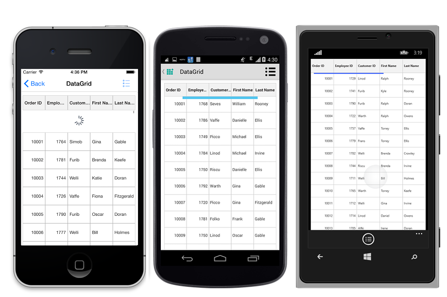

# Pull To Refresh

SfDataGrid lets you to enable the PullToRefresh option by setting the [SfDataGrid.AllowPullToRefresh](http://help.syncfusion.com/cr/cref_files/xamarin/sfdatagrid/Syncfusion.SfDataGrid.XForms~Syncfusion.SfDataGrid.XForms.SfDataGrid~AllowPullToRefresh.html) property to `true` and by setting the [SfDataGrid.PullToRefreshCommand](http://help.syncfusion.com/cr/cref_files/xamarin/sfdatagrid/Syncfusion.SfDataGrid.XForms~Syncfusion.SfDataGrid.XForms.SfDataGrid~PullToRefreshCommand.html) property. When the PullToRefresh is enabled, the SfDataGrid provides support for refreshing the data source in the runtime while doing the pull to refresh action. 

### PullToRefreshCommand

SfDataGrid lets you refresh the data in view in runtime by triggering an `ICommand` binded to the `SfDataGrid.PullToRefreshCommand` property. While you perform pull to refresh action, if the progress bar meets 100 %, then this command is triggered to refresh the records in view. 

You need to set the [SfDataGrid.IsBusy](http://help.syncfusion.com/cr/cref_files/xamarin/sfdatagrid/Syncfusion.SfDataGrid.XForms~Syncfusion.SfDataGrid.XForms.SfDataGrid~IsBusy.html) property to `true` before refreshing the records to notify the grid that pull to refresh action is being performed and set the property to false after the view is refreshed. You can also alter the time for the PullToRefresh animation from the sample by setting a delay based on your requirement.

The following code example illustrates how to enable and perform PullToRefresh operation in SfDataGrid.


//Enable PullToRefresh in SfDataGrid
dataGrid.AllowPullToRefresh = true;
dataGrid.PullToRefreshCommand = new Command(ExecutePullToRefreshCommand);
 
private async void ExecutePullToRefreshCommand()
{
    this.dataGrid.IsBusy = true;
    await Task.Delay(new TimeSpan(0, 0, 5));
    viewModel.ItemsSourceRefresh ();
    this.dataGrid.IsBusy = false;
} 

//ViewModel.cs
internal void ItemsSourceRefresh()
{
    int count = random.Next (1, 6);

    for (int i = 11000; i < 11000 + count; i++) {
        int value = i + random.Next (100, 150);
        this.OrdersInfo.Insert (0, order.RefreshItemsSource (value));
    }
} 


Running the application renders the following output.

