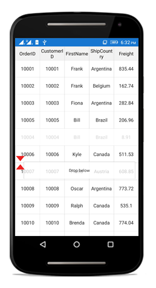
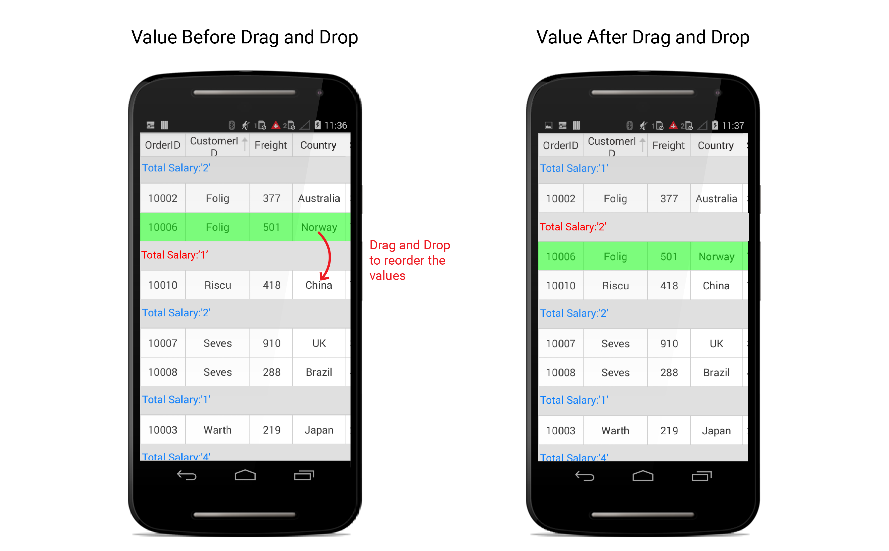

# Row Drag and Drop

SfDataGrid allows you to drag and drop a row by setting the [SfDataGrid.AllowDraggingRow](http://help.syncfusion.com/cr/cref_files/xamarin/sfdatagrid/Syncfusion.SfDataGrid.XForms~Syncfusion.SfDataGrid.XForms.SfDataGrid~AllowDraggingRow.html) property to `true`. A Customizable row drag and drop template is displayed  while dragging a row. The drag and drop operation can be handled based on the requirement using [SfDataGrid.QueryRowDragging](http://help.syncfusion.com/cr/cref_files/xamarin/sfdatagrid/Syncfusion.SfDataGrid.XForms~Syncfusion.SfDataGrid.XForms.SfDataGrid~QueryRowDragging_EV.html) event. 

The following code example shows how to enable row drag and drop in SfDataGrid. 



<syncfusion:SfDataGrid AllowDraggingRow="True" />


dataGrid.AllowDraggingRow = true;



## Dragging scenarios

SfDataGrid allows you to perform the drag and drop operation with both the data rows and groups.

* Records can be reordered to any position with auto scrolling.
* Groups position can be reordered using drag and drop. But no groups can be added inside other groups. 
* Data rows can be reordered within the same group or into the other groups as well. 

N> Reordering changes are made only in [SfDataGrid.View](http://help.syncfusion.com/cr/cref_files/xamarin/sfdatagrid/Syncfusion.SfDataGrid.XForms~Syncfusion.SfDataGrid.XForms.SfDataGrid~View.html) and not in the underlying data. Thus the changes will be reverted when performing sorting, grouping or any other operation that refreshes the view. Reordering changes in the underlying data can be achieved by handling `QueryRowDragging` event in the sample side as explained below in [Reordering underlying data](# Reordering underlying data ).

N> Now, you can drag and drop the grid rows using mouse in UWP (Desktop) platform.

## Row drag and drop template

SfDataGrid allows you to load a desired content when performing row drag and drop operation using the [SfDataGrid.RowDragDropTemplate](http://help.syncfusion.com/cr/cref_files/xamarin/sfdatagrid/Syncfusion.SfDataGrid.XForms~Syncfusion.SfDataGrid.XForms.SfDataGrid~RowDragDropTemplate.html). The template can be defined either in code or XAML. 

## Default template

Default template will be loaded, if template is not explicitly assigned for row drag and drop operations. 

## Customizing row drag and drop template

You can load any type of custom view inside [SfDataGrid.RowDragDropTemplate](http://help.syncfusion.com/cr/cref_files/xamarin/sfdatagrid/Syncfusion.SfDataGrid.XForms~Syncfusion.SfDataGrid.XForms.SfDataGrid~RowDragDropTemplate.html) based on your application’s  requirement.

Refer the following code example that shows how to load row like view in template.





<sfgrid:SfDataGrid.RowDragDropTemplate>
    <DataTemplate>
        <sfgrid:BorderView BackgroundColor="White" BorderColor="Black">
            <sfgrid:BorderView.Content>
                <local:RowTemplate />
            </sfgrid:BorderView.Content>
        </sfgrid:BorderView>
    </DataTemplate>
</sfgrid:SfDataGrid.RowDragDropTemplate>




//Row template a custom view which represent row.

public class RowTemplate : Grid
{        
    #region Constructor

    public RowTemplate()
    {
        this.BackgroundColor = Color.White;
        this.Children.Add(CreateLabel("OrderID"));
        this.Children.Add(new BoxView() { Color = Color.Gray, WidthRequest = 1 });
        this.Children.Add(CreateLabel("EmployeeID"));
        this.Children.Add(new BoxView() { Color = Color.Gray, WidthRequest = 1 });
        this.Children.Add(CreateLabel("CustomerID"));
        this.Children.Add(new BoxView() { Color = Color.Gray, WidthRequest = 1 });
        this.Children.Add(CreateLabel("FirstName"));
        this.Children.Add(new BoxView() { Color = Color.Gray, WidthRequest = 1 });
        this.Children.Add(CreateLabel("LastName"));
    }

    #endregion

    #region Private Method

    private ContentView CreateLabel(string Property)
    {
        var label = new Label();
        label.TextColor = Color.Black;
        label.LineBreakMode = LineBreakMode.NoWrap;
        label.FontSize = 12;
        label.HorizontalTextAlignment = TextAlignment.Center;
        label.VerticalTextAlignment = TextAlignment.Center;
        label.SetBinding(Label.TextProperty, Property);
        return new ContentView() { Content = label };
    }

    #endregion

    #region Override Method

    protected override void LayoutChildren(double x, double y, double width, double height)
    {
        foreach (var child in Children)
        {
            if (Device.OS == TargetPlatform.Android || Device.OS == TargetPlatform.iOS)
            {
                if (child is ContentView)
                    child.Layout(new Rectangle(x, y, (width / ((Children.Count + 1) / 2)) - 0.5, height));
                else
                    child.Layout(new Rectangle(x, y, 0.5, height));
            }
            else
            {
                if (child is ContentView)
                    child.Layout(new Rectangle(x, y, (width / ((Children.Count + 1) / 2)) - 1, height));
                else
                    child.Layout(new Rectangle(x, y, 1, height));

            }
            x += child.Width;
        }
    }

    #endregion
}





N> Currently RowDragAndDrop cannot be used if different rows are set with different heights using the [QueryRowHeight](http://help.syncfusion.com/cr/cref_files/xamarin/sfdatagrid/Syncfusion.SfDataGrid.XForms~Syncfusion.SfDataGrid.XForms.SfDataGrid~QueryRowHeight_EV.html) event. 

## Row drag and drop event

`QueryRowDragging` event is fired upon starting to drag a row and will be continuously fired till the dragging ends. By handing the [SfDataGrid.QueryRowDragging](http://help.syncfusion.com/cr/cref_files/xamarin/sfdatagrid/Syncfusion.SfDataGrid.XForms~Syncfusion.SfDataGrid.XForms.SfDataGrid~QueryRowDragging_EV.html) event you can also cancel the dragging of a particular row.

The `QueryRowDragging` event provides following properties in [QueryRowDraggingEventArgs](http://help.syncfusion.com/cr/cref_files/xamarin/sfdatagrid/Syncfusion.SfDataGrid.XForms~Syncfusion.SfDataGrid.XForms.QueryRowDraggingEventArgs.html):

* [From](http://help.syncfusion.com/cr/cref_files/xamarin/sfdatagrid/Syncfusion.SfDataGrid.XForms~Syncfusion.SfDataGrid.XForms.QueryRowDraggingEventArgs~From.html) – Returns the index of the row currently being dragged.
* [To](http://help.syncfusion.com/cr/cref_files/xamarin/sfdatagrid/Syncfusion.SfDataGrid.XForms~Syncfusion.SfDataGrid.XForms.QueryRowDraggingEventArgs~To.html) – Returns the dragging index where you try to drop the row.
* [Position](http://help.syncfusion.com/cr/cref_files/xamarin/sfdatagrid/Syncfusion.SfDataGrid.XForms~Syncfusion.SfDataGrid.XForms.QueryRowDraggingEventArgs~Position.html) - Returns the current x and y coordinates of the RowDragView.
* [Reason](http://help.syncfusion.com/cr/cref_files/xamarin/sfdatagrid/Syncfusion.SfDataGrid.XForms~Syncfusion.SfDataGrid.XForms.QueryRowDraggingEventArgs~Reason.html) – Returns row dragging details as [QueryRowDraggingReason](http://help.syncfusion.com/cr/cref_files/xamarin/sfdatagrid/Syncfusion.SfDataGrid.XForms~Syncfusion.SfDataGrid.XForms.QueryRowDraggingReason.html).
* [RowData](http://help.syncfusion.com/cr/cref_files/xamarin/sfdatagrid/Syncfusion.SfDataGrid.XForms~Syncfusion.SfDataGrid.XForms.QueryRowDraggingEventArgs~RowData.html)  – Returns the underlying data associated with the dragged row.
* [CurrentRowData](http://help.syncfusion.com/cr/cref_files/xamarin/sfdatagrid/Syncfusion.SfDataGrid.XForms~Syncfusion.SfDataGrid.XForms.QueryRowDraggingEventArgs~CurrentRowData.html)  – Returns the corresponding row data, over which the row drag view is currently placed.
* [Cancel](https://msdn.microsoft.com/en-us/library/system.componentmodel.canceleventargs_properties(v=vs.110).aspx) – A Boolean property to cancel the event.

## Customizing row drag and drop indicators

SfDataGrid allows you to customize the row drag and drop indicators by writing a custom grid style deriving from [DataGridStyle](http://help.syncfusion.com/cr/cref_files/xamarin/sfdatagrid/Syncfusion.SfDataGrid.XForms~Syncfusion.SfDataGrid.XForms.DataGridStyle.html) and assigning it to the [SfDataGrid.GridStyle](http://help.syncfusion.com/cr/cref_files/xamarin/sfdatagrid/Syncfusion.SfDataGrid.XForms~Syncfusion.SfDataGrid.XForms.SfDataGrid~GridStyle.html) property.

The below code example illustrate how to customize the row drag and drop indicators.



dataGrid.GridStyle = new CustomGridStyle();





// Custom style class
public class CustomGridStyle : DataGridStyle
{
    public CustomGridStyle()
    {

    }

    public override ImageSource GetRowDragUpIndicator()
    {
        return ImageSource.FromResource("DataGridDemo.icons.RedUp.png");
    }

    public override ImageSource GetRowDragDownIndicator()
    {
        return ImageSource.FromResource("DataGridDemo.icons.RedDown.png");
    }
}



## Disable dragging for particular row

Dragging can be disabled for a particular row by handling the `QueryRowDragging` event using conditions based on `QueryRowDraggingReason`. Refer following code sample to disable dragging for particular row.



private void SfGrid_QueryRowDragging(object sender, QueryRowDraggingEventArgs e)
{
    //e.From returns the index of the dragged row.
    //e.Reason returns the dragging status of the row.
    if (e.From == 1 && e.Reason == QueryRowDraggingReason.DragStarted)
        e.Cancel = true;
}



## Disable dropping when dragging over particular rows

Dropping can be disabled for particular rows while dragging a row.Refer following code sample to cancel dropping of particular row.



private void SfGrid_QueryRowDragging(object sender, QueryRowDraggingEventArgs e)
{
    //e.To returns the index of the current row.
    //e.Reason returns the dragging status of the row.
    if ((e.To > 5 || e.To < 10) &&
    (e.Reason == QueryRowDraggingReason.DragEnded || e.Reason == QueryRowDraggingReason.Dragging))
        e.Cancel = true;
}



## Disable dropping of particular row

Dropping can be canceled for particular row by handling `QueryRowDragging` event using conditions based on `QueryRowDraggingReason`. Refer following code sample to cancel dropping of particular row.



private void SfGrid_QueryRowDragging(object sender, QueryRowDraggingEventArgs e)
{
    //e.From returns the index of the dragged row.
    //e.Reason returns the dragging status of the row.
    if (e.From == 1 && e.Reason == QueryRowDraggingReason.DragEnded)
        e.Cancel = true;
}



## Disable dropping at a particular position

Dropping at a particular position can be canceled by handling `QueryRowDragging` event using conditions based on `QueryRowDraggingReason`. Refer following code sample to cancel dropping at particular position.



private void SfGrid_QueryRowDragging(object sender, QueryRowDraggingEventArgs e)
{
    //e.To returns the index of the current row.
    //e.Reason returns the dragging status of the row.
    if ((e.To == 5 || e.To == 7) && e.Reason == QueryRowDraggingReason.DragEnded)
        e.Cancel = true;
}



## Reorder the underlying data

Reordering changes directly on the underlying data can be done by handling `QueryRowDragging` event using conditions based on `QueryRowDraggingReason`. Refer following code sample to make permanent reordering changes.



private void SfGrid_QueryRowDragging(object sender, QueryRowDraggingEventArgs e)
{
    //e.To returns the index of the current row.
    //e.From returns the index of the dragged row.
    if (e.Reason == QueryRowDraggingReason.DragEnded)
    {
        var collection = (sender as SfDataGrid).ItemsSource as IList;
        collection.RemoveAt(e.From - 1);
        collection.Insert(e.To - 1, e.RowData);
    }
}



## Drop a grid row in the last position

The `To` property of the `QueryRowDraggingEventArgs` denotes the current drop index of the dragged row when dragging over the grid rows. It returns the same index when you drag a row over the rows in last position or last but one. In order to programmatically track whether the dragged row is dropped at the last position or last but one, SfDataGrid provides the `Position` property in `QueryRowDraggingEventArgs` which denotes the position of the RowDragView.

Refer the following code example in which the `Position` property is used to determine whether the row is dropped in the last position.



private void SfGrid_QueryRowDragging(object sender, QueryRowDraggingEventArgs e)
{
    var totalHeight = dataGrid.RowColumnIndexToPoint(new RowColumnIndex(viewModel.OrdersInfo.Count, 0)).Y + this.dataGrid.RowHeight;
    if (e.Reason == QueryRowDraggingReason.DragEnded)
    {
        if (Math.Ceiling(e.Position.Y + (dataGrid.RowHeight / 2)) > totalHeight && e.To == viewModel.OrdersInfo.Count)
        {
            //Will hit if the row is dropped at the last position                 
            DisplayAlert("RowDragAndDrop info", "The row is dropped at the last position", "OK");
        }
    }
}



## Updating summaries when dragging and dropping a row between groups

Grouping and summaries of items in SfDataGrid are manipulated based on group key. When you drag and drop an item from one group to another group, the group key of the dragged item will differ from the group key of the items in the dropped group. Hence by default, the summaries will not be updated. This is the actual behavior of SfDataGrid. 

Hence, in order to update the summaries when a row is dragged and dropped between groups you need to call the `UpdateCaptionSummaries` and `Refresh` methods in the `QueryRowDragging` event.


public partial class MainPage : ContentPage
{
    private SfDataGrid dataGrid;
    private ViewModel viewModel;
    public MainPage()
    {
         InitializeComponent();
         dataGrid = new SfDataGrid();
         viewModel = new ViewModel();
         dataGrid.ItemsSource = viewModel.OrdersInfo;
         dataGrid.QueryRowDragging += DataGrid_QueryRowDragging;
         this.Content = dataGrid;
    }
    private async void DataGrid_QueryRowDragging(object sender, QueryRowDraggingEventArgs e)
    {
         if (e.Reason == QueryRowDraggingReason.DragEnded)
         {
             // Delay is given for refreshing the view.
             await Task.Delay(100);                
             this.dataGrid.View.TopLevelGroup.UpdateCaptionSummaries();
             this.dataGrid.View.Refresh();
          }
    }
}


The following screenshot shows the output rendered when executing the above code example.

