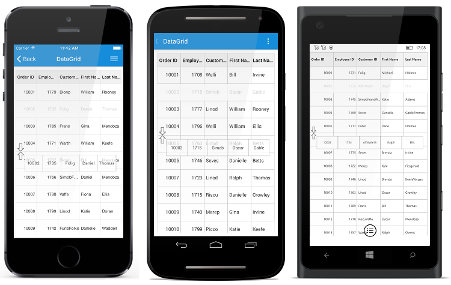

# Row Drag and Drop

SfDataGrid allows you to drag and drop a row by setting the `SfDataGrid.AllowDraggingRow` property to `true`. A Customizable row drag and drop template is displayed  while dragging a row. The drag and drop operation can be handled based on the requirement using `SfDataGrid.QueryRowDragging` event. 

The following code example shows how to enable row drag and drop in SfDataGrid. 



<syncfusion:SfDataGrid AllowDraggingRow="True" />


dataGrid.AllowDraggingRow = true;



## Dragging scenarios

SfDataGrid allows you to perform the drag and drop operation with both the data rows and groups.

* Records can be reordered to any positon with auto scrolling.
* Groups position can be reordered using drag and drop. But no groups can be added inside other groups. 
* Data rows can be reordered within the same group or into the other groups as well. 

N> Reordering changes are made only in `SfDataGrid.View` and not in the underlying data. Thus the changes will be reverted when performing sorting, grouping or any other operation that refreshes the view. Reordering changes in the underlying data can be achieved by handling `QueryRowDragging` event in the sample side as explained below in [Reordering underlying data](# Reordering underlying data ).

## Row drag and drop template

SfDataGrid allows you to load a desired content when performing row drag and drop operation using the `SfDataGrid.RowDragDropTemplate`. The template can be defined either in code or XAML. 

## Default template

Default template will be loaded, if template is not explicitly assigned for row drag and drop operations. 

## Customizing row drag and drop template

You can load any type of custom view inside `SfDataGrid.RowDragDropTemplate` based on your application’s  requirement.

Refer the following code example that shows how to load row like view in template.





<sfgrid:SfDataGrid.RowDragDropTemplate>
    <DataTemplate>
        <sfgrid:BorderView BackgroundColor="White" BorderColor="Black">
            <sfgrid:BorderView.Content>
                <local:RowTemplate />
            </sfgrid:BorderView.Content>
        </sfgrid:BorderView>
    </DataTemplate>
</sfgrid:SfDataGrid.RowDragDropTemplate>




//Row template a custom view which represent row.

public class RowTemplate : Grid
{        
    #region Constructor

    public RowTemplate()
    {
        this.BackgroundColor = Color.White;
        this.Children.Add(CreateLabel("OrderID"));
        this.Children.Add(new BoxView() { Color = Color.Gray, WidthRequest = 1 });
        this.Children.Add(CreateLabel("EmployeeID"));
        this.Children.Add(new BoxView() { Color = Color.Gray, WidthRequest = 1 });
        this.Children.Add(CreateLabel("CustomerID"));
        this.Children.Add(new BoxView() { Color = Color.Gray, WidthRequest = 1 });
        this.Children.Add(CreateLabel("FirstName"));
        this.Children.Add(new BoxView() { Color = Color.Gray, WidthRequest = 1 });
        this.Children.Add(CreateLabel("LastName"));
    }

    #endregion

    #region Private Method

    private ContentView CreateLabel(string Property)
    {
        var label = new Label();
        label.TextColor = Color.Black;
        label.LineBreakMode = LineBreakMode.NoWrap;
        label.FontSize = 12;
        label.HorizontalTextAlignment = TextAlignment.Center;
        label.VerticalTextAlignment = TextAlignment.Center;
        label.SetBinding(Label.TextProperty, Property);
        return new ContentView() { Content = label };
    }

    #endregion

    #region Override Method

    protected override void LayoutChildren(double x, double y, double width, double height)
    {
        foreach (var child in Children)
        {
            if (Device.OS == TargetPlatform.Android || Device.OS == TargetPlatform.iOS)
            {
                if (child is ContentView)
                    child.Layout(new Rectangle(x, y, (width / ((Children.Count + 1) / 2)) - 0.5, height));
                else
                    child.Layout(new Rectangle(x, y, 0.5, height));
            }
            else
            {
                if (child is ContentView)
                    child.Layout(new Rectangle(x, y, (width / ((Children.Count + 1) / 2)) - 1, height));
                else
                    child.Layout(new Rectangle(x, y, 1, height));

            }
            x += child.Width;
        }
    }

    #endregion
}





## Row drag and drop event

`QueryRowDragging` event is fired upon starting to drag a row and will be continuously fired till the dragging ends. By handing the `SfDataGrid.QueryRowDragging` event you can also cancel the dragging of a particular row.

The `QueryRowDragging` event provides following properties in `QueryRowDraggingEventArgs`:

* `From` - Returns the index of the row currently being dragged.
* `To` – Returns the dragging index where you try to drop the row. 
* `Reason` - Returns row dragging details as `QueryRowDraggingReason`.
* `RowData` – Returns the underlying data associated with the dragged row.
* [Cancel](https://msdn.microsoft.com/en-us/library/system.componentmodel.canceleventargs_properties(v=vs.110).aspx) – A Boolean property to cancel the event.

## How to 

### Disable dragging for particular row 

Dragging can be disabled for a particular row by handling the `QueryRowDragging` event using conditions based on `QueryRowDraggingReason`. Refer following code sample to disable dragging for particular row.



private void SfGrid_QueryRowDragging(object sender, QueryRowDraggingEventArgs e)
{
    //e.From returns the index of the dragged row.
    //e.Reason returns the dragging status of the row.
    if (e.From == 1 && e.Reason == QueryRowDraggingReason.DragStarted)
        e.Cancel = true;
}



### Disable dropping when dragging over particular rows

Dropping can be disabled for particular rows while dragging a row.Refer following code sample to cancel dropping of particular row.



private void SfGrid_QueryRowDragging(object sender, QueryRowDraggingEventArgs e)
{
    //e.To returns the index of the current row.
    //e.Reason returns the dragging status of the row.
    if ((e.To > 5 || e.To < 10) &&
    (e.Reason == QueryRowDraggingReason.DragEnded || e.Reason == QueryRowDraggingReason.Dragging))
        e.Cancel = true;
}



### Disable dropping of particular row 

Dropping can be cancelled for particular row by handling `QueryRowDragging` event using conditions based on `QueryRowDraggingReason`. Refer following code sample to cancel dropping of particular row.



private void SfGrid_QueryRowDragging(object sender, QueryRowDraggingEventArgs e)
{
    //e.From returns the index of the dragged row.
    //e.Reason returns the dragging status of the row.
    if (e.From == 1 && e.Reason == QueryRowDraggingReason.DragEnded)
        e.Cancel = true;
}



### Disable dropping at a particular position 

Dropping at a particular position can be cancelled by handling `QueryRowDragging` event using conditions based on `QueryRowDraggingReason`. Refer following code sample to cancel dropping at particular position.



private void SfGrid_QueryRowDragging(object sender, QueryRowDraggingEventArgs e)
{
    //e.To returns the index of the current row.
    //e.Reason returns the dragging status of the row.
    if ((e.To == 5 || e.To == 7) && e.Reason == QueryRowDraggingReason.DragEnded)
        e.Cancel = true;
}



### Reordering underlying data 

Reordering changes directly on the underlying data can be done by handling `QueryRowDragging` event using conditions based on `QueryRowDraggingReason`. Refer following code sample to make permanent reordering changes.



private void SfGrid_QueryRowDragging(object sender, QueryRowDraggingEventArgs e)
{
    //e.To returns the index of the current row.
    //e.From returns the index of the dragged row.
    if (e.Reason == QueryRowDraggingReason.DragEnded)
    {
        var collection = (sender as SfDataGrid).ItemsSource as IList;
        collection.RemoveAt(e.From - 1);
        collection.Insert(e.To - 1, e.RowData);
    }
}



