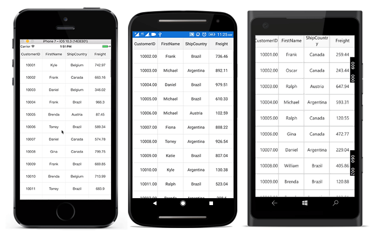
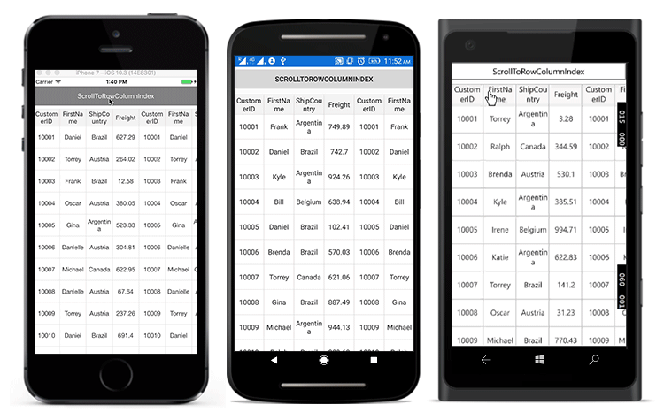
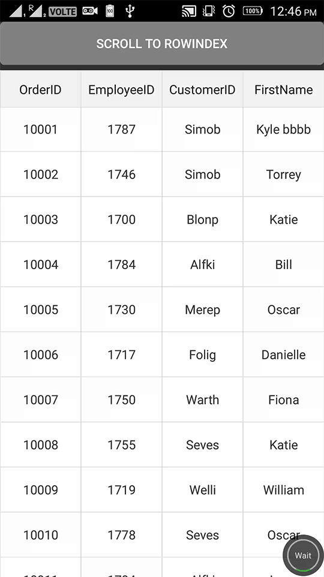
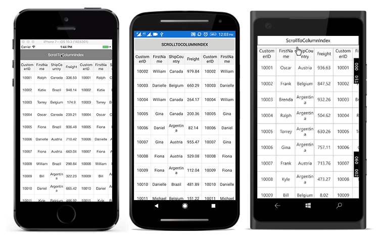
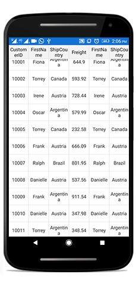
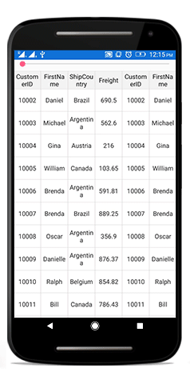

# Scrolling 

## Scrolling mode

The data grid provides three types of scrolling mode that can be customized by using the [SfDataGrid.ScrollingMode](http://help.syncfusion.com/cr/cref_files/xamarin/Syncfusion.SfDataGrid.XForms~Syncfusion.SfDataGrid.XForms.SfDataGrid~ScrollingMode.html) property. By default, the control will scroll the content based on pixel values. The scrolling modes are as follows: 

 * PixelLine
 * Line
 * Pixel

N> The data grid supports for the vertical and horizontal scrollbars in UWP. In addition to that, mouse scrolling is also supporting in UWP desktop application.

### PixelLine

The `ScrollingMode.PixelLine` allows you to scroll its contents like an excel sheet i.e., whenever a row or a column is clipped on the top, the particular row or column will auto scroll to display fully in view.


dataGrid.ScrollingMode = ScrollingMode.PixelLine; 


### Line

The `ScrollingMode.Line` allows you to scroll its contents based on lines i.e., the view will be updated only when the offset values reaches the origin of a row or column in the bound collection.


dataGrid.ScrollingMode = ScrollingMode.Line; 


### Pixel

The `ScrollingMode.Pixel` allows you to scroll its contents based on pixel values i.e., the view will update each pixel change of the offsets, and row or column will appear clipped when offset exceeds the origin of the row or column.


dataGrid.ScrollingMode = ScrollingMode.Pixel; 


## Programmatic scrolling

The data grid scrolls to a particular row and column index programmatically.

### Scroll to row and column index

Scroll programmatically to a particular row and column using the [SfDataGrid.ScrollToRowColumnIndex](http://help.syncfusion.com/cr/cref_files/xamarin/Syncfusion.SfDataGrid.XForms~Syncfusion.SfDataGrid.XForms.SfDataGrid~ScrollToRowColumnIndex.html) method by passing row and column indexes.



dataGrid.ScrollToRowColumnIndex(int rowIndex, int columnIndex);

//For example, 
dataGrid.ScrollToRowColumnIndex(20, 6);



### Scroll to row index

Scroll programmatically to a particular row using the [SfDataGrid.ScrollToRowIndex](http://help.syncfusion.com/cr/cref_files/xamarin/Syncfusion.SfDataGrid.XForms~Syncfusion.SfDataGrid.XForms.SfDataGrid~ScrollToRowIndex.html) method by passing the row index.



dataGrid.ScrollToRowIndex(int rowIndex);

//For example, 
dataGrid.ScrollToRowIndex(20);



### Scroll to column index

Scroll programmatically to a particular column using the [SfDataGrid.ScrollToColumnIndex](http://help.syncfusion.com/cr/cref_files/xamarin/Syncfusion.SfDataGrid.XForms~Syncfusion.SfDataGrid.XForms.SfDataGrid~ScrollToColumnIndex.html) method by passing the column index.



dataGrid.ScrollToColumnIndex(int columnIndex);

//For example,
dataGrid.ScrollToColumnIndex(7);



### Scroll a row/column to a specific position

The SfDataGrid allows to position the scrolled row/column in the datagrid by passing [ScrollToPosition](https://docs.microsoft.com/en-us/dotnet/api/xamarin.forms.scrolltoposition?view=xamarin-forms) as parameter to the `ScrollToRowColumnIndex`, `ScrollToRowIndex`, `ScrollToColumnIndex` methods. The scrolled row/column can take either of the four positions as explained below. The default position is `Start`.

* MakeVisible: Scroll to make a specified row/column visible in datagrid. If the specified row/column is already in view, scrolling will not occur.
* Start: Scroll to make the row/column positioned at the start of the datagrid.
* Center: Scroll to make the row/column positioned at the center of the datagrid.
* End: Scroll to make the row/column positioned at the end of the datagrid. 

N> Programmatic scrolling is not applicable for rows and columns that are frozen in view.

## Vertical Over Scroll Mode

The [SfDataGrid.VerticalOverScrollMode](http://help.syncfusion.com/cr/cref_files/xamarin/Syncfusion.SfDataGrid.XForms~Syncfusion.SfDataGrid.XForms.SfDataGrid~VerticalOverScrollMode.html) property customizes the bouncing behavior of the data grid.

The `SfDataGrid.VerticalOverScrollMode` is of [VerticalScrollMode](http://help.syncfusion.com/cr/cref_files/xamarin/Syncfusion.SfDataGrid.XForms~Syncfusion.SfDataGrid.XForms.SfDataGrid~VerticalOverScrollMode.html) type having the following two modes: 

 * Bounce
 * None

### Bounce
 
The `Bounce` mode allows the data grid to have bouncing effect. Default value of `SfDataGrid.VerticalOverScrollMode` is `Bounce` .

To customize the bouncing effect in the data grid, follow the code example:




dataGrid.VerticalOverScrollMode = VerticalOverScrollMode.Bounce;




  <sfgrid:SfDataGrid x:Name="dataGrid"
                     ColumnSizer="Star"
                     VerticalOverScrollMode="Bounce"
                     ItemsSource="{Binding OrdersInfo}">  
  </sfgrid:SfDataGrid>




### None

The `None` mode disables the bouncing effect in the data grid.

To customize the bouncing effect in the data grid, follow the code example:




dataGrid.VerticalOverScrollMode = VerticalOverScrollMode.None;




  <sfgrid:SfDataGrid x:Name="dataGrid"
                     ColumnSizer="Star"
                     VerticalOverScrollMode="None"
                     ItemsSource="{Binding OrdersInfo}">  
  </sfgrid:SfDataGrid>




## Scrolling customization using Slider

The data grid allows scrolling to a particular row by passing the row index to the `ScrollToRowIndex` method. To scroll the control when interacting with `Slider`, pass the `Slider.Value` as the row index to the `ScrollToRowIndex` method.

To customize the data grid scrolling programmatically using `Slider`, follow the code example:



Slider slider = new Slider();

slider.ValueChanged += Slider_ValueChanged;
private void Slider_ValueChanged(object sender, ValueChangedEventArgs e)
{
    dataGrid.ScrollToRowIndex((int)(e.NewValue));
}


