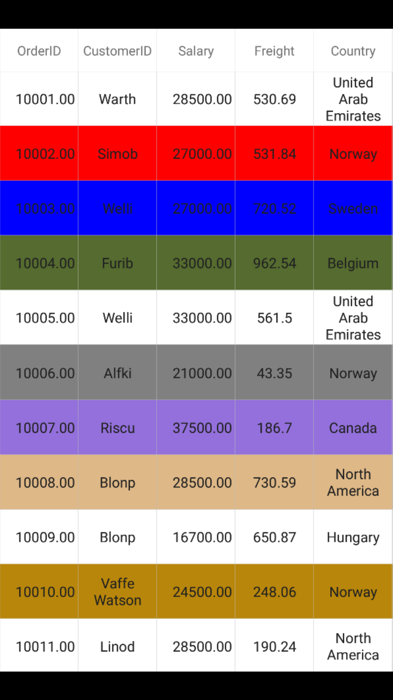

# Selection

This section explains how to enable selection in the data grid; modes, properties, and events involved in selection; and customizations available for selection.

The data grid allows you to select a specific row or group of rows either programmatically or by touch interactions. To enable selection, set the [SfDataGrid.SelectionMode](http://help.syncfusion.com/cr/cref_files/xamarin/Syncfusion.SfDataGrid.XForms~Syncfusion.SfDataGrid.XForms.SfDataGrid~SelectionMode.html) property to a value other than `None`. This control has different selection modes to perform the selection operation as follows:

## Selection modes 

<table>
<tr>
<th> Modes </th>
<th> Description </th>
</tr>
<tr>
<td> {{'[None](http://help.syncfusion.com/cr/cref_files/xamarin/Syncfusion.SfDataGrid.XForms~Syncfusion.SfDataGrid.XForms.SelectionMode.html)'| markdownify }} </td>
<td>Disables selection, and no rows can be selected. This is the default value.</td>
</tr>
<tr>
<td> {{'[Single](http://help.syncfusion.com/cr/cref_files/xamarin/Syncfusion.SfDataGrid.XForms~Syncfusion.SfDataGrid.XForms.SelectionMode.html)'| markdownify }} </td>
<td> Allows selection of a single row only. Upon selecting the next row, the selection in the previous row is cleared. </td>
</tr>
<tr>
<td> {{'[Multiple](http://help.syncfusion.com/cr/cref_files/xamarin/Syncfusion.SfDataGrid.XForms~Syncfusion.SfDataGrid.XForms.SelectionMode.html)'| markdownify }}  </td>
<td> Allows selection of more than one row. Selection is not cleared when selecting more than one record. When you click on a selected row for the second time, the selection is cleared. </td>
</tr>
<tr>
<td>  {{'[SingleDeselect](http://help.syncfusion.com/cr/cref_files/xamarin/Syncfusion.SfDataGrid.XForms~Syncfusion.SfDataGrid.XForms.SelectionMode.html)'| markdownify }}  </td>
<td> Allows selection of only a single row. However, upon tapping the row again, the selection is cleared. Similar to single mode, upon selecting the next row, the selection in the previous row is cleared. </td>
</tr>
</table>

To set the selection mode, follow the code example:



<syncfusion:SfDataGrid x:Name="dataGrid"
                       ColumnSizer="Star"
                       AutoGenerateColumns="True"
                       SelectionMode="Multiple" 
                       ItemsSource="{Binding OrdersInfo}"/>


dataGrid.SelectionMode = SelectionMode.Multiple; 



The following image shows the Selection functionality in the data grid:

## Getting Selected Rows 

SfDataGrid provides `SelectedIndex`,`SelectedItem` and `CurrentItem` properties to get the details of selected rows when selection mode is `Single`, `Multiple` and `SingleDeselect`.

[SfDataGrid.SelectedItem](http://help.syncfusion.com/cr/cref_files/xamarin/sfdatagrid/Syncfusion.SfDataGrid.XForms~Syncfusion.SfDataGrid.XForms.SfDataGrid~SelectedItem.html): Provides the underlying data object of the selected row. It denotes the first selected row in multiple selection.
[SfDataGrid.SelectedIndex](http://help.syncfusion.com/cr/cref_files/xamarin/sfdatagrid/Syncfusion.SfDataGrid.XForms~Syncfusion.SfDataGrid.XForms.SfDataGrid~SelectedIndex.html): Provides the index of the `SfDataGrid.SelectedItem`.
[SfDataGrid.CurrentItem](http://help.syncfusion.com/cr/cref_files/xamarin/sfdatagrid/Syncfusion.SfDataGrid.XForms~Syncfusion.SfDataGrid.XForms.SfDataGrid~CurrentItem.html): Provides the underlying data object of the currently selected row in the data grid. It denotes the first selected row in multiple selection.

### Row Selection

When multiple rows are selected the `SelectedItems` and `SelectionController.SelectedRows` properties provide information about all the selected rows.

[SfDataGrid.SelectedItems](http://help.syncfusion.com/cr/cref_files/xamarin/sfdatagrid/Syncfusion.SfDataGrid.XForms~Syncfusion.SfDataGrid.XForms.SfDataGrid~SelectedItems.html): Provides all the selected records of selected items when multiple selection is enabled.
[SfDataGrid.SelectionController.SelectedRows](http://help.syncfusion.com/cr/cref_files/xamarin/sfdatagrid/Syncfusion.SfDataGrid.XForms~Syncfusion.SfDataGrid.XForms.SfDataGrid~SelectionController.html) : Provides the collection of underlying model object(row data) of all selected items.

### CurrentItem vs SelectedItem

Both [SelectedItem](http://help.syncfusion.com/cr/cref_files/xamarin/sfdatagrid/Syncfusion.SfDataGrid.XForms~Syncfusion.SfDataGrid.XForms.SfDataGrid~SelectedItem.html) and [CurrentItem](http://help.syncfusion.com/cr/cref_files/xamarin/sfdatagrid/Syncfusion.SfDataGrid.XForms~Syncfusion.SfDataGrid.XForms.SfDataGrid~CurrentItem.html) returns the same data object when selection mode is single. When multiple selection is enabled the row that was selected initially is maintained in `SelectedItem` and the row that is currently selected is maintained in `CurrentItem`.

## Programmatic selection

When `SfDataGrid.SelectionMode` is set a value other than `None`, select row/rows from the code by setting the [SfDataGrid.SelectedIndex](http://help.syncfusion.com/cr/cref_files/xamarin/sfdatagrid/Syncfusion.SfDataGrid.XForms~Syncfusion.SfDataGrid.XForms.SfDataGrid~SelectedIndex.html), [SfDataGrid.SelectedItem](http://help.syncfusion.com/cr/cref_files/xamarin/sfdatagrid/Syncfusion.SfDataGrid.XForms~Syncfusion.SfDataGrid.XForms.SfDataGrid~SelectedItem.html), or [SfDataGrid.SelectedItems](http://help.syncfusion.com/cr/cref_files/xamarin/sfdatagrid/Syncfusion.SfDataGrid.XForms~Syncfusion.SfDataGrid.XForms.SfDataGrid~SelectedItems.html) property based on the selection mode. To enable selection from code, follow the code example:

When the selection mode is `Single`, programmatically select a row in two ways either by setting the row index to the `SfDataGrid.SelectedIndex` property, or by setting the underlying object to be selected to the `SfDataGrid.SelectedItem` property. 

To programmatically select a row from the code, follow the code example:



//Perform selection using selected index
dataGrid.SelectedIndex = 3;
 
//Perform selection using selected item
dataGrid.SelectedItem = viewModel.OrdersInfo [5];



When the selection mode is multiple, programmatically select more than one row by adding the underlying object to be selected to the `SfDataGrid.SelectedItems` property. 

To programmatically select more than one row from the code, follow the code example:


 
//Perform multiple selection using selected item
dataGrid.SelectedItems.Add (viewModel.OrdersInfo [2]);
dataGrid.SelectedItems.Add (viewModel.OrdersInfo [4]);
dataGrid.SelectedItems.Add (viewModel.OrdersInfo [7]);
dataGrid.SelectedItems.Add (viewModel.OrdersInfo [9]);



The following screenshot shows the selection functionality in the data grid:

### Scroll to Selected Item

You can scroll programmatically to the selected item by passing the `SelectedIndex` to the [SfDataGrid.ScrollToRowIndex](http://help.syncfusion.com/cr/cref_files/xamarin/sfdatagrid/Syncfusion.SfDataGrid.XForms~Syncfusion.SfDataGrid.XForms.SfDataGrid~ScrollToRowIndex.html) method. Refer the below code snippet for the same.



dataGrid.ScrollToRowIndex((int)dataGrid.SelectedIndex);



## Clear selection

The data grid allows you to clear the selection applied in the grid rows by either setting the `SfDataGrid.SelectionMode` to `None`, or by calling the [SfDataGrid.SelectionController.ClearSelection ()](http://help.syncfusion.com/cr/cref_files/xamarin/sfdatagrid/Syncfusion.SfDataGrid.XForms~Syncfusion.SfDataGrid.XForms.GridSelectionController~ClearSelection.html) method.

Refer the below code snippet to clear the selection in the data grid.



//Clear selection using selection mode
dataGrid.SelectionMode = SelectionMode.None;

//Clear selection using selection controller
dataGrid.SelectionController.ClearSelection (); 



N> Selected items and the selections will be cleared whenever the ItemsSource is changed at runtime.

## Row header selection

The data grid allows you to select grid row(s) upon tapping them over the grid cells. It also allows you to select grid rows when you tap the row header cells. To enable selection in the data grid, set the [SfDataGrid.SelectionMode](http://help.syncfusion.com/cr/cref_files/xamarin/sfdatagrid/Syncfusion.SfDataGrid.XForms~Syncfusion.SfDataGrid.XForms.SfDataGrid~SelectionMode.html) property to a value other than `None`.

### Select records in the data grid when tapping only on the row header cells

The data grid allows you to select a specific row or group of rows by touching the grid cells. However, if you need to select the record only when tapping on the row header cells, you can do this by handling the `SfDataGrid.SelectionChanging` event. 
 
To select records in the data grid when tapping only on the row header cells, follow the code example:




dataGrid.SelectionMode = SelectionMode.Single;

private void DataGrid_SelectionChanging(object sender, GridSelectionChangingEventArgs e)
{
    e.Cancel = true;
}

private void DataGrid_GridTapped(object sender, GridTappedEventsArgs e)
{
    if(e.RowColumnIndex.ColumnIndex == 0)
    {
        dataGrid.SelectedIndex = e.RowColumnIndex.RowIndex;
    }
}
 



N> To enable the row header in the data grid, set the `SfDataGrid.ShowRowHeader` to `true`.

## Selection animation

The data grid supports selecting one or more rows programmatically or by touch interactions. In addition, the control also provides extensibility to animate the selected rows. 

It can be done by extending the [GridSelectionController](http://help.syncfusion.com/cr/cref_files/xamarin/sfdatagrid/Syncfusion.SfDataGrid.XForms~Syncfusion.SfDataGrid.XForms.GridSelectionController.html# ).

Refer to the following example in which a CustomSelectionController is derived from `GridSelectionController` and an instance of it is assigned to the [SfDataGrid.SelectionController](http://help.syncfusion.com/cr/cref_files/xamarin/sfdatagrid/Syncfusion.SfDataGrid.XForms~Syncfusion.SfDataGrid.XForms.SfDataGrid~SelectionController.html ) property to achieve selection animation:



<ContentPage.Resources>
    <ResourceDictionary>
        <local:CustomSelectionController x:Key="CustomSelectionController" DataGrid="{x:Reference dataGrid}">
        </local:CustomSelectionController>
    </ResourceDictionary>
</ContentPage.Resources>

<ContentPage.Content>
    <sfgrid:SfDataGrid x:Name="dataGrid"
            ColumnSizer="Star"
            SelectedIndex="1"
            SelectionMode="Multiple"
            VerticalOverScrollMode="None"
            SelectionController="{StaticResource CustomSelectionController}" />
</ContentPage.Content>


this.dataGrid.ItemsSource = viewModel.OrdersInfo;
this.dataGrid.SelectionController = new CustomSelectionController();
this.dataGrid.SelectionMode = SelectionMode.Multiple;
SelectionPicker.SelectedIndex = 1;





public class CustomSelectionController : GridSelectionController
{
    public CustomSelectionController()
    {
        this.SelectedRows = new GridSelectedRowsCollection();
    }
    protected override async void SetSelectionAnimation(VirtualizingCellsControl rowElement)
    {
        rowElement.Opacity = 0.50;
        await rowElement.FadeTo(1, 400, Easing.CubicInOut);
    }
}



The following screenshot shows the selection animation in the data grid:

## Events in Selection

The data grid provides the following events for selection:

 * [SelectionChanging](http://help.syncfusion.com/cr/cref_files/xamarin/sfdatagrid/Syncfusion.SfDataGrid.XForms~Syncfusion.SfDataGrid.XForms.SfDataGrid~SelectionChanging_EV.html): This event is raised while selecting a row at the execution time before the row is selected. So it allows canceling the selection action by setting the Cancel property of `GridSelectionChangingEventArgs`.
 * [SelectionChanged](http://help.syncfusion.com/cr/cref_files/xamarin/sfdatagrid/Syncfusion.SfDataGrid.XForms~Syncfusion.SfDataGrid.XForms.SfDataGrid~SelectionChanged_EV.html): This event is raised after the column is selected.

These two events are triggered with `GridSelectionChangingEventArgs` and [GridSelectionChangedEventArgs](http://help.syncfusion.com/cr/cref_files/xamarin/sfdatagrid/Syncfusion.SfDataGrid.XForms~Syncfusion.SfDataGrid.XForms.GridSelectionChangedEventArgs.html) that contain the following properties:

 * AddedItems: Gets collection of the underlying data objects added for selection.
 * RemovedItems: Gets collection of the underlying data objects removed from selection.

To hook the `SelectionChanging` event and cancel the selection of a column, follow the code example:



dataGrid.SelectionChanging += DataGrid_SelectionChanging;  

void DataGrid_SelectionChanging (object sender, GridSelectionChangingEventArgs e)
{
    e.Cancel = true;
}



To get the selected item in code-behind using the `SelectionChanged` event, follow the code example:



dataGrid.SelectionChanged += DataGrid_SelectionChanged;

private void DataGrid_SelectionChanged (object sender, GridSelectionChangedEventArgs e)
{
    // Gets the selected item 
    var selectedItem = e.AddedItems[0];
}



### CurrentItem

The [SfDataGrid.CurrentItem](http://help.syncfusion.com/cr/cref_files/xamarin/sfdatagrid/Syncfusion.SfDataGrid.XForms~Syncfusion.SfDataGrid.XForms.SfDataGrid~CurrentItem.html) property holds the underlying data of the last selected row in the data grid. 

Get the current item in the `SfDataGrid.SelectionChanged` event by setting the `SfDataGrid.SelectionMode` as `Multiple` or `SingleDeselect`. If the `SelectionMode` is `Single`, currentItem and selectedItem are same.

To set the selection mode for the data grid in the SelectionChanged event, follow the code example:



dataGrid.SelectionMode = SelectionMode.Multiple; 
 
dataGrid.SelectionChanged += DataGrid_SelectionChanged; 
 
void DataGrid_SelectionChanged (object sender, GridSelectionChangedEventArgs e) 
{ 
 var currentItem = dataGrid.CurrentItem; 

 //your codes
}   



## Customizing Selection Appearance

### Multiple selection colors

The data grid supports selecting one or more rows either programmatically or by touch interactions. By default, the control applies a common background color for the selected rows based on the current theme. However, it also provides extensibility to have multiple selection colors when touching the rows by writing a custom SelectionController derived from [GridSelectionController](http://help.syncfusion.com/cr/cref_files/xamarin/sfdatagrid/Syncfusion.SfDataGrid.XForms~Syncfusion.SfDataGrid.XForms.GridSelectionController.html# ""), and assigning it to the [SfDataGrid.SelectionController](http://help.syncfusion.com/cr/cref_files/xamarin/sfdatagrid/Syncfusion.SfDataGrid.XForms~Syncfusion.SfDataGrid.XForms.SfDataGrid~SelectionController.html# "") property. Override the GetSelectionColor() method to apply different colors for selection at runtime.

To set different colors for the selected rows in the data grid, follow the code example:



sfGrid.SelectionController = new CustomSelectionController(sfGrid);
sfGrid.SelectionMode = SelectionMode.Multiple;





public class CustomSelectionController : GridSelectionController
{
    public Color[] SelectionColors { get; set; }

    public CustomSelectionController(SfDataGrid datagrid) : base(datagrid)
    {
        this.DataGrid = datagrid;
        SelectionColors = new Color[11] 
        { 
            Color.DarkSalmon,
            Color.DarkSlateGray,
            Color.Red, 
            Color.Blue,
            Color.DarkOliveGreen, 
            Color.Black, 
            Color.Gray, 
            Color.MediumPurple,
            Color.BurlyWood,
            Color.DarkCyan,
            Color.DarkGoldenrod 
        };   
    }
    //Code to set multiple selection colors
    public override Color GetSelectionColor(int rowIndex, object rowData)
    {
        if (SelectionColors != null)
            return SelectionColors[rowIndex % 11];
        else
            return Color.Blue;
    }
}



The following screenshot shows the final outcome upon execution of the above code:

### Changing Selection Background and Foreground Color

SfDataGrid allows to change the selection background and foreground color by returning the required color in the `GetSelectionBackgroundColor` and `GetSelectionForegroundColor` overrides in the your custom style class overriding from [DataGridStyle](http://help.syncfusion.com/cr/cref_files/xamarin/sfdatagrid/Syncfusion.SfDataGrid.XForms~Syncfusion.SfDataGrid.XForms.DataGridStyle.html), and assigned it to the [SfDataGrid.GridStyle](http://help.syncfusion.com/cr/cref_files/xamarin/sfdatagrid/Syncfusion.SfDataGrid.XForms~Syncfusion.SfDataGrid.XForms.SfDataGrid~GridStyle.html) property. Refer the below code example to apply selection background and foreground color.



<ContentPage xmlns="http://xamarin.com/schemas/2014/forms"
             xmlns:x="http://schemas.microsoft.com/winfx/2009/xaml"
             xmlns:sfgrid="clr-namespace:Syncfusion.SfDataGrid.XForms;assembly=Syncfusion.SfDataGrid.XForms"
             xmlns:local="clr-namespace:SummaryDemo"
             x:Class="SummaryDemo.Summary">

   <ContentPage.Resources>
        <ResourceDictionary>
            <local:SelectionStyle x:Key="selectionStyle"/>
        </ResourceDictionary>
    </ContentPage.Resources>

    <sfgrid:SfDataGrid x:Name="dataGrid"
                GridStyle="{StaticResource selectionStyle}"
                ItemsSource="{Binding OrdersInfo}" />
</ContentPage>               


//Apply selection background and foreground color to SfDataGrid from code.
SfDataGrid dataGrid = new SfDataGrid();
dataGrid.GridStyle = new SelectionStyle();





//Custom style class
public class SelectionStyle : DataGridStyle
    {
        public SelectionStyle()
        {         
        } 

        public override Color GetSelectionBackgroundColor()
        {
            return Color.Blue;
        }

        public override Color GetSelectionForegroundColor()
        {
            return Color.White;
        }
    }



The following image shows the applying selection background and foreground color:

### Changing Current Cell Border Color

SfDataGrid allows you to change the current cell border color which is applied to the grid cells when entering edit mode, by returning the required color in the `GetCurrentCellBorderColor` override of your custom style class derived from [DataGridStyle](http://help.syncfusion.com/cr/cref_files/xamarin/sfdatagrid/Syncfusion.SfDataGrid.XForms~Syncfusion.SfDataGrid.XForms.DataGridStyle.html) and assigning it to the [SfDataGrid.GridStyle](http://help.syncfusion.com/cr/cref_files/xamarin/sfdatagrid/Syncfusion.SfDataGrid.XForms~Syncfusion.SfDataGrid.XForms.SfDataGrid~GridStyle.html) property.

Following code example illustrates the customization of current cell border color.



<ContentPage xmlns="http://xamarin.com/schemas/2014/forms"
             xmlns:x="http://schemas.microsoft.com/winfx/2009/xaml"
             xmlns:sfgrid="clr-namespace:Syncfusion.SfDataGrid.XForms;assembly=Syncfusion.SfDataGrid.XForms"
             xmlns:local="clr-namespace:SummaryDemo"
             x:Class="SummaryDemo.Summary">

   <ContentPage.Resources>
        <ResourceDictionary>
            <local:SelectionStyle x:Key="selectionStyle"/>
        </ResourceDictionary>
    </ContentPage.Resources>

    <sfgrid:SfDataGrid x:Name="dataGrid"
                GridStyle="{StaticResource selectionStyle}"
                ItemsSource="{Binding OrdersInfo}" />
</ContentPage>               


//Apply selection background and foreground color to SfDataGrid from code.
SfDataGrid dataGrid = new SfDataGrid();
dataGrid.GridStyle = new SelectionStyle();





//Custom style class
public class SelectionStyle : DataGridStyle
    {
        public SelectionStyle()
        {         
        } 

        public override Color GetCurrentCellBorderColor()
        {
            return Color.Pink;
        }
    }



The following image shows changing the current cell border color:

## Binding Selection Properties

SfDataGrid allows to bind the selection properties such as [SelectedIndex](http://help.syncfusion.com/cr/cref_files/xamarin/sfdatagrid/Syncfusion.SfDataGrid.XForms~Syncfusion.SfDataGrid.XForms.SfDataGrid~SelectedIndex.html), [SelectedItem](http://help.syncfusion.com/cr/cref_files/xamarin/sfdatagrid/Syncfusion.SfDataGrid.XForms~Syncfusion.SfDataGrid.XForms.SfDataGrid~SelectedItem.html) to the properties in ViewModel directly.

Following code example shows how to bind the selection properties.



<ContentPage xmlns="http://xamarin.com/schemas/2014/forms"
             xmlns:x="http://schemas.microsoft.com/winfx/2009/xaml"
             xmlns:sfgrid="clr-namespace:Syncfusion.SfDataGrid.XForms;assembly=Syncfusion.SfDataGrid.XForms"
             xmlns:local="clr-namespace:SummaryDemo"
             x:Class="SummaryDemo.Summary">

    <ContentPage.BindingContext>
        <local:ViewModel x:Name="viewModel" />
    </ContentPage.BindingContext>

 <sfgrid:SfDataGrid x:Name="dataGrid"
                ItemsSource ="{Binding OrdersInfo}" 
                SelectionMode ="Multiple"
                SelectedIndex ="{Binding DataGridSelectedIndex,Mode=TwoWay}"
                SelectedItem ="{Binding DataGridSelectedItem,Mode=TwoWay}"/>





// In ViewModel.cs
          private int dataGridSelectedIndex;

          private object dataGridSelectedItem;

           public int DataGridSelectedIndex
        {
            get
            {
                return dataGridSelectedIndex;
            }
            set
            {
                this.dataGridSelectedIndex = value;
                RaisePropertyChanged("DataGridSelectedIndex");
            }
        }

        public object DataGridSelectedItem
        {
            get
            {
                return dataGridSelectedItem;
            }
            set
            {
                this.dataGridSelectedItem = value;
                RaisePropertyChanged("DataGridSelectedItem");
            }
        }

        public ViewModel()
        {
            DataGridSelectedIndex = 2;
            DataGridSelectedItem = OrdersInfo[5];
        }

