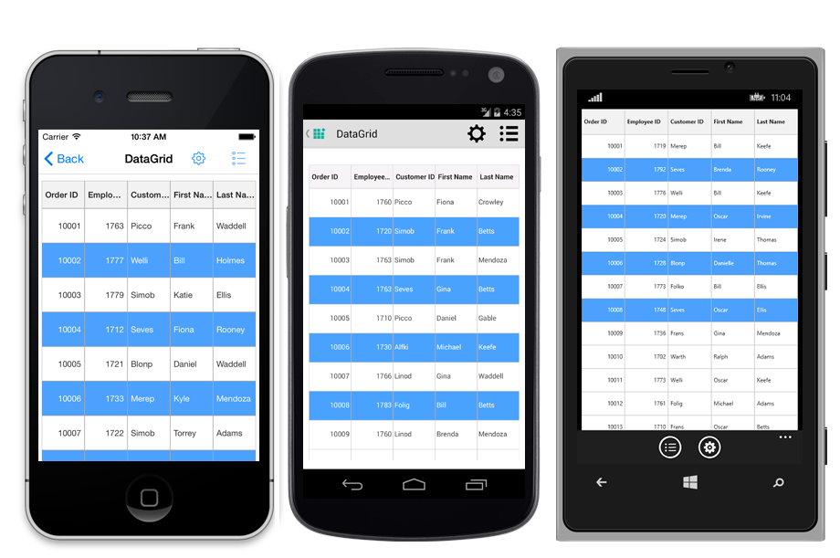
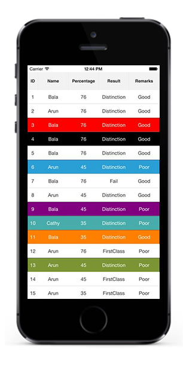

# Selection

This section explains how to enable selection in the data grid; modes, properties, and events involved in selection; and customizations available for selection.

The data grid allows you to select a specific row or group of rows either programmatically or by touch interactions. To enable selection, set the [SfDataGrid.SelectionMode](http://help.syncfusion.com/cr/cref_files/xamarin/sfdatagrid/Syncfusion.SfDataGrid.XForms~Syncfusion.SfDataGrid.XForms.SfDataGrid~SelectionMode.html) property to a value other than `None`. This control has different selection modes to perform the selection operation as follows:

## Selection modes 

<table>
<tr>
<th> Modes </th>
<th> Description </th>
</tr>
<tr>
<td> {{'[None](http://help.syncfusion.com/cr/cref_files/xamarin/sfdatagrid/Syncfusion.SfDataGrid.XForms~Syncfusion.SfDataGrid.XForms.SelectionMode.html)'| markdownify }} </td>
<td>Disables selection, and no rows can be selected. This is the default value.</td>
</tr>
<tr>
<td> {{'[Single](http://help.syncfusion.com/cr/cref_files/xamarin/sfdatagrid/Syncfusion.SfDataGrid.XForms~Syncfusion.SfDataGrid.XForms.SelectionMode.html)'| markdownify }} </td>
<td> Allows selection of a single row only. Upon selecting the next row, the selection in the previous row is cleared. </td>
</tr>
<tr>
<td> {{'[Multiple](http://help.syncfusion.com/cr/cref_files/xamarin/sfdatagrid/Syncfusion.SfDataGrid.XForms~Syncfusion.SfDataGrid.XForms.SelectionMode.html)'| markdownify }}  </td>
<td> Allows selection of more than one row. Selection is not cleared when selecting more than one record. When you click on a selected row for the second time, the selection is cleared. </td>
</tr>
<tr>
<td>  {{'[SingleDeselect](http://help.syncfusion.com/cr/cref_files/xamarin/sfdatagrid/Syncfusion.SfDataGrid.XForms~Syncfusion.SfDataGrid.XForms.SelectionMode.html)'| markdownify }}  </td>
<td> Allows selection of only a single row. However, upon tapping the row again, the selection is cleared. Similar to single mode, upon selecting the next row, the selection in the previous row is cleared. </td>
</tr>
</table>

To set the selection mode, follow the code example:



<syncfusion:SfDataGrid x:Name="dataGrid"
                       ColumnSizer="Star"
                       AutoGenerateColumns="True"
                       SelectionMode="Multiple" 
                       ItemsSource="{Binding OrdersInfo}"/>


dataGrid.SelectionMode = SelectionMode.Multiple; 



## Programmatic selection

When `SfDataGrid.SelectionMode` is set a value other than `None`, select row/rows from the code by setting the [SfDataGrid.SelectedIndex](http://help.syncfusion.com/cr/cref_files/xamarin/sfdatagrid/Syncfusion.SfDataGrid.XForms~Syncfusion.SfDataGrid.XForms.SfDataGrid~SelectedIndex.html), [SfDataGrid.SelectedItem](http://help.syncfusion.com/cr/cref_files/xamarin/sfdatagrid/Syncfusion.SfDataGrid.XForms~Syncfusion.SfDataGrid.XForms.SfDataGrid~SelectedItem.html), or [SfDataGrid.SelectedItems](http://help.syncfusion.com/cr/cref_files/xamarin/sfdatagrid/Syncfusion.SfDataGrid.XForms~Syncfusion.SfDataGrid.XForms.SfDataGrid~SelectedItems.html) property based on the selection mode. To enable selection from code, follow the code example:

When the selection mode is `Single`, programmatically select a row in two ways either by setting the row index to the `SfDataGrid.SelectedIndex` property, or by setting the underlying object to be selected to the `SfDataGrid.SelectedItem` property. 

To programmatically select a row from the code, follow the code example:


//Perform selection using selected index
dataGrid.SelectedIndex = 3;
 
//Perform selection using selected item
dataGrid.SelectedItem = viewModel.OrdersInfo [5];


When the selection mode is multiple, programmatically select more than one row by adding the underlying object to be selected to the `SfDataGrid.SelectedItems` property. 

To programmatically select more than one row from the code, follow the code example:

 
//Perform multiple selection using selected item
dataGrid.SelectedItems.Add (viewModel.OrdersInfo [4]);
dataGrid.SelectedItems.Add (viewModel.OrdersInfo [5]);


The following screenshot shows the selection functionality in the data grid:

### CurrentItem

The [SfDataGrid.CurrentItem](http://help.syncfusion.com/cr/cref_files/xamarin/sfdatagrid/Syncfusion.SfDataGrid.XForms~Syncfusion.SfDataGrid.XForms.SfDataGrid~CurrentItem.html) property holds the underlying data of the last selected row in the data grid. 

Get the current item in the `SfDataGrid.SelectionChanged` event by setting the `SfDataGrid.SelectionMode` as `Multiple` or `SingleDeselect`. If the `SelectionMode` is `Single`, currentItem and selectedItem are same.

To set the selection mode for the data grid in the SelectionChanged event, follow the code example:


dataGrid.SelectionMode = SelectionMode.Multiple; 
 
dataGrid.SelectionChanged += DataGrid_SelectionChanged; 
 
void DataGrid_SelectionChanged (object sender, GridSelectionChangedEventArgs e) 
{ 
 var currentItem = dataGrid.CurrentItem; 

 //your codes
}   

 

## Keyboard Behavior

`SfDataGrid` supports selection via keyboard interaction for the Xamarin.Forms.macOS and Xamarin.Forms.UWP platforms. Keyboard interaction will not have any effect when `SfDataGrid.SelectionMode` is set as `SelectionMode.None`.

<table>
<tr>
<th>
Key or KeyCombinations
</th>
<th>
Description
</th>
</tr>
<tr>
<td>
<kbd>DownArrow</kbd>
</td>
<td>
Moves the selection to next row directly below the current selected row when having SelectionMode is Single. Upon reaching the bottom of the screen, pressing down arrow scrolls and applies selection to the next row if the grid has scrollable content. If the selected row is the last row of the grid, pressing down arrow does nothing. In `Multiple` and `SingleDeselect` selection modes, if the next row has already been selected, then pressing down key will deselect the row.
</td>
</tr>
<tr>
<td>
<kbd>UpArrow</kbd>
</td>
<td>
Moves the selection to previous row directly above the current selected row when having SelectionMode is Single. Upon reaching the top of the screen, pressing up arrow scrolls and applies selection to the previous row if the grid has scrollable content. If the selected row is the first row of the grid, pressing up arrow does nothing. In `Multiple` and `SingleDeselect` selection modes, if the previous row has already been selected, then pressing up key will deselect the row.
</td>
</tr>
<tr>
<td>
<kbd>PageDown</kbd>
</td>
<td>
The SfDataGrid will be scrolled to next set of rows that are not displayed in view, including the row that is partially displayed. If selection is applied to any row, pressing PageDown moves the selection to the last row of the next set of rows when having SelectionMode is Single.
</td>
</tr>
<tr>
<td>
<kbd>PageUp</kbd>
</td>
<td>
The SfDataGrid will be scrolled to previous set of rows that are not displayed in view, including the row that is partially displayed. If selection is applied to any row, pressing PageUp moves the selection to the first row of the next set of rows when having SelectionMode is Single.
</td>
</tr>
<tr>
<td>
<kbd>Tab</kbd>
</td>
<td>
Moves the selection to next row directly below the current selected row when having SelectionMode is Single. Upon reaching the bottom of the screen, pressing tab scrolls and applies selection to the next row if the grid has scrollable content. If the selected row is the last row of the grid, pressing tab does nothing. In `Multiple` and `SingleDeselect` selection modes, if the next row has already been selected, then pressing tab key will deselect the row.
</td>
</tr>
<tr>
<td>
<kbd>Ctrl</kbd> + <kbd>Home</kbd> or <kbd>Ctrl</kbd> + <kbd>UpArrow</kbd> or <kbd>Home</kbd>
</td>
<td>
Scrolls the grid to the first row of the collection.
</td>
</tr>
<tr>
<td>
<kbd>Ctrl</kbd> + <kbd>End</kbd> or <kbd>Ctrl</kbd> + <kbd>DownArrow</kbd> or <kbd>End</kbd>
</td>
<td>
Scrolls the grid to the last row of the collection.
</td>
</tr>
<tr>
<td>
<kbd>Enter</kbd> or <kbd>Ctrl</kbd> + <kbd>Enter</kbd>
</td>
<td>
If the active current cell is in edit mode, the changes will be committed and moves the selection to the row below the active current cell. If the active current cell is in last row, commits changes and only editing is ended.
</td>
</tr>
<tr>
<td>
<kbd>Esc</kbd>
</td>
<td>
If the current cell is in edit mode, reverts the changes that had been done in the current cell. If the underlying source implements the {{'[IEditableObject](https://msdn.microsoft.com/en-us/library/system.componentmodel.ieditableobject#"")'| markdownify }}, on pressing of Esc key for the second time will cancel the edit mode for entire row.
</td>
</tr>
</table>

### Shift Key Combinations

<table>
<tr>
<th>
Key Combinations
</th>
</tr>
<tr>
<td>
<kbd>Shift</kbd> + <kbd>DownArrow</kbd>
</td>
<td>
If Selection Mode is multiple, selects the multiple cells continuously towards downward from the current selected cell,If the Selection Mode is Single or SingleDeselect moves the selection to next row.
</td>
</tr>
<tr>
<td>
<kbd>Shift</kbd> + <kbd>UpArrow</kbd> 
</td>
<td>
If Selection Mode is multiple, selects the multiple cells continuously towards upward from the current selected cell.If the Selection Mode is Single or SingleDeselect moves the selection to previous row.
</td>
</tr>
<tr>
<td>
<kbd>Shift</kbd> + <kbd>Tab</kbd>
</td>
<td>
Moves the selection to previous row from current selected row when having SelectionMode is Single or SingleDeselect. If the selected row is in first row, pressing Shift +Tab does nothing.
</td>   
</tr>
</table>

## Selection events

The data grid provides the following events for selection:

 * [SelectionChanging](http://help.syncfusion.com/cr/cref_files/xamarin/sfdatagrid/Syncfusion.SfDataGrid.XForms~Syncfusion.SfDataGrid.XForms.SfDataGrid~SelectionChanging_EV.html): This event is raised while selecting a row at the execution time before the row is selected. So it allows canceling the selection action by setting the Cancel property of `GridSelectionChangingEventArgs`.
 * [SelectionChanged](http://help.syncfusion.com/cr/cref_files/xamarin/sfdatagrid/Syncfusion.SfDataGrid.XForms~Syncfusion.SfDataGrid.XForms.SfDataGrid~SelectionChanged_EV.html): This event is raised after the column is selected.

These two events are triggered with `GridSelectionChangingEventArgs` and [GridSelectionChangedEventArgs](http://help.syncfusion.com/cr/cref_files/xamarin/sfdatagrid/Syncfusion.SfDataGrid.XForms~Syncfusion.SfDataGrid.XForms.GridSelectionChangedEventArgs.html) that contain the following properties:

 * AddedItems: Gets collection of the underlying data objects added for selection.
 * RemovedItems: Gets collection of the underlying data objects removed from selection.

To hook the `SelectionChanging` event and cancel the selection of a column, follow the code example:


dataGrid.SelectionChanging += DataGrid_SelectionChanging;  

void DataGrid_SelectionChanging (object sender, GridSelectionChangingEventArgs e)
{
    e.Cancel = true;
}


To get the selected item in code-behind using the `SelectionChanged` event, follow the code example:


dataGrid.SelectionChanged += DataGrid_SelectionChanged;

private void DataGrid_SelectionChanged (object sender, GridSelectionChangedEventArgs e)
{
    // Gets the selected item 
    var selectedItem = e.AddedItems[0];
}


## Row header selection

The data grid allows you to select grid row(s) upon tapping them over the grid cells. It also allows you to select grid rows when you tap the row header cells. To enable selection in the data grid, set the [SfDataGrid.SelectionMode](http://help.syncfusion.com/cr/cref_files/xamarin/sfdatagrid/Syncfusion.SfDataGrid.XForms~Syncfusion.SfDataGrid.XForms.SfDataGrid~SelectionMode.html) property to a value other than `None`.

### Select records in the data grid when tapping only on the row header cells

The data grid allows you to select a specific row or group of rows by touching the grid cells. However, if you need to select the record only when tapping on the row header cells, you can do this by handling the `SfDataGrid.SelectionChanging` event. 
 
To select records in the data grid when tapping only on the row header cells, follow the code example:



dataGrid.SelectionMode = SelectionMode.Single;

private void DataGrid_SelectionChanging(object sender, GridSelectionChangingEventArgs e)
{
    e.Cancel = true;
}

private void DataGrid_GridTapped(object sender, GridTappedEventsArgs e)
{
    if(e.RowColumnIndex.ColumnIndex == 0)
    {
        dataGrid.SelectedIndex = e.RowColumnIndex.RowIndex;
    }
}
 


N> To enable the row header in the data grid, set the `SfDataGrid.ShowRowHeader` to `true`.

## Clear selection

The data grid allows you to clear the selection applied in the grid rows in two ways: either by setting the `SfDataGrid.SelectionMode` to `None`, or by calling the [SfDataGrid.SelectionController.ClearSelection ()](http://help.syncfusion.com/cr/cref_files/xamarin/sfdatagrid/Syncfusion.SfDataGrid.XForms~Syncfusion.SfDataGrid.XForms.GridSelectionController~ClearSelection.html) method.

To clear the selection in the data grid, follow the code example:


//Clear selection using selection mode
dataGrid.SelectionMode = SelectionMode.None;

//Clear selection using selection controller
dataGrid.SelectionController.ClearSelection (); 


N> Selected items and the selections will be cleared whenever the ItemsSource is changed at runtime.

## Multiple selection colors

The data grid supports selecting one or more rows either programmatically or by touch interactions. By default, the control applies a common background color for the selected rows based on the current theme. However, it also provides extensibility to have multiple selection colors when touching the rows by writing a custom SelectionController derived from [GridSelectionController](http://help.syncfusion.com/cr/cref_files/xamarin/sfdatagrid/Syncfusion.SfDataGrid.XForms~Syncfusion.SfDataGrid.XForms.GridSelectionController.html# ""), and assigning it to the [SfDataGrid.SelectionController](http://help.syncfusion.com/cr/cref_files/xamarin/sfdatagrid/Syncfusion.SfDataGrid.XForms~Syncfusion.SfDataGrid.XForms.SfDataGrid~SelectionController.html# "") property. Override the GetSelectionColor() method to apply different colors for selection at runtime.

To set different colors for the selected rows in the data grid, follow the code example:


sfGrid.SelectionController = new CustomSelectionController(sfGrid);
sfGrid.SelectionMode = SelectionMode.Multiple;



public class CustomSelectionController : GridSelectionController
{
    public Color[] SelectionColors { get; set; }

    public CustomSelectionController(SfDataGrid datagrid) : base(datagrid)
    {
        this.DataGrid = datagrid;
        SelectionColors = new Color[11] 
        { 
            Color.DarkSalmon,
            Color.DarkSlateGray,
            Color.Red, 
            Color.Blue,
            Color.DarkOliveGreen, 
            Color.Black, 
            Color.Gray, 
            Color.MediumPurple,
            Color.BurlyWood,
            Color.DarkCyan,
            Color.DarkGoldenrod 
        };   
    }
    //Code to set multiple selection colors
    public override Color GetSelectionColor(int rowIndex, object rowData)
    {
        if (SelectionColors != null)
            return SelectionColors[rowIndex % 11];
        else
            return Color.Blue;
    }
}


The following screenshot shows the final outcome upon execution of the above code:

## Selection animation

The data grid supports selecting one or more rows programmatically or by touch interactions. In addition, the control also provides extensibility to animate the selected rows. 

It can be done by extending the [GridSelectionController](http://help.syncfusion.com/cr/cref_files/xamarin/sfdatagrid/Syncfusion.SfDataGrid.XForms~Syncfusion.SfDataGrid.XForms.GridSelectionController.html# ).

Refer to the following example in which a CustomSelectionController is derived from `GridSelectionController` and an instance of it is assigned to the [SfDataGrid.SelectionController](http://help.syncfusion.com/cr/cref_files/xamarin/sfdatagrid/Syncfusion.SfDataGrid.XForms~Syncfusion.SfDataGrid.XForms.SfDataGrid~SelectionController.html ) property to achieve selection animation:



<ContentPage.Resources>
    <ResourceDictionary>
        <local:CustomSelectionController x:Key="CustomSelectionController" DataGrid="{x:Reference dataGrid}">
        </local:CustomSelectionController>
    </ResourceDictionary>
</ContentPage.Resources>

<ContentPage.Content>
    <sfgrid:SfDataGrid x:Name="dataGrid"
            ColumnSizer="Star"
            SelectedIndex="1"
            SelectionMode="Multiple"
            VerticalOverScrollMode="None"
            SelectionController="{StaticResource CustomSelectionController}" />
</ContentPage.Content>


this.dataGrid.ItemsSource = viewModel.OrdersInfo;
this.dataGrid.SelectionController = new CustomSelectionController();
this.dataGrid.SelectionMode = SelectionMode.Multiple;
SelectionPicker.SelectedIndex = 1;




public class CustomSelectionController : GridSelectionController
{
    public CustomSelectionController()
    {
        this.SelectedRows = new GridSelectedRowsCollection();
    }
    protected override async void SetSelectionAnimation(VirtualizingCellsControl rowElement)
    {
        rowElement.Opacity = 0.50;
        await rowElement.FadeTo(1, 400, Easing.CubicInOut);
    }
}


The following screenshot shows the selection animation in the data grid:

