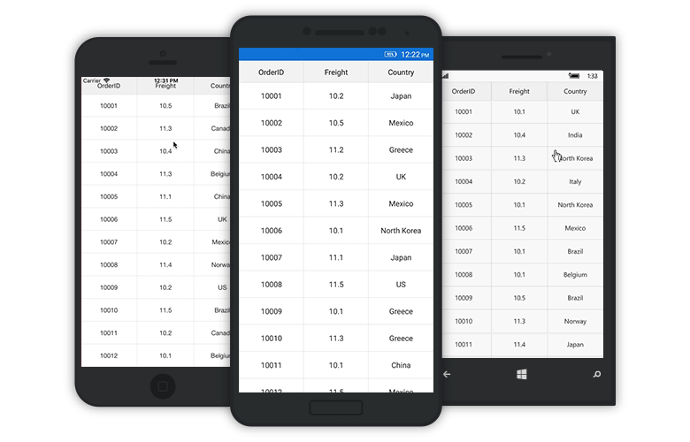

# Sorting 

SfDataGrid allows you to apply sorting on its data by setting the [SfDataGrid.AllowSorting](http://help.syncfusion.com/cr/cref_files/xamarin/sfdatagrid/Syncfusion.SfDataGrid.XForms~Syncfusion.SfDataGrid.XForms.SfDataGrid~AllowSorting.html) property to `true`. It allows you to sort the data against one or more columns. When sorting is applied, the SfDataGrid automatically rearranges the data to match with the current sort criteria. When `SfDataGrid.AllowSorting` is `true`, you can sort the data simply by tapping the column header you wish to sort. Once sorting is applied, the SfDataGrid shows a sort icon in the respective column header indicating the direction of sorting.

N> To update the sorting for the newly added row or column, set the `SfDataGrid.View.LiveDataUpdateMode` to `LiveDataUpdateMode.AllowDataShaping`.

## Programmatic Sorting

SfDataGrid also allows to perform sorting from the code. This requires you to manually define the [SortColumnDescription](http://help.syncfusion.com/cr/cref_files/xamarin/sfdatagrid/Syncfusion.SfDataGrid.XForms~Syncfusion.SfDataGrid.XForms.SortColumnDescription.html) objects and add it in the [SfDataGrid.SortColumnDescriptions](http://help.syncfusion.com/cr/cref_files/xamarin/sfdatagrid/Syncfusion.SfDataGrid.XForms~Syncfusion.SfDataGrid.XForms.SfDataGrid~SortColumnDescriptions.html) collection. SfDataGrid sorts the data based on the `SortColumnDescription` objects that are added to this collection.

`SortColumnDescription` object holds following two properties:

* ColumnName: Name of the sorted column.
* SortDirection: An object of type ListSortDirection defines the sorting direction.

The following code example illustrates this.



<syncfusion:SfDataGrid x:Name="dataGrid"
            ItemsSource="{Binding OrdersInfo}">

    <syncfusion:SfDataGrid.SortColumnDescriptions>
        <syncfusion:SortColumnDescription ColumnName="OrderID" 
                                          SortDirection="Descending" />
        </syncfusion:SfDataGrid.SortColumnDescriptions>
    </syncfusion:SfDataGrid> 


dataGrid.AllowSorting = true;

dataGrid.SortColumnDescriptions.Add (new SortColumnDescription () {
    ColumnName = "OrderID",
    SortDirection = ListSortDirection.Descending
}); 



The following screenshot shows the sorting functionality in SfDataGrid

## Tri-State Sorting

In addition to sort the data in ascending / descending orders, SfDataGrid also allows you to unsort the data in the original order by clicking the header again after sorting to descending order by setting the [SfDataGrid.AllowTriStateSorting](http://help.syncfusion.com/cr/cref_files/xamarin/sfdatagrid/Syncfusion.SfDataGrid.XForms~Syncfusion.SfDataGrid.XForms.SfDataGrid~AllowTriStateSorting.html) property to `true`. When this property is set Sorting in each column iterates through three sort states; ascending, descending, and unsorted.

The following code example shows how to enable Tri-State sorting in SfDataGrid.



<syncfusion:SfDataGrid AllowTriStateSorting="True" />


dataGrid.AllowTriStateSorting = true;



## Multi-Column Sorting

SfDataGrid allows you to sort the data against more than one columns by setting the [SfDataGrid.AllowMultiSorting](http://help.syncfusion.com/cr/cref_files/xamarin/sfdatagrid/Syncfusion.SfDataGrid.XForms~Syncfusion.SfDataGrid.XForms.SfDataGrid~AllowMultiSorting.html) property to `true`. The number of columns by which the data can be sorted is unlimited. To apply sorting for multiple columns, tap the desired column headers after setting the `SfDataGrid.AllowMultiSorting` property.

The following code example shows how to enable multi-sorting in SfDataGrid.



<syncfusion:SfDataGrid AllowMultiSorting="True" />


dataGrid.AllowMultiSorting = true;



## Sort column in double click

* By default, column gets sorted when column header clicked. You can change this behavior to sort the column in double click action by setting [SfDataGrid.SortTapAction](http://help.syncfusion.com/cr/cref_files/xamarin/sfdatagrid/Syncfusion.SfDataGrid.XForms~Syncfusion.SfDataGrid.XForms.SfDataGrid~SortTapAction.html) property to `DoubleTap`.

The following code example shows how to set `SortTapAction` is `DoubleTap` in SfDataGrid.



<syncfusion:SfDataGrid x:Name="dataGrid"
            SortTapAction="DoubleTap"
            ItemsSource="{Binding OrdersInfo}">
    </syncfusion:SfDataGrid> 



dataGrid.SortTapAction=SortTapAction.DoubleTap;




## Sorting events

The SfDataGrid provides you the following events for the sorting functionality:

* [SortColumnsChanging](http://help.syncfusion.com/cr/cref_files/xamarin/sfdatagrid/Syncfusion.SfDataGrid.XForms~Syncfusion.SfDataGrid.XForms.SfDataGrid~SortColumnsChanging_EV.html) – This event is raised while sorting the column at execution time before the column gets sorted. It helps to cancel the sorting action by setting the Cancel property of [DataGridSortColumnsChangingEventArgs](http://help.syncfusion.com/cr/cref_files/xamarin/sfdatagrid/Syncfusion.SfDataGrid.XForms~Syncfusion.SfDataGrid.XForms.DataGridSortColumnsChangingEventArgs.html).
* [SortColumnsChanged](http://help.syncfusion.com/cr/cref_files/xamarin/sfdatagrid/Syncfusion.SfDataGrid.XForms~Syncfusion.SfDataGrid.XForms.SfDataGrid~SortColumnsChanged_EV.html) – This event is raised after the column is sorted.

These two events are triggered with `DataGridSortColumnsChangingEventArgs` and [DataGridSortColumnsChangedEventArgs](http://help.syncfusion.com/cr/cref_files/xamarin/sfdatagrid/Syncfusion.SfDataGrid.XForms~Syncfusion.SfDataGrid.XForms.DataGridSortColumnsChangedEventArgs.html) that contain the following properties.

* AddedItems – Gets the collection of `SortColumnDescription` objects that are added to `SortColumnDescriptions` collection for Sorting.
* RemovedItems – Gets the collection of `SortColumnDescription` objects that are removed from `SortColumnDescriptions` collection.

The following code example illustrates how to hook the `SortColumnsChanging` event and cancel the sorting of a column.



<syncfusion:SfDataGrid x:Name="dataGrid"
            AllowSorting="True"
            SortColumnsChanging="DataGrid_SortColumnsChanging"
            ItemsSource="{Binding OrdersInfo}">
</syncfusion:SfDataGrid> 


dataGrid.SortColumnsChanging += DataGrid_SortColumnsChanging; 




void DataGrid_SortColumnsChanging (object sender, DataGridSortColumnsChangingEventArgs e)
{
    if(e.AddedItems[0].ColumnName == "OrderID")
    {
        e.Cancel = true;
    }
}


## Custom sorting

SfDataGrid allows you to sort columns based on custom logic when the standard sorting techniques do not meet the requirements. For each column, you can apply different sorting criteria by adding `SortComparer` objects to [SfDataGrid.SortComparers](http://help.syncfusion.com/cr/cref_files/xamarin/sfdatagrid/Syncfusion.SfDataGrid.XForms~Syncfusion.SfDataGrid.XForms.SfDataGrid~SortComparers.html) collection.

A `SortComparer` object has the following properties:

* PropertyName: [MappingName]() of the column that applies custom sorting.
* Comparer: Gets or sets the custom comparer that implements the `IComparer` and `ISortDirection` interfaces.

The following code example illustrates how to perform custom sorting for FirstName column based on the string length of the names.



<ContentPage xmlns="http://xamarin.com/schemas/2014/forms"
             xmlns:x="http://schemas.microsoft.com/winfx/2009/xaml"
             xmlns:data="clr-namespace:Syncfusion.Data;assembly=Syncfusion.Data.Portable"
             xmlns:syncfusion="clr-namespace:Syncfusion.SfDataGrid.XForms;assembly=Syncfusion.SfDataGrid.XForms"
             xmlns:local ="clr-namespace:DataGridSample;assembly=DataGridSample"
             x:Class="DataGridSample.Sample">

    <ContentPage.Resources>
        <ResourceDictionary>
            <local:CustomComparer x:Key="Comparer" />
        </ResourceDictionary>
    </ContentPage.Resources>

    <ContentPage.BindingContext>
        <local:ViewModel x:Name="viewModel" />
    </ContentPage.BindingContext>

    <syncfusion:SfDataGrid x:Name="dataGrid"
                           AllowSorting="True"
                           ItemsSource="{Binding OrdersInfo}">

        <syncfusion:SfDataGrid.SortComparers>
            <data:SortComparer Comparer="{StaticResource Comparer}"
                               PropertyName="FirstName" />
        </syncfusion:SfDataGrid.SortComparers>

        <syncfusion:SfDataGrid.SortColumnDescriptions>
            <syncfusion:SortColumnDescription ColumnName="FirstName" 
                                              SortDirection="Descending" />
        </syncfusion:SfDataGrid.SortColumnDescriptions>
    </syncfusion:SfDataGrid>
</ContentPage> 


dataGrid.SortComparers.Add (new SortComparer () {
    PropertyName = "FirstName",
    Comparer = new CustomComparer()
});

dataGrid.SortColumnDescriptions.Add (new SortColumnDescription () {
    ColumnName = "FirstName",
    SortDirection = ListSortDirection.Descending
}); 



The following code example illustrates how to write a Custom Comparer.


public class CustomComparer : IComparer<Object>, ISortDirection
{
    public int Compare(object x, object y)
    {
        int nameX;
        int nameY;

        //For OrderInfo type data
        if (x.GetType () == typeof(OrderInfo)) {
            //Calculating the length of FirstName in OrderInfo objects
            nameX = ((OrderInfo)x).FirstName.Length;
            nameY = ((OrderInfo)y).FirstName.Length;
        }

        //For Group type data                                   
        else if (x.GetType () == typeof(Group)) {
            //Calculating the group key length
            nameX = ((Group)x).Key.ToString ().Length;
            nameY = ((Group)y).Key.ToString ().Length;
        } else {
            nameX = x.ToString ().Length;
            nameY = y.ToString ().Length;
        }

        // Objects are compared and return the SortDirection
        if (nameX.CompareTo (nameY) > 0)
            return SortDirection == ListSortDirection.Ascending ? 1 : -1;
        else if (nameX.CompareTo (nameY) == -1)
            return SortDirection == ListSortDirection.Ascending ? -1 : 1;
        else
            return 0; 
    }

    //Gets or sets the SortDirection value
    public ListSortDirection SortDirection { get; set; }
}


## How to disable sorting for an individual column?

SfDataGrid allows you to disable the sorting for individual columns by using the [GridColumn.AllowSorting](http://help.syncfusion.com/cr/cref_files/xamarin/sfdatagrid/Syncfusion.SfDataGrid.XForms~Syncfusion.SfDataGrid.XForms.GridColumn~AllowSorting.html) property. The default value of this property is `true` and hence all the columns in the [SfDataGrid.Columns](http://help.syncfusion.com/cr/cref_files/xamarin/sfdatagrid/Syncfusion.SfDataGrid.XForms~Syncfusion.SfDataGrid.XForms.SfDataGrid~Columns.html) collection can be sorted when `SfDataGrid.AllowSorting` is set to `true`.

The following code example illustrate how to disable sorting for an individual column.

### For AutoGenerated Column


public MainPage()
{
    InitializeComponent();
    viewModel = new ViewModel();
    dataGrid = new SfDataGrid();
    dataGrid.ItemsSource = viewModel.OrdersInfo;
    dataGrid.AllowSorting = true;
    dataGrid.AutoGeneratingColumn += DataGrid_AutoGeneratingColumn;
    this.Content = dataGrid;          
}
private void DataGrid_AutoGeneratingColumn(object sender, AutoGeneratingColumnEventArgs e)
{
    if (e.Column.MappingName == "Freight")
        e.Column.AllowSorting = false;
}


### For Manually defined column


public MainPage()
{
    InitializeComponent();
    viewModel = new ViewModel();
    dataGrid = new SfDataGrid();
    dataGrid.ItemsSource = viewModel.OrdersInfo;
    dataGrid.AutoGenerateColumns = false;
    dataGrid.AllowSorting = true;
    dataGrid.Columns.Add(new GridTextColumn() { MappingName = "OrderID" });
    dataGrid.Columns.Add(new GridTextColumn() { MappingName = "Freight", AllowSorting = false });
    dataGrid.Columns.Add(new GridTextColumn() { MappingName = "Country" });
    this.Content = dataGrid;          
}
