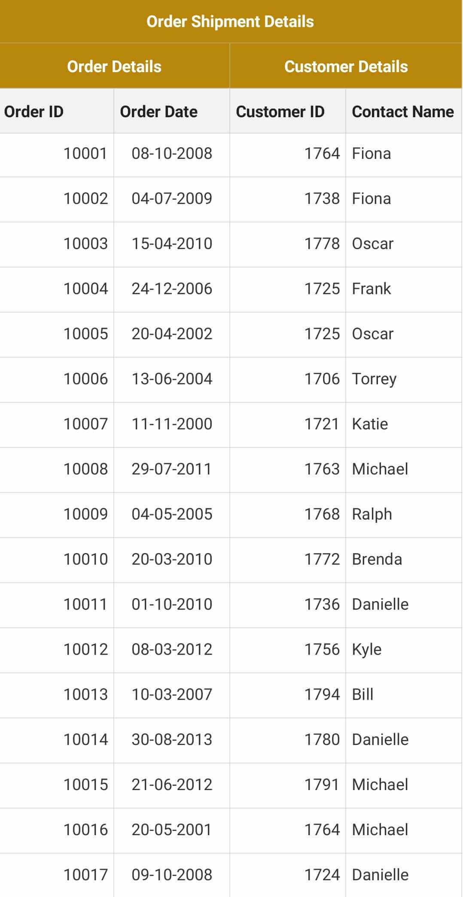
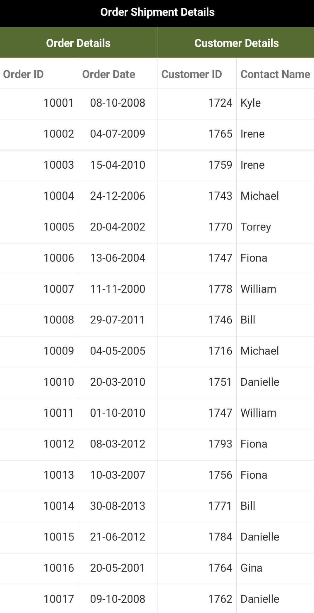
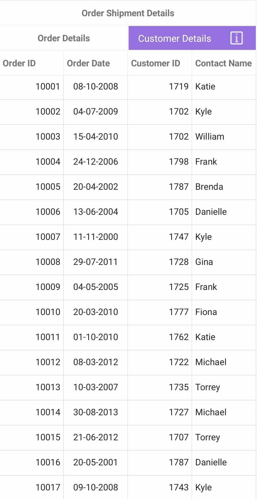

# Stacked Headers

The SfDataGrid supports displaying additional unbound, multiple/multillevel header rows known as `StackedHeaderRows` that spans across the DataGrid columns. You can group one or more columns under each stacked header.

Each `StackedHeaderRow` contains `StackedColumns`, which contains a number of child columns. The `StackedColumn.ChildColumns` property contains the columns grouped under the stacked header row. The `StackedColumn.MappingName` is a unique name used for mapping a specific child column grouped under the same stacked header row, whereas the `StackedColumn.Text` contains the text displayed in the stacked header row.

### Adding stacked header

The stacked headers can be added using the following steps:

1. Create an object of `StackedHeaderRow` for adding stacked columns.
2. Add the columns using the `ChildColumns` property of `StackedColumn`.
3. Add the `StackedColumn` to `StackedColumns` collection.
4. Finally, add the `StackedHeaderRow` to `StackedHeaderRows` collection of the SfDataGrid. 



<syncfusion:SfDataGrid x:Name="dataGrid"         
                       ItemsSource="{Binding Orders}">
     <syncfusion:SfDataGrid.StackedHeaderRows>
            <syncfusion:StackedHeaderRow>
                <syncfusion:StackedHeaderRow.StackedColumns>
                    <syncfusion:StackedColumn
                            ChildColumns="OrderID,OrderDate,CustomerID,ContactName"
                            Text="Order Shipment Details"
                            MappingName="SalesDetails"
                            FontAttribute="Bold"
                            TextAlignment="Center"
                            />
                </syncfusion:StackedHeaderRow.StackedColumns>
            </syncfusion:StackedHeaderRow>
            <syncfusion:StackedHeaderRow>
                <syncfusion:StackedHeaderRow.StackedColumns>
                    <syncfusion:StackedColumn
                            ChildColumns="OrderID,OrderDate"
                            Text="Order Details"
                            MappingName="OrderDetails"
                            FontAttribute="Bold"
                            TextAlignment="Center"
                            />
                    <syncfusion:StackedColumn
                            ChildColumns="CustomerID,ContactName"
                            Text="Customer Details"
                            MappingName="CustomerDetails"
                            FontAttribute="Bold"
                            TextAlignment="Center"
                            />
                </syncfusion:StackedHeaderRow.StackedColumns>
            </syncfusion:StackedHeaderRow>
        </syncfusion:SfDataGrid.StackedHeaderRows>
</syncfusion:SfDataGrid>


var stackedHeaderRow = new StackedHeaderRow();
stackedHeaderRow.StackedColumns.Add(new StackedColumn()
{
	ChildColumns = "OrderID" + "," + "OrderDate" + "," + "CustomerID" + "," + "ContactName",
	Text = "Order Shipment Details",
	MappingName = "SalesDetails",
	FontAttribute = FontAttributes.Bold,
	TextAlignment = TextAlignment.Center,
});
dataGrid.StackedHeaderRows.Add(stackedHeaderRow);

var stackedHeaderRow1 = new StackedHeaderRow();
stackedHeaderRow1.StackedColumns.Add(new StackedColumn()
{
	ChildColumns = "OrderID" + "," + "OrderDate",
	Text = "Order Details",
	MappingName = "OrderDetails",
	FontAttribute = FontAttributes.Bold,
	TextAlignment = TextAlignment.Center
});
stackedHeaderRow1.StackedColumns.Add(new StackedColumn()
{
	ChildColumns = "CustomerID" + "," + "ContactName",
	Text = "Customer Details",
	MappingName = "CustomerDetails",
	FontAttribute = FontAttributes.Bold, 
	TextAlignment = TextAlignment.Center
});
this.dataGrid.StackedHeaderRows.Add(stackedHeaderRow1);



## Adding child columns

You can add the child columns to a particular stacked header row directly using the following code snippet.



var childColumn = dataGrid.StackedHeaderRows[0].StackedColumns[0].ChildColumns;
dataGrid.StackedHeaderRows[0].StackedColumns[0].ChildColumns = childColumn + "," + "OrderDate";



## Removing child columns

Similarly, you can remove the child columns from a particular stacked header row directly using the following code snippet.



var removingColumns = this.dataGrid.StackedHeaderRows[0].StackedColumns[0].ChildColumns.Split(',').ToList<string>();   
string childColumns = string.Empty;

foreach(var stackedColumnName in removingColumns.ToList())
{
    if (stackedColumnName.Equals("OrderID"))
    {
        removingColumns.Remove(stackedColumnName);
    }
    else
    {
        childColumns = childColumns + stackedColumnName + ",";
    }
}
dataGrid.StackedHeaderRows[0].StackedColumns[0].ChildColumns = childColumns;



## Changing stacked header row height

You can change the height of StackedHeaderRows using the `SfDataGrid.HeaderRowHeight` property.



dataGrid.HeaderRowHeight = 50;



You can also change the height of stacked header rows using the `SfDataGrid.QueryRowHeight` event.



dataGrid.QueryRowHeight += dataGrid_QueryRowHeight;
void dataGrid_QueryRowHeight(object sender, QueryRowHeightEventArgs  e)
{
    if(e.RowIndex < this.dataGrid.GetHeaderIndex())
    {
        // Using the following code, you can set a desired height based on the row index. 
        e.Height = 50;
        // Uncomment the below line of code to apply auto fit height based on the contents of the stacked header row.
        //e.Height = dataGrid.GetRowHeight(e.RowIndex);
        e.Handled = true;
    }
}



## Appearance

### Font customization

Customize the FontSize, FontFamily, and the FontAttribute of the text displayed in stacked header column using the `StackedColumn.TextSize`, `StackedColumn.Font`, and `StackedColumn.FontAttribute` properties, respectively. The default font size and font attribute are 14 and normal, respectively.

Refer to the following code snippet to customize the font of the text in stacked columns.



<syncfusion:StackedHeaderRow>
    <syncfusion:StackedHeaderRow.StackedColumns>
        <syncfusion:StackedColumn
                ChildColumns="OrderID,OrderDate,CustomerID,ContactName"
                Text="Order Shipment Details"
                MappingName="SalesDetails"
                TextSize = 16
                Font="Helvetica Neue"
                FontAttribute="Bold"
                />
    </syncfusion:StackedHeaderRow.StackedColumns>
</syncfusion:StackedHeaderRow>


var stackedHeaderRow = new StackedHeaderRow();
stackedHeaderRow.StackedColumns.Add(new StackedColumn()
{
	ChildColumns = "OrderID" + "," + "OrderDate" + "," + "CustomerID" + "," + "ContactName",
	Text = "Order Shipment Details",
	MappingName = "SalesDetails",
    TextSize = 14,
    Font = "Helvetica Neue",
    FontAttribute = FontAttributes.Bold
});
dataGrid.StackedHeaderRows.Add(stackedHeaderRow);



###	Foreground and background customization

The appearance of stacked header row can be customized by returning a desired color in the `GetStackedHeaderBackgroundColor()` and `GetStackedHeaderForegroundColor()` overrides of the  custom written style class derived from `DataGridStyle` and assigning it to the `SfDataGrid.GridStyle` property. 



<ContentPage xmlns="http://xamarin.com/schemas/2014/forms"
             xmlns:x="http://schemas.microsoft.com/winfx/2009/xaml"
             xmlns:syncfusion="clr-namespace:Syncfusion.SfDataGrid.XForms;assembly=Syncfusion.SfDataGrid.XForms"
             xmlns:local ="clr-namespace:DataGridSample;assembly=DataGridSample"
             x:Class="DataGridSample.Sample">

    <ContentPage.Resources>
        <ResourceDictionary>
            <local:Dark x:Key="dark" />
        </ResourceDictionary>
    </ContentPage.Resources>

    <syncfusion:SfDataGrid x:Name="dataGrid"
                GridStyle="{StaticResource dark}"
                ItemsSource="{Binding OrdersInfo}" />
</ContentPage> 


//Apply custom style to SfDataGrid from code
SfDataGrid dataGrid = new SfDataGrid();
dataGrid.GridStyle = new Dark ();




//Custom style class
public class Dark : DataGridStyle
{
    public Dark ()
    {
    }

    public override Color GetStackedHeaderBackgroundColor(int rowIndex)
    {
        return Color.DarkGoldenrod;
    }

    public override Color GetStackedHeaderForegroundColor(int rowIndex)
    {
        return Color.FromRgb(255, 255, 255);
    }  
} 


### Conditional styling

The SfDataGrid also allows to customize the appearance of stacked header rows based on its row index. Refer to the following code snippet to achieve the same.


//Custom style class
public class Dark : DataGridStyle
{
    public Dark ()
    {
    }

    public override Color GetStackedHeaderBackgroundColor(int rowIndex)
    {
        if (rowIndex == 0)
        {
            return Color.Black;
        }
        else if (rowIndex == 1)
        {
            return Color.DarkOliveGreen;
        }
    }

    public override Color GetStackedHeaderForegroundColor(int rowIndex)
    {
        if (rowIndex == 0 || rowIndex == 1)
        {
            return Color.FromRgb(255, 255, 255);
        }
        else
        {
            return Color.FromRgb(43, 43, 43);
        }
    } 
} 


## Loading template in stacked column

The SfDataGrid allows you to load any desired view inside a `StackedColumn` using the `StackedColumn.Template` property. Refer to the following code snippet to load a custom view inside a stacked column header.



     <syncfusion:SfDataGrid.StackedHeaderRows>
            <syncfusion:StackedHeaderRow>
                <syncfusion:StackedHeaderRow.StackedColumns>
                    <syncfusion:StackedColumn
                            ChildColumns="OrderID,OrderDate"
                            Text="Order Details"
                            MappingName="OrderDetails"
                            FontAttribute="Bold"
                            TextAlignment="Center"
                            />
                    <syncfusion:StackedColumn
                            ChildColumns="CustomerID,ContactName"
                            MappingName="CustomerDetails"
                            >
                            <syncfusion:StackedColumn.Template>
                            <DataTemplate>
                                <Grid BackgroundColor="MediumPurple">
                                    <Grid.ColumnDefinitions>
                                        <ColumnDefinition Width="*"/>
                                        <ColumnDefinition Width="50"/>
                                    </Grid.ColumnDefinitions>
                                    <Label Text="Customer Details" TextColor="White" HorizontalTextAlignment="Center" VerticalTextAlignment="Center" Grid.Column="0"/>
                                    <Image Source="customer_details.png"  VerticalOptions="Center" HorizontalOptions="Start" Aspect="AspectFit" Grid.Column="1"/>
                                </Grid>
                            </DataTemplate>
                        </syncfusion:StackedColumn.Template>
                     </syncfusion:StackedColumn>
                </syncfusion:StackedHeaderRow.StackedColumns>
            </syncfusion:StackedHeaderRow>
      </syncfusion:SfDataGrid.StackedHeaderRows>


var stackedHeaderRow1 = new StackedHeaderRow();
stackedHeaderRow1.StackedColumns.Add(new StackedColumn()
{
	ChildColumns = "OrderID" + "," + "OrderDate",
	Text = "Order Details",
	MappingName = "OrderDetails",
	FontAttribute = FontAttributes.Bold,
	TextAlignment = TextAlignment.Center
});
stackedHeaderRow1.StackedColumns.Add(new StackedColumn()
{
	ChildColumns = "CustomerID" + "," + "ContactName",
	MappingName = "CustomerDetails",
    Template = new DataTemplate(() => 
    {
        var gridView = new Grid()
        {
            BackgroundColor = Color.MediumPurple,
            ColumnDefinitions = new ColumnDefinitionCollection()
        {
            new ColumnDefinition{Width = new GridLength(1, GridUnitType.Star) },
            new ColumnDefinition{ Width = 50}
        }
        };
        var imageView = new Image()
        {
            Source = ImageSource.FromFile("customer_details.png"),
            Aspect = Aspect.AspectFit,
            VerticalOptions = LayoutOptions.Center,
            HorizontalOptions = LayoutOptions.Start
        };
        var label = new Label()
        {
            Text = "Customer Details",
            TextColor = Color.White,
            VerticalTextAlignment = TextAlignment.Center,
            HorizontalTextAlignment = TextAlignment.Center
        };
        gridView.Children.Add(label, 0, 0);
        gridView.Children.Add(imageView, 1, 0);
        return gridView;
    }) 
});
this.dataGrid.StackedHeaderRows.Add(stackedHeaderRow1);



