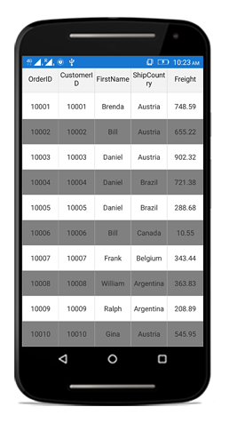
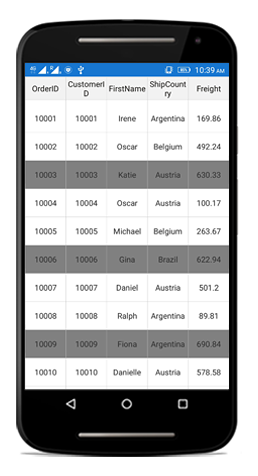
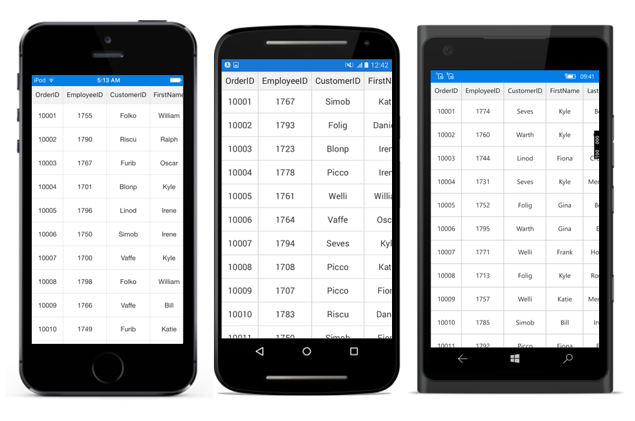
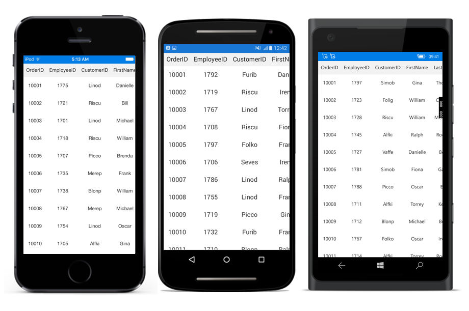

# Styles

SfDatagrid allows you to apply style to all of its elements by writing a Style class overriding from [DataGridStyle](http://help.syncfusion.com/cr/cref_files/xamarin/sfdatagrid/Syncfusion.SfDataGrid.XForms~Syncfusion.SfDataGrid.XForms.DataGridStyle.html) and assigning it to the [SfDataGrid.GridStyle](http://help.syncfusion.com/cr/cref_files/xamarin/sfdatagrid/Syncfusion.SfDataGrid.XForms~Syncfusion.SfDataGrid.XForms.SfDataGrid~GridStyle.html) property.
  
The following example explains you how to apply custom style to SfDatagrid.



<ContentPage xmlns="http://xamarin.com/schemas/2014/forms"
             xmlns:x="http://schemas.microsoft.com/winfx/2009/xaml"
             xmlns:syncfusion="clr-namespace:Syncfusion.SfDataGrid.XForms;assembly=Syncfusion.SfDataGrid.XForms"
             xmlns:local ="clr-namespace:DataGridSample;assembly=DataGridSample"
             x:Class="DataGridSample.Sample">

    <ContentPage.Resources>
        <ResourceDictionary>
            <local:Dark x:Key="dark" />
        </ResourceDictionary>
    </ContentPage.Resources>

    <syncfusion:SfDataGrid x:Name="dataGrid"
                GridStyle="{StaticResource dark}"
                ItemsSource="{Binding OrdersInfo}" />
</ContentPage> 


//Apply custom style to SfDataGrid from code
dataGrid.GridStyle = new Dark ();




//Custom style class
public class Dark : DataGridStyle
{
    public Dark ()
    {
    }

    public override Color GetHeaderBackgroundColor()
    {
        return Color.FromRgb (15, 15, 15);
    }

    public override Color GetHeaderForegroundColor()
    {
        return Color.FromRgb (255, 255, 255);
    }

    public override Color GetRecordBackgroundColor ()
    {
        return Color.FromRgb (43, 43, 43);
    }

    public override Color GetRecordForegroundColor ()
    {
        return Color.FromRgb (255, 255, 255);
    }

    public override Color GetSelectionBackgroundColor ()
    {
        return Color.FromRgb (42, 159, 214);
    }

    public override Color GetSelectionForegroundColor ()
    {
        return Color.FromRgb (255, 255, 255);
    }

    public override Color GetCaptionSummaryRowBackgroundColor ()
    {
        return Color.FromRgb (02, 02, 02);
    }

    public override Color GetCaptionSummaryRowForeGroundColor ()
    {
        return Color.FromRgb (255, 255, 255);
    }

    public override Color GetBorderColor ()
    {
        return Color.FromRgb (81, 83, 82);
    }

    public override Color GetLoadMoreViewBackgroundColor ()
    {
        return Color.FromRgb(242, 242, 242);
    }

    public override Color GetLoadMoreViewForegroundColor ()
    {
        return Color.FromRgb(34, 31, 31);
    }
    
    public override Color GetAlternatingRowBackgroundColor()
    {
        return Color.Yellow;
    }
} 


The following picture shows the grid loaded in a different style.

N> Xamarin.Forms.Style which has specified target type will not be applied to the internal components which are used in SfDataGrid.

## Applying alternate row style

SfDataGrid allows you to apply the alternative row style by writing a Style class overriding from DataGridStyle and assigning it to the [SfDataGrid.GridStyle](http://help.syncfusion.com/cr/cref_files/xamarin/sfdatagrid/Syncfusion.SfDataGrid.XForms~Syncfusion.SfDataGrid.XForms.SfDataGrid~GridStyle.html) property.

The below code illustrates how to apply alternate row style.


//Apply alternative row style
dataGrid.GridStyle = new CustomStyle ();

// Custom style class
public class CustomGridStyle : DataGridStyle
{
    public CustomGridStyle()
    {   
    }

    public override Color GetAlternatingRowBackgroundColor()
    {
        return Color.Gray;
    }   
}


## Customizing the alternate row style

SfDataGrid allows you to customize the alternate row style using the [SfDataGrid.AlternationCount](http://help.syncfusion.com/cr/cref_files/xamarin/sfdatagrid/Syncfusion.SfDataGrid.XForms~Syncfusion.SfDataGrid.XForms.SfDataGrid~AlternationCountProperty.html) property.

The below code illustrates how to set the alternate row count.



//Apply alternative row count
dataGrid.AlternationCount = 3;



## Border Customization

* SfDatagrid allows you to customize the grid borders to vertical, horizontal, both or none based on requirements. Override the [DataGridStyle.GetGridLinesVisibility](http://help.syncfusion.com/cr/cref_files/xamarin/sfdatagrid/Syncfusion.SfDataGrid.XForms~Syncfusion.SfDataGrid.XForms.DataGridStyle~GetGridLinesVisibility.html) method to customize the borders in SfDataGrid.


//Apply custom style to SfDataGrid from code
dataGrid.GridStyle = new CustomStyle ();



//Custom Style class
public class CustomStyle : DataGridStyle
{
    public CustomStyle ()
    {
    }
    public override GridLinesVisibility GetGridLinesVisibility()
    {
       return base.GetGridLinesVisibility();
    }
}


Following are the lists of options available to customize the grid borders.

* Both
* Horizontal
* Vertical
* None

### Both

*  [GridLinesVisibility.Both](http://help.syncfusion.com/cr/cref_files/xamarin/sfdatagrid/Syncfusion.SfDataGrid.XForms~Syncfusion.SfDataGrid.XForms.GridLinesVisibility.html) allows you to display the DataGrid with both Horizontal and Vertical borders.

public override GridLinesVisibility GetGridLinesVisibility()
{
    return GridLinesVisibility.Both;
} 


The following screenshot shows the final outcome upon execution of the above code.

### Horizontal

* [GridLinesVisibility.Horizontal](http://help.syncfusion.com/cr/cref_files/xamarin/sfdatagrid/Syncfusion.SfDataGrid.XForms~Syncfusion.SfDataGrid.XForms.GridLinesVisibility.html) allows you to display the DataGrid with Horizontal border only

public override GridLinesVisibility GetGridLinesVisibility()
{
    return GridLinesVisibility.Horizontal;
} 


The following screenshot shows the final outcome upon execution of the above code.

### Vertical

* [GridLinesVisibility.Vertical](http://help.syncfusion.com/cr/cref_files/xamarin/sfdatagrid/Syncfusion.SfDataGrid.XForms~Syncfusion.SfDataGrid.XForms.GridLinesVisibility.html) allows you to display the DataGrid with Vertical border only

public override GridLinesVisibility GetGridLinesVisibility()
{
    return GridLinesVisibility.Vertical;
} 


The following screenshot shows the final outcome upon execution of the above code.

### None

* [GridLinesVisibility.None](http://help.syncfusion.com/cr/cref_files/xamarin/sfdatagrid/Syncfusion.SfDataGrid.XForms~Syncfusion.SfDataGrid.XForms.GridLinesVisibility.html) allows you to display the DataGrid without borders

public override GridLinesVisibility GetGridLinesVisibility()
{
    return GridLinesVisibility.None;
} 


The following screenshot shows the final outcome upon execution of the above code.

## Customizing the sort icons in header

You can load any desired image as the sort indicator in the SfDataGrid using the [GetHeaderSortIndicatorDown](http://help.syncfusion.com/cr/cref_files/xamarin/sfdatagrid/Syncfusion.SfDataGrid.XForms~Syncfusion.SfDataGrid.XForms.DataGridStyle~GetHeaderSortIndicatorDown.html) and [GetHeaderSortIndicatorUp](http://help.syncfusion.com/cr/cref_files/xamarin/sfdatagrid/Syncfusion.SfDataGrid.XForms~Syncfusion.SfDataGrid.XForms.DataGridStyle~GetHeaderSortIndicatorUp.html) overrides of the [DataGridStyle](http://help.syncfusion.com/cr/cref_files/xamarin/sfdatagrid/Syncfusion.SfDataGrid.XForms~Syncfusion.SfDataGrid.XForms.DataGridStyle.html) class. The following code example illustrates how to change the sort indicators in SfDataGrid.



//Apply custom style to SfDataGrid from code
dataGrid.GridStyle = new Custom();

public class Custom : DataGridStyle
{

    public override ImageSource GetHeaderSortIndicatorDown()
    {
        return ImageSource.FromResource("SfDataGrid_Sample.SortDown.png");
    }

    public override ImageSource GetHeaderSortIndicatorUp()
    {
        return ImageSource.FromResource("SfDataGrid_Sample.SortUp.png");
    }

}


The following screenshots shows the final outcome of the above code

N> The image's BuildAction must be set to EmbeddedResource in order to access the image as resource as shown in above code.

## Customizing resizing indicator

You can change the color of the resizing indicator using the [GetResizingIndicatorColor](http://help.syncfusion.com/cr/cref_files/xamarin/sfdatagrid/Syncfusion.SfDataGrid.XForms~Syncfusion.SfDataGrid.XForms.DataGridStyle~GetResizingIndicatorColor.html) override of the [DataGridStyle](http://help.syncfusion.com/cr/cref_files/xamarin/sfdatagrid/Syncfusion.SfDataGrid.XForms~Syncfusion.SfDataGrid.XForms.DataGridStyle.html) class. The following code example illustrates how to change the color of the resizing indicator in SfDataGrid. 



//Apply custom style to SfDataGrid from code
dataGrid.GridStyle = new Custom();

public class Custom : DataGridStyle
{
    public override Color GetResizingIndicatorColor()
    {
        return Color.Blue;
    }
}


