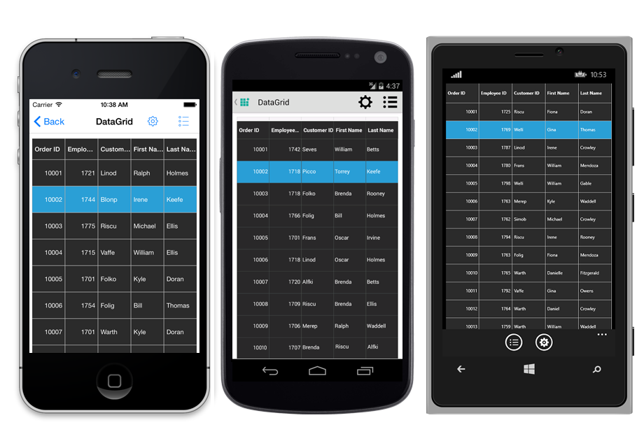

# Styles

SfDatagrid allows you to apply style to all of its elements by writing a Style class overriding from `DataGridStyle` and assigning it to the [SfDataGrid.GridStyle](http://help.syncfusion.com/cr/cref_files/xamarin/sfdatagrid/Syncfusion.SfDataGrid.XForms~Syncfusion.SfDataGrid.XForms.SfDataGrid~GridStyle.html) property.
  
The following example explains you how to apply custom style to SfDatagrid.



<ContentPage xmlns="http://xamarin.com/schemas/2014/forms"
             xmlns:x="http://schemas.microsoft.com/winfx/2009/xaml"
             xmlns:syncfusion="clr-namespace:Syncfusion.SfDataGrid.XForms;assembly=Syncfusion.SfDataGrid.XForms"
             xmlns:local ="clr-namespace:DataGridSample;assembly=DataGridSample"
             x:Class="DataGridSample.Sample">

    <ContentPage.Resources>
        <ResourceDictionary>
            <local:Dark x:Key="dark" />
        </ResourceDictionary>
    </ContentPage.Resources>

    <syncfusion:SfDataGrid x:Name="dataGrid"
                GridStyle="{StaticResource dark}"
                ItemsSource="{Binding OrdersInfo}" />
</ContentPage> 


//Apply custom style to SfDataGrid from code
dataGrid.GridStyle = new Dark ();




//Custom style class
public class Dark : DataGridStyle
{
    public Dark ()
    {
    }

    public override Color GetHeaderBackgroundColor()
    {
        return Color.FromRgb (15, 15, 15);
    }

    public override Color GetHeaderForegroundColor()
    {
        return Color.FromRgb (255, 255, 255);
    }

    public override Color GetRecordBackgroundColor ()
    {
        return Color.FromRgb (43, 43, 43);
    }

    public override Color GetRecordForegroundColor ()
    {
        return Color.FromRgb (255, 255, 255);
    }

    public override Color GetSelectionBackgroundColor ()
    {
        return Color.FromRgb (42, 159, 214);
    }

    public override Color GetSelectionForegroundColor ()
    {
        return Color.FromRgb (255, 255, 255);
    }

    public override Color GetCaptionSummaryRowBackgroundColor ()
    {
        return Color.FromRgb (02, 02, 02);
    }

    public override Color GetCaptionSummaryRowForeGroundColor ()
    {
        return Color.FromRgb (255, 255, 255);
    }

    public override Color GetBorderColor ()
    {
        return Color.FromRgb (81, 83, 82);
    }

    public override Color GetLoadMoreViewBackgroundColor ()
    {
        return Color.FromRgb(242, 242, 242);
    }

    public override Color GetLoadMoreViewForegroundColor ()
    {
        return Color.FromRgb(34, 31, 31);
    }
    
    public override Color GetAlternatingRowBackgroundColor()
    {
        return Color.Yellow;
    }
} 


The following picture shows the grid loaded in a different style.

## Border Customization

* SfDatagrid allows you to customize the grid borders to vertical, horizontal or both based on requirements. you have override the `DataGridStyle.GetGridLinesVisibility`
method. 


public virtual GridLinesVisibility GetGridLinesVisibility()
{
    return GridLinesVisibility;
} 

Following are the lists of options available to customize the grid borders.

* Both
* Horizontal
* Vertical
* None

### Both

*  `GridLinesVisibility.Both` allows you to display the DataGrid with both Horizontal and Vertical borders.

### Horizontal

* `GridLinesVisibility.Horizontal` allows you to display the DataGrid with Horizontal border only

### Vertical

* `GridLinesVisibility.Vertical` allows you to display the DataGrid with Vertical border only

### None

* `GridLinesVisibility.None` allows you to display the DataGrid without borders

## How to

### Change the Sorting Icon in column headers

You can load any desired image as the sort indicator in the `SfDataGrid` using the [GetHeaderSortIndicatorDown](http://help.syncfusion.com/cr/cref_files/xamarin/sfdatagrid/Syncfusion.SfDataGrid.XForms~Syncfusion.SfDataGrid.XForms.DataGridStyle~GetHeaderSortIndicatorDown.html) and [GetHeaderSortIndicatorUp](http://help.syncfusion.com/cr/cref_files/xamarin/sfdatagrid/Syncfusion.SfDataGrid.XForms~Syncfusion.SfDataGrid.XForms.DataGridStyle~GetHeaderSortIndicatorUp.html) overrides of the `DataGridStyle` class. The following code example illustrates how to change the sort indicators in `SfDataGrid`.



//Apply custom style to SfDataGrid from code
dataGrid.GridStyle = new Custom();

public class Custom : DataGridStyle
{

    public override ImageSource GetHeaderSortIndicatorDown()
    {
        return ImageSource.FromResource("SfDataGrid_Sample.SortDown.png");
    }

    public override ImageSource GetHeaderSortIndicatorUp()
    {
        return ImageSource.FromResource("SfDataGrid_Sample.SortUp.png");
    }

}


The following screenshots shows the final outcome of the above code

N> The image's BuildAction must be set to EmbeddedResource in order to access the image as resource as shown in above code.

### Change the color of the resizing indicator

You can change the color of the resizing indicator using the [GetResizingIndicatorColor](http://help.syncfusion.com/cr/cref_files/xamarin/sfdatagrid/Syncfusion.SfDataGrid.XForms~Syncfusion.SfDataGrid.XForms.DataGridStyle~GetResizingIndicatorColor.html) override of the `DataGridStyle` class. The following code example illustrates how to change the color of the resizing indicator in `SfDataGrid`. 



//Apply custom style to SfDataGrid from code
dataGrid.GridStyle = new Custom();

public class Custom : DataGridStyle
{
    public override Color GetResizingIndicatorColor()
    {
        return Color.Blue;
    }
}


