# Summary

SfDataGrid provides support to display the concise information about the bound data objects using summaries. SfDataGrid provides below summary types.

* **Table Summary** - Used to display the summary information at top and/or bottom in SfDataGrid.

* **Group Summary** - used to display summary information of data objects in each group.

* **Caption Summary** - Used to display the summary information in the caption of the group.

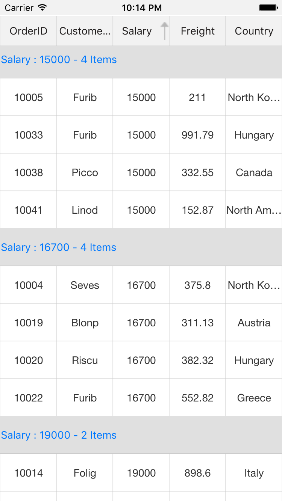

Summary rows are represented by using [GridSummaryRow](http://help.syncfusion.com/cr/cref_files/xamarin/sfdatagrid/Syncfusion.SfDataGrid.XForms~Syncfusion.SfDataGrid.XForms.GridSummaryRow.html) and each `GridSummaryRow` hold summary information of columns in [SummaryColumns](https://help.syncfusion.com/cr/cref_files/xamarin/sfdatagrid/Syncfusion.SfDataGrid.XForms~Syncfusion.SfDataGrid.XForms.GridSummaryRow~SummaryColumns.html) property . The `SummaryColumns` contains the collection of [GridSummaryColumn](http://help.syncfusion.com/cr/cref_files/xamarin/sfdatagrid/Syncfusion.SfDataGrid.XForms~Syncfusion.SfDataGrid.XForms.GridSummaryColumn.html) which carries the name of column, format and its summary aggregate type.

You can derive additional information from your data like sum, average, maximum, minimum and count using summaries in SfDataGrid. These summary values can be computed for groups or for the entire SfDataGrid using `GridSummaryRow` and `GridSummaryColumn` that implements [ISummaryRow](http://help.syncfusion.com/cr/cref_files/xamarin/data/Syncfusion.Data.Portable~Syncfusion.Data.ISummaryRow.html) and [ISummaryColumn](http://help.syncfusion.com/cr/cref_files/xamarin/data/Syncfusion.Data.Portable~Syncfusion.Data.ISummaryColumn.html) interface.

N> Summary does not refresh with data. To update the summary for the newly added row or if any values in the summary column is modified, set the [SfDataGrid.View.LiveDataUpdateMode](https://help.syncfusion.com/cr/cref_files/xamarin/data/Syncfusion.Data.Portable~Syncfusion.Data.CollectionViewAdv~LiveDataUpdateMode.html) to `LiveDataUpdateMode.AllowDataShaping` or `LiveDataUpdateMode.AllowSummaryUpdate`.

## Table Summaries

SfDataGrid provides built-in support for table summaries. The table summary value is calculated based on all the records in SfDataGrid. SfDataGrid allows you to add multiple table summary rows either at top or bottom or at both positions.

You can add table summary row in SfDataGrid by adding [GridTableSummaryRow](http://help.syncfusion.com/cr/cref_files/xamarin/sfdatagrid/Syncfusion.SfDataGrid.XForms~Syncfusion.SfDataGrid.XForms.GridTableSummaryRow.html) to the [SfDataGrid.TableSummaryRows](https://help.syncfusion.com/cr/cref_files/xamarin/sfdatagrid/Syncfusion.SfDataGrid.XForms~Syncfusion.SfDataGrid.XForms.SfDataGrid~TableSummaryRows.html) collection.

Below screenshot illustrates the table summary rows in SfDataGrid.

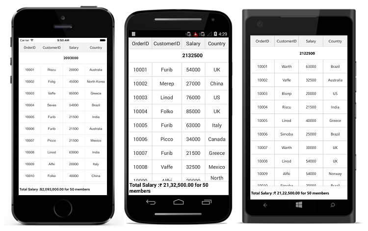

You can add more than one table summary rows either at top or bottom or at both positions in SfDataGrid.



<sfGrid:SfDataGrid.TableSummaryRows>
    <sfGrid:GridTableSummaryRow Title="Total Salary :{TotalSalary} for {ProductCount} members"
                                Position="Top"
                                ShowSummaryInRow="True">
        <sfGrid:GridTableSummaryRow.SummaryColumns>
            <sfGrid:GridSummaryColumn Name="TotalSalary"
                                      Format="{}{Sum:c}"
                                      MappingName="Salary"
                                      SummaryType="DoubleAggregate" />
            <sfGrid:GridSummaryColumn Name="ProductCount"
                                      Format="{}{Count}"
                                      MappingName="Salary"
                                      SummaryType="CountAggregate" />
            </sfGrid:GridTableSummaryRow.SummaryColumns>
        </sfGrid:GridTableSummaryRow>
    <sfGrid:GridTableSummaryRow Position="Top" ShowSummaryInRow="True">
        <sfGrid:GridTableSummaryRow.SummaryColumns>
            <sfGrid:GridSummaryColumn Name="TotalSalary"
                                      Format="{}{Sum}"
                                      MappingName="Salary"
                                      SummaryType="DoubleAggregate" />
            </sfGrid:GridTableSummaryRow.SummaryColumns>
        </sfGrid:GridTableSummaryRow>
</sfGrid:SfDataGrid.TableSummaryRows>



GridTableSummaryRow summaryRow1 = new GridTableSummaryRow();
summaryRow1.Title = "Total Salary:{TotalSalary} for {ProductCount} members";
summaryRow1.ShowSummaryInRow = true;
summaryRow1.Position = Position.Top;
summaryRow1.SummaryColumns.Add(new GridSummaryColumn()
{
    Name = "TotalSalary",
    MappingName = "Salary",
    Format = "{Sum:c}",
    SummaryType = SummaryType.DoubleAggregate
});
summaryRow1.SummaryColumns.Add(new GridSummaryColumn()
{
    Name = "ProductCount",
    MappingName = "Salary",
    Format = "{Count}",
    SummaryType = SummaryType.CountAggregate
});
sfGrid.TableSummaryRows.Add(summaryRow1);

GridTableSummaryRow summaryRow2 = new GridTableSummaryRow();
summaryRow2.ShowSummaryInRow = false;
summaryRow2.Position = Position.Top;
summaryRow2.SummaryColumns.Add(new GridSummaryColumn()
{
    Name = "TotalSalary",
    MappingName = "Salary",
    Format = "{Sum}",
    SummaryType = SummaryType.DoubleAggregate
});
sfGrid.TableSummaryRows.Add(summaryRow2);



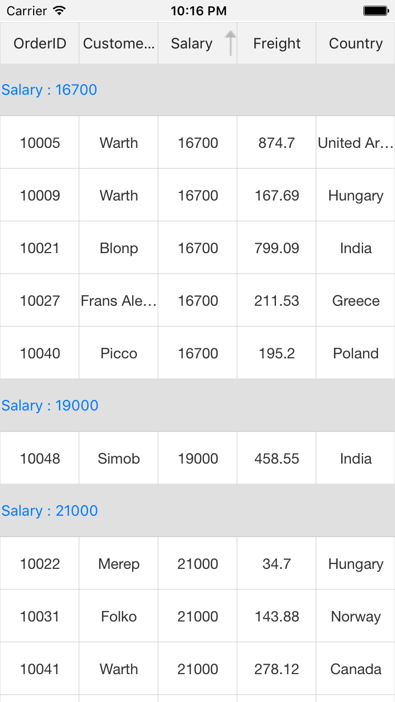

### Defining summary for row

You can display summary information in a row by setting [GridTableSummaryRow.ShowSummaryInRow](https://help.syncfusion.com/cr/cref_files/xamarin/sfdatagrid/Syncfusion.SfDataGrid.XForms~Syncfusion.SfDataGrid.XForms.GridSummaryRow~ShowSummaryInRow.html) to `true` and defining summary columns. You have to define [GridTableSummaryRow.Title](https://help.syncfusion.com/cr/cref_files/xamarin/sfdatagrid/Syncfusion.SfDataGrid.XForms~Syncfusion.SfDataGrid.XForms.GridSummaryRow~Title.html) based on [GridSummaryColumn.Name](https://help.syncfusion.com/cr/cref_files/xamarin/sfdatagrid/Syncfusion.SfDataGrid.XForms~Syncfusion.SfDataGrid.XForms.GridSummaryRow~Name.html) property to format summary columns values in a row.



<sfGrid:SfDataGrid.TableSummaryRows>
    <sfGrid:GridTableSummaryRow Title="Total Salary :{TotalSalary} for {ProductCount} members"
                                ShowSummaryInRow="True">
        <sfGrid:GridTableSummaryRow.SummaryColumns>
            <sfGrid:GridSummaryColumn Name="TotalSalary"
                                      Format="{}{Sum:c}"
                                      MappingName="Salary"
                                      SummaryType="DoubleAggregate" />
            <sfGrid:GridSummaryColumn Name="ProductCount"
                                      Format="{}{Count}"
                                      MappingName="Salary"
                                      SummaryType="CountAggregate" />
            </sfGrid:GridTableSummaryRow.SummaryColumns>
        </sfGrid:GridTableSummaryRow>
</sfGrid:SfDataGrid.TableSummaryRows>



GridTableSummaryRow summaryRow = new GridTableSummaryRow();
summaryRow.Title = "Total Salary:{TotalSalary} for {ProductCount} members";
summaryRow.ShowSummaryInRow = true;
summaryRow.SummaryColumns.Add(new GridSummaryColumn()
{
    Name = "TotalSalary",
    MappingName = "Salary",
    Format = "{Sum:c}",
    SummaryType = SummaryType.DoubleAggregate
});
summaryRow.SummaryColumns.Add(new GridSummaryColumn()
{
    Name = "ProductCount",
    MappingName = "Salary",
    Format = "{Count}",
    SummaryType = SummaryType.CountAggregate
});
sfGrid.TableSummaryRows.Add(summaryRow);



The following screenshot shows the table summary row if `ShowSummaryInRow` is `true`.

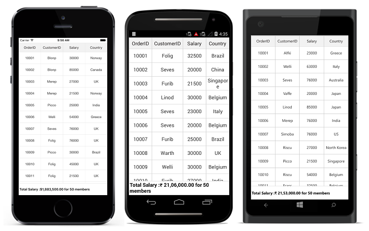

### Defining summary for column

You can display summary information in the column by setting `GridTableSummaryRow.ShowSummaryInRow` to `false` and defining summary columns. `GridSummaryColumn` is the object of [GridTableSummaryRow.SummaryColumns](https://help.syncfusion.com/cr/cref_files/xamarin/sfdatagrid/Syncfusion.SfDataGrid.XForms~Syncfusion.SfDataGrid.XForms.GridSummaryRow~SummaryColumns.html) collection that contains the following important properties:

* [Name](https://help.syncfusion.com/cr/cref_files/xamarin/sfdatagrid/Syncfusion.SfDataGrid.XForms~Syncfusion.SfDataGrid.XForms.GridSummaryColumn~Name.html): Defines name of the `GridSummaryColumn` that helps to denote the `GridSummaryColumn` in `GridTableSummaryRow` with Title.

* [MappingName](https://help.syncfusion.com/cr/cref_files/xamarin/sfdatagrid/Syncfusion.SfDataGrid.XForms~Syncfusion.SfDataGrid.XForms.GridSummaryColumn~MappingName.html): The corresponding column name that is used for the summary calculation.

* [SummaryType](https://help.syncfusion.com/cr/cref_files/xamarin/sfdatagrid/Syncfusion.SfDataGrid.XForms~Syncfusion.SfDataGrid.XForms.GridSummaryColumn~SummaryType.html): It is the `SummaryType` (enum) property that helps to define the aggregate type for the summary calculation. SfDataGrid
control provides the following predefined aggregates.

  * CountAggregate
  * Int32Aggregate
  * DoubleAggregate

* [CustomAggregate](https://help.syncfusion.com/cr/cref_files/xamarin/sfdatagrid/Syncfusion.SfDataGrid.XForms~Syncfusion.SfDataGrid.XForms.GridSummaryColumn~CustomAggregate.html): Defines the `CustomAggregate` class object when the summary type is set as `Custom` that calculates the custom summaries.

* [Format](https://help.syncfusion.com/cr/cref_files/xamarin/sfdatagrid/Syncfusion.SfDataGrid.XForms~Syncfusion.SfDataGrid.XForms.GridSummaryColumn~Format.html): `string` property that formats the summary value and displays it. `Format` property may contains two parts that are separated by a colon (:). First part denotes the aggregate function name and second part denotes display format of the summary value.

Refer [Formatting Summary](#_Formatting_Summary) section to know more about how to format summary and [Aggregate Types](#_Aggregate_Types) section to know about different summary types.

In the below code snippet, summary is defined for `Salary` column.



<sfGrid:SfDataGrid.TableSummaryRows>
    <sfGrid:GridTableSummaryRow Name="TableSummary" ShowSummaryInRow="False">
        <sfGrid:GridTableSummaryRow.SummaryColumns>
            <sfGrid:GridSummaryColumn Name="TableSummary"
                                      Format="{}{Sum}"
                                      MappingName="Salary"
                                      SummaryType="DoubleAggregate" />
        </sfGrid:GridTableSummaryRow.SummaryColumns>
    </sfGrid:GridTableSummaryRow>
</sfGrid:SfDataGrid.TableSummaryRows>



GridTableSummaryRow summaryRow = new GridTableSummaryRow();
summaryRow.ShowSummaryInRow = false;
summaryRow.SummaryColumns.Add(new GridSummaryColumn()
{
    Name = "TableSummary",
    MappingName = "Salary",
    Format = "{Sum}",
    SummaryType = SummaryType.DoubleAggregate
});
sfGrid.TableSummaryRows.Add(summaryRow);



The following screenshot shows the table summary row if `ShowSummaryInRow` is `false`.

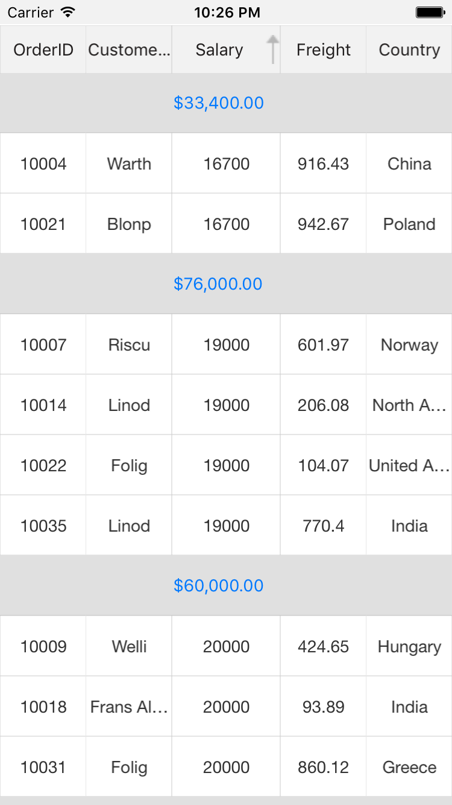

### Positioning TableSummaryRows

SfDataGrid allows you to add table summary rows either at top or bottom positions using [GridTableSummaryRow.Position](https://help.syncfusion.com/cr/cref_files/xamarin/sfdatagrid/Syncfusion.SfDataGrid.XForms~Syncfusion.SfDataGrid.XForms.GridTableSummaryRow~Position.html) property.



<sfGrid:SfDataGrid.TableSummaryRows>
    <sfGrid:GridTableSummaryRow Position="Top"
                                ShowSummaryInRow="False">
        <sfGrid:GridTableSummaryRow.SummaryColumns>
            <sfGrid:GridSummaryColumn Name="TotalSalary"
                                      Format="{}{Sum}"
                                      MappingName="Salary"
                                      SummaryType="DoubleAggregate" />
            </sfGrid:GridTableSummaryRow.SummaryColumns>
        </sfGrid:GridTableSummaryRow>
    <sfGrid:GridTableSummaryRow Position="Bottom"
                                ShowSummaryInRow="True"
                                Title="Total Salary :{TotalSalary} for {ProductCount} members">
        <sfGrid:GridTableSummaryRow.SummaryColumns>
            <sfGrid:GridSummaryColumn Name="TotalSalary"
                                      Format="{}{Sum:c}"
                                      MappingName="Salary"
                                      SummaryType="DoubleAggregate" />
            <sfGrid:GridSummaryColumn Name="ProductCount"
                                      Format="{}{Count}"
                                      MappingName="Salary"
                                      SummaryType="CountAggregate" />
        </sfGrid:GridTableSummaryRow.SummaryColumns>
    </sfGrid:GridTableSummaryRow>
</sfGrid:SfDataGrid.TableSummaryRows>



GridTableSummaryRow topSummaryRow = new GridTableSummaryRow();
topSummaryRow.Position = Position.Top;
topSummaryRow.ShowSummaryInRow = false;
topSummaryRow.SummaryColumns.Add(new GridSummaryColumn()
{
    Name = "TotalSalary",
    MappingName = "Salary",
    Format = "{Sum}",
    SummaryType = SummaryType.DoubleAggregate
});
sfGrid.TableSummaryRows.Add(topSummaryRow);

GridTableSummaryRow bottomSummaryRow = new GridTableSummaryRow();
bottomSummaryRow.Position = Position.Bottom;
bottomSummaryRow.Title = "Total Salary:{TotalSalary} for {ProductCount} members";
bottomSummaryRow.ShowSummaryInRow = true;
bottomSummaryRow.SummaryColumns.Add(new GridSummaryColumn()
{
    Name = "TotalSalary",
    MappingName = "Salary",
    Format = "{Sum:c}",
    SummaryType = SummaryType.DoubleAggregate
});
bottomSummaryRow.SummaryColumns.Add(new GridSummaryColumn()
{
    Name = "ProductCount",
    MappingName = "Salary",
    Format = "{Count}",
    SummaryType = SummaryType.CountAggregate
});
sfGrid.TableSummaryRows.Add(bottomSummaryRow);



The below screenshot illustrates the positioning of table summary rows in SfDataGrid.

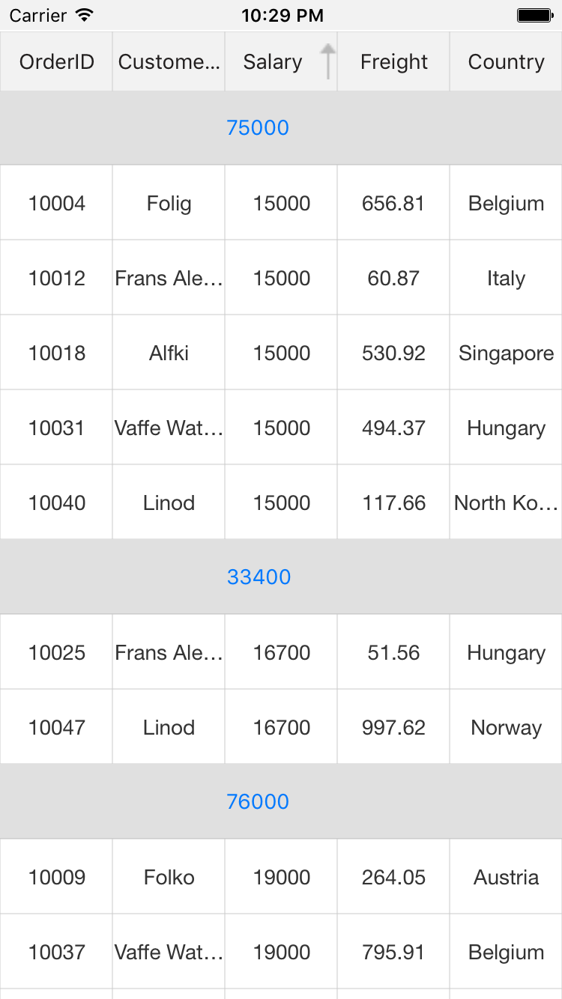

## Caption Summaries

SfDataGrid provides built-in support for caption summaries. The caption summary value calculated based on the records in a group and the summary information will be displayed in the caption of group.

Below screenshot shows the built-in caption summary of a group.

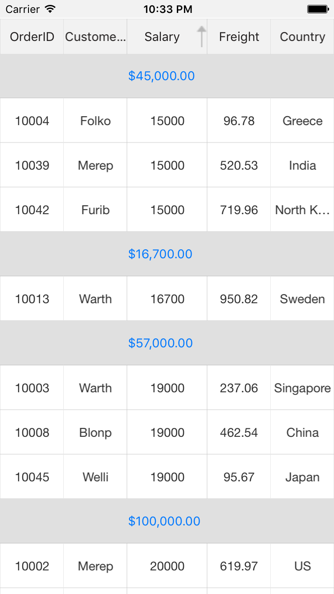

### Formatting built-in caption summary

By default, the summary value displayed in caption summary rows based on [SfDataGrid.GroupCaptionTextFormat](https://help.syncfusion.com/cr/cref_files/xamarin/sfdatagrid/Syncfusion.SfDataGrid.XForms~Syncfusion.SfDataGrid.XForms.SfDataGrid~GroupCaptionTextFormat.html) property.

The default group caption format is `{ColumnName}: {Key} - {ItemsCount} Items`.

* **ColumnName** - Displays the name of the column currently grouped.

* **Key** - Displays the key value of the group.

* **ItemsCount** - Displays the number of items in a group.

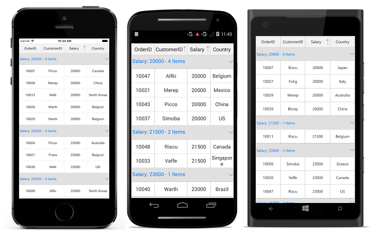

You can customize this group caption text format by setting the `SfDataGrid.GroupCaptionTextFormat` property. The following code example illustrates how to customize group caption text in SfDataGrid.



<sfGrid:SfDataGrid x:Name="dataGrid"
                   AutoGenerateColumns="True"
                   ColumnSizer="Star"
                   GroupCaptionTextFormat="{}{ColumnName}: {Key}">



//Customized group caption text
dataGrid.GroupCaptionTextFormat = "{ColumnName} : {Key}";



Below screenshot shows the final outcome of the above code.

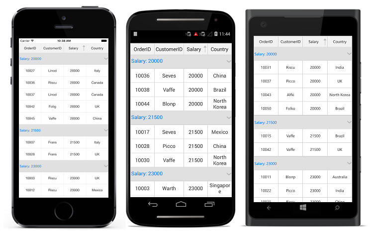

### Defining summary for row

You can display summary information in a row by setting [GridSummaryRow.ShowSummaryInRow](https://help.syncfusion.com/cr/cref_files/xamarin/sfdatagrid/Syncfusion.SfDataGrid.XForms~Syncfusion.SfDataGrid.XForms.GridSummaryRow~ShowSummaryInRow.html) to `true` and defining summary columns. You have to define [GridSummaryRow.Title](https://help.syncfusion.com/cr/cref_files/xamarin/sfdatagrid/Syncfusion.SfDataGrid.XForms~Syncfusion.SfDataGrid.XForms.GridSummaryRow~Title.html) based on [GridSummaryColumn.Name](https://help.syncfusion.com/cr/cref_files/xamarin/sfdatagrid/Syncfusion.SfDataGrid.XForms~Syncfusion.SfDataGrid.XForms.GridSummaryRow~Name.html) property to format summary columns values in a row.



<sfGrid:SfDataGrid.CaptionSummaryRow>
    <sfGrid:GridSummaryRow Title="Total Salary :{TotalSalary} for {ProductCount} members"
                           ShowSummaryInRow="True">
        <sfGrid:GridSummaryRow.SummaryColumns>
            <sfGrid:GridSummaryColumn Name="TotalSalary"
                                      Format="{}{Sum:c}"
                                      MappingName="Salary"
                                      SummaryType="DoubleAggregate" />
            <sfGrid:GridSummaryColumn Name="ProductCount"
                                      Format="{}{Count}"
                                      MappingName="Salary"
                                      SummaryType="CountAggregate" />
            </sfGrid:GridSummaryRow.SummaryColumns>
        </sfGrid:GridSummaryRow>
</sfGrid:SfDataGrid.CaptionSummaryRow>



GridSummaryRow summaryRow = new GridSummaryRow();
summaryRow.Title = "Total Salary:{TotalSalary} for {ProductCount} members";
summaryRow.ShowSummaryInRow = true;
summaryRow.SummaryColumns.Add(new GridSummaryColumn()
{
    Name = "TotalSalary",
    MappingName = "Salary",
    Format = "{Sum:c}",
    SummaryType = SummaryType.DoubleAggregate
});
summaryRow.SummaryColumns.Add(new GridSummaryColumn()
{
    Name = "ProductCount",
    MappingName = "Salary",
    Format = "{Count}",
    SummaryType = SummaryType.CountAggregate
});
sfGrid.CaptionSummaryRow= summaryRow;



The following screenshot shows the final outcome for both values of `ShowSummaryInRow` to `true`.

### Defining summary for column

You can display summary information in the column by setting `GridSummaryRow.ShowSummaryInRow` to `false` and defining summary columns. `SfDataGrid.GridSummaryColumn` is the object of [GridSummaryRow.SummaryColumns](https://help.syncfusion.com/cr/cref_files/xamarin/sfdatagrid/Syncfusion.SfDataGrid.XForms~Syncfusion.SfDataGrid.XForms.GridSummaryRow~SummaryColumns.html) collection that contains the following important properties:

* [Name](https://help.syncfusion.com/cr/cref_files/xamarin/sfdatagrid/Syncfusion.SfDataGrid.XForms~Syncfusion.SfDataGrid.XForms.GridSummaryColumn~Name.html): Defines name of the `GridSummaryColumn` that helps to denote the `GridSummaryColumn` in `GridSummaryRow` with Title.

* [MappingName](https://help.syncfusion.com/cr/cref_files/xamarin/sfdatagrid/Syncfusion.SfDataGrid.XForms~Syncfusion.SfDataGrid.XForms.GridSummaryColumn~MappingName.html): The corresponding column name that is used for the summary calculation.

* [SummaryType](https://help.syncfusion.com/cr/cref_files/xamarin/sfdatagrid/Syncfusion.SfDataGrid.XForms~Syncfusion.SfDataGrid.XForms.GridSummaryColumn~SummaryType.html): It is the `SummaryType` (enum) property that helps to define the aggregate type for the summary calculation. `DataGrid` 
control provides the following predefined aggregates.

  * CountAggregate
  * Int32Aggregate
  * DoubleAggregate

* [CustomAggregate](https://help.syncfusion.com/cr/cref_files/xamarin/sfdatagrid/Syncfusion.SfDataGrid.XForms~Syncfusion.SfDataGrid.XForms.GridSummaryColumn~CustomAggregate.html): Defines the `CustomAggregate` class object when the summary type is set as `Custom` that calculates the custom summaries.

* [Format](https://help.syncfusion.com/cr/cref_files/xamarin/sfdatagrid/Syncfusion.SfDataGrid.XForms~Syncfusion.SfDataGrid.XForms.GridSummaryColumn~Format.html): `string` property that formats the summary value and displays it. `Format` property may contains two parts that are separated by a colon (:). First part denotes the aggregate function name and second part denotes display format of the summary value.

Refer [Formatting Summary](#_Formatting_Summary) section to know more about how to format summary and [Aggregate Types](#_Aggregate_Types) section to know about different summary types.

In the below code snippet, summary is defined for `Salary` column.



<sfGrid:SfDataGrid.CaptionSummaryRow>
    <sfGrid:GridSummaryRow Name="CaptionSummary" ShowSummaryInRow="False">
        <sfGrid:GridSummaryRow.SummaryColumns>
            <sfGrid:GridSummaryColumn Name="CaptionSummary"
                                      Format="{}{Sum}"
                                      MappingName="Salary"
                                      SummaryType="DoubleAggregate" />
        </sfGrid:GridSummaryRow.SummaryColumns>
    </sfGrid:GridSummaryRow>
</sfGrid:SfDataGrid.CaptionSummaryRow>



GridSummaryRow summaryRow = new GridSummaryRow();
summaryRow.ShowSummaryInRow = false;
summaryRow.SummaryColumns.Add(new GridSummaryColumn()
{
    Name = "CaptionSummary",
    MappingName = "Salary",
    Format = "{Sum:c}",
    SummaryType = SummaryType.DoubleAggregate
});
sfGrid.CaptionSummaryRow= summaryRow;



N> `CaptionSummaryColumn` text will be aligned based on `GridColumn.TextAlignment`.

### Caption summary Template

SfDataGrid allows to host the any view(s) inside a caption summary row by setting [SfDataGrid.CaptionSummaryTemplate](http://help.syncfusion.com/cr/cref_files/xamarin/sfdatagrid/Syncfusion.SfDataGrid.XForms~Syncfusion.SfDataGrid.XForms.SfDataGrid~CaptionSummaryTemplateProperty.html) property. 

To load the label and image in caption summary template, follow the code example:



 <ContentPage.Resources>
    <ResourceDictionary>
      <local:DisplayBindingConverter x:Key="SummaryConverter" />
    </ResourceDictionary>
  </ContentPage.Resources>

  <sfgrid:SfDataGrid x:Name="dataGrid"
                   ItemsSource="{Binding OrdersInfo}">

<sfgrid:SfDataGrid.CaptionSummaryTemplate>
   <DataTemplate>
     <StackLayout Orientation="Horizontal" BackgroundColor="Gray">
       <Image Source="{local:ImageResource UG_Sample.SalaryIcon.Png}"
              Margin="0,5,0,5"
             HorizontalOptions="Start"
             VerticalOptions="Center"/>
       <Label Text="{Binding Converter={StaticResource SummaryConverter}, ConverterParameter = {x:Reference dataGrid} }"
              TextColor="White"
              FontSize="Large"
              VerticalTextAlignment="Center"
              HorizontalTextAlignment="Start"
              LineBreakMode="NoWrap"
              HorizontalOptions="FillAndExpand"
              VerticalOptions="FillAndExpand">
         <Label.Style>
           
         </Label.Style>
       </Label>
       </StackLayout>
     </DataTemplate>
</sfgrid:SfDataGrid.CaptionSummaryTemplate>
<sfgrid:SfDataGrid.CaptionSummaryRow>
    <sfgrid:GridSummaryRow Name="CaptionSummary" ShowSummaryInRow="True" Title="Salary: {CaptionSummary}">
        <sfgrid:GridSummaryRow.SummaryColumns>
            <sfgrid:GridSummaryColumn Name="CaptionSummary"
                                      Format="{}{Sum}"
                                      MappingName="Salary"
                                      SummaryType="DoubleAggregate" />
        </sfgrid:GridSummaryRow.SummaryColumns>
    </sfgrid:GridSummaryRow>
</sfgrid:SfDataGrid.CaptionSummaryRow>
</sfgrid:SfDataGrid>




// To write a converter, follow the code example:

public class GroupCaptionConverter : IValueConverter
{
    public object Convert(object value, Type targetType, object parameter, CultureInfo culture)
    {
        var data = value != null ? value as Group : null;
        if (data != null)
        {
            SfDataGrid dataGrid = (SfDataGrid)parameter;
            var summaryText = SummaryCreator.GetSummaryDisplayTextForRow((value as Group).SummaryDetails, dataGrid.View);

            return summaryText;
        }
        return null;
    }

    public object ConvertBack(object value, Type targetType, object parameter, CultureInfo culture)
    {
        return null;
    }
}



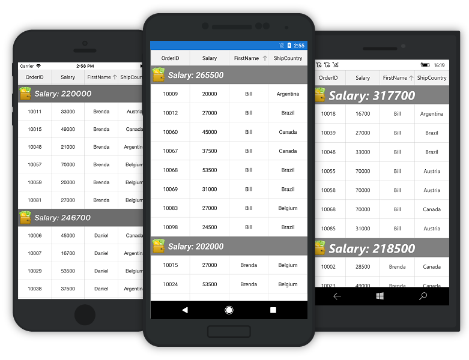

N> `DataTemplateSelector` can also be directly assigned to `CaptionSummaryTemplate`.

## Group summary

Group summary values are calculated based on records in the group. The summary information will be displayed at the bottom of each group. You can view the group summary row by expanding the corresponding group header. The data grid adds any number of group summary row.

Add group summary rows in the data grid by adding the [GridSummaryRow](http://help.syncfusion.com/cr/cref_files/xamarin/sfdatagrid/Syncfusion.SfDataGrid.XForms~Syncfusion.SfDataGrid.XForms.GridSummaryRow.html) to [SfDataGrid.GroupSummaryRows](http://help.syncfusion.com/cr/cref_files/wpf/sfdatagrid/Syncfusion.SfGrid.WPF~Syncfusion.UI.Xaml.Grid.SfDataGrid~GroupSummaryRows.html) collection.

### Displaying summary in the row

The summary information can be displayed in the row by setting the [GridSummaryRow.ShowSummaryInRow](https://help.syncfusion.com/cr/cref_files/xamarin/sfdatagrid/Syncfusion.SfDataGrid.XForms~Syncfusion.SfDataGrid.XForms.GridSummaryRow~ShowSummaryInRow.html) to `true` and by defining summary columns. You have to define the [GridSummaryRow.Title](https://help.syncfusion.com/cr/cref_files/xamarin/sfdatagrid/Syncfusion.SfDataGrid.XForms~Syncfusion.SfDataGrid.XForms.GridSummaryRow~Title.html) based on the [GridSummaryColumn.Name](https://help.syncfusion.com/cr/cref_files/xamarin/sfdatagrid/Syncfusion.SfDataGrid.XForms~Syncfusion.SfDataGrid.XForms.GridSummaryRow~Name.html) property to format summary columns value in a row.
 
Refer to [Formatting Summary](#formatting-summary) section to know more about how to format summary. 




<ContentPage x:Class="SummaryDemo.Summary"
             xmlns="http://xamarin.com/schemas/2014/forms"
             xmlns:x="http://schemas.microsoft.com/winfx/2009/xaml"
             xmlns:local="clr-namespace:SummaryDemo"
             xmlns:sfgrid="clr-namespace:Syncfusion.SfDataGrid.XForms;assembly=Syncfusion.SfDataGrid.XForms">
    <sfgrid:SfDataGrid x:Name="dataGrid" AllowResizingColumn="True" AllowGroupExpandCollapse="True"
                       AutoGenerateColumns="True" 
                       ColumnSizer="Star">

    <sfgrid:SfDataGrid.GroupColumnDescriptions>
            <sfgrid:GroupColumnDescription ColumnName="Salary"  />
        </sfgrid:SfDataGrid.GroupColumnDescriptions>

        <sfgrid:SfDataGrid.GroupSummaryRows>
            <sfgrid:GridSummaryRow ShowSummaryInRow="True" Title="Total Salary: {Salary} for {customerID} members">
                
                <sfgrid:GridSummaryRow.SummaryColumns>

                    <sfgrid:GridSummaryColumn Name="Salary" 
                                                  MappingName="Salary" 
                                                  Format="{}{Sum}"
                                                  SummaryType="DoubleAggregate">
                    </sfgrid:GridSummaryColumn>

                    <sfgrid:GridSummaryColumn Name="customerID" 
                                                  MappingName="CustomerID" 
                                                  Format="{}{Count}"
                                                  SummaryType="CountAggregate">
                    </sfgrid:GridSummaryColumn>

                </sfgrid:GridSummaryRow.SummaryColumns>
                
            </sfgrid:GridSummaryRow>
        </sfgrid:SfDataGrid.GroupSummaryRows>

  </sfgrid:SfDataGrid>
</ContentPage>


            this.dataGrid.GroupSummaryRows.Add(new GridSummaryRow()
            {
                ShowSummaryInRow = true,
                Title = "Total Salary: {Salary} for {customerID} members",
                SummaryColumns = new ObservableCollection<ISummaryColumn>()
                {
                    new GridSummaryColumn()
                    {
                        Name="Salary",
                        MappingName="Salary",
                        SummaryType=SummaryType.DoubleAggregate,
                        Format="{Sum}"
                    },
                    new GridSummaryColumn()
                    {
                        Name="customerID",
                        MappingName="customerID",
                        Format="{Count}",
                        SummaryType=SummaryType.CountAggregate
                    }
                }
            });




### Displaying summary in the column

The summary information can be displayed in the column by setting the [GridSummaryRow.ShowSummaryInRow](https://help.syncfusion.com/cr/cref_files/xamarin/sfdatagrid/Syncfusion.SfDataGrid.XForms~Syncfusion.SfDataGrid.XForms.GridSummaryRow~ShowSummaryInRow.html) to `false` and by defining summary columns. To calculate summary based on the column, specify the following properties:

1. [GridSummaryColumn.MappingName](https://help.syncfusion.com/cr/cref_files/xamarin/sfdatagrid/Syncfusion.SfDataGrid.XForms~Syncfusion.SfDataGrid.XForms.GridSummaryColumn~MappingName.html): Provides MappingName of the column (Property name of data object) that you want to calculate summary.
2. [GridSummaryColumn.SummaryType](https://help.syncfusion.com/cr/cref_files/xamarin/sfdatagrid/Syncfusion.SfDataGrid.XForms~Syncfusion.SfDataGrid.XForms.GridSummaryColumn~SummaryType.html): Provides different built-in summary calculation functions for various types.
3. [GridSummaryColumn.Format](https://help.syncfusion.com/cr/cref_files/xamarin/sfdatagrid/Syncfusion.SfDataGrid.XForms~Syncfusion.SfDataGrid.XForms.GridSummaryColumn~Format.html): Provides format string for the summary based on support function name in the specified SummaryType.

Refer to [Formatting Summary](#formatting-summary) section to know more about how to format summary and [Aggregate Types](#aggregate-types) section to know about different Summary Types.

In the following code snippet, summary is defined for `Salary` and `CustomerID` columns:



<ContentPage x:Class="SummaryDemo.Summary"
             xmlns="http://xamarin.com/schemas/2014/forms"
             xmlns:x="http://schemas.microsoft.com/winfx/2009/xaml"
             xmlns:local="clr-namespace:SummaryDemo"
             xmlns:sfgrid="clr-namespace:Syncfusion.SfDataGrid.XForms;assembly=Syncfusion.SfDataGrid.XForms">

 <sfgrid:SfDataGrid x:Name="dataGrid" AllowResizingColumn="True"
                       AutoGenerateColumns="True" 
                       ColumnSizer="Star">

       <sfgrid:SfDataGrid.GroupSummaryRows>
            <sfgrid:GridSummaryRow ShowSummaryInRow="False" >
                
                <sfgrid:GridSummaryRow.SummaryColumns>

                    <sfgrid:GridSummaryColumn Name="Salary" 
                                                  MappingName="Salary" 
                                                  Format="{}{Sum}"
                                                  SummaryType="DoubleAggregate">
                    </sfgrid:GridSummaryColumn>

                    <sfgrid:GridSummaryColumn Name="customerID" 
                                                  MappingName="CustomerID" 
                                                  Format="Total members - {Count}"
                                                  SummaryType="CountAggregate">
                    </sfgrid:GridSummaryColumn>

                </sfgrid:GridSummaryRow.SummaryColumns>
                
            </sfgrid:GridSummaryRow>
        </sfgrid:SfDataGrid.GroupSummaryRows>

    </sfgrid:SfDataGrid>
</ContentPage>




            this.dataGrid.GroupSummaryRows.Add(new GridSummaryRow()
            {
                ShowSummaryInRow = false,
                SummaryColumns = new ObservableCollection<ISummaryColumn>()
                {
                    new GridSummaryColumn()
                    {
                        Name="Salary",
                        MappingName="Salary",
                        SummaryType=SummaryType.DoubleAggregate,
                        Format="{Sum}"
                    },
                    new GridSummaryColumn()
                    {
                        Name="customerID",
                        MappingName="CustomerID",
                        Format="Total members - {Count:d}",
                        SummaryType=SummaryType.CountAggregate
                    }
                }
            });



### Group summary template

The data grid hosts any view(s) inside a group summary by setting the `GridSummaryColumn.Template` property. 

### Displaying template for a column

To load label and image in the group summary template for a column, follow the code example:



 <ContentPage.Resources>
        <ResourceDictionary>
            <local:GroupSummaryConverter x:Key="SummaryConverter" />
        </ResourceDictionary>
</ContentPage.Resources>

<sfgrid:SfDataGrid x:Name="dataGrid" AllowResizingColumn="True" AutoGenerateColumns="False" ColumnSizer="Star">

    <sfgrid:SfDataGrid.Columns>
        <sfgrid:GridTextColumn MappingName="OrderID" />
        <sfgrid:GridTextColumn MappingName="Salary" />
        <sfgrid:GridTextColumn MappingName="CustomerID" />
        <sfgrid:GridTextColumn MappingName="Country" />
    </sfgrid:SfDataGrid.Columns>
   
     <sfgrid:SfDataGrid.GroupSummaryRows>
            <sfgrid:GridSummaryRow ShowSummaryInRow="False" >
                
                <sfgrid:GridSummaryRow.SummaryColumns>

                    <sfgrid:GridSummaryColumn Name="Salary"
                                                  MappingName="Salary" 
                                                  Format="{}{Sum}"
                                                  SummaryType="DoubleAggregate">
                        <sfgrid:GridSummaryColumn.Template>
                            <DataTemplate>
                                <StackLayout Orientation="Horizontal" BackgroundColor="Gray">
                                    <Label Text="{Binding Converter={StaticResource SummaryConverter}, ConverterParameter = {x:Reference dataGrid} }"
                                           TextColor="White"
                                           FontSize="Large"
                                           VerticalTextAlignment="Center"
                                           HorizontalTextAlignment="Center"
                                           LineBreakMode="NoWrap"
                                           HorizontalOptions="FillAndExpand"
                                           VerticalOptions="FillAndExpand">
                                        <Label.Style>
                                            
                                        </Label.Style>
                                    </Label>
                                </StackLayout>
                            </DataTemplate>
                        </sfgrid:GridSummaryColumn.Template>
                        
                    </sfgrid:GridSummaryColumn>
                    </sfgrid:GridSummaryRow.SummaryColumns>
                
            </sfgrid:GridSummaryRow>
        </sfgrid:SfDataGrid.GroupSummaryRows>

    </sfgrid:SfDataGrid>





// To write a converter, follow the code example:

 public class GroupSummaryConverter : IValueConverter
    {

        public object Convert(object value, Type targetType, object parameter, CultureInfo culture)
        {
            var data = value != null ? value as SummaryRecordEntry : null;
            if (data != null)
            {
                SfDataGrid dataGrid = (SfDataGrid)parameter;
                
                var summaryText = SummaryCreator.GetSummaryDisplayText(data,"Salary",dataGrid.View);

                return summaryText.ToString();
            }
            return null;
        }

        public object ConvertBack(object value, Type targetType, object parameter, CultureInfo culture)
        {
            return null;
        }
    }



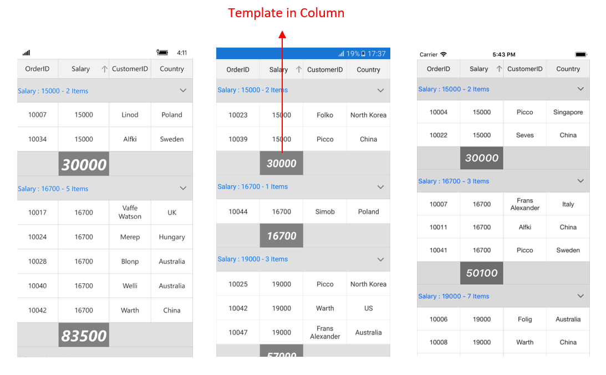

## Formatting Summary

In the below sections formatting is explained using `CaptionSummary`. However, the formatting can be applied for `TableSummaries` also.

### Defining Summary Function

In the following code snippet [Format](https://help.syncfusion.com/cr/cref_files/xamarin/sfdatagrid/Syncfusion.SfDataGrid.XForms~Syncfusion.SfDataGrid.XForms.GridSummaryColumn~Format.html) property is defined to display sum of `Salary` by specifying the function name inside curly braces:

N> `DoubleAggregate` is used as `SummaryType` which has the count, max, min, average, and sum functions.



<sfGrid:SfDataGrid.CaptionSummaryRow>
    <sfGrid:GridSummaryRow ShowSummaryInRow="False">
        <sfGrid:GridSummaryRow.SummaryColumns>
            <sfGrid:GridSummaryColumn Name="CaptionSummary"
                                      Format="{}{Sum}"
                                      MappingName="Salary"
                                      SummaryType="DoubleAggregate" />
        </sfGrid:GridSummaryRow.SummaryColumns>
    </sfGrid:GridSummaryRow>
</sfGrid:SfDataGrid.CaptionSummaryRow>



GridSummaryRow summaryRow = new GridSummaryRow();
summaryRow.ShowSummaryInRow = false;
summaryRow.SummaryColumns.Add(new GridSummaryColumn()
{
    Name = "CaptionSummary",
    MappingName = "Salary",
    Format = "{Sum}",
    SummaryType = SummaryType.DoubleAggregate
});
sfGrid.CaptionSummaryRow= summaryRow;



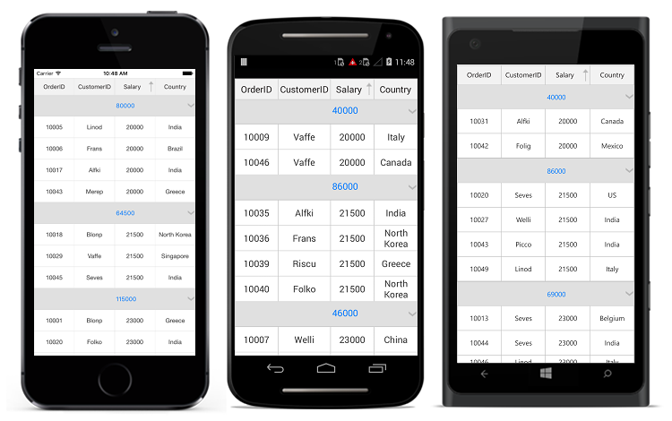

### Formatting Summary Value

You can format the summary value by setting the appropriate format after the aggregate function followed by a colon(:) in `GridSummaryColumn.Format` property.

In the below code snippet `Salary` column summary is formatted using `c` format specifier. Refer [here](https://msdn.microsoft.com/en-us/library/dwhawy9k.aspx?f=255&MSPPError=-2147217396) to know about how to set different format.



<sfGrid:SfDataGrid.CaptionSummaryRow>
    <sfGrid:GridSummaryRow ShowSummaryInRow="False">
        <sfGrid:GridSummaryRow.SummaryColumns>
            <sfGrid:GridSummaryColumn Name="CaptionSummary"
                                      Format="{}{Sum:c}"
                                      MappingName="Salary"
                                      SummaryType="DoubleAggregate" />
        </sfGrid:GridSummaryRow.SummaryColumns>
    </sfGrid:GridSummaryRow>
</sfGrid:SfDataGrid.CaptionSummaryRow>



GridSummaryRow summaryRow = new GridSummaryRow();
summaryRow.ShowSummaryInRow = false;
summaryRow.SummaryColumns.Add(new GridSummaryColumn()
{
    Name = "CaptionSummary",
    MappingName = "Salary",
    Format = "{Sum:c}",
    SummaryType = SummaryType.DoubleAggregate
});
sfGrid.CaptionSummaryRow= summaryRow;



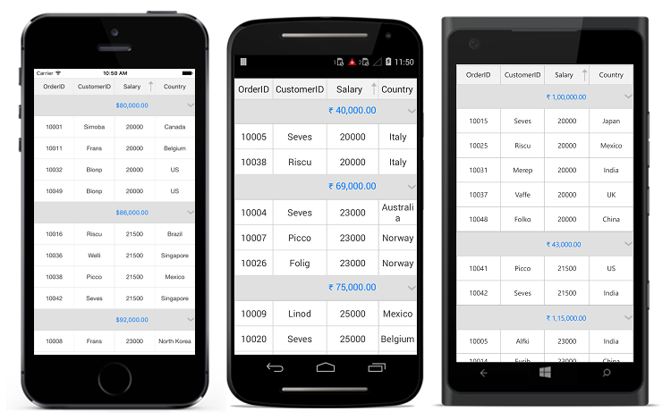

### Displaying additional Content in Summary

You can append additional content with summary value using `GridSummaryColumn.Format` property.

In the below code snippet `Total :` text is appended before summary value.



<sfGrid:SfDataGrid.CaptionSummaryRow>
    <sfGrid:GridSummaryRow ShowSummaryInRow="False">
        <sfGrid:GridSummaryRow.SummaryColumns>
            <sfGrid:GridSummaryColumn Name="CaptionSummary"
                                      Format="Total: {Sum:c}"
                                      MappingName="Salary"
                                      SummaryType="DoubleAggregate" />
        </sfGrid:GridSummaryRow.SummaryColumns>
    </sfGrid:GridSummaryRow>
</sfGrid:SfDataGrid.CaptionSummaryRow>



GridSummaryRow summaryRow = new GridSummaryRow();
summaryRow.ShowSummaryInRow = false;
summaryRow.SummaryColumns.Add(new GridSummaryColumn()
{
    Name = "CaptionSummary",
    MappingName = "Salary",
    Format = "Total:{Sum:c}",
    SummaryType = SummaryType.DoubleAggregate
});
sfGrid.CaptionSummaryRow= summaryRow;



 
### Formatting Summary for row using Title property

You can format the summary value for row using [GridSummaryRow.Title](https://help.syncfusion.com/cr/cref_files/xamarin/sfdatagrid/Syncfusion.SfDataGrid.XForms~Syncfusion.SfDataGrid.XForms.GridSummaryRow~Title.html) when `ShowSummaryInRow` set to `true`.



<sfGrid:SfDataGrid.CaptionSummaryRow>
    <sfGrid:GridSummaryRow Title="Total Salary:{TotalSalary} for {ProductCount} members" ShowSummaryInRow="True">
        <sfGrid:GridSummaryRow.SummaryColumns>
            <sfGrid:GridSummaryColumn Name="TotalSalary"
                                      Format="{}{Sum:c}"
                                      MappingName="Salary"
                                      SummaryType="DoubleAggregate" />
            <sfGrid:GridSummaryColumn Name="ProductCount"
                                      Format="{}{Count}"
                                      MappingName="Salary"
                                       SummaryType="CountAggregate" />
        </sfGrid:GridSummaryRow.SummaryColumns>
    </sfGrid:GridSummaryRow>
</sfGrid:SfDataGrid.CaptionSummaryRow>



GridSummaryRow summaryRow = new GridSummaryRow();
summaryRow.Title = "Total Salary:{TotalSalary} for {ProductCount} members";
summaryRow.ShowSummaryInRow = true;
summaryRow.SummaryColumns.Add(new GridSummaryColumn()
{
    Name = "TotalSalary",
    MappingName = "Salary",
    Format = "{}{Sum:c}",
    SummaryType = SummaryType.DoubleAggregate
});
summaryRow.SummaryColumns.Add(new GridSummaryColumn()
{
    Name = "ProductCount",
    MappingName = "Salary",
    Format = "{Count}",
    SummaryType = SummaryType.DoubleAggregate
});
sfGrid.CaptionSummaryRow= summaryRow;



N> Setting the `SummaryColumn.Format` property to {Sum:c} throws an exception since the compiler treats it like how we set binding to a string, since the syntax is the same. But here we are trying to set the culture format for the string. Hence set the format as Format = "{}{Sum:c}" when setting the format in XAML.  

## Aggregate Types

You can specify the different summary aggregate types by using [GridSummaryColumn.SummaryType](https://help.syncfusion.com/cr/cref_files/xamarin/sfdatagrid/Syncfusion.SfDataGrid.XForms~Syncfusion.SfDataGrid.XForms.GridSummaryColumn~SummaryType.html) property and use the built-in function in [GridSummaryColumn.Format](https://help.syncfusion.com/cr/cref_files/xamarin/sfdatagrid/Syncfusion.SfDataGrid.XForms~Syncfusion.SfDataGrid.XForms.GridSummaryColumn~Format.html).

The following are the list of predefined aggregate types and its built-in functions.

<table>
<tr>
<th>
Aggregate Type
</th>
<th>
Built-in function
</th>
</tr>
<tr>
<td>
CountAggregate
</td>
<td>
Count
</td>
</tr>
<tr>
<td>
Int32Aggregate
</td>
<td>
Count, Max, Min, Average and Sum
</td>
</tr>
<tr>
<td>
DoubleAggregate
</td>
<td>
Count, Max, Min, Average and Sum
</td>
</tr>
<tr>
<td>
Custom
</td>
<td>
Used for Custom Summaries
</td>
</tr>
</table>

N> The above aggregate types can be applied for both `CaptionSummaries` and `TableSummaries`.

## Custom Summaries

SfDataGrid allows you to implement your own aggregate functions, when the built-in aggregate functions do not meet your requirement.

You can calculate the summary values based on custom logic using [GridSummaryColumn.CustomAggregate](https://help.syncfusion.com/cr/cref_files/xamarin/sfdatagrid/Syncfusion.SfDataGrid.XForms~Syncfusion.SfDataGrid.XForms.GridSummaryColumn~CustomAggregate.html) property.

### Implementing custom aggregate

1. Create a custom aggregate class by deriving from [ISummaryAggregate](https://help.syncfusion.com/cr/cref_files/xamarin/data/Syncfusion.Data.Portable~Syncfusion.Data.ISummaryAggregate.html) interface.
2. In the `CalculateAggregateFunc()` method, you have to calculate the summary and assign it to the property.

In the below code snippet, `Standard Deviation` is calculated for quantity of products.


public class CustomAggregate : ISummaryAggregate
{
    public CustomAggregate()
    {
    }
    public double StdDev { get; set; }
    public Action<System.Collections.IEnumerable, string, PropertyInfo> CalculateAggregateFunc()
    {
        return (items, property, pd) =>
        {
            var enumerableItems = items as IEnumerable<OrderInfo>;
            if (pd.Name == "StdDev")
            {
                this.StdDev = enumerableItems.StdDev<OrderInfo>(q => q.OrderID);
            }
        };
    }
}

public static class LinqExtensions
{
    public static double StdDev<T>(this IEnumerable<T> values, Func<T, double?> selector)
    {
        double value = 0;
        var count = values.Count();
        if (count > 0)
        {
            double? avg = values.Average(selector);
            double sum = values.Select(selector).Sum(d =>
            {
                if (d.HasValue)
                {
                    return Math.Pow(d.Value - avg.Value, 2);
                }
                return 0.0;
            });
            value = Math.Sqrt((sum) / (count - 1));
        }
        return value;
    }
}


Assign the custom aggregate to `GridSummaryColumn.CustomAggregate` property and set the `SummaryType` as `Custom`. `GridSummaryColumn.Format` property is defined based on property name in custom aggregate `StdDev`.



<sfGrid:SfDataGrid.CaptionSummaryRow>
    <sfGrid:GridSummaryRow Title="Standard Deviation:{CaptionSummary}" ShowSummaryInRow = "True">                                                     
        <sfGrid:GridSummaryRow.SummaryColumns>
            <sfGrid:GridSummaryColumn Name="CaptionSummary"
                                      CustomAggregate="{StaticResource customAggregate}"
                                      Format="{}{StdDev}"
                                      MappingName="OrderID"
                                      SummaryType="Custom" />
        </sfGrid:GridSummaryRow.SummaryColumns>
    </sfGrid:GridSummaryRow>
</sfGrid:SfDataGrid.CaptionSummaryRow>



GridSummaryRow summaryRow = new GridSummaryRow();
summaryRow.Title = "Standard Deviation:{CaptionSummary}";
summaryRow.ShowSummaryInRow = true;
summaryRow.SummaryColumns.Add(new GridSummaryColumn
{
    Name = "CaptionSummary",
    CustomAggregate  = new CustomAggregate(),
    MappingName = "OrderID",
    Format = "{StdDev}",
    SummaryType = Syncfusion.Data.SummaryType.Custom
});
dataGrid.CaptionSummaryRow = summaryRow;



N> The above custom summaries section is explained using `CaptionSummary` but the custom summaries can be applied for `TableSummaries` also.

You can download the sample demo [here](http://www.syncfusion.com/downloads/support/directtrac/general/ze/SummaryDemo-142807621) .
