# Summary

The data grid supports to display the concise information about the bound data objects using summaries. The control provides the following summary types:

* **Caption Summary** - Used to display the summary information in the caption of the group.
* **Group Summary** - Used to display summary information of data objects in each group.
* **Table Summary** - Used to display the summary information at top and/or bottom in SfDataGrid.

Summary rows are represented by using the [GridSummaryRow](http://help.syncfusion.com/cr/cref_files/xamarin/Syncfusion.SfDataGrid.XForms~Syncfusion.SfDataGrid.XForms.GridSummaryRow.html) that hold summary information of columns in the [SummaryColumns](https://help.syncfusion.com/cr/cref_files/xamarin/Syncfusion.SfDataGrid.XForms~Syncfusion.SfDataGrid.XForms.GridSummaryRow~SummaryColumns.html) property . The `SummaryColumns` contains the collection of [GridSummaryColumn](http://help.syncfusion.com/cr/cref_files/xamarin/Syncfusion.SfDataGrid.XForms~Syncfusion.SfDataGrid.XForms.GridSummaryColumn.html) which carries name, format, and summary aggregate type of the column.

Derive additional information from the data like sum, average, maximum, minimum, and count using summaries in the data grid. These summary values can be computed for groups or for the entire control using `GridSummaryRow` and `GridSummaryColumn` that implements [ISummaryRow](http://help.syncfusion.com/cr/cref_files/xamarin/Syncfusion.Data.Portable~Syncfusion.Data.ISummaryRow.html) and [ISummaryColumn](http://help.syncfusion.com/cr/cref_files/xamarin/Syncfusion.Data.Portable~Syncfusion.Data.ISummaryColumn.html) interfaces.

N> The Summary does not refresh with data. To update the summary for the newly added row, or for the modified summary column, set the [SfDataGrid.View.LiveDataUpdateMode](https://help.syncfusion.com/cr/cref_files/xamarin/Syncfusion.Data.Portable~Syncfusion.Data.CollectionViewAdv~LiveDataUpdateMode.html) to `LiveDataUpdateMode.AllowDataShaping` or `LiveDataUpdateMode.AllowSummaryUpdate`.

## Caption summaries

The data grid provides built-in support for caption summaries. The caption summary value calculated based on the records in a group. The summary information will be displayed in the caption of group.

The following screenshot shows the built-in caption summary of a group:

### Formatting built-in caption summary

By default, caption summary rows are displayed with the [SfDataGrid.GroupCaptionTextFormat](https://help.syncfusion.com/cr/cref_files/xamarin/Syncfusion.SfDataGrid.XForms~Syncfusion.SfDataGrid.XForms.SfDataGrid~GroupCaptionTextFormat.html) property.

Default group caption format is `{ColumnName}: {Key} - {ItemsCount} Items`.

* **ColumnName**: Displays the name of the currently grouped column.
* **Key**: Displays the key value of the group.
* **ItemsCount**: Displays the number of items in a group.

The group caption text format can be customized by setting the `SfDataGrid.GroupCaptionTextFormat` property. The following code example illustrates how to customize group caption text in the data grid:



<sfGrid:SfDataGrid x:Name="dataGrid"
                   AutoGenerateColumns="True"
                   ColumnSizer="Star"
                   GroupCaptionTextFormat="{}{ColumnName}: {Key}">



//Customized group caption text
dataGrid.GroupCaptionTextFormat = "{ColumnName} : {Key}";



The following screenshot shows the outcome of the previous code:

### Displaying summary for a row

Display summary information in a row by setting the [GridGroupSummaryRow.ShowSummaryInRow](https://help.syncfusion.com/cr/cref_files/xamarin/Syncfusion.SfDataGrid.XForms~Syncfusion.SfDataGrid.XForms.GridSummaryRow~ShowSummaryInRow.html) to `true` and define summary columns. You have to define [GridGroupSummaryRow.Title](https://help.syncfusion.com/cr/cref_files/xamarin/Syncfusion.SfDataGrid.XForms~Syncfusion.SfDataGrid.XForms.GridSummaryRow~Title.html) based on [GridSummaryColumn.Name](https://help.syncfusion.com/cr/cref_files/xamarin/Syncfusion.SfDataGrid.XForms~Syncfusion.SfDataGrid.XForms.GridSummaryRow~Name.html) property to format summary columns values in a row.



<sfGrid:SfDataGrid.CaptionSummaryRow>
    <sfGrid:GridGroupSummaryRow Title="Total Salary :{TotalSalary} for {ProductCount} members"
                           ShowSummaryInRow="True">
        <sfGrid:GridGroupSummaryRow.SummaryColumns>
            <sfGrid:GridSummaryColumn Name="TotalSalary"
                                      Format="{}{Sum:c}"
                                      MappingName="Salary"
                                      SummaryType="DoubleAggregate" />
            <sfGrid:GridSummaryColumn Name="ProductCount"
                                      Format="{}{Count}"
                                      MappingName="Salary"
                                      SummaryType="CountAggregate" />
            </sfGrid:GridGroupSummaryRow.SummaryColumns>
        </sfGrid:GridGroupSummaryRow>
</sfGrid:SfDataGrid.CaptionSummaryRow>



GridGroupSummaryRow summaryRow = new GridGroupSummaryRow();
summaryRow.Title = "Total Salary:{TotalSalary} for {ProductCount} members";
summaryRow.ShowSummaryInRow = true;
summaryRow.SummaryColumns.Add(new GridSummaryColumn()
{
    Name = "TotalSalary",
    MappingName = "Salary",
    Format = "{Sum:c}",
    SummaryType = SummaryType.DoubleAggregate
});
summaryRow.SummaryColumns.Add(new GridSummaryColumn()
{
    Name = "ProductCount",
    MappingName = "Salary",
    Format = "{Count}",
    SummaryType = SummaryType.CountAggregate
});
sfGrid.CaptionSummaryRow= summaryRow;



The following screenshot shows the outcome for both values of `ShowSummaryInRow` to `true`:

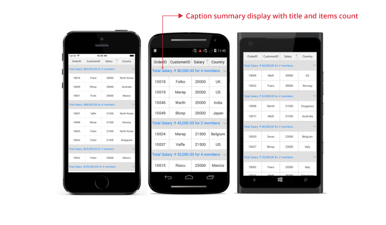

### Displaying summary for column

Display summary information in the column by setting the `GridSummaryRow.ShowSummaryInRow` to `false` and define summary columns. `SfDataGrid.GridSummaryColumn` is the object of [GridSummaryRow.SummaryColumns](https://help.syncfusion.com/cr/cref_files/xamarin/Syncfusion.SfDataGrid.XForms~Syncfusion.SfDataGrid.XForms.GridSummaryRow~SummaryColumns.html) collection that contains the following important properties:

* [Name](https://help.syncfusion.com/cr/cref_files/xamarin/Syncfusion.SfDataGrid.XForms~Syncfusion.SfDataGrid.XForms.GridSummaryColumn~Name.html): Defines name of the `GridSummaryColumn` to denote the `GridSummaryColumn` in `GridSummaryRow` with title.
* [MappingName](https://help.syncfusion.com/cr/cref_files/xamarin/Syncfusion.SfDataGrid.XForms~Syncfusion.SfDataGrid.XForms.GridSummaryColumn~MappingName.html): Defines the corresponding column name used for the summary calculation.
* [SummaryType](https://help.syncfusion.com/cr/cref_files/xamarin/Syncfusion.SfDataGrid.XForms~Syncfusion.SfDataGrid.XForms.GridSummaryColumn~SummaryType.html): Defines the `SummaryType` (enum) property to define the aggregate type for the summary calculation. 

The `DataGrid` control provides the following predefined aggregates:

  * CountAggregate
  * Int32Aggregate
  * DoubleAggregate

[CustomAggregate](https://help.syncfusion.com/cr/cref_files/xamarin/Syncfusion.SfDataGrid.XForms~Syncfusion.SfDataGrid.XForms.GridSummaryColumn~CustomAggregate.html) defines the `CustomAggregate` class object when the summary type is set as `Custom` that calculates the custom summaries.

The [Format](https://help.syncfusion.com/cr/cref_files/xamarin/Syncfusion.SfDataGrid.XForms~Syncfusion.SfDataGrid.XForms.GridSummaryColumn~Format.html) defines the `string` property that formats the summary value and displays it. The `Format` property may contains two parts separated by a colon (:). First part denotes the aggregate function name, and second part denotes display format of the summary value.

Refer to the [Formatting Summary](#_Formatting_Summary) section to know more about how to format summary, and [Aggregate Types](#_Aggregate_Types) section to know about different summary types.

In the following code snippet, summary is defined for `Salary` column:



<sfGrid:SfDataGrid.CaptionSummaryRow>
    <sfGrid:GridSummaryRow Name="CaptionSummary" ShowSummaryInRow="False">
        <sfGrid:GridSummaryRow.SummaryColumns>
            <sfGrid:GridSummaryColumn Name="CaptionSummary"
                                      Format="{}{Sum}"
                                      MappingName="Salary"
                                      SummaryType="DoubleAggregate" />
        </sfGrid:GridSummaryRow.SummaryColumns>
    </sfGrid:GridSummaryRow>
</sfGrid:SfDataGrid.CaptionSummaryRow>



GridSummaryRow summaryRow = new GridSummaryRow();
summaryRow.ShowSummaryInRow = false;
summaryRow.SummaryColumns.Add(new GridSummaryColumn()
{
    Name = "CaptionSummary",
    MappingName = "Salary",
    Format = "{Sum:c}",
    SummaryType = SummaryType.DoubleAggregate
});
sfGrid.CaptionSummaryRow= summaryRow;



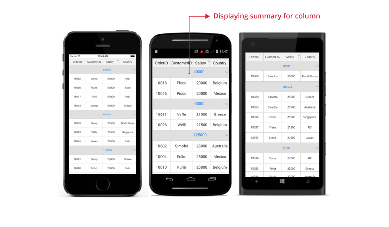

N> The `CaptionSummaryColumn` text will be aligned based on the `GridColumn.TextAlignment`.

### Caption summary template

The data grid hosts any view(s) inside a caption summary for the entire row or for individual columns by loading a template.  

### Displaying template for a row

The template for a caption summary row can be set by using [SfDataGrid.CaptionSummaryTemplate](http://help.syncfusion.com/cr/cref_files/xamarin/Syncfusion.SfDataGrid.XForms~Syncfusion.SfDataGrid.XForms.SfDataGrid~CaptionSummaryTemplateProperty.html) to customize it based on requirement. 

Refer the below code example in which a label is loaded in the caption summary template of caption summary row.



 <ContentPage.Resources>
    <ResourceDictionary>
      <local:DisplayBindingConverter x:Key="SummaryConverter" />
    </ResourceDictionary>
  </ContentPage.Resources>

  <sfgrid:SfDataGrid x:Name="dataGrid"
                   ItemsSource="{Binding OrdersInfo}">

<sfgrid:SfDataGrid.CaptionSummaryTemplate>
   <DataTemplate>
     <StackLayout Orientation="Horizontal" BackgroundColor="Gray">
       <Image Source="{local:ImageResource UG_Sample.SalaryIcon.Png}"
              Margin="0,5,0,5"
             HorizontalOptions="Start"
             VerticalOptions="Center"/>
       <Label Text="{Binding Converter={StaticResource SummaryConverter}, ConverterParameter = {x:Reference dataGrid} }"
              TextColor="White"
              FontSize="Large"
              VerticalTextAlignment="Center"
              HorizontalTextAlignment="Start"
              LineBreakMode="NoWrap"
              HorizontalOptions="FillAndExpand"
              VerticalOptions="FillAndExpand">
         <Label.Style>
           
         </Label.Style>
       </Label>
       </StackLayout>
     </DataTemplate>
</sfgrid:SfDataGrid.CaptionSummaryTemplate>
<sfgrid:SfDataGrid.CaptionSummaryRow>
    <sfgrid:GridSummaryRow Name="CaptionSummary" ShowSummaryInRow="True" Title="Salary: {CaptionSummary}">
        <sfgrid:GridSummaryRow.SummaryColumns>
            <sfgrid:GridSummaryColumn Name="CaptionSummary"
                                      Format="{}{Sum}"
                                      MappingName="Salary"
                                      SummaryType="DoubleAggregate" />
        </sfgrid:GridSummaryRow.SummaryColumns>
    </sfgrid:GridSummaryRow>
</sfgrid:SfDataGrid.CaptionSummaryRow>
</sfgrid:SfDataGrid>




// To write a converter, follow the code example:

public class GroupCaptionConverter : IValueConverter
{
    public object Convert(object value, Type targetType, object parameter, CultureInfo culture)
    {
        var data = value != null ? value as Group : null;
        if (data != null)
        {
            SfDataGrid dataGrid = (SfDataGrid)parameter;
            var summaryText = SummaryCreator.GetSummaryDisplayTextForRow((value as Group).SummaryDetails, dataGrid.View);

            return summaryText;
        }
        return null;
    }

    public object ConvertBack(object value, Type targetType, object parameter, CultureInfo culture)
    {
        return null;
    }
}



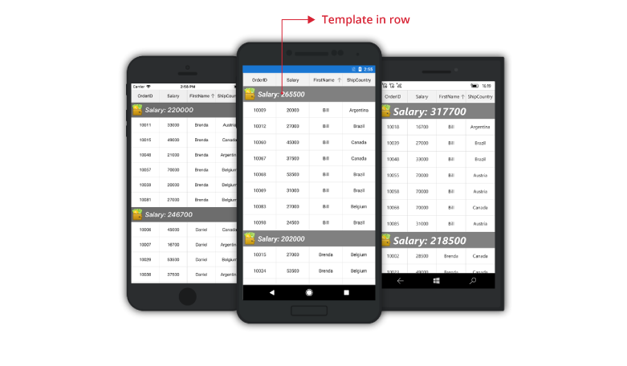

N> The `DataTemplateSelector` can also be directly assigned to the `CaptionSummaryTemplate`.

### Displaying template for a column

The template for a Caption summary column can be set by using `GridSummaryColumn.Template` to customize it based on requirement. 

Refer the below code example in which a label is loaded in the template of caption summary column.



 <ContentPage.Resources>
        <ResourceDictionary>
            <local:GroupCaptionConverter x:Key="SummaryConverter" />
        </ResourceDictionary>
</ContentPage.Resources>

<sfgrid:SfDataGrid x:Name="dataGrid" AllowResizingColumn="True" AutoGenerateColumns="False" ColumnSizer="Star">

    <sfgrid:SfDataGrid.Columns>
        <sfgrid:GridTextColumn MappingName="OrderID" />
        <sfgrid:GridTextColumn MappingName="Salary" />
        <sfgrid:GridTextColumn MappingName="CustomerID" />
    </sfgrid:SfDataGrid.Columns>
   
    <sfgrid:SfDataGrid.CaptionSummaryRow>
        <sfgrid:GridSummaryRow Name="CaptionSummary" ShowSummaryInRow="False" Title="Salary: {CaptionSummary}">
            <sfgrid:GridSummaryRow.SummaryColumns>
                <sfgrid:GridSummaryColumn Name="CaptionSummary" Format="{}{Sum}" MappingName="Salary"  
                                          SummaryType="DoubleAggregate" >
                    <sfgrid:GridSummaryColumn.Template>

                        <DataTemplate>
                                <StackLayout Orientation="Horizontal" BackgroundColor="DarkCyan">
                                    <Image  PropertyChanged="Image_PropertyChanged" Margin="0,5,0,5"  
                                            HorizontalOptions="Start" 
                                            VerticalOptions="Center"/>
                                    <Label Text="{Binding Converter={StaticResource SummaryConverter}, 
                                                  ConverterParameter = {x:Reference dataGrid} }" 
                                            TextColor="White" FontSize="Small" 
                                            VerticalTextAlignment="Center"
                                            HorizontalTextAlignment="Start"
                                            LineBreakMode="NoWrap"
                                            HorizontalOptions="FillAndExpand"
                                            VerticalOptions="FillAndExpand">
                                        <Label.Style>
                                            
                                        </Label.Style>
                                    </Label>
                                </StackLayout>
                            </DataTemplate>

                        </sfgrid:GridSummaryColumn.Template>
                    </sfgrid:GridSummaryColumn>
                </sfgrid:GridSummaryRow.SummaryColumns>
            </sfgrid:GridSummaryRow>
        </sfgrid:SfDataGrid.CaptionSummaryRow> 

    </sfgrid:SfDataGrid>





// To write a converter, follow the code example:

public class GroupCaptionConverter : IValueConverter
{
    public object Convert(object value, Type targetType, object parameter, CultureInfo culture)
    {
        var data = value != null ? value as Group : null;
        if (data != null)
        {
            SfDataGrid dataGrid = (SfDataGrid)parameter;
            var summaryText = SummaryCreator.GetSummaryDisplayTextForRow((value as Group).SummaryDetails, dataGrid.View);

            return summaryText;
        }
        return null;
    }
    public object ConvertBack(object value, Type targetType, object parameter, CultureInfo culture)
    {
        return null;
    }
}



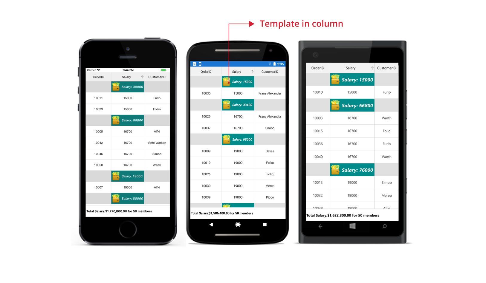

## Group summary

Group summary values are calculated based on records in the group. The summary information will be displayed at the bottom of each group. You can view the group summary row by expanding the corresponding group header. The data grid adds any number of group summary row.

Add group summary rows in the data grid by adding the [GridSummaryRow](http://help.syncfusion.com/cr/cref_files/xamarin/Syncfusion.SfDataGrid.XForms~Syncfusion.SfDataGrid.XForms.GridSummaryRow.html) to [SfDataGrid.GroupSummaryRows](http://help.syncfusion.com/cr/cref_files/wpf/Syncfusion.SfGrid.WPF~Syncfusion.UI.Xaml.Grid.SfDataGrid~GroupSummaryRows.html) collection.

### Displaying summary in the row

The summary information can be displayed in the row by setting the [GridSummaryRow.ShowSummaryInRow](https://help.syncfusion.com/cr/cref_files/xamarin/Syncfusion.SfDataGrid.XForms~Syncfusion.SfDataGrid.XForms.GridSummaryRow~ShowSummaryInRow.html) to `true` and by defining summary columns. You have to define the [GridSummaryRow.Title](https://help.syncfusion.com/cr/cref_files/xamarin/Syncfusion.SfDataGrid.XForms~Syncfusion.SfDataGrid.XForms.GridSummaryRow~Title.html) based on the [GridSummaryColumn.Name](https://help.syncfusion.com/cr/cref_files/xamarin/Syncfusion.SfDataGrid.XForms~Syncfusion.SfDataGrid.XForms.GridSummaryRow~Name.html) property to format summary columns value in a row.
 
Refer to [Formatting Summary](#formatting-summary) section to know more about how to format summary. 




<ContentPage x:Class="SummaryDemo.Summary"
             xmlns="http://xamarin.com/schemas/2014/forms"
             xmlns:x="http://schemas.microsoft.com/winfx/2009/xaml"
             xmlns:local="clr-namespace:SummaryDemo"
             xmlns:sfgrid="clr-namespace:Syncfusion.SfDataGrid.XForms;assembly=Syncfusion.SfDataGrid.XForms">
    <sfgrid:SfDataGrid x:Name="dataGrid" AllowResizingColumn="True" AllowGroupExpandCollapse="True"
                       AutoGenerateColumns="True" 
                       ColumnSizer="Star">

    <sfgrid:SfDataGrid.GroupColumnDescriptions>
            <sfgrid:GroupColumnDescription ColumnName="Salary"  />
        </sfgrid:SfDataGrid.GroupColumnDescriptions>

        <sfgrid:SfDataGrid.GroupSummaryRows>
            <sfgrid:GridSummaryRow ShowSummaryInRow="True" Title="Total Salary: {Salary} for {customerID} members">
                
                <sfgrid:GridSummaryRow.SummaryColumns>

                    <sfgrid:GridSummaryColumn Name="Salary" 
                                                  MappingName="Salary" 
                                                  Format="{}{Sum}"
                                                  SummaryType="DoubleAggregate">
                    </sfgrid:GridSummaryColumn>

                    <sfgrid:GridSummaryColumn Name="customerID" 
                                                  MappingName="CustomerID" 
                                                  Format="{}{Count}"
                                                  SummaryType="CountAggregate">
                    </sfgrid:GridSummaryColumn>

                </sfgrid:GridSummaryRow.SummaryColumns>
                
            </sfgrid:GridSummaryRow>
        </sfgrid:SfDataGrid.GroupSummaryRows>

  </sfgrid:SfDataGrid>
</ContentPage>


            this.dataGrid.GroupSummaryRows.Add(new GridSummaryRow()
            {
                ShowSummaryInRow = true,
                Title = "Total Salary: {Salary} for {customerID} members",
                SummaryColumns = new ObservableCollection<ISummaryColumn>()
                {
                    new GridSummaryColumn()
                    {
                        Name="Salary",
                        MappingName="Salary",
                        SummaryType=SummaryType.DoubleAggregate,
                        Format="{Sum}"
                    },
                    new GridSummaryColumn()
                    {
                        Name="customerID",
                        MappingName="customerID",
                        Format="{Count}",
                        SummaryType=SummaryType.CountAggregate
                    }
                }
            });




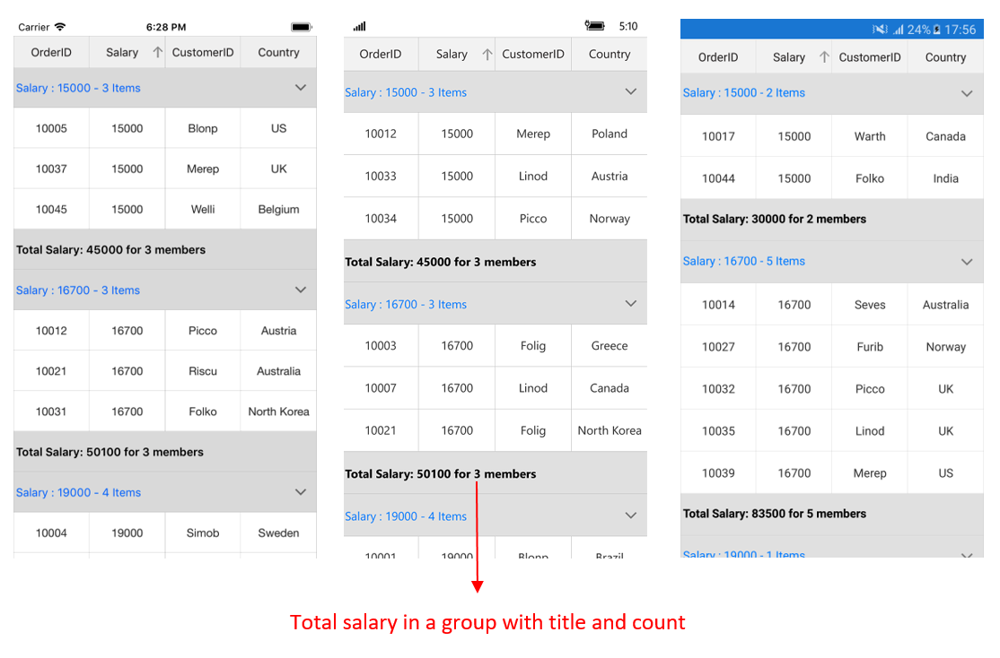

### Displaying summary in the column

The summary information can be displayed in the column by setting the [GridSummaryRow.ShowSummaryInRow](https://help.syncfusion.com/cr/cref_files/xamarin/Syncfusion.SfDataGrid.XForms~Syncfusion.SfDataGrid.XForms.GridSummaryRow~ShowSummaryInRow.html) to `false` and by defining summary columns. To calculate summary based on the column, specify the following properties:

1. [GridSummaryColumn.MappingName](https://help.syncfusion.com/cr/cref_files/xamarin/Syncfusion.SfDataGrid.XForms~Syncfusion.SfDataGrid.XForms.GridSummaryColumn~MappingName.html): Provides MappingName of the column (Property name of data object) that you want to calculate summary.
2. [GridSummaryColumn.SummaryType](https://help.syncfusion.com/cr/cref_files/xamarin/Syncfusion.SfDataGrid.XForms~Syncfusion.SfDataGrid.XForms.GridSummaryColumn~SummaryType.html): Provides different built-in summary calculation functions for various types.
3. [GridSummaryColumn.Format](https://help.syncfusion.com/cr/cref_files/xamarin/Syncfusion.SfDataGrid.XForms~Syncfusion.SfDataGrid.XForms.GridSummaryColumn~Format.html): Provides format string for the summary based on support function name in the specified SummaryType.

Refer to [Formatting Summary](#formatting-summary) section to know more about how to format summary and [Aggregate Types](#aggregate-types) section to know about different Summary Types.

In the following code snippet, summary is defined for `Salary` and `CustomerID` columns:



<ContentPage x:Class="SummaryDemo.Summary"
             xmlns="http://xamarin.com/schemas/2014/forms"
             xmlns:x="http://schemas.microsoft.com/winfx/2009/xaml"
             xmlns:local="clr-namespace:SummaryDemo"
             xmlns:sfgrid="clr-namespace:Syncfusion.SfDataGrid.XForms;assembly=Syncfusion.SfDataGrid.XForms">

 <sfgrid:SfDataGrid x:Name="dataGrid" AllowResizingColumn="True"
                       AutoGenerateColumns="True" 
                       ColumnSizer="Star">

       <sfgrid:SfDataGrid.GroupSummaryRows>
            <sfgrid:GridSummaryRow ShowSummaryInRow="False" >
                
                <sfgrid:GridSummaryRow.SummaryColumns>

                    <sfgrid:GridSummaryColumn Name="Salary" 
                                                  MappingName="Salary" 
                                                  Format="{}{Sum}"
                                                  SummaryType="DoubleAggregate">
                    </sfgrid:GridSummaryColumn>

                    <sfgrid:GridSummaryColumn Name="customerID" 
                                                  MappingName="CustomerID" 
                                                  Format="Total members - {Count}"
                                                  SummaryType="CountAggregate">
                    </sfgrid:GridSummaryColumn>

                </sfgrid:GridSummaryRow.SummaryColumns>
                
            </sfgrid:GridSummaryRow>
        </sfgrid:SfDataGrid.GroupSummaryRows>

    </sfgrid:SfDataGrid>
</ContentPage>




            this.dataGrid.GroupSummaryRows.Add(new GridSummaryRow()
            {
                ShowSummaryInRow = false,
                SummaryColumns = new ObservableCollection<ISummaryColumn>()
                {
                    new GridSummaryColumn()
                    {
                        Name="Salary",
                        MappingName="Salary",
                        SummaryType=SummaryType.DoubleAggregate,
                        Format="{Sum}"
                    },
                    new GridSummaryColumn()
                    {
                        Name="customerID",
                        MappingName="CustomerID",
                        Format="Total members - {Count:d}",
                        SummaryType=SummaryType.CountAggregate
                    }
                }
            });



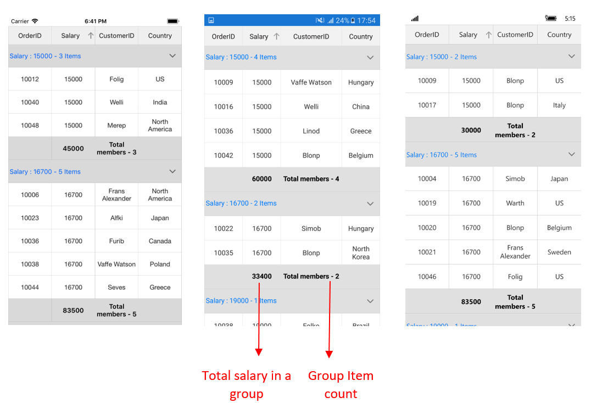

### Group summary template

The data grid hosts any view(s) inside a group summary for the entire row or for individual columns by loading a template.  

### Displaying template for a row

The template for a group summary row can be set by using `SfDataGrid.GroupSummaryTemplate` to customize it based on requirement. 

Refer the below code example in which a label is loaded in the group summary template of group summary row.



    <ContentPage.Resources>
        <ResourceDictionary>
            <local:GroupSummaryConverter x:Key="SummaryConverter" />
        </ResourceDictionary>
    </ContentPage.Resources>

  <sfgrid:SfDataGrid x:Name="dataGrid"
                   ItemsSource="{Binding OrdersInfo}">

       <sfgrid:SfDataGrid.GroupSummaryTemplate>
            <DataTemplate>
                <StackLayout Orientation="Horizontal" BackgroundColor="Gray">
                <Label Text="{Binding Converter={StaticResource SummaryConverter}, ConverterParameter = {x:Reference dataGrid} }"
                                           TextColor="White"
                                           FontSize="Large"
                                           VerticalTextAlignment="Center"
                                           HorizontalTextAlignment="Start"
                                           LineBreakMode="NoWrap"
                                           HorizontalOptions="FillAndExpand"
                                           VerticalOptions="FillAndExpand">
                    <Label.Style>
                        
                    </Label.Style>
                </Label>
                </StackLayout>
            </DataTemplate>
       </sfgrid:SfDataGrid.GroupSummaryTemplate>

   <sfgrid:SfDataGrid.GroupSummaryRows>
            <sfgrid:GridSummaryRow ShowSummaryInRow="True">
                
                <sfgrid:GridSummaryRow.SummaryColumns>

                    <sfgrid:GridSummaryColumn Name="Salary" 
                                                  MappingName="Salary" 
                                                  Format="{}{Sum}"
                                                  SummaryType="DoubleAggregate">
                    </sfgrid:GridSummaryColumn>

                    <sfgrid:GridSummaryColumn Name="customerID" 
                                                  MappingName="CustomerID" 
                                                  Format="{}{Count}"
                                                  SummaryType="CountAggregate">
                    </sfgrid:GridSummaryColumn>

                </sfgrid:GridSummaryRow.SummaryColumns>
                
            </sfgrid:GridSummaryRow>
        </sfgrid:SfDataGrid.GroupSummaryRows>
</sfgrid:SfDataGrid>





// To write a converter, follow the code example:

public class GroupSummaryConverter : IValueConverter
    {

        public object Convert(object value, Type targetType, object parameter, CultureInfo culture)
        {
            var data = value != null ? value as SummaryRecordEntry : null;
            if (data != null)
            {
                SfDataGrid dataGrid = (SfDataGrid)parameter;
                
                var summaryText = SummaryCreator.GetSummaryDisplayText(data,"Salary",dataGrid.View);

                return "Total Salary:" + " " + summaryText.ToString();
            }
            return null;
        }

        public object ConvertBack(object value, Type targetType, object parameter, CultureInfo culture)
        {
            return null;
        }
    }



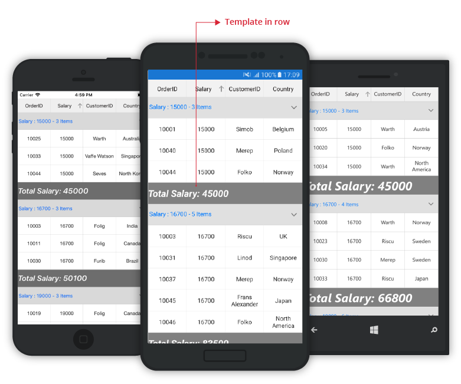

N> The `DataTemplateSelector` can also be directly assigned to the `SfDataGrid.GroupSummaryTemplate`.

### Displaying template for a column

The template for a group summary column can be set by using `GridSummaryColumn.Template` to customize it based on requirement. 

Refer the below code example in which a label is loaded in the template of group summary column.



 <ContentPage.Resources>
        <ResourceDictionary>
            <local:GroupSummaryConverter x:Key="SummaryConverter" />
        </ResourceDictionary>
</ContentPage.Resources>

<sfgrid:SfDataGrid x:Name="dataGrid" AllowResizingColumn="True" AutoGenerateColumns="False" ColumnSizer="Star">

    <sfgrid:SfDataGrid.Columns>
        <sfgrid:GridTextColumn MappingName="OrderID" />
        <sfgrid:GridTextColumn MappingName="Salary" />
        <sfgrid:GridTextColumn MappingName="CustomerID" />
        <sfgrid:GridTextColumn MappingName="Country" />
    </sfgrid:SfDataGrid.Columns>
   
     <sfgrid:SfDataGrid.GroupSummaryRows>
            <sfgrid:GridSummaryRow ShowSummaryInRow="False" >
                
                <sfgrid:GridSummaryRow.SummaryColumns>

                    <sfgrid:GridSummaryColumn Name="Salary"
                                                  MappingName="Salary" 
                                                  Format="{}{Sum}"
                                                  SummaryType="DoubleAggregate">
                        <sfgrid:GridSummaryColumn.Template>
                            <DataTemplate>
                                <StackLayout Orientation="Horizontal" BackgroundColor="Gray">
                                    <Label Text="{Binding Converter={StaticResource SummaryConverter}, ConverterParameter = {x:Reference dataGrid} }"
                                           TextColor="White"
                                           FontSize="Large"
                                           VerticalTextAlignment="Center"
                                           HorizontalTextAlignment="Center"
                                           LineBreakMode="NoWrap"
                                           HorizontalOptions="FillAndExpand"
                                           VerticalOptions="FillAndExpand">
                                        <Label.Style>
                                            
                                        </Label.Style>
                                    </Label>
                                </StackLayout>
                            </DataTemplate>
                        </sfgrid:GridSummaryColumn.Template>
                        
                    </sfgrid:GridSummaryColumn>
                    </sfgrid:GridSummaryRow.SummaryColumns>
                
            </sfgrid:GridSummaryRow>
        </sfgrid:SfDataGrid.GroupSummaryRows>

    </sfgrid:SfDataGrid>





// To write a converter, follow the code example:

 public class GroupSummaryConverter : IValueConverter
    {

        public object Convert(object value, Type targetType, object parameter, CultureInfo culture)
        {
            var data = value != null ? value as SummaryRecordEntry : null;
            if (data != null)
            {
                SfDataGrid dataGrid = (SfDataGrid)parameter;
                
                var summaryText = SummaryCreator.GetSummaryDisplayText(data,"Salary",dataGrid.View);

                return summaryText.ToString();
            }
            return null;
        }

        public object ConvertBack(object value, Type targetType, object parameter, CultureInfo culture)
        {
            return null;
        }
    }



## Table summaries

The data grid provides built-in support for table summaries. The table summary value is calculated based on all records in the control.

You can add table summary row in the data grid by adding the [GridTableSummaryRow](http://help.syncfusion.com/cr/cref_files/xamarin/Syncfusion.SfDataGrid.XForms~Syncfusion.SfDataGrid.XForms.GridTableSummaryRow.html) to the [SfDataGrid.TableSummaryRows](https://help.syncfusion.com/cr/cref_files/xamarin/Syncfusion.SfDataGrid.XForms~Syncfusion.SfDataGrid.XForms.SfDataGrid~TableSummaryRows.html) collection.

The following screenshot illustrates table summary rows in the data grid:

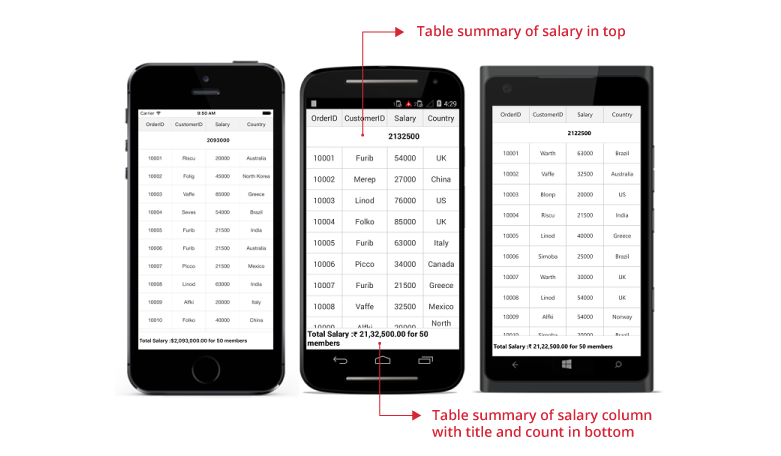



<sfGrid:SfDataGrid.TableSummaryRows>
    <sfGrid:GridTableSummaryRow Title="Total Salary :{TotalSalary} for {ProductCount} members"
                                Position="Top"
                                ShowSummaryInRow="True">
        <sfGrid:GridTableSummaryRow.SummaryColumns>
            <sfGrid:GridSummaryColumn Name="TotalSalary"
                                      Format="{}{Sum:c}"
                                      MappingName="Salary"
                                      SummaryType="DoubleAggregate" />
            <sfGrid:GridSummaryColumn Name="ProductCount"
                                      Format="{}{Count}"
                                      MappingName="Salary"
                                      SummaryType="CountAggregate" />
            </sfGrid:GridTableSummaryRow.SummaryColumns>
        </sfGrid:GridTableSummaryRow>
    <sfGrid:GridTableSummaryRow Position="Top" ShowSummaryInRow="True">
        <sfGrid:GridTableSummaryRow.SummaryColumns>
            <sfGrid:GridSummaryColumn Name="TotalSalary"
                                      Format="{}{Sum}"
                                      MappingName="Salary"
                                      SummaryType="DoubleAggregate" />
            </sfGrid:GridTableSummaryRow.SummaryColumns>
        </sfGrid:GridTableSummaryRow>
</sfGrid:SfDataGrid.TableSummaryRows>



GridTableSummaryRow summaryRow1 = new GridTableSummaryRow();
summaryRow1.Title = "Total Salary:{TotalSalary} for {ProductCount} members";
summaryRow1.ShowSummaryInRow = true;
summaryRow1.Position = Position.Top;
summaryRow1.SummaryColumns.Add(new GridSummaryColumn()
{
    Name = "TotalSalary",
    MappingName = "Salary",
    Format = "{Sum:c}",
    SummaryType = SummaryType.DoubleAggregate
});
summaryRow1.SummaryColumns.Add(new GridSummaryColumn()
{
    Name = "ProductCount",
    MappingName = "Salary",
    Format = "{Count}",
    SummaryType = SummaryType.CountAggregate
});
sfGrid.TableSummaryRows.Add(summaryRow1);

GridTableSummaryRow summaryRow2 = new GridTableSummaryRow();
summaryRow2.ShowSummaryInRow = false;
summaryRow2.Position = Position.Top;
summaryRow2.SummaryColumns.Add(new GridSummaryColumn()
{
    Name = "TotalSalary",
    MappingName = "Salary",
    Format = "{Sum}",
    SummaryType = SummaryType.DoubleAggregate
});
sfGrid.TableSummaryRows.Add(summaryRow2);



### Displaying summary in a row

Display summary information in a row by setting the [GridTableSummaryRow.ShowSummaryInRow](https://help.syncfusion.com/cr/cref_files/xamarin/Syncfusion.SfDataGrid.XForms~Syncfusion.SfDataGrid.XForms.GridSummaryRow~ShowSummaryInRow.html) to `true` and define summary columns. You have to define the [GridTableSummaryRow.Title](https://help.syncfusion.com/cr/cref_files/xamarin/Syncfusion.SfDataGrid.XForms~Syncfusion.SfDataGrid.XForms.GridSummaryRow~Title.html) based on the [GridSummaryColumn.Name](https://help.syncfusion.com/cr/cref_files/xamarin/Syncfusion.SfDataGrid.XForms~Syncfusion.SfDataGrid.XForms.GridSummaryRow~Name.html) property to format summary columns values in a row.



<sfGrid:SfDataGrid.TableSummaryRows>
    <sfGrid:GridTableSummaryRow Title="Total Salary :{TotalSalary} for {ProductCount} members"
                                ShowSummaryInRow="True">
        <sfGrid:GridTableSummaryRow.SummaryColumns>
            <sfGrid:GridSummaryColumn Name="TotalSalary"
                                      Format="{}{Sum:c}"
                                      MappingName="Salary"
                                      SummaryType="DoubleAggregate" />
            <sfGrid:GridSummaryColumn Name="ProductCount"
                                      Format="{}{Count}"
                                      MappingName="Salary"
                                      SummaryType="CountAggregate" />
            </sfGrid:GridTableSummaryRow.SummaryColumns>
        </sfGrid:GridTableSummaryRow>
</sfGrid:SfDataGrid.TableSummaryRows>



GridTableSummaryRow summaryRow = new GridTableSummaryRow();
summaryRow.Title = "Total Salary:{TotalSalary} for {ProductCount} members";
summaryRow.ShowSummaryInRow = true;
summaryRow.SummaryColumns.Add(new GridSummaryColumn()
{
    Name = "TotalSalary",
    MappingName = "Salary",
    Format = "{Sum:c}",
    SummaryType = SummaryType.DoubleAggregate
});
summaryRow.SummaryColumns.Add(new GridSummaryColumn()
{
    Name = "ProductCount",
    MappingName = "Salary",
    Format = "{Count}",
    SummaryType = SummaryType.CountAggregate
});
sfGrid.TableSummaryRows.Add(summaryRow);



The following screenshot shows the table summary row if `ShowSummaryInRow` is `true`:

### Displaying summary in a column

Display summary information in a column by setting `GridTableSummaryRow.ShowSummaryInRow` to `false` and defining summary columns. `GridSummaryColumn` is the object of [GridTableSummaryRow.SummaryColumns](https://help.syncfusion.com/cr/cref_files/xamarin/Syncfusion.SfDataGrid.XForms~Syncfusion.SfDataGrid.XForms.GridSummaryRow~SummaryColumns.html) collection that contains the following important properties:

* [Name](https://help.syncfusion.com/cr/cref_files/xamarin/Syncfusion.SfDataGrid.XForms~Syncfusion.SfDataGrid.XForms.GridSummaryColumn~Name.html): Defines name of the `GridSummaryColumn` to denote the `GridSummaryColumn` in `GridTableSummaryRow` with title.
* [MappingName](https://help.syncfusion.com/cr/cref_files/xamarin/Syncfusion.SfDataGrid.XForms~Syncfusion.SfDataGrid.XForms.GridSummaryColumn~MappingName.html): Defines the corresponding column name for the summary calculation.
* [SummaryType](https://help.syncfusion.com/cr/cref_files/xamarin/Syncfusion.SfDataGrid.XForms~Syncfusion.SfDataGrid.XForms.GridSummaryColumn~SummaryType.html): Defines the `SummaryType` (enum) property to define the aggregate type for the summary calculation. 

The data grid control provides the following predefined aggregates:

  * CountAggregate
  * Int32Aggregate
  * DoubleAggregate

[CustomAggregate](https://help.syncfusion.com/cr/cref_files/xamarin/Syncfusion.SfDataGrid.XForms~Syncfusion.SfDataGrid.XForms.GridSummaryColumn~CustomAggregate.html) defines the `CustomAggregate` class object when the summary type is set as `Custom` that calculates custom summaries.

The [Format](https://help.syncfusion.com/cr/cref_files/xamarin/Syncfusion.SfDataGrid.XForms~Syncfusion.SfDataGrid.XForms.GridSummaryColumn~Format.html) defines the `string` property that formats the summary value and displays it. The `Format` property may contains two parts that are separated by a colon (:). First part denotes the aggregate function name, and second part denotes display format of the summary value.

Refer to the [Formatting Summary](#_Formatting_Summary) section to know more about how to format summary and [Aggregate Types](#_Aggregate_Types) section to know about different summary types.

In the following code snippet, summary is defined for `Salary` column:



<sfGrid:SfDataGrid.TableSummaryRows>
    <sfGrid:GridTableSummaryRow Name="TableSummary" ShowSummaryInRow="False">
        <sfGrid:GridTableSummaryRow.SummaryColumns>
            <sfGrid:GridSummaryColumn Name="TableSummary"
                                      Format="{}{Sum}"
                                      MappingName="Salary"
                                      SummaryType="DoubleAggregate" />
        </sfGrid:GridTableSummaryRow.SummaryColumns>
    </sfGrid:GridTableSummaryRow>
</sfGrid:SfDataGrid.TableSummaryRows>



GridTableSummaryRow summaryRow = new GridTableSummaryRow();
summaryRow.ShowSummaryInRow = false;
summaryRow.SummaryColumns.Add(new GridSummaryColumn()
{
    Name = "TableSummary",
    MappingName = "Salary",
    Format = "{Sum}",
    SummaryType = SummaryType.DoubleAggregate
});
sfGrid.TableSummaryRows.Add(summaryRow);



The following screenshot shows the table summary row if `ShowSummaryInRow` is `false`.

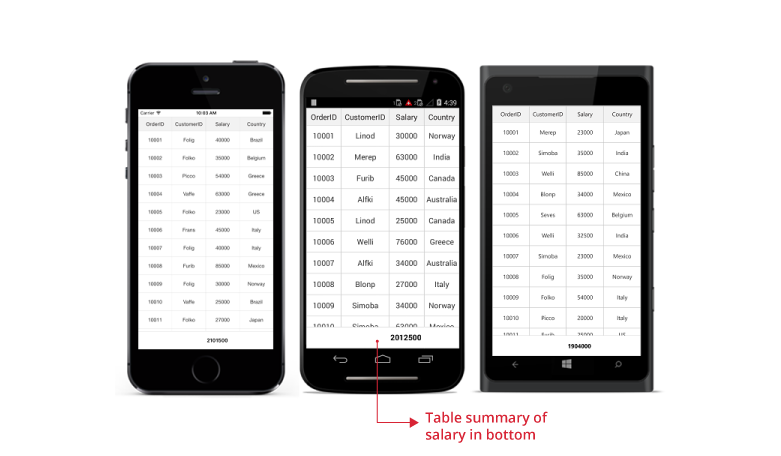

### Positioning TableSummaryRows

The data grid add table summary rows either at top or bottom positions using the [GridTableSummaryRow.Position](https://help.syncfusion.com/cr/cref_files/xamarin/Syncfusion.SfDataGrid.XForms~Syncfusion.SfDataGrid.XForms.GridTableSummaryRow~Position.html) property.



<sfGrid:SfDataGrid.TableSummaryRows>
    <sfGrid:GridTableSummaryRow Position="Top"
                                ShowSummaryInRow="False">
        <sfGrid:GridTableSummaryRow.SummaryColumns>
            <sfGrid:GridSummaryColumn Name="TotalSalary"
                                      Format="{}{Sum}"
                                      MappingName="Salary"
                                      SummaryType="DoubleAggregate" />
            </sfGrid:GridTableSummaryRow.SummaryColumns>
        </sfGrid:GridTableSummaryRow>
    <sfGrid:GridTableSummaryRow Position="Bottom"
                                ShowSummaryInRow="True"
                                Title="Total Salary :{TotalSalary} for {ProductCount} members">
        <sfGrid:GridTableSummaryRow.SummaryColumns>
            <sfGrid:GridSummaryColumn Name="TotalSalary"
                                      Format="{}{Sum:c}"
                                      MappingName="Salary"
                                      SummaryType="DoubleAggregate" />
            <sfGrid:GridSummaryColumn Name="ProductCount"
                                      Format="{}{Count}"
                                      MappingName="Salary"
                                      SummaryType="CountAggregate" />
        </sfGrid:GridTableSummaryRow.SummaryColumns>
    </sfGrid:GridTableSummaryRow>
</sfGrid:SfDataGrid.TableSummaryRows>



GridTableSummaryRow topSummaryRow = new GridTableSummaryRow();
topSummaryRow.Position = Position.Top;
topSummaryRow.ShowSummaryInRow = false;
topSummaryRow.SummaryColumns.Add(new GridSummaryColumn()
{
    Name = "TotalSalary",
    MappingName = "Salary",
    Format = "{Sum}",
    SummaryType = SummaryType.DoubleAggregate
});
sfGrid.TableSummaryRows.Add(topSummaryRow);

GridTableSummaryRow bottomSummaryRow = new GridTableSummaryRow();
bottomSummaryRow.Position = Position.Bottom;
bottomSummaryRow.Title = "Total Salary:{TotalSalary} for {ProductCount} members";
bottomSummaryRow.ShowSummaryInRow = true;
bottomSummaryRow.SummaryColumns.Add(new GridSummaryColumn()
{
    Name = "TotalSalary",
    MappingName = "Salary",
    Format = "{Sum:c}",
    SummaryType = SummaryType.DoubleAggregate
});
bottomSummaryRow.SummaryColumns.Add(new GridSummaryColumn()
{
    Name = "ProductCount",
    MappingName = "Salary",
    Format = "{Count}",
    SummaryType = SummaryType.CountAggregate
});
sfGrid.TableSummaryRows.Add(bottomSummaryRow);



The below screenshot illustrates the positioning of table summary rows in SfDataGrid.

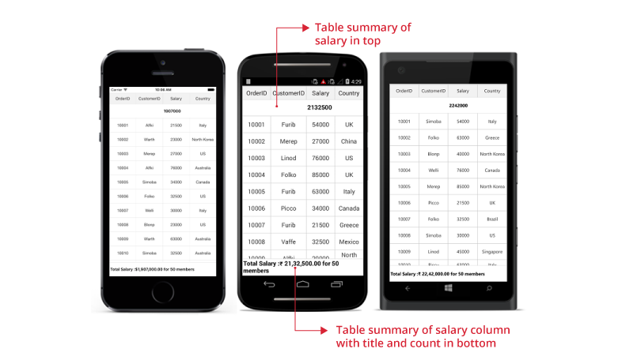

## Formatting summary

In the following sections, the formatting is explained using the `CaptionSummary`. However, the formatting can also be applied for `TableSummaries`.

### Defining summary function

In the following code snippet, the [Format](https://help.syncfusion.com/cr/cref_files/xamarin/Syncfusion.SfDataGrid.XForms~Syncfusion.SfDataGrid.XForms.GridSummaryColumn~Format.html) property is defined to display sum of `Salary` by specifying the function name inside curly braces:



<sfGrid:SfDataGrid.CaptionSummaryRow>
    <sfGrid:GridSummaryRow ShowSummaryInRow="False">
        <sfGrid:GridSummaryRow.SummaryColumns>
            <sfGrid:GridSummaryColumn Name="CaptionSummary"
                                      Format="{}{Sum}"
                                      MappingName="Salary"
                                      SummaryType="DoubleAggregate" />
        </sfGrid:GridSummaryRow.SummaryColumns>
    </sfGrid:GridSummaryRow>
</sfGrid:SfDataGrid.CaptionSummaryRow>



GridSummaryRow summaryRow = new GridSummaryRow();
summaryRow.ShowSummaryInRow = false;
summaryRow.SummaryColumns.Add(new GridSummaryColumn()
{
    Name = "CaptionSummary",
    MappingName = "Salary",
    Format = "{Sum}",
    SummaryType = SummaryType.DoubleAggregate
});
sfGrid.CaptionSummaryRow= summaryRow;



### Formatting summary value

Format the summary value by setting the appropriate format after the aggregate function followed by a colon(:) in the `GridSummaryColumn.Format` property.

In the following code snippet `Salary` column summary is formatted using `c` format specifier. Refer to [here](https://msdn.microsoft.com/en-us/library/dwhawy9k.aspx?f=255&MSPPError=-2147217396) to know about how to set different formats.



<sfGrid:SfDataGrid.CaptionSummaryRow>
    <sfGrid:GridSummaryRow ShowSummaryInRow="False">
        <sfGrid:GridSummaryRow.SummaryColumns>
            <sfGrid:GridSummaryColumn Name="CaptionSummary"
                                      Format="{}{Sum:c}"
                                      MappingName="Salary"
                                      SummaryType="DoubleAggregate" />
        </sfGrid:GridSummaryRow.SummaryColumns>
    </sfGrid:GridSummaryRow>
</sfGrid:SfDataGrid.CaptionSummaryRow>



GridSummaryRow summaryRow = new GridSummaryRow();
summaryRow.ShowSummaryInRow = false;
summaryRow.SummaryColumns.Add(new GridSummaryColumn()
{
    Name = "CaptionSummary",
    MappingName = "Salary",
    Format = "{Sum:c}",
    SummaryType = SummaryType.DoubleAggregate
});
sfGrid.CaptionSummaryRow= summaryRow;



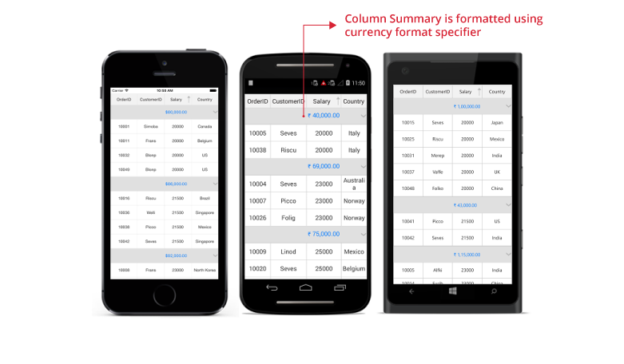

### Displaying additional content in summary

Append additional content with summary value using the `GridSummaryColumn.Format` property.

In the following code snippet `Total:` text is appended before summary value:



<sfGrid:SfDataGrid.CaptionSummaryRow>
    <sfGrid:GridSummaryRow ShowSummaryInRow="False">
        <sfGrid:GridSummaryRow.SummaryColumns>
            <sfGrid:GridSummaryColumn Name="CaptionSummary"
                                      Format="Total: {Sum:c}"
                                      MappingName="Salary"
                                      SummaryType="DoubleAggregate" />
        </sfGrid:GridSummaryRow.SummaryColumns>
    </sfGrid:GridSummaryRow>
</sfGrid:SfDataGrid.CaptionSummaryRow>



GridSummaryRow summaryRow = new GridSummaryRow();
summaryRow.ShowSummaryInRow = false;
summaryRow.SummaryColumns.Add(new GridSummaryColumn()
{
    Name = "CaptionSummary",
    MappingName = "Salary",
    Format = "Total:{Sum:c}",
    SummaryType = SummaryType.DoubleAggregate
});
sfGrid.CaptionSummaryRow= summaryRow;



 
### Formatting summary for a row using Title property

Format the summary value for a row using the [GridSummaryRow.Title](https://help.syncfusion.com/cr/cref_files/xamarin/Syncfusion.SfDataGrid.XForms~Syncfusion.SfDataGrid.XForms.GridSummaryRow~Title.html) when `ShowSummaryInRow` set to `true`.



<sfGrid:SfDataGrid.CaptionSummaryRow>
    <sfGrid:GridSummaryRow Title="Total Salary:{TotalSalary} for {ProductCount} members" ShowSummaryInRow="True">
        <sfGrid:GridSummaryRow.SummaryColumns>
            <sfGrid:GridSummaryColumn Name="TotalSalary"
                                      Format="{}{Sum:c}"
                                      MappingName="Salary"
                                      SummaryType="DoubleAggregate" />
            <sfGrid:GridSummaryColumn Name="ProductCount"
                                      Format="{}{Count}"
                                      MappingName="Salary"
                                       SummaryType="CountAggregate" />
        </sfGrid:GridSummaryRow.SummaryColumns>
    </sfGrid:GridSummaryRow>
</sfGrid:SfDataGrid.CaptionSummaryRow>



GridSummaryRow summaryRow = new GridSummaryRow();
summaryRow.Title = "Total Salary:{TotalSalary} for {ProductCount} members";
summaryRow.ShowSummaryInRow = true;
summaryRow.SummaryColumns.Add(new GridSummaryColumn()
{
    Name = "TotalSalary",
    MappingName = "Salary",
    Format = "{}{Sum:c}",
    SummaryType = SummaryType.DoubleAggregate
});
summaryRow.SummaryColumns.Add(new GridSummaryColumn()
{
    Name = "ProductCount",
    MappingName = "Salary",
    Format = "{Count}",
    SummaryType = SummaryType.DoubleAggregate
});
sfGrid.CaptionSummaryRow= summaryRow;



N> Setting the `SummaryColumn.Format` property to {Sum:c} throws an exception since the compiler treats it like how we set binding to a string, since the syntax is the same. But here we are trying to set the culture format for the string. Hence set the format as Format = "{}{Sum:c}" when setting the format in XAML.  

## Aggregate types

Specify different summary aggregate types by using the [GridSummaryColumn.SummaryType](https://help.syncfusion.com/cr/cref_files/xamarin/Syncfusion.SfDataGrid.XForms~Syncfusion.SfDataGrid.XForms.GridSummaryColumn~SummaryType.html) property, and use the built-in function in [GridSummaryColumn.Format](https://help.syncfusion.com/cr/cref_files/xamarin/Syncfusion.SfDataGrid.XForms~Syncfusion.SfDataGrid.XForms.GridSummaryColumn~Format.html).

List of predefined aggregate types and its built-in functions are as follows:

<table>
<tr>
<th>
Aggregate Type
</th>
<th>
Built-in function
</th>
</tr>
<tr>
<td>
CountAggregate
</td>
<td>
Count
</td>
</tr>
<tr>
<td>
Int32Aggregate
</td>
<td>
Count, max, min, average, and sum.
</td>
</tr>
<tr>
<td>
DoubleAggregate
</td>
<td>
Count, max, min, average, and sum.
</td>
</tr>
<tr>
<td>
Custom
</td>
<td>
Used for custom summaries
</td>
</tr>
</table>

N> The above aggregate types can be applied for both `CaptionSummaries` and `TableSummaries`.

## Custom summaries

The data grid implements your own aggregate functions when the built-in aggregate functions do not meet your requirement.

Summary values can be calculated based on custom logic using the [GridSummaryColumn.CustomAggregate](https://help.syncfusion.com/cr/cref_files/xamarin/Syncfusion.SfDataGrid.XForms~Syncfusion.SfDataGrid.XForms.GridSummaryColumn~CustomAggregate.html) property.

### Implementing custom aggregate

1. Create a custom aggregate class by deriving from [ISummaryAggregate](https://help.syncfusion.com/cr/cref_files/xamarin/Syncfusion.Data.Portable~Syncfusion.Data.ISummaryAggregate.html) interface.
2. In the `CalculateAggregateFunc()` method, you have to calculate the summary and assign it to the property.

In the following code snippet, `Standard Deviation` is calculated for quantity of products:


public class CustomAggregate : ISummaryAggregate
{
    public CustomAggregate()
    {
    }
    public double StdDev { get; set; }
    public Action<System.Collections.IEnumerable, string, PropertyInfo> CalculateAggregateFunc()
    {
        return (items, property, pd) =>
        {
            var enumerableItems = items as IEnumerable<OrderInfo>;
            if (pd.Name == "StdDev")
            {
                this.StdDev = enumerableItems.StdDev<OrderInfo>(q => q.OrderID);
            }
        };
    }
}

public static class LinqExtensions
{
    public static double StdDev<T>(this IEnumerable<T> values, Func<T, double?> selector)
    {
        double value = 0;
        var count = values.Count();
        if (count > 0)
        {
            double? avg = values.Average(selector);
            double sum = values.Select(selector).Sum(d =>
            {
                if (d.HasValue)
                {
                    return Math.Pow(d.Value - avg.Value, 2);
                }
                return 0.0;
            });
            value = Math.Sqrt((sum) / (count - 1));
        }
        return value;
    }
}


Assign the custom aggregate to `GridSummaryColumn.CustomAggregate` property and set the `SummaryType` as `Custom`. `GridSummaryColumn.Format` property is defined based on property name in custom aggregate `StdDev`.



<sfGrid:SfDataGrid.CaptionSummaryRow>
    <sfGrid:GridSummaryRow Title="Standard Deviation:{CaptionSummary}" ShowSummaryInRow = "True">                                                     
        <sfGrid:GridSummaryRow.SummaryColumns>
            <sfGrid:GridSummaryColumn Name="CaptionSummary"
                                      CustomAggregate="{StaticResource customAggregate}"
                                      Format="{}{StdDev}"
                                      MappingName="OrderID"
                                      SummaryType="Custom" />
        </sfGrid:GridSummaryRow.SummaryColumns>
    </sfGrid:GridSummaryRow>
</sfGrid:SfDataGrid.CaptionSummaryRow>



GridSummaryRow summaryRow = new GridSummaryRow();
summaryRow.Title = "Standard Deviation:{CaptionSummary}";
summaryRow.ShowSummaryInRow = true;
summaryRow.SummaryColumns.Add(new GridSummaryColumn
{
    Name = "CaptionSummary",
    CustomAggregate  = new CustomAggregate(),
    MappingName = "OrderID",
    Format = "{StdDev}",
    SummaryType = Syncfusion.Data.SummaryType.Custom
});
dataGrid.CaptionSummaryRow = summaryRow;



N> The above custom summaries section is explained using `CaptionSummary` but the custom summaries can be also applied for `TableSummaries`.

## Overriding summary renderer

Each summary cell in the data grid is associated with its own cell renderer. The data grid allows to extend this renderer to customize the grid cells based on your requirement. Customization can be applied by overriding the available virtual methods in the each cell renderer.

Each summary has a specific key using which the custom summary renderer can be registered to the [SfDataGrid.CellRenderers](https://help.syncfusion.com/cr/cref_files/xamarin/Syncfusion.SfDataGrid.XForms~Syncfusion.SfDataGrid.XForms.SfDataGrid~CellRenderers.html) collection. Remove the key from collection and add a new entry with the same key along with the instance of custom renderer to register.

<table>

<tr>
<th>Types of summary</th>
<th>Renderer</th>
<th>Key</th>
</tr>

<tr>
<td>Table summary</td>
<td><a href="https://help.syncfusion.com/cr/cref_files/xamarin/Syncfusion.SfDataGrid.XForms~Syncfusion.SfDataGrid.XForms.GridTableSummaryCellRenderer.html">GridTableSummaryCellRenderer</a> </td>
<td>TableSummary</td>
</tr>

<tr>
<td>Caption summary</td>
<td><a href="https://help.syncfusion.com/cr/cref_files/xamarin/Syncfusion.SfDataGrid.XForms~Syncfusion.SfDataGrid.XForms.GridCaptionSummaryCellRenderer.html">GridCaptionSummaryCellRenderer</a> </td>
<td>CaptionSummary</td>
</tr>

<tr>
<td>Group summary</td>
<td><a href="">GridSummaryCellRenderer</a> </td>
<td>GroupSummary</td>
</tr>

</table>

### Customizing table summary

The data grid allows customizing the table summary by extending the [GridTableSummaryCellRenderer](https://help.syncfusion.com/cr/cref_files/xamarin/Syncfusion.SfDataGrid.XForms~Syncfusion.SfDataGrid.XForms.GridTableSummaryCellRenderer.html) class.

To customize the table summary, follow the code example:



// To remove default summary and Add custom summary.

public class Summary : ContentPage
{
    public Summary()
    {
        InitializeComponent();
        dataGrid.CellRenderers.Remove("TableSummary");
        dataGrid.CellRenderers.Add("TableSummary", new GridTableSummaryCellRendererExt());
    }
}

public class GridTableSummaryCellRendererExt : GridTableSummaryCellRenderer
{
    public GridTableSummaryCellRendererExt()
    {
    }

    public override void OnInitializeDisplayView(DataColumnBase dataColumn, SfLabel view)
    {
        base.OnInitializeDisplayView(dataColumn, view);
        view.HorizontalTextAlignment = TextAlignment.Center;
        view.BackgroundColor = Color.DarkCyan;
        view.FontSize = 16;
        view.TextColor = Color.White;

    }
}


The following screenshot shows the final outcome upon execution of the above code.

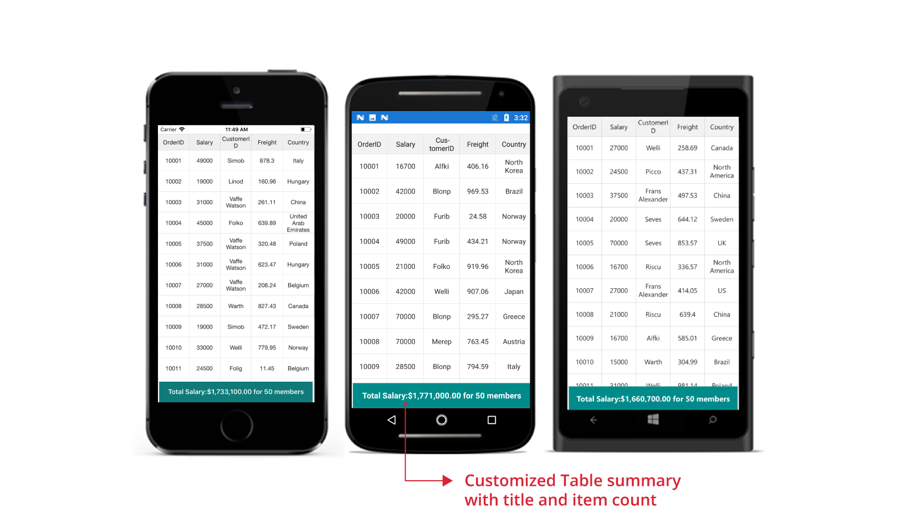

### Customizing caption summary

The data grid customizes the caption summary by overriding the [GridCaptionSummaryCellRenderer](https://help.syncfusion.com/cr/cref_files/xamarin/Syncfusion.SfDataGrid.XForms~Syncfusion.SfDataGrid.XForms.GridCaptionSummaryCellRenderer.html).

N> By default, `LoadUIView` property of `GridColumn` is `false` for android. Hence, `OnInitializeDisplayView()` will not be called.




<sfgrid:SfDataGrid x:Name="dataGrid"      
                    AllowResizingColumn="True"
                    AutoGenerateColumns="False" 
                    ColumnSizer="Star">

        <sfgrid:SfDataGrid.Columns>
            <sfgrid:GridTextColumn MappingName="OrderID" LoadUIView="True" />
            <sfgrid:GridTextColumn MappingName="Salary" />
            <sfgrid:GridTextColumn MappingName="CustomerID" />
            
            <sfgrid:GridTextColumn MappingName="Freight" />
            <sfgrid:GridTextColumn MappingName="Country" />
        </sfgrid:SfDataGrid.Columns>

        <sfgrid:SfDataGrid.GroupColumnDescriptions>
            <sfgrid:GroupColumnDescription ColumnName="CustomerID"  />
        </sfgrid:SfDataGrid.GroupColumnDescriptions>
</sfgrid:SfDataGrid>




// To remove default summary and Add custom summary.

public class Summary : ContentPage
{
    public Summary()
    {
        InitializeComponent();
        dataGrid.CellRenderers.Remove("CaptionSummary");
        dataGrid.CellRenderers.Add("CaptionSummary", new GridCaptionSummaryCellRendererExt());
        dataGrid.GroupCaptionTextFormat = "{ColumnName} is Grouped by {Key} with Count- {ItemsCount}";
    }
}

public class GridCaptionSummaryCellRendererExt : GridCaptionSummaryCellRenderer
{
    public GridCaptionSummaryCellRendererExt()
    {
    }

    public override void OnInitializeDisplayView(DataColumnBase dataColumn, SfLabel view)
    {
        base.OnInitializeDisplayView(dataColumn, view);
        view.HorizontalTextAlignment = TextAlignment.Center;
        view.BackgroundColor = Color.DarkCyan;
        view.FontAttributes = FontAttributes.Bold;
        view.FontSize = 16;
        view.TextColor = Color.White;
    }
}



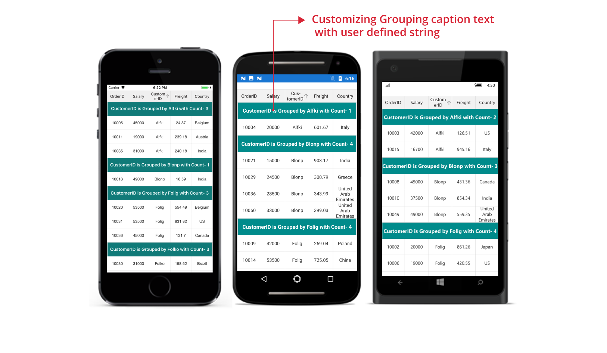

You can download the sample demo [here](http://www.syncfusion.com/downloads/support/directtrac/general/ze/SummaryDemo-142807621) .