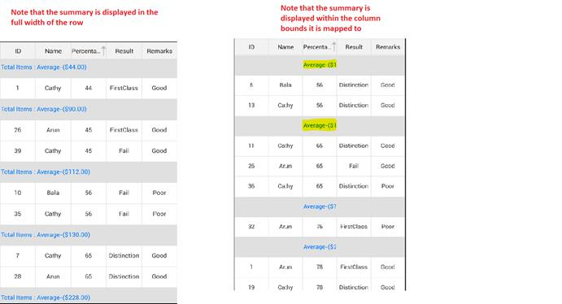

# Summary

SfDataGrid displays the summaries for each Group using the [CaptionSummaryRowControl](http://help.syncfusion.com/cr/cref_files/xamarin/sfdatagrid/Syncfusion.SfDataGrid.XForms~Syncfusion.SfDataGrid.XForms.CaptionSummaryRowControl.html#  “”) which carries the information about a particular Group like the Group name, number of items (records) in the Group, etc.

SfDataGrid control allows you to display summaries for each Group. You can derive additional information from your data like Sum, Average, Maximum, Minimum and Count using Caption Summary. These summary values are computed for Groups using [SfDatagrid.GridSummaryRow](http://help.syncfusion.com/cr/cref_files/xamarin/sfdatagrid/Syncfusion.SfDataGrid.XForms~Syncfusion.SfDataGrid.XForms.GridSummaryRow.html#  “”) and [SfDatagrid.GridSummaryColumn](http://help.syncfusion.com/cr/cref_files/xamarin/sfdatagrid/Syncfusion.SfDataGrid.XForms~Syncfusion.SfDataGrid.XForms.GridSummaryColumn.html#  “”) that implements [ISummaryRow](http://help.syncfusion.com/cr/cref_files/xamarin/data/Syncfusion.Data.Portable~Syncfusion.Data.ISummaryRow.html#  “”) and [ISummaryColumn](http://help.syncfusion.com/cr/cref_files/xamarin/data/Syncfusion.Data.Portable~Syncfusion.Data.ISummaryColumn.html#  “”) interface.

## GridSummaryRow

All the summaries are represented by `SfDataGrid.GridSummaryRow` that contains the following important properties.
<table>
<tr>
<td>
{{'**Property**'| markdownify }}
</td>
<td>
{{'**Type**'| markdownify }}
</td>
<td>
{{'**Description**'| markdownify }}
</td>
<td>
{{'**Default Value**'| markdownify }}
</td>
</tr>
<tr>
<td>
{{'[GridSummaryRow.ShowSummaryInRow](http://help.syncfusion.com/cr/cref_files/xamarin/sfdatagrid/Syncfusion.SfDataGrid.XForms~Syncfusion.SfDataGrid.XForms.GridSummaryRow~ShowSummaryInRow.html# “”)'| markdownify }}
</td>
<td>
bool
</td>
<td>
Indicates whether the summary value is displayed in specific column or row.
</td>
<td>
True
</td>
</tr>
<tr>
<td>
{{'[GridSummaryRow.Title](http://help.syncfusion.com/cr/cref_files/xamarin/sfdatagrid/Syncfusion.SfDataGrid.XForms~Syncfusion.SfDataGrid.XForms.GridSummaryRow~Title.html# “”)'| markdownify }}
</td>
<td>
string
</td>
<td>
Displays summary with title (with Statement) while ShowSummaryInRow is set to ‘true’.
</td>
<td>
null
</td>
</tr>
<tr>
<td>
{{'[GridSummaryRow.SummaryColumns](http://help.syncfusion.com/cr/cref_files/xamarin/sfdatagrid/Syncfusion.SfDataGrid.XForms~Syncfusion.SfDataGrid.XForms.GridSummaryRow~SummaryColumns.html# “”)'| markdownify }}
</td>
<td>
ObservableCollection&lt;ISummaryColumn&gt;
</td>
<td>
Gets or sets a value that stores the collection of GridSummaryColumns to calculate the summaries.
</td>
<td>
new ObservableCollection&lt;ISummaryColumn&gt; ()
</td>
</tr>
<tr>
<td>
{{'[GridSummaryRow.Name](http://help.syncfusion.com/cr/cref_files/xamarin/sfdatagrid/Syncfusion.SfDataGrid.XForms~Syncfusion.SfDataGrid.XForms.GridSummaryRow~Name.html# “”)'| markdownify }}
</td>
<td>
string
</td>
<td>
Gets or sets a value that indicates the name of GridSummaryRow.
</td>
<td>
null
</td>
</tr>
</table>

## GridSummaryColumn

`SfDataGrid.GridSummaryColumn` is the object of `GridSummaryRow.SummaryColumns` collection that contains the following important properties:

* [Name](http://help.syncfusion.com/cr/cref_files/xamarin/sfdatagrid/Syncfusion.SfDataGrid.XForms~Syncfusion.SfDataGrid.XForms.GridSummaryColumn~Name.html#  “”): Defines name of the `GridSummaryColumn` that helps to denote the `GridSummaryColumn` in `GridSummaryRow` with Title.
* [MappingName](http://help.syncfusion.com/cr/cref_files/xamarin/sfdatagrid/Syncfusion.SfDataGrid.XForms~Syncfusion.SfDataGrid.XForms.GridSummaryColumn~MappingName.html#  “”): The corresponding column name that is used for the summary calculation.
* [SummaryType](http://help.syncfusion.com/cr/cref_files/xamarin/sfdatagrid/Syncfusion.SfDataGrid.XForms~Syncfusion.SfDataGrid.XForms.GridSummaryColumn~SummaryType.html#  “”): It is the SummaryType (enum) property that helps to define the aggregate type for the summary calculation. DataGrid control provides the following predefined aggregates.

  * CountAggregate.
  * Int32Aggregate.
  * DoubleAggregate.

* [CustomAggregate](http://help.syncfusion.com/cr/cref_files/xamarin/sfdatagrid/Syncfusion.SfDataGrid.XForms~Syncfusion.SfDataGrid.XForms.GridSummaryColumn~CustomAggregate.html#  “”): Defines the CustomAggregate class object when the summary type is set as Custom that calculates the custom summaries.
* [Format](http://help.syncfusion.com/cr/cref_files/xamarin/sfdatagrid/Syncfusion.SfDataGrid.XForms~Syncfusion.SfDataGrid.XForms.GridSummaryColumn~Format.html#  “”): String property that formats the summary value and displays it. Format property contains two parts that is separated by a colon (:). First part denotes the aggregate function name and second part denotes display format of the summary value.

For example when you declare the format as “{Sum:c}”, the keyword “Sum” denotes the aggregate function name. Every aggregate type has some built-in aggregate function. The aggregate function names in built-in aggregate types are as follows:

      1. CountAggregate: Count
      2. Int32Aggregate: Count, Max, Min, Average and Sum
      3. DoubleAggregate: Count, Max, Min, Average and Sum

You can use these function names only when you define the Format property.
Second part denotes the format. The key word “c” denotes the string format that defines how the summary value is displayed.
To know more about the string format values, you can refer the following MSDN link: [http://msdn.microsoft.com/en-us/library/dwhawy9k.aspx](http://msdn.microsoft.com/en-us/library/dwhawy9k.aspx#  “”).

The following code example illustrates how to declare the summaries in SfDataGrid in code behind and XAML.



GridSummaryRow summaryRow = new GridSummaryRow();
summaryRow.Title = "Total Items:{CaptionSummary}";
summaryRow.ShowSummaryInRow = false;
summaryRow.SummaryColumns.Add{new GridSummaryColumn()
{
    Name="CaptionSummary",
    MappingName="Percentage",
    Format="Count-({Sum:c})",
    SummaryType=SummaryType.DoubleAggregate
});
sfgrid.CaptionSummaryRow= summaryRow;



<sfgrid:SfDataGrid.CaptionSummaryRow>
   <sfgrid:GridSummaryRow Title="Total Items :{CaptionSummary}" 
                          ShowSummaryInRow="False" 
                          Name="CaptionSummary">
      <sfgrid:GridSummaryRow.SummaryColumns>
         <sfgrid:GridSummaryColumn Name="CaptionSummary"
                                   Format="Average-({Sum:c})"
                                   MappingName="Percentage"
                                   SummaryType="DoubleAggregate" />
      </sfgrid:GridSummaryRow.SummaryColumns>
   </sfgrid:GridSummaryRow>
</sfgrid:SfDataGrid.CaptionSummaryRow>



The [GridSummaryRow.ShowSummaryInRow](http://help.syncfusion.com/cr/cref_files/xamarin/sfdatagrid/Syncfusion.SfDataGrid.XForms~Syncfusion.SfDataGrid.XForms.GridSummaryRow~ShowSummaryInRow.html#  “”) property can be set to true or false for displaying the Summary in the entire row or for displaying the summary within the column bounds it is mapped to. The following screenshot shows the final outcome for both values of `ShowSummaryInRow`.

## How To?

### How to set custom GroupCaptionTextFormat for CaptionSummaryRows? 

SfDataGrid also supports setting custom GroupCaptionTextFormat for [CaptionSummaryRows](http://help.syncfusion.com/cr/cref_files/xamarin/sfdatagrid/Syncfusion.SfDataGrid.XForms~Syncfusion.SfDataGrid.XForms.CaptionSummaryRowControl.html#  “”). By default the group caption text will be in the format “{ColumnName} : {Key} - {ItemsCount} Items”.

* ColumnName : Displays the grouped column name.
* Key : Displays the group key value.
* ItemsCount : Displays the number of items in group.

You can customize this group caption text format by setting the [SfDataGrid.GroupCaptionTextFormat](http://help.syncfusion.com/cr/cref_files/xamarin/sfdatagrid/Syncfusion.SfDataGrid.XForms~Syncfusion.SfDataGrid.XForms.SfDataGrid~GroupCaptionTextFormat.html#  “”) property. The following code example illustrates how to customize GroupCaptionText in SfDataGrid.



//Customized GroupCaptionText in German 
dataGrid.GroupCaptionTextFormat = "{ColumnName} : {Key} - {ItemsCount} Produkte";



