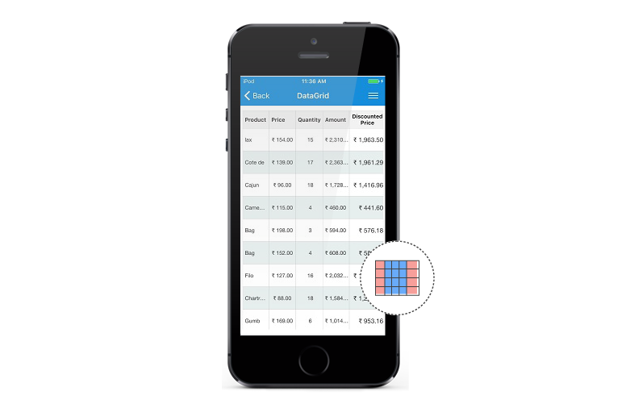

# Unbound Column

SfDataGrid allows you to add **additional columns** which are **not bound with data object** from underlying data source. You can add unbound column using `SfDataGrid.GridUnBoundColumn` class.



<syncfusion:SfDataGrid x:Name="dataGrid"                                                                       
                       AutoGenerateColumns="False" 
                       ItemsSource="{Binding Orders}">
    <syncfusion:SfDataGrid.Columns>
        <syncfusion:GridUnboundColumn 
		                       Expression="UnitPrice*Discount"
                               HeaderText="Discount Price"
                               MappingName="DiscountPrice"
                               Format="C"   >
        </syncfusion:GridUnboundColumn>
    </syncfusion:SfDataGrid.Columns>
</syncfusion:SfDataGrid>


this.dataGrid.Columns.Add(new GridUnboundColumn() { HeaderText="Discount Price", MappingName="DiscountPrice", Expression="UnitPrice*Discount" });



N> It is mandatory to specify the `GridColumn.MappingName` for `SfDataGrid.GridUnBoundColumn` with some name to identify the column. It is not necessary to define name of field in the data object.

## Populating data for unbound column

You can populate the data for unbound column by setting `Expression` or `Format` property.

### Using Expression

You can specify the arithmetic or logic expression using `Expression` property to compute the display value. By default `GridUnBoundColumn` evaluates the expression with casing. You can disable the casing while evaluate the expression by setting `CaseSensitive` property to `false`.
Below are the list of Arithmetic and logical operations supported.

<table>
<tr>
<th>
Arithmetic operations
</th>
<th>
Operator
</th>
</tr>
<tr>
<td>
Add
</td>
<td>
+
</td>
</tr>
<tr>
<td>
Subtract
</td>
<td>
-
</td>
</tr>
<tr>
<td>
Multiply
</td>
<td>
*
</td>
</tr>
<tr>
<td>
Divide
</td>
<td>
/
</td>
</tr>
<tr>
<td>
Power
</td>
<td>
^
</td>
</tr>
<tr>
<td>
Mod
</td>
<td>
%
</td>
</tr>
<tr>
<td>
Greater Than
</td>
<td>
>
</td>
</tr>
<tr>
<td>
Less Than
</td>
<td>
<
</td>
</tr>
<tr>
<td>
Equal
</td>
<td>
=
</td>
</tr>
<tr>
<td>
GreaterThanOrEqual
</td>
<td>
>=
</td>
</tr>
<tr>
<td>
LessThanOrEqual
</td>
<td>
<=
</td>
</tr>
</table>

*Logical Operations*

<table>
<tr>
<th>
Logical operations
</th>
<th>
Operators
</th>
</tr>
<tr>
<td>
AND
</td>
<td>
(char)135
</td>
</tr>
<tr>
<td>
OR
</td>
<td>
(char)136
</td>
</tr>
<tr>
<td>
NOT
</td>
<td>
(char)137
</td>
</tr>
</table>



<syncfusion:SfDataGrid x:Name="dataGrid"                                                                       
                       AutoGenerateColumns="False" 
                       ItemsSource="{Binding Orders}">
    <syncfusion:SfDataGrid.Columns>
        <syncfusion:GridUnboundColumn HeaderText="Unbound Column"
                                      MappingName="UnboundColumn" />
    </syncfusion:SfDataGrid.Columns>
</syncfusion:SfDataGrid>


(this.dataGrid.Columns[3] as GridUnboundColumn).Expression = "Discount * UnitPrice > 0" + (char)135 + "UnitPrice * Quantity > 100";



### Using Format

You can format the values of other columns and display the formatted value in unbound column using `Format` property.



<syncfusion:SfDataGrid x:Name="dataGrid"
                       AutoGenerateColumns="False" 
                       ItemsSource="{Binding Orders}">
    <syncfusion:SfDataGrid.Columns>
        <syncfusion:GridUnboundColumn Format="'{Discount}% for {OrderID}'"
                                      HeaderText="Discount Price"
                                      MappingName="DiscountPrice"/>
    </syncfusion:SfDataGrid.Columns>
</syncfusion:SfDataGrid>





this.dataGrid.Columns.Add(new GridUnboundColumn() { HeaderText = "Discount Price", MappingName = "DiscountPrice", Format = "'{Discount}% for {OrderID}'" });

