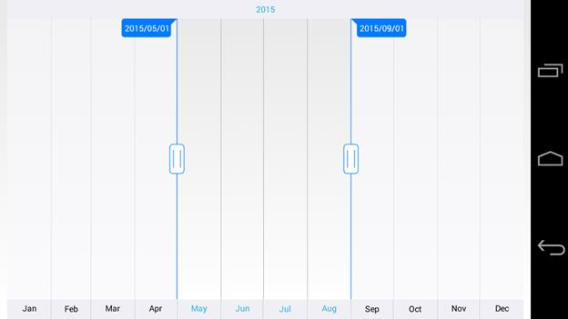
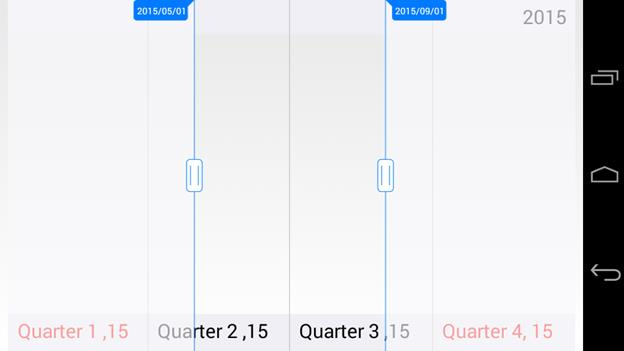

# Major and Minor Scales

SfDateTimeRangeNavigator displays major and minor scales at the top and bottom position of the control. You can also control its visibility using `MajorScaleStyle.IsVisible` and `MinorScaleStyle.IsVisible` properties.

## Intervals

By default, best possible interval component will be chosen for both major and minor scales based on the available size of the view. For example, if the available space is sufficient to show only year labels without overlapping, interval will be displayed in years. However, you can also set specific `DateTimeIntervalType` components using `Intervals` property as demonstrated in the below code snippet.



<rangenavigator:SfDateTimeRangeNavigator Minimum="1/1/2015" Maximum="1/1/2016" ViewRangeStart="5/1/2015" ViewRangeEnd="9/1/2016" Intervals="Year,Month" />



SfDateTimeRangeNavigator dateTime = new SfDateTimeRangeNavigator();
dateTime.Intervals = DateTimeIntervalType.Year | DateTimeIntervalType. Month;



## Appearance Customization

The `MajorScaleStyle` and `MinorScaleStyle` properties of `SfDateTimeRangeNavigator` are used to customize the appearance of ticks and labels.

* `Position` – used to position the labels and ticks inside or outside of the range navigator.
* `LabelAlignment` – used to set the alignment of the labels. 
* `LabelTextColor` – used to change the text color of the labels.
* `LabelFontSize` – used to change the font size of the labels.
* `LabelFontAttributes` – used to change the font attribute of the labels.
* `LabelFontFamily` – used to change the font family of the labels.
* `SelectedLabelFontSize` – used to change the font size of the selected labels.
* `SelectedLabelFontAttributes` – used to change the font attribute of the selected labels.
* `SelectedLabelFontFamily` – used to change the font family of the selected labels.
* `LabelMargin` – used to change the margin size of the labels.
* `SelectedLabelTextColor` – used to change the text color of the selected labels.
* `SelectedLabelMargin` – used to change the margin of the selected labels.



<rangenavigator:SfDateTimeRangeNavigator Minimum="1/1/2015" Maximum="1/1/2016" ViewRangeStart="5/1/2015" ViewRangeEnd="9/1/2016">
<rangenavigator:SfDateTimeRangeNavigator.MajorScaleStyle>
<rangenavigator:ScaleStyle Position="Inside" LabelAlignment="Right" SelectedLabelTextColor="Blue" SelectedLabelFontSize="20" SelectedLabelMargin="15" LabelTextColor="Black" LabelFontSize="20" LabelMargin="15" </rangenavigator:SfDateTimeRangeNavigator.MajorScaleStyle>
<rangenavigator:SfDateTimeRangeNavigator.MinorScaleStyle>
<rangenavigator:ScaleStyle Position="Inside" LabelAlignment="Left" SelectedLabelTextColor="Red" SelectedLabelFontSize="20" SelectedLabelMargin="15" LabelTextColor="Black" LabelFontSize="20" LabelMargin="15" />
</rangenavigator:SfDateTimeRangeNavigator.MinorScaleStyle>
</rangenavigator:SfDateTimeRangeNavigator>



SfDateTimeRangeNavigator dateTime = new SfDateTimeRangeNavigator();
dateTime.MajorScaleStyle.Position = ScalePosition.Inside;
dateTime.MajorScaleStyle.LabelTextColor = Color.Black;
dateTime.MajorScaleStyle.LabelMargin = 15;
dateTime.MajorScaleStyle.LabelFontSize = 20;
dateTime.MajorScaleStyle.LabelAlignment = LabelAlignment.Right;
dateTime.MajorScaleStyle.SelectedLabelTextColor = Color.Red;
dateTime.MajorScaleStyle.SelectedLabelMargin = 15;
dateTime.MajorScaleStyle.SelectedLabelFontSize = 20;
dateTime.MinorScaleStyle.Position = ScalePosition.Inside;
dateTime.MinorScaleStyle.LabelTextColor = Color.Black;
dateTime.MinorScaleStyle.LabelMargin = 15;
dateTime.MinorScaleStyle.LabelFontSize = 20;
dateTime.MinorScaleStyle.LabelAlignment = LabelAlignment.Left;
dateTime.MinorScaleStyle.SelectedLabelTextColor = Color.Blue;
dateTime.MinorScaleStyle.SelectedLabelMargin = 15;
dateTime.MinorScaleStyle.SelectedLabelFontSize = 20;



