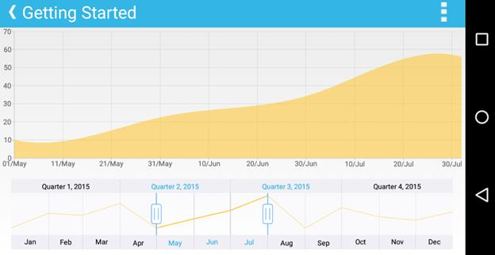

# Getting started

This section walks you through the steps required to add `SfDateTimeRangeNavigator` and populate it with data, and also explains how to respond to range selection performed in the control. 

## Referencing Essential Studio components in your solution

If you had acquired Essential Studio components through the Xamarin component store interface from within your IDE, then after adding the components to your Xamarin.iOS, Xamarin.Android and Windows Phone projects through the Component manager, you will still need to manually reference the PCL (Portable Class Library) assemblies in the Xamarin.Forms PCL project in your solution. You can do this by manually adding the relevant PCL assembly references to your PCL project contained in the following path inside of your solution folder.

Components/syncfusionessentialstudio-version/lib/pcl/

Alternatively if you had downloaded Essential Studio from Syncfusion.com or through the Xamarin store web interface then all assembly references need to be added manually.

After installing Essential Studio for Xamarin, all the required assemblies can be found in the installation folders, typically

{Syncfusion Installed location}\Essential Studio\{release version}\lib

Eg: C:\Program Files (x86)\Syncfusion\Essential Studio\12.2.0.40\lib

or after downloading through the Xamarin store web interface, all the required assemblies can be found in the below folder

{download location}\syncfusionessentialstudio-version\lib

You can then add the assembly references to the respective projects as shown below

### PCL project

pcl\Syncfusion.SfChart.XForms.dll

### Android project

android\Syncfusion.SfChart.Andriod.dll

android\Syncfusion.SfChart.XForms.Andriod.dll

android\Syncfusion.SfChart.XForms.dll

### iOS(Classic) project

ios\Syncfusion.SfChart.iOS.dll

ios\Syncfusion.SfChart.XForms.iOS.dll

ios\Syncfusion.SfChart.XForms.dll

### iOS(Unified) project

iOS-unified\Syncfusion.SfChart.iOS.dll

iOS-unified\Syncfusion.SfChart.XForms.iOS.dll

iOS-unified\Syncfusion.SfChart.XForms.dll

### Windows Phone project

wp8\Syncfusion.SfChart.WP8.dll

wp8\Syncfusion.SfChart.XForms.WinPhone.dll

wp8\Syncfusion.SfChart.XForms.dll

Currently an additional step is required for Windows Phone and iOS projects. We need to call the `SfRangeNavigatorRenderer.Init()` as shown below.

Call the `SfRangeNavigatorRenderer.Init()` in MainPage constructor of the Windows Phone project as shown


[C#]

public MainPage() 
{ 
	new SfRangeNavigatorRenderer.Init(); 
	... 
}



Call the `SfRangeNavigatorRenderer.Init()` in FinishedLaunching overridden method of AppDelegate class in iOS Project as shown below


[C#]

public override bool FinishedLaunching(UIApplication app, NSDictionary options) 
{ 
	... 
	new SfRangeNavigatorRenderer.Init();  
	... 
}



## Adding and configuring SfDateTimeRangeNavigator 

First, let us initialize the control with major and minor date time scales by specifying the minimum and maximum date to be visualized in the control using `Minimum` and `Maximum` properties.

Following code example illustrates this,


[C#]

SfDateTimeRangeNavigator rangeNavigator = new SfDateTimeRangeNavigator();

rangeNavigator.Minimum = new DateTime(2015, 01, 01);

rangeNavigator.Maximum = new DateTime(2016, 01, 01);



N> If you don’t specify `Minimum` and `Maximum` properties, minimum and maximum dates will be chosen automatically based on the provided data using `ItemsSource` property, which is explained in the next step in this section.

Next, create a data model representing the list of sample data.


[C#]

public class DataModel
{
	public ObservableCollection<Model> DateTimeData;
	
	DataModel()
	{ 		
		DateTimeData = new ObservableCollection<Model>()
		{ 
			
			new Model (new DateTime(2015, 01, 01), 14), 
			new Model (new DateTime(2015, 02, 01), 54), 
			new Model (new DateTime(2015, 03, 01), 23), 
			new Model (new DateTime(2015, 04, 01), 53), 
			new Model (new DateTime(2015, 05, 01), 25), 
			new Model (new DateTime(2015, 06, 01), 32), 
			new Model (new DateTime(2015, 07, 01), 78), 
			new Model (new DateTime(2015, 08, 01), 100), 
			new Model (new DateTime(2015, 09, 01), 55), 
			new Model (new DateTime(2015, 10, 01), 38), 
			new Model (new DateTime(2015, 11, 01), 27), 
			new Model (new DateTime(2015, 12, 01), 56), 
			new Model (new DateTime(2016, 01, 01), 33) 
			
		}; 
	} 
} 

public class Model 
{ 
	public DateTime Date { get; set; } 
	
	public double Value { get; set; } 
	
	public Model(DateTime dateTime, double value) 
	{ 
		Date = dateTime;
		Value = value; 
	} 
} 



Then, let us populate the chart, which is displayed inside the `SfDateTimeRangeNavigator`, by setting the above data using `ItemsSource` property. And then specify the property names which contain the x and y values in the model using `XBindingPath` and `YBindingPath` properties.

N> By default, data is visualized using line series. You can change the chart type or add more series by accessing the SfChart instance using `SfDateTimeRangeNavigator.Content` property. 


[C#]

SfDateTimeRangeNavigator rangeNavigator = new SfDateTimeRangeNavigator() 
{ 
	rangeNavigator.ItemsSource = dataModel.DateTimeData, 
	rangeNavigator.XBindingPath = "Date", 
	rangeNavigator.YBindingPath = "Value" 
};  



## Handle range selection

In real time, other controls like chart, grid etc., are updated in response to the range selection performed in SfDateTimeRangeNavigator. You can handle the selection using RangeChanged event and update other controls based on the selected date time or perform some other tasks using the selected data.

N> You can get the selected date time using `ViewRangeStart` and `ViewRangeEnd` properties or you can get selected data using `SelectedData` property.

Following code example illustrates how to handle range selection and update chart's date time axis range,


[C#]

rangeNavigator.RangeChanged += rangeNavigator_RangeChanged;  

private void rangeNavigator_RangeChanged(object sender, RangeChangedEventArgs e) 
{ 
	//Updating chart's date time range 
	dateTimeAxis.Minimum = e.ViewRangeStartDate; 
	dateTimeAxis.Maximum = e.ViewRangeEndDate; 
}  



