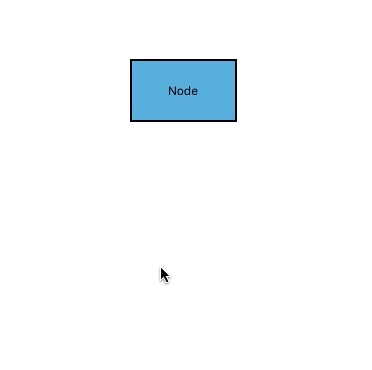

# DrawingMode
Drawing mode are used to draw continuously for selected mode on the diagram area, dynamically.

## Text node
Text node is a node, which has default annotation. This mode will add continuous text node. The following code example illustrates how to enable TextNode mode.


<diagram:SfDiagram x:Name="diagram" DrawingMode="TextNode">
 </diagram:SfDiagram> 





diagram.DrawingMode = DrawingMode.TextNode;



## Connector
Connector mode will add continuous orthogonal connector in diagram area. In this mode we can connect connectors in between Points, Nodes or Ports. The following code example illustrates how to enable Connector mode.


<diagram:SfDiagram x:Name="diagram" DrawingMode="Connector">
 </diagram:SfDiagram>





diagram.DrawingMode = DrawingMode.Connector;



