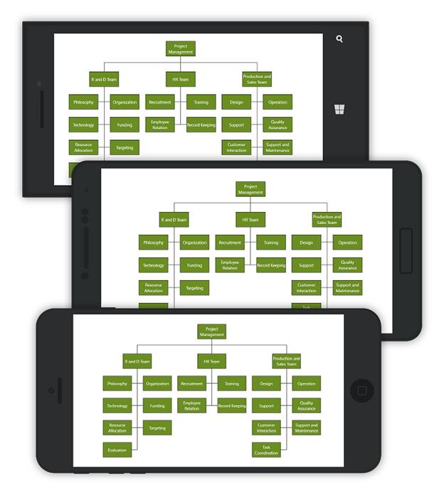

# Layouts
 SfDiagram provides support to auto-arrange the nodes in the Diagram area that is referred as **Layout.**
We have explained the Automatic Layout with Employee class and DataSourceSettings.The followings are initial steps for all the Layout.

## Create class for data
 Now, you have to create a class, Employee with properties to store the employee’s information like Team, Role, ID, reporting person ID, etc. You also have to create a collection that stores a collection of the employees.


//Employee Business Object
    public class Employee
    {
        public string Team { get; set; }
        public string Role { get; set; }
        public int EmployeeId { get; set; }
    }

    //Employee Collection
    public class Employees : ObservableCollection<Employee>
    {
}


##
## Initialize Data Source Settings 


<!--Initializes the DataSourceSettings -->
<control:SfDiagram.DataSourceSettings>
        <control:DataSourceSettings x:Key="DataSourceSettings" ParentId="Team" Id="EmployeeId" 
        DataSource="{StaticResource Employees}" />
      </control:SfDiagram.DataSourceSettings>


# 

// Initializes the DataSourceSettings 
 DataSourceSettings setting = new DataSourceSettings();
 setting.DataSource = employee;
 setting.Id = "ID";
 setting.ParentId = "ReportingId";
 diagram.DataSourceSettings = setting;



## Organization Layout
An organizational chart is a Diagram that displays the structure of an organization and relationships. To create an organizational chart, Type should be set as LayoutType.Organization. The following code example illustrates how to create an organizational chart. 


<ContentPage.Resources>
   <ResourceDictionary>
      <local:Employees x:Key="Employees">
    <!—-Employee Collection -->
          <local:Employee EmployeeId="0" Role="Project Management" />
          <local:Employee EmployeeId= "1"  Role= "R and D Team" Team= "0"/>
          <local:Employee EmployeeId= "3"  Role= "Philosophy" Team= "1"/>
          <local:Employee EmployeeId= "4"  Role= "Organization" Team= "1"/>
          <local:Employee EmployeeId= "5"  Role= "Technology" Team= "1"/>
          <local:Employee EmployeeId= "7"  Role= "Funding" Team= "1"/>
          <local:Employee EmployeeId= "8"  Role= "Resource Allocation" Team= "1"/>
          <local:Employee EmployeeId= "9"  Role= "Targeting" Team= "1"/>
          <local:Employee EmployeeId= "11"  Role= "Evaluation" Team= "1"/>
          <local:Employee EmployeeId= "156"  Role= "HR Team" Team= "0"/>
          <local:Employee EmployeeId= "13"  Role= "Recruitment" Team= "156"/>
          <local:Employee EmployeeId= "113"  Role= "Training" Team= "156"/>
          <local:Employee EmployeeId= "112"  Role= "Employee Relation" Team= "156"/>
          <local:Employee EmployeeId= "14"  Role= "Record Keeping" Team= "156"/>
          <local:Employee EmployeeId= "17"  Role= "Production and Sales Team" Team= "0"/>
          <local:Employee EmployeeId= "119"  Role= "Design" Team= "17"/>
          <local:Employee EmployeeId= "19"  Role= "Operation" Team= "17"/>
          <local:Employee EmployeeId= "20"  Role= "Support" Team= "17"/>
          <local:Employee EmployeeId= "21"  Role= "Quality Assurance" Team= "17"/>
          <local:Employee EmployeeId= "23"  Role= "Customer Interaction" Team= "17"/>
          <local:Employee EmployeeId= "24"  Role= "Support and Maintenance" Team= "17"/>
          <local:Employee EmployeeId= "25"  Role= "Task Coordination" Team= "17"/>
          </local:Employees>
    <control:DirectedTreeLayout x:Key="TreeLayout" TreeOrientation="TopToBottom" Type="Organization"/>
    </ResourceDictionary>
</ContentPage.Resources>

  <ContentPage.Content>
    <Grid x:Name="grid">
  <control:SfDiagram x:Name="diagram" >
    <!--Initializes the DataSourceSettings--> 
    <control:SfDiagram.DataSourceSettings>
        <control:DataSourceSettings x:Key="DataSourceSettings" ParentId="Team" Id="EmployeeId" 
        DataSource="{StaticResource Employees}" />
      </control:SfDiagram.DataSourceSettings>
   <!--Initializes the Layout-->
    <control:SfDiagram.LayoutManager>
     <control:LayoutManager x:Key="LayoutManager" 
               Layout="{StaticResource TreeLayout}" />
      </control:SfDiagram.LayoutManager>    </control:SfDiagram>
      </Grid>
</ContentPage.Content>


//Employee Collection
ObservableCollection<Employee> employee = new ObservableCollection<Employee>();
            employee.Add(new Employee { EmployeeId = 0, Role = "Project Management" });
            employee.Add(new Employee { EmployeeId = 1,  Role = "R and D Team" ,Team = "0" });
            employee.Add(new Employee { EmployeeId = 3 , Role = "Philosophy", Team = "1" });
            employee.Add(new Employee { EmployeeId =4 , Role = "Organization", Team = "1" });
            employee.Add(new Employee { EmployeeId = 5 , Role = "Technology", Team = "1" });
            employee.Add(new Employee { EmployeeId = 7,  Role = "Funding" ,Team = "1" });
            employee.Add(new Employee { EmployeeId = 8 , Role = "Resource Allocation" ,Team = "1" });
            employee.Add(new Employee { EmployeeId = 9,  Role = "Targeting" ,Team = "1" });
            employee.Add(new Employee { EmployeeId = 11,  Role = "Evaluation" ,Team = "1" });
            employee.Add(new Employee { EmployeeId = 156 , Role = "HR Team", Team = "0" });
            employee.Add(new Employee { EmployeeId = 13 , Role = "Recruitment", Team = "156" });
            employee.Add(new Employee { EmployeeId = 113 , Role = "Training" ,Team = "156" });
            employee.Add(new Employee { EmployeeId = 112 , Role = "Employee Relation" ,Team = "156" });
            employee.Add(new Employee { EmployeeId = 14 , Role = "Record Keeping", Team = "156" });
            employee.Add(new Employee { EmployeeId = 17 , Role = "Production and Sales Team" ,Team = "0" });
            employee.Add(new Employee { EmployeeId = 119,  Role = "Design", Team = "17" });
            employee.Add(new Employee { EmployeeId = 19 , Role = "Operation", Team = "17" });
            employee.Add(new Employee { EmployeeId = 20 , Role = "Support" ,Team = "17" });
            employee.Add(new Employee { EmployeeId = 21 , Role = "Quality Assurance" ,Team = "17" });
            employee.Add(new Employee { EmployeeId = 23 , Role = "Customer Interaction" ,Team = "17" });
            employee.Add(new Employee { EmployeeId = 24 , Role = "Support and Maintenance" ,Team = "17" });
            employee.Add(new Employee { EmployeeId = 25 , Role = "Task Coordination", Team = "17" });

//Set parentId and id for DataSourceSettings
DataSourceSettings setting = new DataSourceSettings();
setting.DataSource = employee;
setting.Id = "EmployeeId";
setting.ParentId = "Team";
diagram.DataSourceSettings = setting;
diagram.LayoutManager = new LayoutManager() { Layout = new DirectedTreeLayout() { TreeOrientation = TreeOrientation.TopToBottom, Type = LayoutType.Organization } };


Organizational chart layout starts parsing from root and iterate through all its child elements. “BeginNodeLayout” event provides necessary information of a Node’s children and the way to arrange (Orientation, Type etc.) them.

## BeginNodeLayout
User can change ChartType and Orientation by using BeginNodeLayout event of the SfDiagram. This event will fire for each Node added in Layout when the layout is getting updated. Default ChartType us Alternate and default orientation is Vertical. The following code example illustrates how to register an event and how to change ChartType and orientation.


  // Registering an event 
 diagram.BeginNodeLayout += Diagram_BeginNodeLayout; 

private void Diagram_BeginNodeLayout(object sender, BeginNodeLayoutEventArgs args)
        {
            if (!args.HasSubTree)
            {
                args.Type = ChartType.Left;
                args.Orientation = Orientation.Vertical;
            }
        }



## BeginNodeRender
User can change node content using BeginNodeRender event of the SfDiagram. This event will fire for each Node added in Layout when the layout is getting updated.


// Registering an event
diagram.BeginNodeRender += Diagram_BeginNodeRender;

private void Diagram_BeginNodeRender(object sender, BeginNodeRenderEventArgs args)
        {
            Node node = args.Item as Node;
            node.Width = 150;
            node.Height = 60;
            node.ShapeType = ShapeType.Rectangle;
            Syncfusion.SfDiagram.XForms.Style style = new Syncfusion.SfDiagram.XForms.Style(){Brush = new SolidBrush(Color.OliveDrab) }; 
            node.Style = style;
            AnnotationCollection annotations = new AnnotationCollection();
            Annotation annotation = new Annotation()
            {
                Content = (node.Content as Employee).Role,
                HorizontalAlignment =             HorizontalAlignment.Center,
                VerticalAlignment = VerticalAlignment.Center,
                TextBrush = new SolidBrush(Color.White)
            };
            annotations.Add(annotation);
            node.Annotations = annotations;
        }



## Expand and Collapse Node
User can able to expand and collapse the parent node using NodeClicked event of the SfDiagram. This event will fire when click node in Layout.


// Registering an event
diagram.BeginNodeLayout += Diagram_BeginNodeLayout;

void Diagram_NodeClicked(object sender, NodeClickedEventArgs args)
 {
     if ((args.Item.Content as Employee).HasChild && args.Item.IsExpanded)
         {
                args.Item.IsExpanded = false;
         }
     else if ((args.Item.Content as Employee).HasChild && !args.Item.IsExpanded)
         {
                args.Item.IsExpanded = true;
         }
  }



