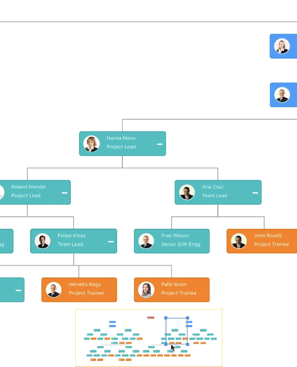

# OverviewPanel
The overview panel is used to display the preview (overall mini view) of the entire content of a diagram. This helps you to see the overall picture of a large diagram and easily navigate to a position of the page using view port rectangle.
When working on a large diagram, to navigate, you have to zoom out the entire diagram to find where you are. This solution is not suitable when frequent navigation is required.
The overview control solves this problem by displaying a preview (overall view) of the entire diagram, A rectangle indicates the viewport of the diagram. Navigation is made easy by dragging this rectangle. 

## Create overview panel 
The following code shows how to create overview panel in a diagram.


       <sfdiagram:OverviewPanel x:Name="overview" >
       </sfdiagram:OverviewPanel>





//Define over view panel 

OverviewPanel overview = new OverviewPanel();
overview.Width = 500;
overview.Height = 500;
overview.IsVisible = true;

diagram.OverviewPanel = overview;



### Prevent refresh
Prevents diagram being updated in overview panel if any interaction takes place in the diagram layer. Prevents the diagram update for the entire actions till the property is set to true. This property is helpful when there is no need for frequent refreshing in the overview panel.



  //Define prevent refresh property 

  overview.PreventRefresh = true;




### Force refresh 
This method force refreshes the diagram in the overview panel. When the overview panel is prevented from updating diagram interaction by enabling PreventRefresh, force refresh is used to update the diagram in the overview panel. 



  //Define force refresh method 
   overview.ForceRefresh();




## Customizing view port rect 
The “StartX” and “StartY” properties are used to define the start position of the view port rect over the overview panel. The following code shows how to customize the view port rect.



 //Customize the view port rect 
  ViewportRect ViewportRect = new ViewportRect(overview);
  ViewportRect.StrokeColor = Color.Black;
  ViewportRect.StartX = 300;
  ViewportRect.StartY = 100;




