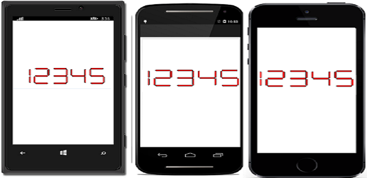
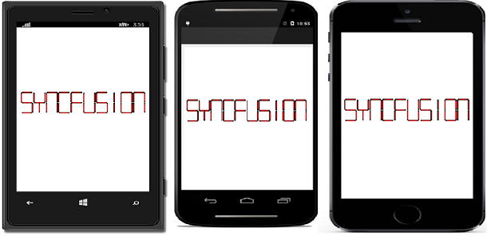
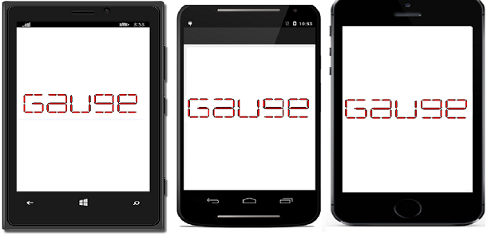
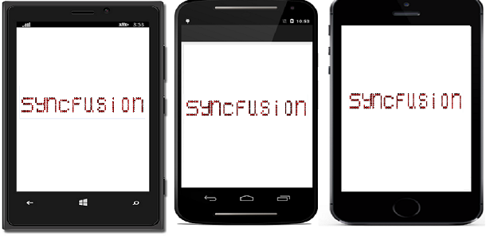

# CharacterType

The Digital Characters can be drawn in 4 different segments as follows.
 
1. Seven

2. Fourteen

3. Sixteen

4. EightCrossEightDotMatrix

N> By default, SegmentSeven is the default CharacterType in the Digital Gauge.

## Seven Segment



sfDigitalGauge.CharacterType = CharacterType.SegmentSeven;



## Fourteen Segment



sfDigitalGauge.CharacterType = CharacterType.SegmentFourteen;



 
## Sixteen Segment
 


sfDigitalGauge.CharacterType = CharacterType.SegmentSixteen;



## EightCrossEightDotMatrix Segment



sfDigitalGauge.CharacterType = CharacterType.EightCrossEightDotMatrix;



