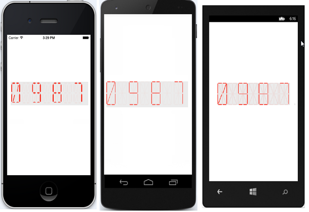

---
layout: post
title: Character type in DigitalGauge
description: Learn how to define character type in DigitalGauge
platform: Xamarin
control: DigitalGauge
documentation: ug
---

# CharacterType

The Digital Characters can be drawn in 4 different segments as follows.
 
1. Seven

2. Fourteen

3. Sixteen

4. EightCrossEightDotMatrix

N> By default, SegmentSeven is the default CharacterType in the Digital Gauge.

## Seven Segment





	sfDigitalGauge.CharacterType = CharacterType.SegmentSeven;





	<gauge:SfDigitalGauge x:Name="sfdigitalgauge"  CharacterType="SegmentSeven" />





## Fourteen Segment





	sfDigitalGauge.CharacterType = CharacterType.SegmentFourteen;





	<gauge:SfDigitalGauge x:Name="sfdigitalgauge" CharacterType="SegmentFourteen" />





 
## Sixteen Segment
 
 
 


	sfDigitalGauge.CharacterType = CharacterType.SegmentSixteen;





	<gauge:SfDigitalGauge x:Name="sfdigitalgauge"  CharacterType="SegmentSixteen" />





## EightCrossEightDotMatrix Segment





	sfDigitalGauge.CharacterType = CharacterType.EightCrossEightDotMatrix;





	<gauge:SfDigitalGauge x:Name="sfdigitalgauge"  CharacterType="EightCrossEightDotMatrix"  />





