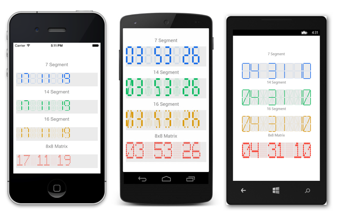

# Getting Started

This section explains you the steps to configure a SfDigitalGauge control in a real-time scenario and also provides a walk-through on some of the customization features available in it.

## Referencing Essential Studio Components in Your Solution	

If you had acquired Essential Studio components through the Xamarin component store interface from within your IDE, then after adding the components to your Xamarin.iOS, Xamarin.Android and Windows Phone projects through the Component manager, you will still need to manually reference the PCL (Portable Class Library) assemblies in the Xamarin.Forms PCL project in your solution. You can do this by manually adding the relevant PCL assembly references to your PCL project contained in the following path inside of your solution folder.

Components/syncfusionessentialstudio-version/lib/pcl/

Alternatively if you had downloaded Essential Studio from Syncfusion.com or through the Xamarin store web interface then all assembly references need to be added manually.

After installing Essential Studio for Xamarin, all the required assemblies can be found in the installation folders, typically

{Syncfusion Installed location}\Essential Studio\syncfusionessentialstudio-version\lib

Eg: C:\Program Files (x86)\Syncfusion\Essential Studio\{{ site.releaseversion }}\lib

Or after downloading through the Xamarin store web interface, all the required assemblies can be found in the below folder

{Download location}\syncfusionessentialstudio-version\lib

You can then add the assembly references to the respective projects as shown below

### PCL 
pcl\Syncfusion.SfGauge.XForms.dll

### Android 
android\Syncfusion.SfGauge.Android.dll
android\Syncfusion.SfGauge.XForms.Android.dll
android\Syncfusion.SfGauge.XForms.dll

### iOS 
iOS-unified\Syncfusion.SfGauge.iOS.dll
iOS-unified\Syncfusion.SfGauge.XForms.iOS.dll
iOS-unified\Syncfusion.SfGauge.XForms.dll

### Windows Phone
wp8\Syncfusion.SfInput.WP8.dll
wp8\Syncfusion.SfShared.WP8.dll
wp8\Syncfusion.SfGauge.XForms.dll
wp8\Syncfusion.SfGauge.XForms.WinPhone.dll

### Windows Phone 8.1
wp81\Syncfusion.SfInput.WP.dll
wp81\Syncfusion.SfShared.WP.dll
wp81\Syncfusion.SfGauge.XForms.dll
wp81\Syncfusion.SfGauge.XForms.WinPhone.dll

### WinRT 
winrt\Syncfusion.SfInput.WinRT.dll
winrt\Syncfusion.SfShared.WinRT.dll
winrt\Syncfusion.SfGauge.XForms.dll
winrt\Syncfusion.SfGauge.XForms.WinRT.dll

### UWP 
uwp\Syncfusion.SfInput.UWP.dll
uwp\Syncfusion.SfShared.UWP.dll
uwp\Syncfusion.SfGauge.XForms.dll
uwp\Syncfusion.SfGauge.XForms.UWP.dll

Currently an additional step is required for Windows Phone, Windows Phone 8.1 and iOS projects. We need to create an instance of the DigitalGauge custom renderer as shown below. 

Create an instance of SfDigitalGaugeRenderer in MainPage constructor of the Windows Phone and Windows Phone 8.1 project as shown 



public MainPage()

{
    new SfDigitalGaugeRenderer();
}



Create an instance of SfDigitalGaugeRenderer in FinishedLaunching overridden method of AppDelegate class in iOS Project as shown below



public override bool FinishedLaunching(UIApplication app, NSDictionary options)

{
    new SfDigitalGaugeRenderer ();
}	



## Add and Configure the SfDigitalGauge

The SfDigitalGauge control is configured entirely in C# code or by using XAML markup. The following steps explain on how to create a SfDigitalGauge and configure its elements.

* Adding namespace for the added assemblies. 





	<xmlns:gauge="clr-namespace:Syncfusion.SfGauge.XForms;assembly=Syncfusion.SfGauge.XForms"/>





	using Syncfusion.SfGauge.XForms; 





* Now add the SfDigitalGauge control with a required optimal name by using the included namespace.





	<gauge:SfDigitalGauge x:Name="digitalgauge" />
	




	SfDigitalGauge digitalgauge = new SfDigitalGauge(); 





* Configure the properties of SfDigitalGauge.





	<gauge:SfDigitalGauge x:Name="digitalgauge" SegmentStrokeWidth="3" CharacterHeight="50" CharacterWidth="25" CharacterType="SegmentSeven" DisabledSegmentAlpha="30" />





	SfDigitalGauge digitalgauge = new SfDigitalGauge ();
	digitalgauge.Value =  DateTime.Now.ToString ("HH mm ss");
	digitalgauge.CharacterHeight = 50;
	digitalgauge.CharacterWidth= 25;
	digitalgauge.SegmentStrokeWidth = 3;
	digitalgauge.CharacterType = CharacterType.SegmentSeven;
	digitalgauge.DisabledSegmentAlpha = 30;
	digitalgauge.BackgroundColor = Color.FromRgb (235, 235, 235);
	digitalgauge.CharacterStrokeColor = Color.FromRgb (20,108,237);
	digitalgauge.DisabledSegmentColor = Color.FromRgb (20,108,237);





## Setting Value

* The `Value` property sets the display value in the SfDigitalGauge.





	<gauge:SfDigitalGauge x:Name="digitalgauge" Value="{Binding}" />





    digitalgauge.Value =  DateTime.Now.ToString ("HH mm ss");





