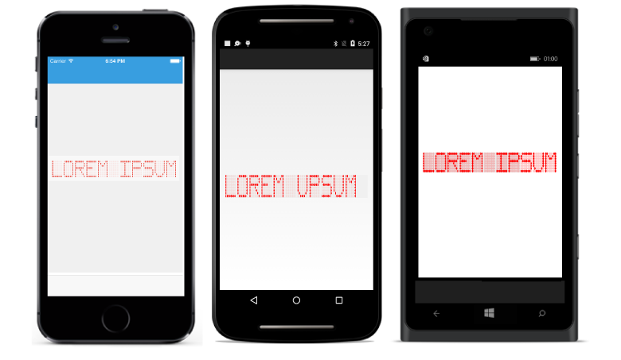

# Overview

SfDigitalGauge control is used to display alphanumeric characters in digital (LED Display) mode. SfDigitalGauge is used to display a range of values that uses characters in combination with numbers. The SfDigitalGauge control for Android lets you visualize alpha and numeric values over a Digital Gauge frame.

## Key Features

* Supports four predefined CharacterTypes

* Full Character Customization support has been provided

* Segments can be customized.

* Special characters support has been provided

