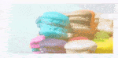

# Customization of SfEffectsView

The [`SfEffectsView`](https://help.syncfusion.com/cr/cref_files/xamarin/Syncfusion.Core.XForms~Syncfusion.XForms.EffectsView.SfEffectsView.html) control provides support to customize the corner radius, animation duration, color, and more. This section explains how to customize the effects view control.

## RippleAnimationDuration

The [`RippleAnimationDuration`](https://help.syncfusion.com/cr/cref_files/xamarin/Syncfusion.Core.XForms~Syncfusion.XForms.EffectsView.SfEffectsView~RippleAnimationDuration.html) property of [`SfEffectsView`](https://help.syncfusion.com/cr/cref_files/xamarin/Syncfusion.Core.XForms~Syncfusion.XForms.EffectsView.SfEffectsView.html) is used to customize the duration of ripple animation.

 

 

<sync:SfEffectsView RippleAnimationDuration="800">
    ...
</sync:SfEffectsView>



 

var effectsView = new SfEffectsView()
{
    RippleAnimationDuration = 800
};





## ScaleAnimationDuration

The [`ScaleAnimationDuration`](https://help.syncfusion.com/cr/cref_files/xamarin/Syncfusion.Core.XForms~Syncfusion.XForms.EffectsView.SfEffectsView~ScaleAnimationDuration.html) property of [`SfEffectsView`](https://help.syncfusion.com/cr/cref_files/xamarin/Syncfusion.Core.XForms~Syncfusion.XForms.EffectsView.SfEffectsView.html) is used to customize the duration of scale animation.

 

 

<sync:SfEffectsView
    LongPressEffects="Scale"
    ScaleAnimationDuration="800">
    ...
</sync:SfEffectsView>



 

var effectsView = new SfEffectsView()
{
    LongPressEffects = SfEffects.Scale,
    ScaleAnimationDuration = 800
};





## RotationAnimationDuration

The [`RotationAnimationDuration`](https://help.syncfusion.com/cr/cref_files/xamarin/Syncfusion.Core.XForms~Syncfusion.XForms.EffectsView.SfEffectsView~RotationAnimationDuration.html) property of [`SfEffectsView`](https://help.syncfusion.com/cr/cref_files/xamarin/Syncfusion.Core.XForms~Syncfusion.XForms.EffectsView.SfEffectsView.html) is used to customize the duration of rotation animation.

 

 

<sync:SfEffectsView
    RotationAnimationDuration="800"
    TouchDownEffects="Rotation">
    ...
</sync:SfEffectsView>



 

var effectsView = new SfEffectsView()
{
    RotationAnimationDuration = 800,
    LongPressEffects = SfEffects.Rotation
};





## InitialRippleFactor

The [`InitialRippleFactor`](https://help.syncfusion.com/cr/cref_files/xamarin/Syncfusion.Core.XForms~Syncfusion.XForms.EffectsView.SfEffectsView~InitialRippleFactor.html) property of [`SfEffectsView`](https://help.syncfusion.com/cr/cref_files/xamarin/Syncfusion.Core.XForms~Syncfusion.XForms.EffectsView.SfEffectsView.html) is used to customize the initial radius of ripple.

 

 

<sync:SfEffectsView InitialRippleFactor="0.1">
    ...
</sync:SfEffectsView>



 

var effectsView = new SfEffectsView
{
    InitialRippleFactor = 0.1
};





## ScaleFactor

The [`ScaleFactor`](https://help.syncfusion.com/cr/cref_files/xamarin/Syncfusion.Core.XForms~Syncfusion.XForms.EffectsView.SfEffectsView~ScaleFactor.html) property of [`SfEffectsView`](https://help.syncfusion.com/cr/cref_files/xamarin/Syncfusion.Core.XForms~Syncfusion.XForms.EffectsView.SfEffectsView.html) is used to customize the scale of the view.

 

 

 <sync:SfEffectsView
     ScaleFactor="0.85"
     LongPressEffects="Scale"
     TouchDownEffects="None"
     TouchUpEffects="None">
     ...
 </sync:SfEffectsView>



 

var effectsView = new SfEffectsView
{
    ScaleFactor = 0.85,
    LongPressEffects = SfEffects.Scale,
    TouchDownEffects = SfEffects.None,
    TouchUpEffects = SfEffects.None
};





## HighlightColor

The [`HighlightColor`](https://help.syncfusion.com/cr/cref_files/xamarin/Syncfusion.Core.XForms~Syncfusion.XForms.EffectsView.SfEffectsView~HighlightColor.html) property of [`SfEffectsView`](https://help.syncfusion.com/cr/cref_files/xamarin/Syncfusion.Core.XForms~Syncfusion.XForms.EffectsView.SfEffectsView.html) is used to customize the color of highlight effect.

 

 

<sync:SfEffectsView
     HighlightColor="#2196F3"
     TouchDownEffects="Highlight">
     ...
 </sync:SfEffectsView>



 

var effectsView = new SfEffectsView
{
    HighlightColor = Color.FromHex("#2196F3"),
    TouchDownEffects = SfEffects.Highlight
};





## RippleColor

The [`RippleColor`](https://help.syncfusion.com/cr/cref_files/xamarin/Syncfusion.Core.XForms~Syncfusion.XForms.EffectsView.SfEffectsView~RippleColor.html) property of [`SfEffectsView`](https://help.syncfusion.com/cr/cref_files/xamarin/Syncfusion.Core.XForms~Syncfusion.XForms.EffectsView.SfEffectsView.html) is used to customize the color of ripple.

 

 

<sync:SfEffectsView RippleColor="#2196F3">
    ...
</sync:SfEffectsView>



 

var effectsView = new SfEffectsView
{
    RippleColor = Color.FromHex("#2196F3")
};
            




## SelectionColor

The [`SelectionColor`](https://help.syncfusion.com/cr/cref_files/xamarin/Syncfusion.Core.XForms~Syncfusion.XForms.EffectsView.SfEffectsView~SelectionColor.html) property of [`SfEffectsView`](https://help.syncfusion.com/cr/cref_files/xamarin/Syncfusion.Core.XForms~Syncfusion.XForms.EffectsView.SfEffectsView.html) is used to customize the color of selection effect.

 

 

<sync:SfEffectsView
    LongPressEffects="Selection"
    SelectionColor="#2196F3">
    ...
</sync:SfEffectsView>



 

var effectsView = new SfEffectsView
{
    LongPressEffects = SfEffects.Selection,
    SelectionColor = Color.FromHex("#2196F3")
};





## CornerRadius

The [`CornerRadius`](https://help.syncfusion.com/cr/cref_files/xamarin/Syncfusion.Core.XForms~Syncfusion.XForms.EffectsView.SfEffectsView~CornerRadius.html) property of [`SfEffectsView`](https://help.syncfusion.com/cr/cref_files/xamarin/Syncfusion.Core.XForms~Syncfusion.XForms.EffectsView.SfEffectsView.html) is used to customize the corner radius of the [`SfEffectsView`](https://help.syncfusion.com/cr/cref_files/xamarin/Syncfusion.Core.XForms~Syncfusion.XForms.EffectsView.SfEffectsView.html) control.

 

 

<sync:SfEffectsView CornerRadius="0,25">
    ...
</sync:SfEffectsView>



 

var effectsView = new SfEffectsView
{
    CornerRadius = new Thickness(0, 25)
};





## Angle

The [`Angle`](https://help.syncfusion.com/cr/cref_files/xamarin/Syncfusion.Core.XForms~Syncfusion.XForms.EffectsView.SfEffectsView~Angle.html) property of [`SfEffectsView`](https://help.syncfusion.com/cr/cref_files/xamarin/Syncfusion.Core.XForms~Syncfusion.XForms.EffectsView.SfEffectsView.html) is used to customize the rotation angle.

 

 

<sync:SfEffectsView
    Angle="180"
    TouchDownEffects="Ripple,Rotation">
    ...
</sync:SfEffectsView>



 

var effectsView = new SfEffectsView
{
    Angle = 180,
    TouchDownEffects = SfEffects.Ripple | SfEffects.Rotation
};
            




