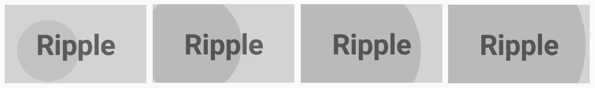
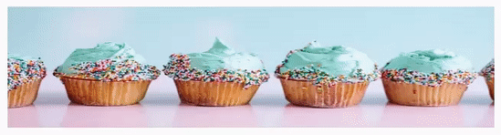

---
layout: post
title: Features in Syncfusion EffectsView
description: Different effects available in EffectsView
platform: xamarin
control: SfEffectsView
documentation: ug
---

# Effects

The SfEffectsView control provides support to ripple effect, highlight effect, and more. This section explains about different effects available in effects view.

## Ripple

The [`SfEffects.Ripple`] is a growable circle, which is initially placed on the tapped location, and it will grow till the whole layout is filled. [`SfEffects.Ripple`] is rendered based on [`SfEffectsView.InitialRippleFactor`].

 

 

                <sfEffectsView:SfEffectsView HorizontalOptions="Center" TouchDownEffects="Ripple">
                    <Label BackgroundColor="#D3D2D5" FontAttributes="Bold" FontSize="18" HeightRequest="50" HorizontalTextAlignment="Center" Text="Ripple" VerticalOptions="Center" VerticalTextAlignment="Center" WidthRequest="90" />
                </sfEffectsView:SfEffectsView>



 

            var effectsView = new SfEffectsView()
            {
                TouchDownEffects = SfEffects.Ripple,
                HorizontalOptions = LayoutOptions.Center,
                Content = new Label()
                {
                    Text = "Ripple",
                    HeightRequest = 50,
                    WidthRequest = 90,
                    BackgroundColor = Color.FromHex("#D3D2D5"),
                    FontAttributes = FontAttributes.Bold,
                    FontSize = 18,
                    HorizontalTextAlignment = TextAlignment.Center,
                    VerticalTextAlignment = TextAlignment.Center,
                    VerticalOptions = LayoutOptions.Center,
                }
            };
            this.Content = effectsView;





## Highlight

[`SfEffects.Highlight`] is a smooth transition on the background color of the [`SfEffectsView`]. It generally appears before the ripple effect when it is given in combination with [`SfEffects.Ripple`] effect.

 

 

            <sfEffectsView:SfEffectsView TouchDownEffects="Highlight" HighlightColor="#FF0000">                                                  
                   <Grid BackgroundColor="White">
                       
                       <Grid.ColumnDefinitions>
                           <ColumnDefinition Width="3*"/>
                           <ColumnDefinition Width="7*"/>
                       </Grid.ColumnDefinitions>
   
                       <Grid.RowDefinitions>
                           <RowDefinition />
                           <RowDefinition />
                           <RowDefinition />
                           <RowDefinition />
                       </Grid.RowDefinitions>
   
                       <Image Source="Person.png" Margin="7" 
                              Grid.RowSpan="4"/>
                       <Label Text="Laura Steffi" Grid.Column="1"
                              FontAttributes="Bold"  Grid.Row="0"  VerticalTextAlignment="Center"
                              Margin="15,0,0,0" Font="17"/>
                       <Label Text="Data Science Analyst" Grid.Column="1" Grid.Row="1" 
                              VerticalTextAlignment="Center" FontAttributes="Bold"
                              Margin="15,0,0,0" Font="14"/>
                       <Label Text="laurasteffi@gmail.com" Grid.Column="1" Grid.Row="2"
                              VerticalTextAlignment="Center" Margin="15,0,0,0" Font="14"/>
                       <Label Text="011-253-321" Grid.Column="1" Grid.Row="3" 
                              VerticalTextAlignment="Center" Margin="15,0,0,0" Font="14"/>
                   </Grid>
           </sfEffectsView:SfEffectsView>



 

            var effectsView = new SfEffectsView
            {
                HighlightColor = Color.FromHex("#FF0000"),
                TouchDownEffects = SfEffects.Highlight,
            };

            var grid = new Grid
            {
                BackgroundColor = Color.White,
                ColumnDefinitions = new ColumnDefinitionCollection()
                {
                    new ColumnDefinition{ Width = new GridLength(3, GridUnitType.Star) },
                    new ColumnDefinition{ Width = new GridLength(7, GridUnitType.Star) }
                },
            };

            var image = new Image
            {
                Source = "Person.png",
                Margin = 7
            };

            var name = new Label
            {
                Text = "Laura Steffi",
                FontAttributes = FontAttributes.Bold,
                VerticalTextAlignment = TextAlignment.Center,
                Margin = new Thickness(15,0,0,0),
                FontSize = 17
            };

            var designation = new Label
            {
                Text = "Data Science Analyst",
                FontAttributes = FontAttributes.Bold,
                VerticalTextAlignment = TextAlignment.Center,
                Margin = new Thickness(15, 0, 0, 0),
                FontSize = 14
            };

            var email = new Label
            {
                Text = "laurasteffi@gmail.com",
                FontAttributes = FontAttributes.Bold,
                VerticalTextAlignment = TextAlignment.Center,
                Margin = new Thickness(15, 0, 0, 0),
                FontSize = 14
            };

            var phone = new Label
            {
                Text = "011-253-321",
                FontAttributes = FontAttributes.Bold,
                VerticalTextAlignment = TextAlignment.Center,
                Margin = new Thickness(15, 0, 0, 0),
                FontSize = 14
            };

            grid.Children.Add(image, 0, 0);
            Grid.SetRowSpan(image, 4);
            grid.Children.Add(name, 1, 0);
            grid.Children.Add(designation, 1, 1);
            grid.Children.Add(email, 1, 2);
            grid.Children.Add(phone, 1, 3);

            effectsView.Content = grid;
            this.Content = effectsView;





## Selection

[`SfEffects.Selection`] is a smooth color transition to indicate the view state is moved to selected state. It generally appears after the ripple effect when it is given in combination with [`SfEffects.Ripple`] effect.

 

 

            <sfEffectsView:SfEffectsView SelectionColor="#FF0000" LongPressEffects="Selection">
                <Image Source="Biscuits.png" Aspect="Fill"/>
            </sfEffectsView:SfEffectsView>



 

            var effectsView = new SfEffectsView
            {
                SelectionColor = Color.FromHex("#FF0000"),
                LongPressEffects = SfEffects.Selection,
                Content = new Image()
                {
                    Source = "Biscuits.png",
                    Aspect = Aspect.Fill
                }
            };
            this.Content = effectsView;





## Scale

[`SfEffects.Scale`] is a smooth transition from actual size of the object to the size calculated based on [`SfEffectsView.ScaleFactor`] in pixels.

 

 

            <sfEffectsView:SfEffectsView TouchDownEffects="None" TouchUpEffects="None"
                                         LongPressEffects="Scale" ScaleFactor="0.85">
                <Image Source="Biscuits.png" Aspect="Fill"/>
            </sfEffectsView:SfEffectsView>



 

            var effectsView = new SfEffectsView
            {
                ScaleFactor = 0.85,
                TouchDownEffects = SfEffects.None,
                TouchUpEffects = SfEffects.None,
                LongPressEffects = SfEffects.Scale,
                Content = new Image()
                {
                    Source = "Biscuits.png",
                    Aspect = Aspect.Fill
                }
            };
            this.Content = effectsView;





## Rotation

[`SfEffects.Rotation`] provides a circular movement to the [`SfEffectsView`] around the center of the [`SfEffectsView`] based on the specified [`SfEffectsView.Angle`]. 

 

 

            <sfEffectsView:SfEffectsView Angle="180" TouchDownEffects="Rotation">
                <Image Source="Arrow.png" HeightRequest="70" WidthRequest="70"/>
            </sfEffectsView:SfEffectsView>



 

            var effectsView = new SfEffectsView
            {
                Angle = 180,
                TouchDownEffects = SfEffects.Rotation,
                Content = new Image()
                {
                    Source = "Arrow.png",
                    Aspect = Aspect.Fill
                }
            };
            this.Content = effectsView;




