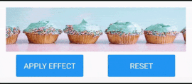

# Methods

You can add or remove effect programmatically using the [`ApplyEffects`](https://help.syncfusion.com/cr/cref_files/xamarin/Syncfusion.Core.XForms~Syncfusion.XForms.EffectsView.SfEffectsView~ApplyEffects.html) or [`Reset`](https://help.syncfusion.com/cr/cref_files/xamarin/Syncfusion.Core.XForms~Syncfusion.XForms.EffectsView.SfEffectsView~Reset.html) method.

## ApplyEffects

The [`ApplyEffects`](https://help.syncfusion.com/cr/cref_files/xamarin/Syncfusion.Core.XForms~Syncfusion.XForms.EffectsView.SfEffectsView~ApplyEffects.html) method is used to trigger the effects rendering with or without repetition. The following are the optional parameters to be passed:

* `effects` - [`SfEffects`](https://help.syncfusion.com/cr/cref_files/xamarin/Syncfusion.Core.XForms~Syncfusion.XForms.EffectsView.SfEffects.html) to be applied. By default, `SfEffects.Ripple` will be applied.
* `rippleStartPosition` - [`RippleStartPosition`](https://help.syncfusion.com/cr/cref_files/xamarin/Syncfusion.Core.XForms~Syncfusion.XForms.EffectsView.RippleStartPosition.html) can be left, top, right, bottom, or default. By default, ripple starts from the center.
* `rippleStartPoint` - point at which ripple animation starts. The default value is null.
* `repeat` - bool value used to set whether to repeat the applied effect. The default value is false. Only `SfEffects.Ripple` and `SfEffects.Highlight` can be repeated.

 

                <Grid>

                    <Grid.RowDefinitions>
                        <RowDefinition Height="Auto" />
                        <RowDefinition Height="Auto" />
                    </Grid.RowDefinitions>

                    <Grid.ColumnDefinitions>
                        <ColumnDefinition />
                        <ColumnDefinition />
                    </Grid.ColumnDefinitions>

                    <Grid Grid.ColumnSpan="2">

                        <sfEffectsView:SfEffectsView
                            x:Name="effectsView"
                            RippleAnimationDuration="500"
                            VerticalOptions="Center">
                            <Image Aspect="Fill" Source="Biscuits.png" />
                        </sfEffectsView:SfEffectsView>

                    </Grid>

                    <Button
                        x:Name="ApplyScaleEffectButton"
                        Grid.Row="1"
                        BackgroundColor="Accent"
                        Clicked="ApplyScaleEffectButton_Clicked"
                        HeightRequest="40"
                        HorizontalOptions="CenterAndExpand"
                        Text="Apply Effect"
                        TextColor="White"
                        VerticalOptions="CenterAndExpand"
                        WidthRequest="120" />
                    <Button
                        x:Name="ScaleResetButton"
                        Grid.Row="1"
                        Grid.Column="1"
                        BackgroundColor="Accent"
                        Clicked="ScaleResetButton_Clicked"
                        HeightRequest="40"
                        HorizontalOptions="CenterAndExpand"
                        Text="Reset"
                        TextColor="White"
                        VerticalOptions="Center"
                        WidthRequest="120" />

                </Grid>



 

            private void ApplyEffectClicked(object sender, EventArgs e)
            {
                effectsView.ApplyEffects(effects: SfEffects.Ripple, repeat: true);
            }



N> The [`SfEffects`](https://help.syncfusion.com/cr/cref_files/xamarin/Syncfusion.Core.XForms~Syncfusion.XForms.EffectsView.SfEffects.html) applied using [`ApplyEffects`](https://help.syncfusion.com/cr/cref_files/xamarin/Syncfusion.Core.XForms~Syncfusion.XForms.EffectsView.SfEffectsView~ApplyEffects.html) method will be removed only after calling the [`Reset`](https://help.syncfusion.com/cr/cref_files/xamarin/Syncfusion.Core.XForms~Syncfusion.XForms.EffectsView.SfEffectsView~Reset.html) method.

## Reset

The [`Reset`](https://help.syncfusion.com/cr/cref_files/xamarin/Syncfusion.Core.XForms~Syncfusion.XForms.EffectsView.SfEffectsView~Reset.html) method is used to reset the `SfEffects.Highlight` and `SfEffects.Ripple` effects, which are applied using the [`ApplyEffects`](https://help.syncfusion.com/cr/cref_files/xamarin/Syncfusion.Core.XForms~Syncfusion.XForms.EffectsView.SfEffectsView~ApplyEffects.html) method.

 

                <Grid>

                    <Grid.RowDefinitions>
                        <RowDefinition Height="Auto" />
                        <RowDefinition Height="Auto" />
                    </Grid.RowDefinitions>

                    <Grid.ColumnDefinitions>
                        <ColumnDefinition />
                        <ColumnDefinition />
                    </Grid.ColumnDefinitions>

                    <Grid Grid.ColumnSpan="2">

                        <sfEffectsView:SfEffectsView
                            x:Name="effectsView"
                            RippleAnimationDuration="500"
                            VerticalOptions="Center">
                            <Image Aspect="Fill" Source="Biscuits.png" />
                        </sfEffectsView:SfEffectsView>

                    </Grid>

                    <Button
                        x:Name="ApplyScaleEffectButton"
                        Grid.Row="1"
                        BackgroundColor="Accent"
                        Clicked="ApplyScaleEffectButton_Clicked"
                        HeightRequest="40"
                        HorizontalOptions="CenterAndExpand"
                        Text="Apply Effect"
                        TextColor="White"
                        VerticalOptions="CenterAndExpand"
                        WidthRequest="120" />
                    <Button
                        x:Name="ScaleResetButton"
                        Grid.Row="1"
                        Grid.Column="1"
                        BackgroundColor="Accent"
                        Clicked="ScaleResetButton_Clicked"
                        HeightRequest="40"
                        HorizontalOptions="CenterAndExpand"
                        Text="Reset"
                        TextColor="White"
                        VerticalOptions="Center"
                        WidthRequest="120" />

                </Grid>



 

            private void ResetEffectClicked(object sender, EventArgs e)
            {
                effectsView.Reset();
            }



