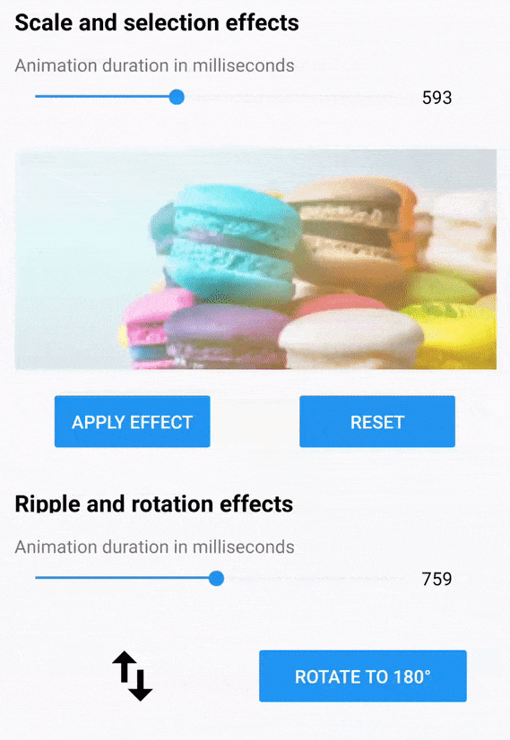

# Overview

The Effects View is a container control that provides modern effects like ripple, selection, scaling, and rotation out of the box. Users can render these effects through touch interactions like touch down, touch up, long press, and also by calling the API. 

## Key features

* Highlight and ripple animations.
* Selection effect with built-in support for notifications during selection state changes.
* Scale down, scale up, and rotation effects.