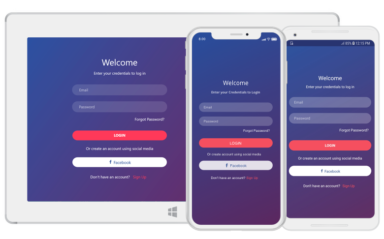

# Overview

The Xamarin.Forms GradientView control provides the gradient background to various views of applications. The SfGradientView control supports the following two types of gradient:
* Linear gradient
* Radial gradient

## Key Features

* Customizes the background as a linear gradient by horizontally or vertically.

* Customizes the background as a radial gradient with different center point.

