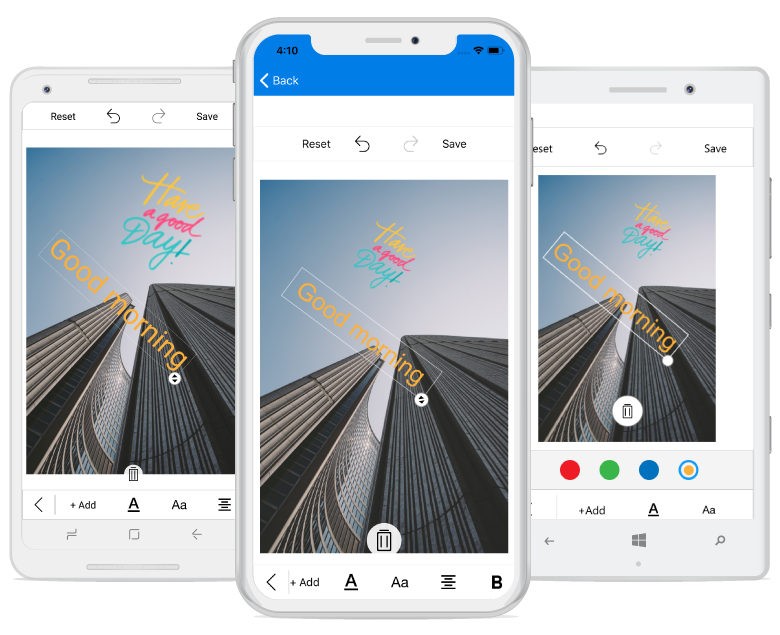

## CustomView

You can add any custom shapes or views to an image using the `AddCustomView` method in the image editor control. To add a custom view, specify the view and its desired `CustomViewSettings` as shown in the following code snippet.



        Image customImage = new Image() { HeightRequest = 200, WidthRequest = 200  };
        Assembly assembly = Assembly.GetAssembly(typeof(Sample));
        customImage.Source = ImageSource.FromResource("sample_namespace.CustomImage.png", assembly);
        imageEditor.AddCustomView(customImage, new CustomViewSettings());
  


## CustomViewSettings

The CustomViewSettings is defined to set the values for `CanMaintainAspectRatio`, `Bounds` and `Angle`.

* The CanMaintainAspectRatio property is used to decide whether the aspect ratio value needs to be maintained when resizing the custom view.

* Bounds property is used to set the bounds of the custom view. Using this property, you can position the custom view wherever you want on the image. In percentage, the value should fall between 0 and 100.

* Angle property is used to set the angle of the custom view. Using this property, you can rotate the custom view at desired angle.



CustomViewSettings customViewSettings = new CustomViewSettings()
{
    CanMaintainAspectRatio = false,
    Bounds = new Rect(0, 0, 100, 100),
    Angle=50
};



## CustomView Rotation

You can rotate and resize the custom view by enabling the `RotatableElements` property of image editor. `ImageEditorElements` is an enum type with values Text and CustomView as shown in the following code snippet.





    editor.RotatableElements = ImageEditorElements.CustomView;   





You can rotate the custom view based on a particular angle using `Angle` property in `CustomViewSettings` as shown in the following code snippet. 





        Image customImage = new Image() { HeightRequest = 200, WidthRequest = 200  };
        Assembly assembly = Assembly.GetAssembly(typeof(Sample));
        customImage.Source = ImageSource.FromResource("sample_namespace.CustomImage.png", assembly);
        imageEditor.AddCustomView(customImage, new CustomViewSettings(){Angle = 50});    





