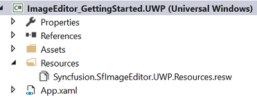
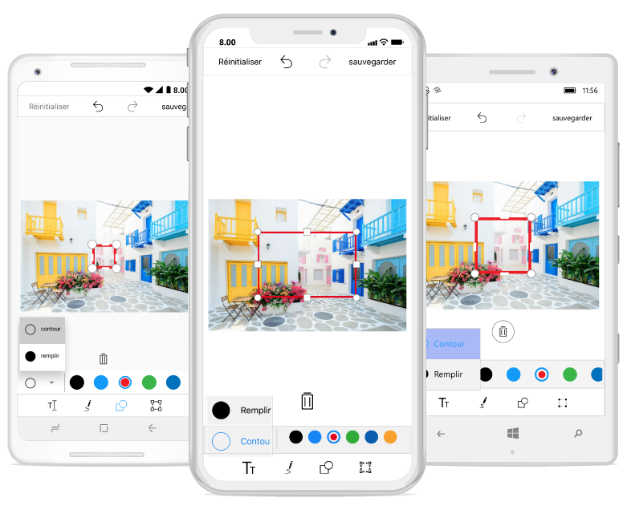

# Localization

The image editor control supports localization. You can localize the contents of image editor by adding equivalent localized strings.

## Change default language

Based on resource strings in the project, the contents are localized. By default, the image editor control is available in English.

You can localize image editor contents in the following two ways:

* Using Resx file from PCL.
* From platform-specific projects.

## Using Resx file from PCL

You can localize the text from PCL by adding equivalent localized strings in the resource file. The required resx files are available under the Resources folder.

E.g., For Japanese, filename should be Syncfusion.SfImageEditor.XForms.ja-JP.resx.

Now, set Build Action to EmbeddedResource. The CurrentCulture must be set in the platform projects.

Convert the platform-specific format to a .NET format, and set it to Thread.CurrentThread.CurrentUICulture.

You can use the value set to this static property from our source to read the values in PCL project’s Syncfusion.SfImageEditor.XForms.ja-JP.resx files.





    public void SetLocale(CultureInfo culture)
    {
        Thread.CurrentThread.CurrentCulture = culture;
        Thread.CurrentThread.CurrentUICulture = culture;
    }
    
    public CultureInfo GetCurrentCultureInfo()
    {
        var netLanguage = "en";
        var androidLocale = Java.Util.Locale.Default;
        netLanguage =                                     
        AndroidToLanguage(androidLocale.ToString().Replace("_", "-"));
            CultureInfo culture = null;
            try
            {
                culture = new CultureInfo(netLanguage);
            }
            catch
            {
                try
                {
                    var fallback = ToFallbackLanguage(new                
                                   PlatformCulture(netLanguage));
                    culture = new CultureInfo(fallback); 
                }
                catch
                {
                    culture = new CultureInfo("en");
                }
            }
        return culture;
    }
 



The following code snippet shows converting Japanese language to CultureInfo equivalent.





          var netLanguage = platCulture.LanguageCode; 

          case "ja":
                netLanguage = "ja-JP"; //equivalent to Japanese for this app
                break;

 



Change the language preference in device.

The following screenshot shows localizing the text to Japanese language.

## From platform-specific projects

You can localize the text from different platforms by adding equivalent localized strings in resource file. For localizing text, configure it to each platform separately.

* Localizing the text in Android renderer.
* Localizing the text in iOS renderer.
* Localizing the text in UWP renderer.

### Android

You can localize the text available in the control by adding equivalent localized strings in resource file.

Create String.xml in resource file in Android

Location- ProjectName.Android/Resources/values/Strings.Xml

The following screenshot shows localizing the text to French language.

### iOS 

You can localize custom text available in the control by adding equivalent localized strings in resource file.

Create Localizable.strings in resource file in iOS.

Location- ProjectName.iOS/Resources/Localizable.strings

The following screenshot shows localizing the text to French language.

### UWP 

You can localize custom text available in the control by adding equivalent localized strings in resource file.

Create Syncfusion.SfImageEditor.UWP.Resources file in UWP.

Location- ProjectName.UWP/Resources/Syncfusion.SfImageEditor.UWP.Resources 

The following screenshot shows localizing the text to French language.

The following screenshot shows localizing the text to French language in image editor.

