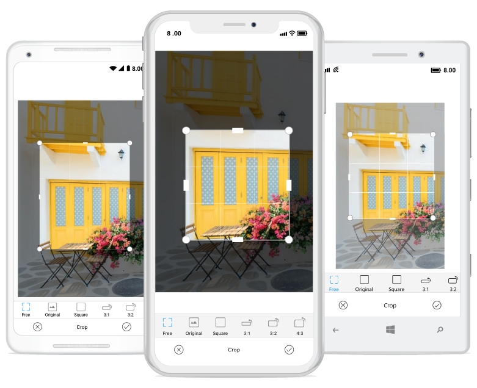

## Crop

You can crop the desired portion of an image with cropping tool.

## Image cropping ratio

You can crop the image with various aspect ratios. The list of available built-in toolbar cropping ratios are "`Free`, `Original`, `Square`, `3:1`, `1:3`, `3:2`, `2:3`, `4:3`, `3:4`, `5:4`, `4:5`, `16:9`, `9:16` "

Cropping operation can be done in the following two ways:

* Enable Cropping and Selecting the crop region visually
* Manually enter the cropping area

### Handling the cropping tool

The `ToggleCropping` method in the SfImageEditor control allows user to enable or disable the cropping region placed over the image to visually choose the area for cropping. 

*	To crop the image to any desired size.



//  for free hand cropping

editor.ToggleCropping();    



* To crop an image based on original width and height of the image.



// for cropping the image with original width and height of the image.

editor.ToggleCropping(float.NaN,float.NaN);    



* To crop an image based on specific ratio.



// for cropping the image with ratio x value as 9 and y value as 17

editor.ToggleCropping(9,17);    



After the cropping area has been selected, the `Crop` method is called which in turn crops the selected region and displays the cropped image on the ImageEditor.



editor.Crop();



### Manually enter the cropping area

To manually enter the cropping rectangle without even enabling the cropping functionality, make use of the overloaded Crop(Rectangle rect) method. It can be done by defining a rectangle yourself, and pass it to Crop(rect) method.





editor.Crop(new Rectangle(100,100,150,200));





