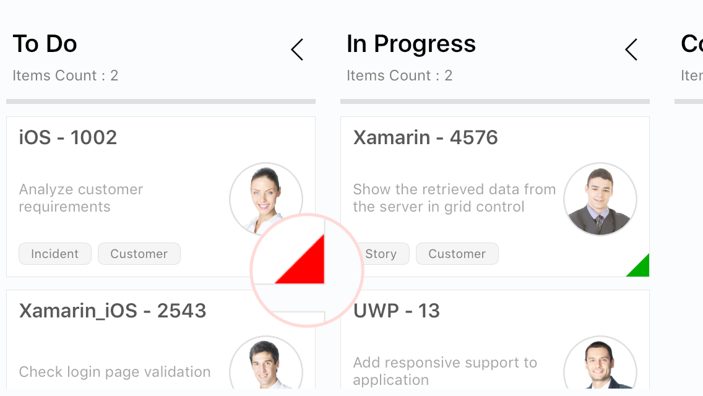
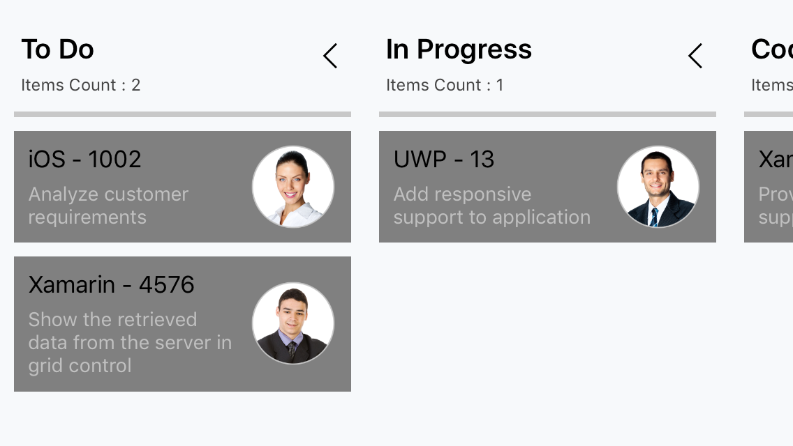

#Cards

The default elements of a card can be customized using the below properties of [KanbanModel](http://help.syncfusion.com/cr/cref_files/xamarin/sfkanban/Syncfusion.SfKanban.XForms~Syncfusion.SfKanban.XForms.KanbanModel.html).

[Title](http://help.syncfusion.com/cr/cref_files/xamarin/sfkanban/Syncfusion.SfKanban.XForms~Syncfusion.SfKanban.XForms.KanbanModel~Title.html)         - Used to set the title of a card.
[ImageURL](http://help.syncfusion.com/cr/cref_files/xamarin/sfkanban/Syncfusion.SfKanban.XForms~Syncfusion.SfKanban.XForms.KanbanModel~ImageURL.html)      - Used to set the image URL of a card. The image will be displayed at right side in default card template.
[Category](http://help.syncfusion.com/cr/cref_files/xamarin/sfkanban/Syncfusion.SfKanban.XForms~Syncfusion.SfKanban.XForms.KanbanModel~Category.html)      - Used to set the category of a card. Based on the category the cards will be added to the respective columns. 
[Description](http://help.syncfusion.com/cr/cref_files/xamarin/sfkanban/Syncfusion.SfKanban.XForms~Syncfusion.SfKanban.XForms.KanbanModel~Description.html)   - Used to set the description text of a card.
[ColorKey](http://help.syncfusion.com/cr/cref_files/xamarin/sfkanban/Syncfusion.SfKanban.XForms~Syncfusion.SfKanban.XForms.KanbanModel~ColorKey.html)      - Used to specify the indicator color key. The color value of the corresponding key should be added in ColorModel collection of SfKanban.
[Tags](http://help.syncfusion.com/cr/cref_files/xamarin/sfkanban/Syncfusion.SfKanban.XForms~Syncfusion.SfKanban.XForms.KanbanModel~Tags.html)          - Used to specify the tags of a card. The tags will be displayed at bottom in default card template.
[ID](http://help.syncfusion.com/cr/cref_files/xamarin/sfkanban/Syncfusion.SfKanban.XForms~Syncfusion.SfKanban.XForms.KanbanModel~ID.html)            - Used to set the ID of a card.



new KanbanModel()
{
    ID = 1,
    Title = "iOS - 1002",
    ImageURL = "Image1.png",
    Category = "Open",
    Description = "Analyze customer requirements",
    ColorKey = "Red",
    Tags = new string[] { "Incident", "Customer" }
});



Following code snippet is used to define the colors for each key.



List<KanbanColorMapping> colormodels = new List<KanbanColorMapping>();
colormodels.Add(new KanbanColorMapping("Green", Color.Green));
colormodels.Add(new KanbanColorMapping("Red", Color.Red));
colormodels.Add(new KanbanColorMapping("Aqua", Color.Aqua));
colormodels.Add(new KanbanColorMapping("Blue", Color.Blue));
kanban.ColorModel = colormodels;



## Template

You can replace the entire card template with your own design using [CardTemplate](http://help.syncfusion.com/cr/cref_files/xamarin/sfkanban/Syncfusion.SfKanban.XForms~Syncfusion.SfKanban.XForms.SfKanban~CardTemplate.html) property of [SfKanban](http://help.syncfusion.com/cr/cref_files/xamarin/sfkanban/Syncfusion.SfKanban.XForms~Syncfusion.SfKanban.XForms.SfKanban.html). The following code snippet and screenshot illustrates this.





<kanban:SfKanban.CardTemplate >

<DataTemplate>
    <StackLayout WidthRequest="250" Orientation="Vertical" BackgroundColor="Gray" Padding="10,10,10,10"> 
        
        <StackLayout  Orientation="Horizontal"> 

            <Label Text="{Binding Path=Title}" TextColor="Silver" HorizontalOptions="StartAndExpand" >
            </Label>

        </StackLayout>      

        <StackLayout  Orientation="Horizontal"> 

            <Label Text="{Binding Description}" WidthRequest="150" FontSize="14" TextColor="Silver" LineBreakMode="WordWrap" ></Label>                    
            <Image Source="{Binding ImageURL}" HeightRequest="50" WidthRequest="50"  ></Image>

        </StackLayout>
        
    </StackLayout>
</DataTemplate>

</kanban:SfKanban.CardTemplate>





var cardTemplate = new DataTemplate(() =>
{

    StackLayout root = new StackLayout()
    {
        WidthRequest = 250,
        Orientation = StackOrientation.Vertical,
        Padding = new Thickness(10),
        BackgroundColor = Color.Gray
    };

    StackLayout titleLayout = new StackLayout();
    Label title = new Label()
    {
        TextColor = Color.Silver,
        HorizontalOptions = LayoutOptions.StartAndExpand
    };
    title.SetBinding(Label.TextProperty, new Binding("Title"));
    titleLayout.Children.Add(title);

    StackLayout contentLayout = new StackLayout()
    {
        Orientation = StackOrientation.Horizontal
    };
    Label desc = new Label()
    {
        WidthRequest = 150,
        FontSize = 14,
        TextColor = Color.Silver,
        LineBreakMode = LineBreakMode.WordWrap
    };
    desc.SetBinding(Label.TextProperty, new Binding("Description"));
    Image image = new Image()
    {
        HeightRequest = 50,
        WidthRequest = 50
    };
    image.SetBinding(Image.SourceProperty, new Binding("ImageURL"));
    contentLayout.Children.Add(desc);
    contentLayout.Children.Add(image);

    root.Children.Add(titleLayout);
    root.Children.Add(contentLayout);

    return root;

});

kanban.CardTemplate = cardTemplate;





## Custom Model 

You can define custom model for [CardTemplate](http://help.syncfusion.com/cr/cref_files/xamarin/sfkanban/Syncfusion.SfKanban.XForms~Syncfusion.SfKanban.XForms.SfKanban~CardTemplate.html). 



//Custom Model Class

public class CustomModel
{

    public string Name
    {
        get; 
        set;
    }

    public string Key
    {
        get;
        set;
    }

    public string Description
    {
        get;
        set;
    }

    public string Picture
    {
        get;
        set;
    }
}



Create a ViewModel class with a collection property to hold a collection of [CustomModel] instances as shown below. Each [CustomModel] instance represent a card in Kanban control.



public class ViewModel
{
    public ObservableCollection<CustomModel> Cards { get; set; }

    public ViewModel()
    {
        Cards = new ObservableCollection<CustomModel>();

        Cards.Add(new CustomModel()
        {
            Name = "iOS - 12",
            Picture = "Image1.png",
            Key = "Open",
            Description = "Analyze customer requirements"
        });

        Cards.Add(new CustomModel()
        {
            Name = "Xamarin - 4576",
            Picture = "Image2.png",
            Key = "Open",
            Description = "Show the retrieved data from the server in grid control"
        });

        Cards.Add(new CustomModel()
        {
            Name = "UWP - 13",
            Picture = "Image4.png",
            Key = "In Progress",
            Description = "Add responsive support to application"
        });

        Cards.Add(new CustomModel()
        {
            Name = "Xamarin_iOS - 2543",
            Key = "Code Review",
            Picture = "Image3.png",
            Description = "Check login page validation"
        });

    }

}



Here the code snippet for [CardTemplate]((http://help.syncfusion.com/cr/cref_files/xamarin/sfkanban/Syncfusion.SfKanban.XForms~Syncfusion.SfKanban.XForms.SfKanban~CardTemplate.html)) updated with CustomModel.

N> By default [ColumnMappingPath](http://help.syncfusion.com/cr/cref_files/xamarin/sfkanban/Syncfusion.SfKanban.XForms~Syncfusion.SfKanban.XForms.SfKanban~ColumnMappingPath.html) value is Category. While using CustomModel we need to change [ColumnMappingPath](http://help.syncfusion.com/cr/cref_files/xamarin/sfkanban/Syncfusion.SfKanban.XForms~Syncfusion.SfKanban.XForms.SfKanban~ColumnMappingPath.html) value if it is differed from default value.





<kanban:SfKanban x:Name="kanban" ColumnMappingPath="Key" ItemsSource="{Binding Cards}">

    <kanban:SfKanban.CardTemplate >

        <DataTemplate>

            <StackLayout WidthRequest="250" Orientation="Vertical" BackgroundColor="Gray" Padding="10,10,10,10"> 

                <StackLayout  Orientation="Horizontal"> 
                    <Label Text="{Binding Path=Name}" TextColor="Silver" HorizontalOptions="StartAndExpand" >
                    </Label>
                </StackLayout>      

                <StackLayout  Orientation="Horizontal"> 
                    <Label Text="{Binding Description}" WidthRequest="150" FontSize="14" TextColor="Silver" LineBreakMode="WordWrap" ></Label>                    
                    <Image Source="{Binding Picture}" HeightRequest="50" WidthRequest="50"  ></Image>
                </StackLayout>

            </StackLayout>

        </DataTemplate>
        
    </kanban:SfKanban.CardTemplate>

</kanban:SfKanban>





kanban.ColumnMappingPath = "Key";

var cardTemplate = new DataTemplate(() =>
{

    StackLayout root = new StackLayout()
    {
        WidthRequest = 250,
        Orientation = StackOrientation.Vertical,
        Padding = new Thickness(10),
        BackgroundColor = Color.Gray
    };

    StackLayout titleLayout = new StackLayout();
    Label title = new Label()
    {
        TextColor = Color.Silver,
        HorizontalOptions = LayoutOptions.StartAndExpand
    };
    title.SetBinding(Label.TextProperty, new Binding("Name"));
    titleLayout.Children.Add(title);

    StackLayout contentLayout = new StackLayout()
    {
        Orientation = StackOrientation.Horizontal
    };
    Label desc = new Label()
    {
        WidthRequest = 150,
        FontSize = 14,
        TextColor = Color.Silver,
        LineBreakMode = LineBreakMode.WordWrap
    };
    desc.SetBinding(Label.TextProperty, new Binding("Description"));
    Image image = new Image()
    {
        HeightRequest = 50,
        WidthRequest = 50
    };
    image.SetBinding(Image.SourceProperty, new Binding("Picture"));
    contentLayout.Children.Add(desc);
    contentLayout.Children.Add(image);

    root.Children.Add(titleLayout);
    root.Children.Add(contentLayout);

    return root;

});

kanban.CardTemplate = cardTemplate;

kanban.CardTemplate = cardTemplate;





