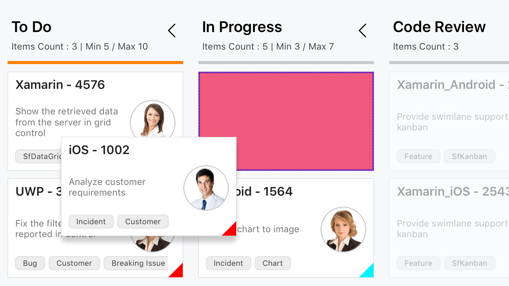
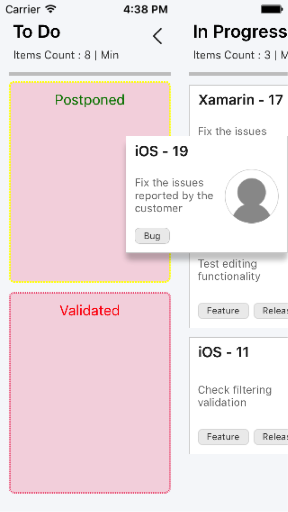
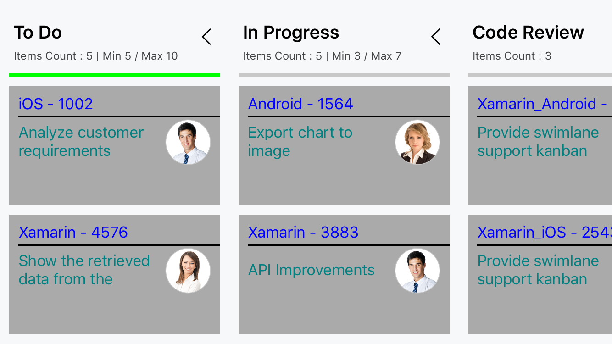
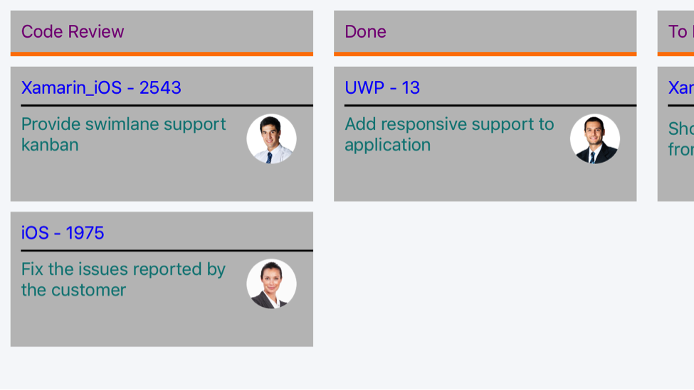

# Customization

'PlaceHolderStyle' – It is used to customize the place holder of Kanban cards.





<kanban:SfKanban.PlaceholderStyle>
		<kanban:KanbanPlaceholderStyle FontSize="16" TextColor="Red" BackgroundColor="Fuchsia" BorderColor="Fuchsia" BorderThickness="2" SelectedFontSize="16" SelectedTextColor="Green" SelectedBorderColor="Yellow" SelectedBorderThickness="2" SelectedBackgroundColor="Fuchsia">
		</kanban:KanbanPlaceholderStyle>
</kanban:SfKanban.PlaceholderStyle>





KanbanPlaceholderStyle style = new KanbanPlaceholderStyle();

style.FontSize = 20;
style.TextColor = Color.Red;
style.BackgroundColor = Color.FromRgb(239, 89, 123);
style.BorderColor = Color.Blue;
style.BorderThickness = 2;
style.StrokeDashArray = new double[] { 1, 1 };

style.SelectedFontSize = 20;
style.SelectedTextColor = Color.Green;
style.SelectedBorderColor = Color.Yellow;
style.SelectedBackgroundColor = Color.FromRgb(239, 89, 123);
style.SelectedBorderThickness = 2;
style.SelectedStrokeDashArray = new double[] { 2, 1 };

kanban.PlaceholderStyle = style;			





SelectedBackground – Indicates the color, when hover on any category of multiple categories in a single column as shown in the below snapshot.

Kanban Card Template - You can customize the appearance of the cards with your own template by using 'CardTemplate' property.





<kanban:SfKanban.CardTemplate>
	<DataTemplate>
		<StackLayout WidthRequest="300" Orientation="Vertical" BackgroundColor="Silver" Padding="10,10,10,10">
			<StackLayout Orientation="Horizontal">
				<Label Text="{Binding Path=Title}" TextColor="Blue" HorizontalOptions="StartAndExpand">
				</Label>
			</StackLayout>
			<Label HeightRequest="2" WidthRequest="230" BackgroundColor="Black">
			</Label>
			<StackLayout Orientation="Horizontal">
				<Label Text="{Binding Description}" WidthRequest="230" HeightRequest="50" TextColor="Teal" LineBreakMode="WordWrap">
				</Label>
				<Image Source="{Binding ImageURL}" HeightRequest="50" WidthRequest="50">
				</Image>
			</StackLayout>
		</StackLayout>
	</DataTemplate>
</kanban:SfKanban.CardTemplate>





var cardTemplate = new DataTemplate(() =>
{
	StackLayout root = new StackLayout()
	{
		WidthRequest = 300,
		Orientation = StackOrientation.Vertical,
		Padding = new Thickness(10),
		BackgroundColor = Color.Silver
	};

	StackLayout titleLayout = new StackLayout();
	Label title = new Label()
	{
		TextColor = Color.Blue,
		HorizontalOptions = LayoutOptions.StartAndExpand
	};
	title.SetBinding(Label.TextProperty, new Binding("Title"));
	titleLayout.Children.Add(title);

	Label line = new Label()
	{
		HeightRequest = 2,
		WidthRequest = 230,
		BackgroundColor = Color.Black
	};

	StackLayout contentLayout = new StackLayout()
	{
		Orientation = StackOrientation.Horizontal
	};
	Label desc = new Label()
	{
		WidthRequest = 210,
		HeightRequest = 50,
		TextColor = Color.Teal,
		LineBreakMode = LineBreakMode.WordWrap
	};
	desc.SetBinding(Label.TextProperty, new Binding("Description"));
	Image image = new Image()
	{
		HeightRequest = 50,
		WidthRequest = 50
	};
	image.SetBinding(Image.SourceProperty, new Binding("ImageURL"));
	contentLayout.Children.Add(desc);
	contentLayout.Children.Add(image);

	root.Children.Add(titleLayout);
	root.Children.Add(line);
	root.Children.Add(contentLayout);

	return root;
});

kanban.CardTemplate = cardTemplate;





Kanban Column Header Template – We can also define template for column header using 'HeaderTemplate' property.





<kanban:SfKanban.HeaderTemplate>
	<DataTemplate>
		<StackLayout WidthRequest="300" HeightRequest="40" BackgroundColor="Silver">
			<Label Margin="10" Text="{Binding Path=Title}" TextColor="Purple" HorizontalOptions="Start">
			</Label>
		</StackLayout>
	</DataTemplate>
</kanban:SfKanban.HeaderTemplate>





var headerTemplate = new DataTemplate(() =>
{

	StackLayout root = new StackLayout()
	{
		WidthRequest = 300,
		HeightRequest = 40,
		BackgroundColor = Color.Silver
	};

	Label label = new Label();
	label.Margin = new Thickness(10);
	label.TextColor = Color.Purple;
	label.HorizontalOptions = LayoutOptions.Start;
	label.SetBinding(Label.TextProperty, new Binding("Title"));

	root.Children.Add(label);

	return root;

});

kanban.HeaderTemplate = headerTemplate;





