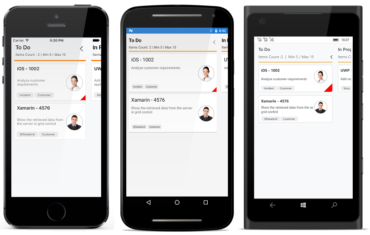

# Getting Started

## Create your first Kanban in Xamarin.Forms

This section provides a quick overview for working with Essential Kanban for Xamarin.Forms. It is an efficient way to visualize the workflow at each stage along its path to completion.

## Referencing Essential Studio components in your solution

If you had acquired Essential Studio components through the Xamarin component store interface from within your IDE, then after adding the components to your Xamarin.iOS and Xamarin.Android projects through the Component manager, you will still need to manually reference the UWP and PCL (Portable Class Library) assemblies in the Xamarin.Forms UWP and PCL project in your solution. You can do this by manually adding the relevant assembly references to your UWP and PCL project contained in the following path inside of your solution folder

Components/syncfusionessentialstudio-version/lib/uwp/

Components/syncfusionessentialstudio-version/lib/pcl/

Alternatively if you had downloaded Essential Studio from Syncfusion.com or through the Xamarin store web interface then all assembly references need to be added manually.

After installing Essential Studio for Xamarin, all the required assemblies can be found in the installation folders, typically

{Syncfusion Installed location}\Essential Studio\{Release Version}\lib

Eg: C:\Program Files (x86)\Syncfusion\Essential Studio\14.3.0.49\lib
or after downloading through the Xamarin store web interface, all the required assemblies can be found in the below folder

{download location}\syncfusionessentialstudio-version\lib

You can then add the assembly references to the respective projects as shown below

## PCL project

pcl\Syncfusion.SfKanban.XForms.dll

## Android project

android\Syncfusion.SfKanban.Android.dll
android\Syncfusion.SfKanban.XForms.Android.dll
android\Syncfusion.SfKanban.XForms.dll

## iOS(Unified) project

ios-unified\Syncfusion.SfKanban.iOS.dll 
ios-unified\Syncfusion.SfKanban.XForms.iOS.dll
ios-unified\Syncfusion.SfKanban.XForms.dll

## UWP

uwp\Syncfusion.SfKanban.UWP.dll
uwp\Syncfusion.SfKanban.XForms.UWP.dll
uwp\Syncfusion.SfKanban.XForms.dll

N> Essential Kanban supporting Xamarin.Forms version 2.3.0.49 and greater.

Currently an additional step is required for configuring UWP and iOS platforms. We need to create an instance of SfKanbanRenderer as shown below.

Create an instance of SfKanbanRenderer in the constructor of MainPage in UWP project as shown below.



public MainPage()
{
    ...
    new SfKanbanRenderer();
    ...  
}



Create an instance of SfKanbanRenderer in FinishedLaunching overridden method of AppDelegate class in the iOS Project as shown below.



public override bool FinishedLaunching(UIApplication app, NSDictionary options)
{
    ...
    new SfKanbanRenderer();
    ...  
}



## Create a simple SfKanban

This section explains how to create a ['SfKanban'](http://help.syncfusion.com/cr/cref_files/xamarin/sfkanban/Syncfusion.SfKanban.XForms~Syncfusion.SfKanban.XForms.SfKanban.html) and configure it. 
This is how the final output will look like on iOS, Android and Windows devices. You can download the entire source code of this demo for Xamarin.Forms from [here](http://files2.syncfusion.com/Xamarin.iOS/Samples/KanbanForms_GettingStarted.zip).

In this walk through, you will create a new application that contains the ['SfKanban'](http://help.syncfusion.com/cr/cref_files/xamarin/sfkanban/Syncfusion.SfKanban.XForms~Syncfusion.SfKanban.XForms.SfKanban.html) which includes the below topics.

* Adding SfKanban in Xamarin.Forms
* Create data model
* Binding data
* Defining columns
* Working with Workflows
* Work In-Progress Limit

## Adding SfKanban in Xamarin.Forms

1. Add the required assembly references to the project as discussed in the _Reference Essential Studio Components in your Solution_ section.
2. Import ['SfKanban'](http://help.syncfusion.com/cr/cref_files/xamarin/sfkanban/Syncfusion.SfKanban.XForms~Syncfusion.SfKanban.XForms.SfKanban.html) control namespace.
3. Create an instance of [`SfKanban`](http://help.syncfusion.com/cr/cref_files/xamarin/sfkanban/Syncfusion.SfKanban.XForms~Syncfusion.SfKanban.XForms.SfKanban.html) control and set to Content property of a Page.

   


SfKanban kanban = new SfKanban();
this.Content = kanban;




<kanban:SfKanban x:Name="kanban">
</kanban:SfKanban>




## Create KanbanModel for the SfKanban

Create a collection of [`KanbanModel`](http://help.syncfusion.com/cr/cref_files/xamarin/sfkanban/Syncfusion.SfKanban.XForms~Syncfusion.SfKanban.XForms.KanbanModel.html) objects for populating [`SfKanban`](http://help.syncfusion.com/cr/cref_files/xamarin/sfkanban/Syncfusion.SfKanban.XForms~Syncfusion.SfKanban.XForms.SfKanban.html).


using System;
using System.Collections.Generic;
using System.Collections.ObjectModel;
using GettingStartedKanban;
using Syncfusion.SfKanban.XForms;
using Xamarin.Forms;

namespace GettingStartedKanban
{
	public class KanbanGettingStartedViewModel
	{
		public ObservableCollection<KanbanModel> Cards { get; set; }

		public KanbanGettingStartedViewModel()
		{
			Cards = new ObservableCollection<KanbanModel>();

			Cards.Add(new KanbanModel()
			{
				ID = 1,
				Title = "iOS - 1002",
				ImageURL = "Image1.png",
				Category = "Open",
				Description = "Analyze customer requirements",
				ColorKey = "Red",
				Tags = new string[] { "Incident", "Customer" }
			});

			Cards.Add(new KanbanModel()
			{
				ID = 6,
				Title = "Xamarin - 4576",
				ImageURL = "Image2.png",
				Category = "Open",
				Description = "Show the retrieved data from the server in grid control",
				ColorKey = "Green",
				Tags = new string[] { "SfDataGrid", "Customer" }
			});

			Cards.Add(new KanbanModel()
			{
				ID = 13,
				Title = "UWP - 13",
				ImageURL = "Image4.png",
				Category = "In Progress",
				Description = "Add responsive support to application",
				ColorKey = "Brown",
				Tags = new string[] { "Story", "Kanban" }
			});

			Cards.Add(new KanbanModel()
			{
				ID = 2543,
				Title = "Xamarin_iOS - 2543",
				Category = "Code Review",
				ImageURL = "Image3.png",
				Description = "Provide swimlane support kanban",
				ColorKey = "Brown",
				Tags = new string[] { "Feature", "SfKanban" }
			});

			Cards.Add(new KanbanModel()
			{
				ID = 1975,
				Title = "iOS - 1975",
				Category = "Done",
				ImageURL = "Image5.png",
				Description = "Fix the issues reported by the customer",
				ColorKey = "Purple",
				Tags = new string[] { "Bug" }
			});

		}
	}
}



## Binding data to SfKanban
In order to bind the data source of the [`SfKanban`](http://help.syncfusion.com/cr/cref_files/xamarin/sfkanban/Syncfusion.SfKanban.XForms~Syncfusion.SfKanban.XForms.SfKanban.html), set [`ItemsSource`](http://help.syncfusion.com/cr/cref_files/xamarin/sfkanban/Syncfusion.SfKanban.XForms~Syncfusion.SfKanban.XForms.SfKanban~ItemsSource.html) property as shown below. The following code binds the collection created in previous step to [`ItemsSource`](http://help.syncfusion.com/cr/cref_files/xamarin/sfkanban/Syncfusion.SfKanban.XForms~Syncfusion.SfKanban.XForms.SfKanban~ItemsSource.html) property.

   


kanban.ItemsSource = model.Cards;


 

<kanban:SfKanban x:Name="kanban" ItemsSource="{Binding Cards}">
</kanban:SfKanban>




## Defining Columns

By default, we need to define the columns manually by adding the [`KanbanColumn`](http://help.syncfusion.com/cr/cref_files/xamarin/sfkanban/Syncfusion.SfKanban.XForms~Syncfusion.SfKanban.XForms.KanbanColumn.html) object to the [`Columns`](http://help.syncfusion.com/cr/cref_files/xamarin/sfkanban/Syncfusion.SfKanban.XForms~Syncfusion.SfKanban.XForms.SfKanban~Columns.html) collection property in [`SfKanban`](http://help.syncfusion.com/cr/cref_files/xamarin/sfkanban/Syncfusion.SfKanban.XForms~Syncfusion.SfKanban.XForms.SfKanban.html).

[`ItemsSource`](http://help.syncfusion.com/cr/cref_files/xamarin/sfkanban/Syncfusion.SfKanban.XForms~Syncfusion.SfKanban.XForms.SfKanban~ItemsSource.html) which was bound to the kanban will be added to the respective columns using [`ColumnMappingPath`](http://help.syncfusion.com/cr/cref_files/xamarin/sfkanban/Syncfusion.SfKanban.XForms~Syncfusion.SfKanban.XForms.SfKanban~ColumnMappingPath.html) property in [`SfKanban`](http://help.syncfusion.com/cr/cref_files/xamarin/sfkanban/Syncfusion.SfKanban.XForms~Syncfusion.SfKanban.XForms.SfKanban.html) and [`Categories`](http://help.syncfusion.com/cr/cref_files/xamarin/sfkanban/Syncfusion.SfKanban.XForms~Syncfusion.SfKanban.XForms.KanbanColumn~Categories.html) collection property in [`KanbanColumn`](http://help.syncfusion.com/cr/cref_files/xamarin/sfkanban/Syncfusion.SfKanban.XForms~Syncfusion.SfKanban.XForms.KanbanColumn.html).

We need to set the required property name to [`ColumnMappingPath`](http://help.syncfusion.com/cr/cref_files/xamarin/sfkanban/Syncfusion.SfKanban.XForms~Syncfusion.SfKanban.XForms.SfKanban~ColumnMappingPath.html) which will be essential to add the data to the respective columns.

In this example, the data whose [`Category`](http://help.syncfusion.com/cr/cref_files/xamarin/sfkanban/Syncfusion.SfKanban.XForms~Syncfusion.SfKanban.XForms.KanbanColumn~Categories.html) property�s value is set as Open will be added to the todo Column and other data will be added to the respective columns.

The following code example illustrates how this can be done.

   


KanbanColumn todoColumn = new KanbanColumn();
todoColumn.Title = "To Do";
todoColumn.Categories = new List<object>() { "Open" };
kanban.Columns.Add(todoColumn);

KanbanColumn progressColumn = new KanbanColumn();
progressColumn.Title = "In Progress";
progressColumn.Categories = new List<object>() { "In Progress" };
kanban.Columns.Add(progressColumn);

KanbanColumn codeColumn = new KanbanColumn();
codeColumn.Title = "Code Review";
codeColumn.Categories = new List<object>() { "Code Review" };
kanban.Columns.Add(codeColumn);

KanbanColumn doneColumn = new KanbanColumn();
doneColumn.Title = "Done";
doneColumn.Categories = new List<object>() { "Done" };
kanban.Columns.Add(doneColumn);


 

<kanban:SfKanban.Columns>

    <kanban:KanbanColumn x:Name="todoColumn" Title="To Do"  >
    </kanban:KanbanColumn>
    
    <kanban:KanbanColumn x:Name="progressColumn" Title="In Progress">
    </kanban:KanbanColumn>
    
    <kanban:KanbanColumn x:Name="codeColumn" Title="Code Review" >
    </kanban:KanbanColumn>
    
    <kanban:KanbanColumn x:Name="doneColumn" Title="Done"  >
    </kanban:KanbanColumn> 
    
</kanban:SfKanban.Columns>




You can also set [`AutoGenerateColumns`](http://help.syncfusion.com/cr/cref_files/xamarin/sfkanban/Syncfusion.SfKanban.XForms~Syncfusion.SfKanban.XForms.SfKanban~AutoGenerateColumns.html) property to true in which you don't need to define the columns as mentioned in the above example. This will create columns depending on the [`ColumnMappingPath`](http://help.syncfusion.com/cr/cref_files/xamarin/sfkanban/Syncfusion.SfKanban.XForms~Syncfusion.SfKanban.XForms.SfKanban~ColumnMappingPath.html) property for all the distinct values in [`ItemsSource`](http://help.syncfusion.com/cr/cref_files/xamarin/sfkanban/Syncfusion.SfKanban.XForms~Syncfusion.SfKanban.XForms.SfKanban~ItemsSource.html).

When the columns are auto-generated, you can handle the [`ColumnsGenerated`](http://help.syncfusion.com/cr/cref_files/xamarin/sfkanban/Syncfusion.SfKanban.XForms~Syncfusion.SfKanban.XForms.SfKanban~ColumnsGenerated_EV.html) event to customize the columns after they are added to the [`ActualColumns`](http://help.syncfusion.com/cr/cref_files/xamarin/sfkanban/Syncfusion.SfKanban.XForms~Syncfusion.SfKanban.XForms.SfKanban~ActualColumns.html) collection in SfKanban.

##Working with workflows

A Kanban workflow is a set of [`Category`](http://help.syncfusion.com/cr/cref_files/xamarin/sfkanban/Syncfusion.SfKanban.XForms~Syncfusion.SfKanban.XForms.KanbanColumn~Categories.html) and ['AllowedTransitions'](http://help.syncfusion.com/cr/cref_files/xamarin/sfkanban/Syncfusion.SfKanban.XForms~Syncfusion.SfKanban.XForms.KanbanWorkflow~AllowedTransitions.html), that an item moves through during its lifecycle and typically represents processes within your organization.

[`Category`](http://help.syncfusion.com/cr/cref_files/xamarin/sfkanban/Syncfusion.SfKanban.XForms~Syncfusion.SfKanban.XForms.KanbanColumn~Categories.html) represents a state of an item at a particular point in a specific workflow. An item can be in only one category at a specific point of time.

['AllowedTransitions'](http://help.syncfusion.com/cr/cref_files/xamarin/sfkanban/Syncfusion.SfKanban.XForms~Syncfusion.SfKanban.XForms.KanbanWorkflow~AllowedTransitions.html) is a list of categories to where the card can be moved from the current category.

## Creating the workflows
Initialize [`Workflows`](http://help.syncfusion.com/cr/cref_files/xamarin/sfkanban/Syncfusion.SfKanban.XForms~Syncfusion.SfKanban.XForms.SfKanban~Workflows.html) property with a list of [`KanbanWorkflow`](http://help.syncfusion.com/cr/cref_files/xamarin/sfkanban/Syncfusion.SfKanban.XForms~Syncfusion.SfKanban.XForms.KanbanWorkflow.html) instances. Each instance represents a workflow in Kanban. The following code example illustrates how this can be done.



var workflows = new List<KanbanWorkflow>();

var openWorkflow = new KanbanWorkflow();  
openWorkflow.Category = "Open"; 
openWorkflow.AllowedTransitions = new List<object> { "In Progress" }; 

var progressWorkflow = new KanbanWorkflow(); 
progressWorkflow.Category = "In Progress"; 
progressWorkflow.AllowedTransitions = new List<object> { "Open", "Code Review", "Closed-No Code Changes" };

workflows.Add(openWorkflow); 
workflows.Add(progressWorkflow); 

kanban.Workflows = workflows;



## Work In-Progress Limit

In column, you can set minimum and maximum items limit by using the [`MinimumLimit`](http://help.syncfusion.com/cr/cref_files/xamarin/sfkanban/Syncfusion.SfKanban.XForms~Syncfusion.SfKanban.XForms.KanbanColumn~MinimumLimit.html) and [`MaximumLimit`](http://help.syncfusion.com/cr/cref_files/xamarin/sfkanban/Syncfusion.SfKanban.XForms~Syncfusion.SfKanban.XForms.KanbanColumn~MaximumLimit.html) properties. However, this will not restrict moving the items from one column to another column. But the violation of the limit can be indicated by changing the color of the error bar.

   


todoColumn.MinimumLimit = 5; 
todoColumn.MaximumLimit = 10;   


 

<kanban:KanbanColumn x:Name="todoColumn" Title="To Do" MinimumLimit="5" MaximumLimit="15" >
</kanban:KanbanColumn>

   


Following properties are used to customize its appearance.
* ['Color'](http://help.syncfusion.com/cr/cref_files/xamarin/sfkanban/Syncfusion.SfKanban.XForms~Syncfusion.SfKanban.XForms.KanbanErrorBarSettings~Color.html) : used to change the default color of the error bar
* ['MaxValidationColor'](http://help.syncfusion.com/cr/cref_files/xamarin/sfkanban/Syncfusion.SfKanban.XForms~Syncfusion.SfKanban.XForms.KanbanErrorBarSettings~MaxValidationColor.html) : used to change the maximum validation color of the error bar
* ['MinValidationColor'](http://help.syncfusion.com/cr/cref_files/xamarin/sfkanban/Syncfusion.SfKanban.XForms~Syncfusion.SfKanban.XForms.KanbanErrorBarSettings~MinValidationColor.html) : used to change the minimum validation color of the error bar
* ['Height'](http://help.syncfusion.com/cr/cref_files/xamarin/sfkanban/Syncfusion.SfKanban.XForms~Syncfusion.SfKanban.XForms.KanbanErrorBarSettings~Height.html) : used to change the height of the error bar


todoColumn.ErrorbarSettings.Color = Color.Green;
todoColumn.ErrorbarSettings.MinValidationColor = Color.FromHex("FF6A00");
todoColumn.ErrorbarSettings.MaxValidationColor = Color.Red;
todoColumn.ErrorbarSettings.Height = 4;


