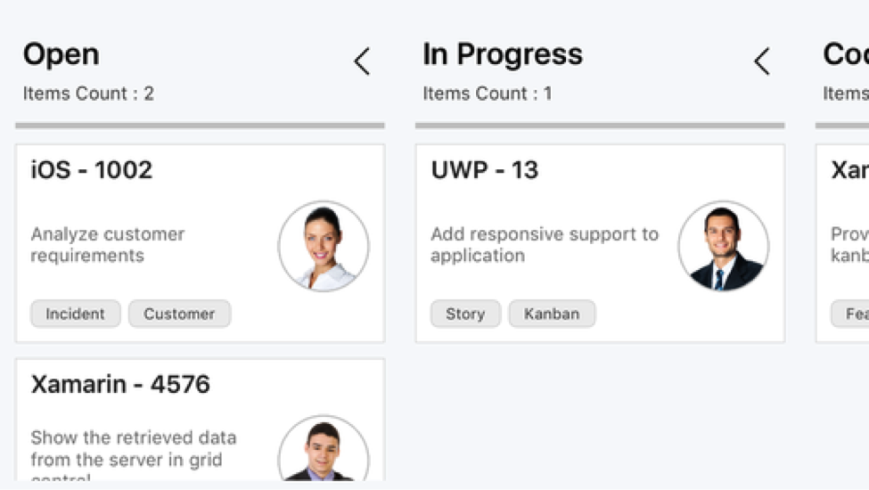

# Getting Started

This section provides a quick overview for working with Essential Kanban for Xamarin.Forms. It is an efficient way to visualize the workflow at each stage along its path to completion.

## Adding Kanban Reference

Refer this [article](https://help.syncfusion.com/xamarin/introduction/download-and-installation) to know how to obtain and reference Essential Studio components in your solution; then refer [this](https://help.syncfusion.com/xamarin/introduction/control-dependencies#sfkanban) link to know about the assemblies required for adding Kanban to your project.

I> After adding the reference, currently, an additional step is required for iOS and UWP projects. We need to call Init method in the `SfKanbanRenderer` as shown in this [KB article](https://www.syncfusion.com/kb/7171).

I> For UWP alone, one more additional step is required if the project is built in release mode with .NET Native tool chain enabled. You can refer the [KB article](https://www.syncfusion.com/kb/7170) for more details.

## Initialize Kanban

Import ['SfKanban'](http://help.syncfusion.com/cr/cref_files/xamarin/Syncfusion.SfKanban.XForms~Syncfusion.SfKanban.XForms.SfKanban.html) namespace as shown below in your respective page,





xmlns:kanban="clr-namespace:Syncfusion.SfKanban.XForms;assembly=Syncfusion.SfKanban.XForms"  


 
using Syncfusion.SfKanban.XForms;





Create an instance of ['SfKanban'](http://help.syncfusion.com/cr/cref_files/xamarin/Syncfusion.SfKanban.XForms~Syncfusion.SfKanban.XForms.SfKanban.html) control and set to Content property of a Page.





<kanban:SfKanban>
</kanban:SfKanban>





SfKanban kanban = new SfKanban();
this.Content = kanban;





## Initialize view model

Create a ViewModel class with a collection property to hold a collection of [`KanbanModel`](http://help.syncfusion.com/cr/cref_files/xamarin/Syncfusion.SfKanban.XForms~Syncfusion.SfKanban.XForms.KanbanModel.html) instances as shown below. Each [`KanbanModel`](http://help.syncfusion.com/cr/cref_files/xamarin/Syncfusion.SfKanban.XForms~Syncfusion.SfKanban.XForms.KanbanModel.html) instance represent a card in Kanban control.



public class ViewModel
{
	public ObservableCollection<KanbanModel> Cards { get; set; }
	public ViewModel()
	{
		Cards = new ObservableCollection<KanbanModel>();
		Cards.Add(new KanbanModel()
		{
			ID = 1,
			Title = "iOS - 1002",
			ImageURL = "Image1.png",
			Category = "Open",
			Description = "Analyze customer requirements",
			ColorKey = "Red",
			Tags = new string[] { "Incident", "Customer" }
		});
		Cards.Add(new KanbanModel()
		{
			ID = 6,
			Title = "Xamarin - 4576",
			ImageURL = "Image2.png",
			Category = "Open",
			Description = "Show the retrieved data from the server in grid control",
			ColorKey = "Green",
			Tags = new string[] { "Story", "Customer" }
		});
		Cards.Add(new KanbanModel()
		{
			ID = 13,
			Title = "UWP - 13",
			ImageURL = "Image4.png",
			Category = "In Progress",
			Description = "Add responsive support to application",
			ColorKey = "Brown",
			Tags = new string[] { "Story", "Customer" }
		});
		Cards.Add(new KanbanModel()
		{
			ID = 2543,
			Title = "Xamarin_iOS - 2543",
			Category = "Code Review",
			ImageURL = "Image3.png",
			Description = "Check login page validation",
			ColorKey = "Brown",
			Tags = new string[] { "Story", "Customer" }
		});
	}
}



Set the `ViewModel` instance as the `BindingContext` of your Page; this is done to bind properties of `ViewModel` to [`SfKanban`](http://help.syncfusion.com/cr/cref_files/xamarin/Syncfusion.SfKanban.XForms~Syncfusion.SfKanban.XForms.SfKanban.html).

N> Add namespace of ViewModel class in your XAML page if you prefer to set BindingContext in XAML.





<ContentPage xmlns="http://xamarin.com/schemas/2014/forms" 
		xmlns:x="http://schemas.microsoft.com/winfx/2009/xaml" 
		x:Class="GettingStartedKanban.MainPage" 
		xmlns:kanban="clr-namespace:Syncfusion.SfKanban.XForms;assembly=Syncfusion.SfKanban.XForms"  
		xmlns:local="clr-namespace:GettingStartedKanban"> 
	<ContentPage.BindingContext>
		<local:ViewModel>
		</local:ViewModel>   
	</ContentPage.BindingContext>
</ContentPage>





this.BindingContext = new ViewModel();





## Binding data to SfKanban

Bind the above data to [`SfKanban`](http://help.syncfusion.com/cr/cref_files/xamarin/Syncfusion.SfKanban.XForms~Syncfusion.SfKanban.XForms.SfKanban.html) using [`ItemsSource`](http://help.syncfusion.com/cr/cref_files/xamarin/Syncfusion.SfKanban.XForms~Syncfusion.SfKanban.XForms.SfKanban~ItemsSource.html) property.





<kanban:SfKanban ItemsSource="{Binding Cards}">
</kanban:SfKanban>





kanban.SetBinding(SfKanban.ItemsSourceProperty, "Cards");





## Defining columns

The columns are generated automatically based on the distinct values of ['KanbanModel.Category'](http://help.syncfusion.com/cr/cref_files/xamarin/Syncfusion.SfKanban.XForms~Syncfusion.SfKanban.XForms.KanbanModel~Category.html) from ['ItemsSource'](http://help.syncfusion.com/cr/cref_files/xamarin/Syncfusion.SfKanban.XForms~Syncfusion.SfKanban.XForms.SfKanban~ItemsSource.html). But, you can also define the columns by setting ['AutoGenerateColumns'](http://help.syncfusion.com/cr/cref_files/xamarin/Syncfusion.SfKanban.XForms~Syncfusion.SfKanban.XForms.SfKanban~AutoGenerateColumns.html) property to false and adding ['KanbanColumn'](http://help.syncfusion.com/cr/cref_files/xamarin/Syncfusion.SfKanban.XForms~Syncfusion.SfKanban.XForms.KanbanColumn.html) instance to ['Columns'](http://help.syncfusion.com/cr/cref_files/xamarin/Syncfusion.SfKanban.XForms~Syncfusion.SfKanban.XForms.SfKanban~Columns.html) property of ['SfKanban'](http://help.syncfusion.com/cr/cref_files/xamarin/Syncfusion.SfKanban.XForms~Syncfusion.SfKanban.XForms.SfKanban.html).




<kanban:SfKanban x:Name="kanban" AutoGenerateColumns="False"> 

	<kanban:SfKanban.Columns>

		<kanban:KanbanColumn x:Name="openColumn" Title="To Do"  >
		</kanban:KanbanColumn>

		<kanban:KanbanColumn x:Name="progressColumn" Title="In Progress">
		</kanban:KanbanColumn>

		<kanban:KanbanColumn x:Name="codeColumn" Title="Code Review" >
		</kanban:KanbanColumn>

		<kanban:KanbanColumn x:Name="doneColumn" Title="Done"  >
		</kanban:KanbanColumn> 

	</kanban:SfKanban.Columns>

</kanban:SfKanban> 





kanban.AutoGenerateColumns = false; 

KanbanColumn openColumn = new KanbanColumn();
openColumn.Title = "To Do";
kanban.Columns.Add(openColumn);

KanbanColumn progressColumn = new KanbanColumn();
progressColumn.Title = "In Progress";
kanban.Columns.Add(progressColumn);

KanbanColumn codeColumn = new KanbanColumn();
codeColumn.Title = "Code Review";
kanban.Columns.Add(codeColumn);

KanbanColumn doneColumn = new KanbanColumn();
doneColumn.Title = "Done";
kanban.Columns.Add(doneColumn);





Define the categories of column using [`Categories`](http://help.syncfusion.com/cr/cref_files/xamarin/Syncfusion.SfKanban.XForms~Syncfusion.SfKanban.XForms.KanbanColumn~Categories.html) property of [`KanbanColumn`](http://help.syncfusion.com/cr/cref_files/xamarin/Syncfusion.SfKanban.XForms~Syncfusion.SfKanban.XForms.KanbanColumn.html) and cards will be added to the respective columns.



openColumn.Categories = new List<object>() { "Open" };
progressColumn.Categories = new List<object>() { "In Progress" };
codeColumn.Categories = new List<object>() { "Code Review" };
doneColumn.Categories = new List<object>() { "Done" };



This is how the final output will look like on iOS, Android and Windows devices. You can download the entire source code of this demo from [here](http://files2.syncfusion.com/Xamarin.Forms/Samples/GettingStartedKanban.zip).

