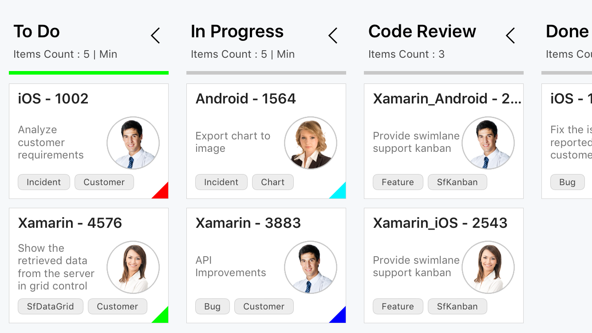
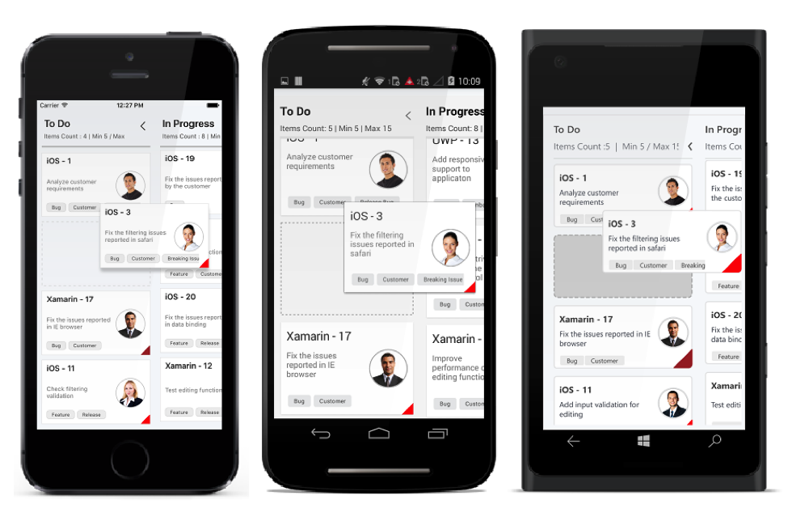

# Other features in Kanban

AllowDrag – It enable or disable the dragging cards in the corresponding Kanban column.

AllowDrop – It used to enable or disable the Kanban column to drop the Kanban cards while dragging. 





<kanban:SfKanban.Columns>

<kanban:KanbanColumn x:Name="column1" AllowDrop="false" AllowDrag="false" Title="To Do">

</kanban:KanbanColumn>

</kanban:SfKanban.Columns>





KanbanColumn column = new KanbanColumn();

column.AllowDrop = false;

column.AllowDrag = false;

kanban.Columns.Add(column);

 

Kanban Column Width – we can modify the default width of the kanban columns using ColumnWidth property





<kanban:SfKanban x:Name="kanban" ColumnWidth="100" ItemsSource="{Binding Cards}">

</kanban:SfKanban>





kanban.ColumnWidth = 200;

 





#Kanban Expand/Collapse Column 

Columns can be collapsed or expanded interactively using IsExpanded property. Also set card limits for columns using MaximumLimit, MinimumLimit properties.





<kanban:SfKanban.Columns>

<kanban:KanbanColumn x:Name="column1" Title="To Do" MinimumLimit="5" MaximumLimit="15" IsExpanded="false" >
</kanban:KanbanColumn>

<kanban:KanbanColumn x:Name="column2" Title="In Progress" IsExpanded="false" >
</kanban:KanbanColumn>

</kanban:SfKanban.Columns>





KanbanColumn column1 = new KanbanColumn();
column1.MinimumLimit = 5;
column1.MaximumLimit = 15;
column1.IsExpanded   = false;
KanbanColumn column2 = new KanbanColumn();
column2.IsExpanded   = false;
kanban.Columns.Add(column1);
kanban.Columns.Add(column2);

 

# Events

'itemTapped'

This event will be fired when we tap on the item.

'dragStart'
' 
This event will be fired when we start to drag a item.

'dragEnd'

This event should be fired whenever dragging is cancelled in following cases,
Event can be cancelled. When this event is cancelled, item will not be dropped on to the target column.

'dragEnter'

This event should be fired when a item enters a column. Event can be cancelled. When it is cancelled, DragOver events will not be fired for that target column at all and placeholder should not appear on further move over the same column.

'dragLeave'

This event should be fired when the item leaves the column. So it means, this event should be preceded by DragStart or DragEnter events.

'dragOver'

This event will be fired when placeholder appears in new position or whenever placeholder position changes on further move within same column.  Usually this event will be called after DragStart or DragEnter events.

'columnsGenerated'
 
This event will be fired when after the columns are auto-generated.  In this event, user can change the header text of the column.

