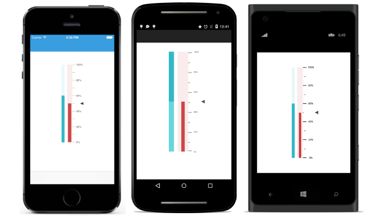

# Changing Display Orientation

SfLinearGauge provides support for the vertical orientation. By default SfLinearGauge renders with horizontal orientation. You can the change the orientation by using the `Orientation` property. Orientation can be categorized as follows.

* Horizontal
* Vertical





  linearGauge.Orientation = Syncfusion.SfGauge.XForms.Orientation.OrientationVertical;





	<gauge:SfLinearGauge x:Name="linearGauge" Orientation="Vertical" />
	




