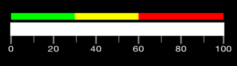

# Configure Range Indicator

Ranges of the linear scale are a collection of the linear range. A linear range is a visual element that starts with a specified StartValue and ends with a specified EndValue within the linear scale. These start and end values can be mentioned using LinearRange class.





<linear:LinearScale.Ranges>
		<linear:LinearRange x:Name="Range1" StartValue="0" Color="Green" Offset ="0.07" EndValue="30" StartWidth="10" EndWidth="10" />
		<linear:LinearRange x:Name="Range2" StartValue="30" Color="Yellow" EndValue="60" Offset ="0.07" StartWidth="10" EndWidth="10" />
		<linear:LinearRange x:Name="Range3" StartValue="60" Color="Red" EndValue="100" Offset ="0.07" StartWidth="10" EndWidth="10" />
</linear:LinearScale.Ranges>
	




	LinearRange Range1 = new LinearRange ();
    Range1.StartValue = 0;
    Range1.EndValue = 30;
    Range1.Color = Color.FromRgb (0, 255, 0);
    Range1.StartWidth = 10;
    Range1.EndWidth = 10;
    Range1.Offset = 0.17;
    scale.Ranges.Add (Range1);
    //Range2
    LinearRange Range2 = new LinearRange ();
    Range2.StartValue = 30;
    Range2.EndValue = 60;
    Range2.Color = Color.FromRgb (255, 255, 0);
    Range2.StartWidth = 10;
    Range2.EndWidth = 10; 
    Range2.Offset = 0.07;                       
    scale.Ranges.Add (Range2); 
    //Range2
    LinearRange Range3 = new LinearRange ();
    Range3.StartValue = 60;
    Range3.EndValue = 100;
    Range3.Color = Color.FromRgb (255, 0, 0);
    Range3.StartWidth = 10;
    Range3.EndWidth = 10; 
    Range3.Offset = 0.07;                       
    scale.Ranges.Add (Range3); 
	




