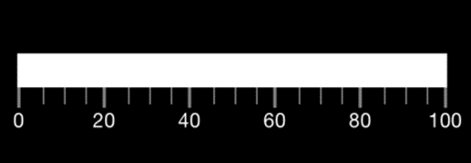

# Configure Ticks and Labels

LinearScale is used to set the Labels, Values and Ticks to specify the basic look and feel of the SfLinearGauge. It defines the overall minimum and maximum values, along with the frequency of labels and ticks through the interval of the scale. It can contain multiple ranges within a scale. It also contains one or more pointers to point out the measures of the linear scale.




<linear:SfLinearGauge.Scales>
		<linear:LinearScale x:Name="scale" MinimumValue="0" MaximumValue="100" Interval="20" ScaleBarLength="100" ScaleBarColor="#FAECEC" MinorTicksPerInterval="1" ScaleBarSize="13" ScalePosition="BackWard" />
</linear:SfLinearGauge.Scales>		
	




	LinearScale scale = new LinearScale();
			scale.MinimumValue = 0;
			scale.MaximumValue = 100;
			scale.Interval = 20;
			scale.ScaleBarLength = 100;
			scale.ScaleBarColor = Color.FromRgb(250, 236, 236);
			scale.LabelColor = Color.FromRgb(84, 84, 84);
			scale.MinorTicksPerInterval = 1;
			scale.ScaleBarSize = 13;
			scale.ScalePosition = ScalePosition.BackWard;
			linearGauge.Scales.Add(scale);
	




