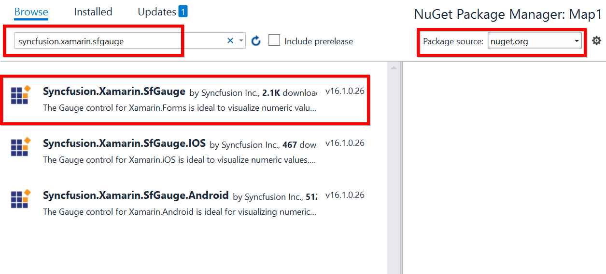
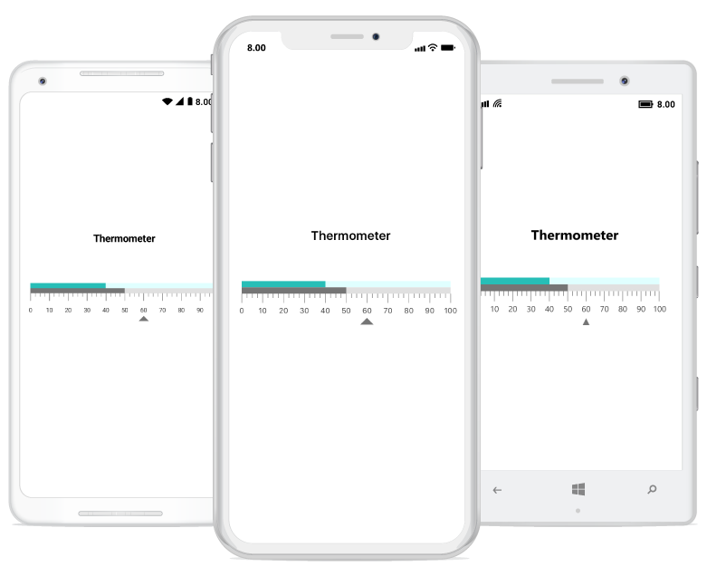

# Getting Started

This section explains the steps required to configure a [`SfLinearGauge`](https://help.syncfusion.com/cr/cref_files/xamarin/Syncfusion.SfGauge.XForms~Syncfusion.SfGauge.XForms.SfLinearGauge.html) control in a real-time scenario and also provides a walk-through on some of the customization features available in [`SfLinearGauge`](https://help.syncfusion.com/cr/cref_files/xamarin/Syncfusion.SfGauge.XForms~Syncfusion.SfGauge.XForms.SfLinearGauge.html) control.

## Adding linear gauge reference

Syncfusion Xamarin components are available in [nuget.org](https://www.nuget.org/). To add linear gauge to your project, open the NuGet package manager in Visual Studio, and search for [syncfusion.xamarin.sfgauge](https://www.nuget.org/packages/Syncfusion.Xamarin.SfGauge), and then install it. 

To know more about obtaining our components, refer to these links: [Mac](https://help.syncfusion.com/xamarin/introduction/download-and-installation/mac) and [Windows](https://help.syncfusion.com/xamarin/introduction/download-and-installation/windows). Also, if you prefer to manually refer the assemblies instead of NuGet, refer to this [link](https://help.syncfusion.com/xamarin/introduction/control-dependencies#sflineargauge) to know about the dependent assemblies for linear gauge.

I> After adding the reference, an additional step is required for iOS and UWP projects. You should create an instance of the `SfGaugeRenderer` in iOS and UWP projects as shown in this [KB article](https://www.syncfusion.com/kb/8271).

I>For UWP alone, one more additional step is required if the project is built-in release mode with .NET Native tool chain is enabled. You can refer to this [KB article](https://www.syncfusion.com/kb/8272) for more details.

## Reference Mono.Android.Export

1. In the Solution Explorer in the Android project, right-click on References and choose Add Reference.

2. In the Add Reference window, select the Assemblies tab and choose the Framework.

3. In the Framework tab, ensure Mono.Android and Mono.Android.Export  is checked and click ok.

**Adding namespace for the added assemblies**





	     xmlns:linear="clr-namespace:Syncfusion.SfGauge.XForms;assembly=Syncfusion.SfGauge.XForms"
	




	      using Syncfusion.SfGauge.XForms;





## Initialize gauge

You can initialize the [`SfLinearGauge`](https://help.syncfusion.com/cr/cref_files/xamarin/Syncfusion.SfGauge.XForms~Syncfusion.SfGauge.XForms.SfLinearGauge.html) control with a required optimal name by using the included namespace.





			<gauge:SfLinearGauge/>





		SfLinearGauge linearGauge = new SfLinearGauge();
		this.Content = linearGauge;





## Adding header

You can assign a unique header to [`SfLinearGauge`](https://help.syncfusion.com/cr/cref_files/xamarin/Syncfusion.SfGauge.XForms~Syncfusion.SfGauge.XForms.SfLinearGauge.html) by using the [`LinearHeader`](https://help.syncfusion.com/cr/cref_files/xamarin/Syncfusion.SfGauge.XForms~Syncfusion.SfGauge.XForms.LinearHeader.html) property and position it wherever as you desired by using the [`Offset`](https://help.syncfusion.com/cr/cref_files/xamarin/Syncfusion.SfGauge.XForms~Syncfusion.SfGauge.XForms.LinearHeader~Offset.html) property.





         <gauge:SfLinearGauge>
		 
             <gauge:SfLinearGauge.Header>
                <gauge:LinearHeader Text="Thermometer" TextSize="20" FontAttributes="Bold" Offset="0.35,0.35"/>
             </gauge:SfLinearGauge.Header>
			 
         </gauge:SfLinearGauge>





		SfLinearGauge linearGauge=new SfLinearGauge(); 
        LinearHeader linearHeader = new LinearHeader();
        linearHeader.Text = "Thermometer";
        linearHeader.TextSize = 20;
        linearHeader.FontAttributes = FontAttributes.Bold;
        linearHeader.Offset = new Point(0.35, 0.35);
        linearGauge.Header = linearHeader;





## Configuring scales

Scales is a collection of [`LinearScale`](https://help.syncfusion.com/cr/cref_files/xamarin/Syncfusion.SfGauge.XForms~Syncfusion.SfGauge.XForms.LinearScale.html), which is used to indicate the numeric values. Scale bar, ticks, labels, ranges, and pointers are the sub elements of a scale. 

The [`MinimumValue`](https://help.syncfusion.com/cr/cref_files/xamarin/Syncfusion.SfGauge.XForms~Syncfusion.SfGauge.XForms.LinearScale~MinimumValue.html) and [`MaximumValue`](https://help.syncfusion.com/cr/cref_files/xamarin/Syncfusion.SfGauge.XForms~Syncfusion.SfGauge.XForms.LinearScale~MaximumValue.html) properties allow you to set the scale range.





	    <gauge:SfLinearGauge>
            <gauge:SfLinearGauge.Scales>
            <gauge:LinearScale ScaleBarColor="#e0e0e0" LabelColor="#424242">
                    <gauge:LinearScale.MajorTickSettings>
                        <gauge:LinearTickSettings Thickness="1"  Color="Gray" Length="15"/>
                    </gauge:LinearScale.MajorTickSettings>
                    <gauge:LinearScale.MinorTickSettings>
                        <gauge:LinearTickSettings Thickness="1"  Color="Gray" Length="7"/>
                    </gauge:LinearScale.MinorTickSettings>
                </gauge:LinearScale>
        </gauge:SfLinearGauge.Scales>
        </gauge:SfLinearGauge>





		LinearScale linearScale = new LinearScale();
        linearScale.ScaleBarColor = Color.FromHex("#e0e0e0");
        linearScale.LabelColor = Color.FromHex("#424242");
        linearScale.MajorTickSettings.Thickness = 1;
        linearScale.MajorTickSettings.Length = 15;
        linearScale.MajorTickSettings.Color = Color.Gray;
        linearScale.MinorTickSettings.Color = Color.Gray;
        linearScale.MinorTickSettings.Length = 7;
        linearScale.MinorTickSettings.Thickness = 1;
        linearGauge.Scales.Add(linearScale);
	    this.Content = linearGauge;
	




## Adding a symbol pointer

[`SymbolPointer`](https://help.syncfusion.com/cr/cref_files/xamarin/Syncfusion.SfGauge.XForms~Syncfusion.SfGauge.XForms.SymbolPointer.html) is a shape that can be placed to mark the pointer value in gauge.





            <gauge:LinearScale.Pointers>
                <gauge:SymbolPointer Value="60" Offset="45" Color="#757575"/>
            </gauge:LinearScale.Pointers>





	    SymbolPointer symbolPointer = new SymbolPointer();
        symbolPointer.Value = 60;
        symbolPointer.Offset = 45;
        symbolPointer.Color = Color.FromHex("#757575");
        linearScale.Pointers.Add(symbolPointer);





## Adding a bar pointer

[`BarPointer`](https://help.syncfusion.com/cr/cref_files/xamarin/Syncfusion.SfGauge.XForms~Syncfusion.SfGauge.XForms.BarPointer.html) is used to mark the scale values. It starts at the beginning of gauge and ends at the pointer value.





                    <gauge:LinearScale.Pointers>
                        <gauge:BarPointer Value="50" Color="#757575" />
                    </gauge:LinearScale.Pointers>





		BarPointer barPointer = new BarPointer();
        barPointer.Value = 50;
        barPointer.Color = Color.FromHex("#757575");
        linearScale.Pointers.Add(barPointer);
	




## Adding ranges

You can categorize the scale values using the start and end values properties in [`LinearRange`](https://help.syncfusion.com/cr/cref_files/xamarin/Syncfusion.SfGauge.XForms~Syncfusion.SfGauge.XForms.LinearRange.html). You can add multiple ranges for a scale using the `ranges` property.




		
                    <gauge:LinearScale.Ranges>
                        <gauge:LinearRange StartValue="0" EndValue="40" Color="#27beb7" Offset="-20"/>
                        <gauge:LinearRange StartValue="40" EndValue="100" Color="LightCyan" Offset="-20"/>
                    </gauge:LinearScale.Ranges>



    
	
		LinearRange linearRange = new LinearRange();
        linearRange.StartValue = 0;
        linearRange.EndValue = 40;
        linearRange.Color = Color.FromHex("#27beb7");
        linearRange.Offset = -20;
        linearScale.Ranges.Add(linearRange);

        LinearRange linearRange1 = new LinearRange();
        linearRange1.StartValue = 40;
        linearRange1.EndValue = 100;
        linearRange1.Color = Color.LightCyan;
        linearRange1.Offset = -20;
        linearScale.Ranges.Add(linearRange1);
        linearGauge.Scales.Add(linearScale);
	




The following code example gives you the complete code of above configurations.



 

<?xml version="1.0" encoding="utf-8" ?>
<ContentPage xmlns="http://xamarin.com/schemas/2014/forms"
             xmlns:x="http://schemas.microsoft.com/winfx/2009/xaml"
             xmlns:gauge="clr-namespace:Syncfusion.SfGauge.XForms;assembly=Syncfusion.SfGauge.XForms"  
             xmlns:local="clr-namespace:Gauge_GettingStarted"
             x:Class="Gauge_GettingStarted.MainPage">

    <gauge:SfLinearGauge>
        <gauge:SfLinearGauge.Header>
            <gauge:LinearHeader Text="Thermometer" TextSize="20" FontAttributes="Bold" Offset="0.35,0.35"/>
        </gauge:SfLinearGauge.Header>
        <gauge:SfLinearGauge.Scales>
            <gauge:LinearScale ScaleBarColor="#e0e0e0" LabelColor="#424242">
                <gauge:LinearScale.MajorTickSettings>
                    <gauge:LinearTickSettings Thickness="1"  Color="Gray" Length="15"/>
                </gauge:LinearScale.MajorTickSettings>
                <gauge:LinearScale.MinorTickSettings>
                    <gauge:LinearTickSettings Thickness="1"  Color="Gray" Length="7"/>
                </gauge:LinearScale.MinorTickSettings>
                <gauge:LinearScale.Pointers>
                    <gauge:SymbolPointer Value="60" Offset="45" Color="#757575"/>
                    <gauge:BarPointer Value="50" Color="#757575" />
                </gauge:LinearScale.Pointers>
                <gauge:LinearScale.Ranges>
                    <gauge:LinearRange StartValue="0" EndValue="40" Color="#27beb7" >
                        <gauge:LinearRange.Offset>
                            <OnPlatform x:TypeArguments="x:Double" iOS="-20" Android="-20" WinPhone="-40" />
                        </gauge:LinearRange.Offset>
                    </gauge:LinearRange>
                    <gauge:LinearRange StartValue="40" EndValue="100" Color="LightCyan">
                        <gauge:LinearRange.Offset>
                            <OnPlatform x:TypeArguments="x:Double" iOS="-20" Android="-20" WinPhone="-40" />
                        </gauge:LinearRange.Offset>
                    </gauge:LinearRange>
                </gauge:LinearScale.Ranges>
            </gauge:LinearScale>
        </gauge:SfLinearGauge.Scales>
        
    </gauge:SfLinearGauge>
</ContentPage>
	 


  
   
using Syncfusion.SfGauge.XForms;
using Xamarin.Forms;

namespace Gauge_GettingStarted
{
	public partial class MainPage : ContentPage
	{
		public MainPage()
		{
			InitializeComponent();

            //Initializing linear gauge
            SfLinearGauge linearGauge = new SfLinearGauge();

            //Adding header 
            LinearHeader linearHeader = new LinearHeader();
            linearHeader.Text = "Thermometer";
            linearHeader.TextSize = 20;
            linearHeader.FontAttributes = FontAttributes.Bold;
            linearHeader.Offset = new Point(0.35, 0.35);
            linearGauge.Header = linearHeader;

            //Initializing scale for linear gauge
            LinearScale linearScale = new LinearScale();
            linearScale.ScaleBarColor = Color.FromHex("#e0e0e0");
            linearScale.LabelColor = Color.FromHex("#424242");
            linearScale.MajorTickSettings.Thickness = 1;
            linearScale.MajorTickSettings.Length = 15;
            linearScale.MajorTickSettings.Color = Color.Gray;
            linearScale.MinorTickSettings.Color = Color.Gray;
            linearScale.MinorTickSettings.Length = 7;
            linearScale.MinorTickSettings.Thickness = 1;
            linearGauge.Scales.Add(linearScale);

            //Adding symbol pointer
            SymbolPointer symbolPointer = new SymbolPointer();
            symbolPointer.Value = 60;
            symbolPointer.Offset = 45;
            symbolPointer.Color = Color.FromHex("#757575");
            linearScale.Pointers.Add(symbolPointer);

            //Adding bar pointer
            BarPointer barPointer = new BarPointer();
            barPointer.Value = 50;
            barPointer.Color = Color.FromHex("#757575");
            linearScale.Pointers.Add(barPointer);

            //Adding linear ranges
            LinearRange linearRange = new LinearRange();
            linearRange.StartValue = 0;
            linearRange.EndValue = 40;
            linearRange.Color = Color.FromHex("#27beb7");
            linearRange.Offset = Device.RuntimePlatform == Device.iOS ? -20 : Device.RuntimePlatform == Device.Android ? -20 : -40;
            linearScale.Ranges.Add(linearRange);

            LinearRange linearRange1 = new LinearRange();
            linearRange1.StartValue = 40;
            linearRange1.EndValue = 100;
            linearRange1.Color = Color.LightCyan;
            linearRange1.Offset = Device.RuntimePlatform == Device.iOS ? -20 : Device.RuntimePlatform == Device.Android ? -20 : -40;
            linearScale.Ranges.Add(linearRange1);
            linearGauge.Scales.Add(linearScale);
            this.Content = linearGauge;
        }
    }
}
	

       


The following linear gauge is created as a result of the above codes.
 

You can find the complete getting started sample from this [`link`](http://www.syncfusion.com/downloads/support/directtrac/general/ze/Gauge-GettingStarted1094113275).  

