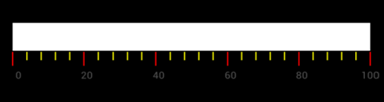

# LinearTickSettings

Ticks are categorized into two types: major and minor. These ticks are arranged with respect to the specified frequency i.e., Interval of the linear scale. The minor ticks are displayed using the 
MinorTicksPerInterval property.





	LinearTickSettings minor = new LinearTickSettings ();
	minor.Length = 10;
	minor.Color = Color.FromRgb (175, 175, 175);
	minor.Thickness = 1;
	scale.MinorTickSettings = minor;
	//Major Ticks setting
	LinearTickSettings major = new LinearTickSettings ();
	major.Length = 10;
	major.Color = Color.FromRgb (175, 175, 175);
    major.Thickness = 1;
    scale.MajorTickSettings = major; 
	




	<gauge:LinearTickSettings x:Name="minor" Length="10" Thickness="1" MinorTickSettings="minor" />
	




