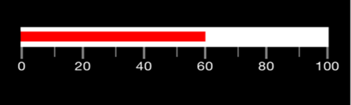
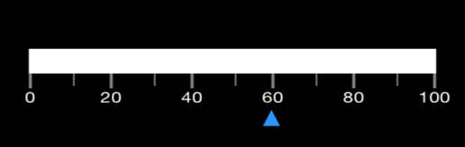

# Types of Value Indicator

SfLinearGauge provides support to mark the values using BarPointer and SymbolPointer.

## Through Bar Pointer

`BarPointer` is an accenting line or colored bar that is placed on the SfLinearGauge to mark the values. 





<linear:LinearScale x:Name="scale" MinimumValue="0" MaximumValue="100" Interval="20" ScaleBarLength="100" ScaleBarColor="#FAECEC" MinorTicksPerInterval="1" ScaleBarSize="13" ScalePosition="BackWard" >
		<linear:LinearScale.Pointers>
			<linear:BarPointer x:Name="rangePointer" Value="50"  Thickness="10" />
		</linear:LinearScale.Pointers>
</linear:LinearScale>
	



LinearScale scale = new LinearScale();
scale.MinimumValue = 0;
scale.MaximumValue = 100;
scale.Interval = 20;
scale.ScaleBarLength = 100;
scale.ScaleBarColor = Color.FromRgb(250, 236, 236);
scale.LabelColor = Color.FromRgb(84, 84, 84);
scale.MinorTicksPerInterval = 1;
scale.ScaleBarSize = 13;
scale.ScalePosition = ScalePosition.BackWard;			
			
BarPointer rangePointer = new BarPointer();
rangePointer.Value = 50;
rangePointer.Thickness = 10;
scale.Pointers.Add(rangePointer);
			
linearGauge.Scales.Add(scale);





## Through Symbol Pointer

In SymbolPointer, the value is pointed by a symbol on the scale. The Symbol Pointer class is derived from Pointer class. You can modify the symbol pointer size using the `StrokeWidth` property. The color of the symbol pointer is changed using the `Color` property.





<linear:LinearScale x:Name="scale" MinimumValue="0" MaximumValue="100" Interval="20" ScaleBarLength="100" ScaleBarColor="#FAECEC" MinorTicksPerInterval="1" ScaleBarSize="13" ScalePosition="BackWard" >
		<linear:LinearScale.Pointers>
			<linear:SymbolPointer x:Name="symbolPointer" Value="60"  Offset="0.0" Thickness="3" />
		</linear:LinearScale.Pointers>
</linear:LinearScale>
	




LinearScale scale = new LinearScale();
scale.MinimumValue = 0;
scale.MaximumValue = 100;
scale.Interval = 20;
scale.ScaleBarLength = 100;
scale.ScaleBarColor = Color.FromRgb(250, 236, 236);
scale.LabelColor = Color.FromRgb(84, 84, 84);
scale.MinorTicksPerInterval = 1;
scale.ScaleBarSize = 13;
scale.ScalePosition = ScalePosition.BackWard;

SymbolPointer symbolPointer = new SymbolPointer();
symbolPointer.Value = 50;
symbolPointer.Offset = 0.0;
symbolPointer.Thickness = 3;
scale.Pointers.Add(symbolPointer);
			
linearGauge.Scales.Add(scale);
	




