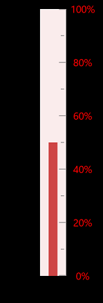
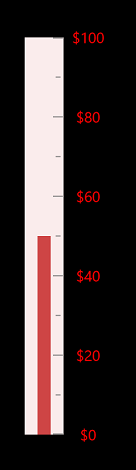

---

layout: post
title: Labels in Syncfusion LinearGauge control for Xamarin.Forms
description:  Learn how to set labels in Syncfusion LinearGauge control
platform: xamarin
control: LinearGauge
documentation: ug

---

# LABELS

Labels associate a numeric value with major scale tick marks.

## Label Customization

The label color can be changed using the `LabelColor` property. The labels can be positioned far away from the ticks by using the `LabelOffset` property.The size of the Labels can be changed by using the `LabelFontSize` property.





    <linear:SfLinearGauge x:Name="linearGauge">
          <linear:SfLinearGauge.Scales>
	  				<linear:LinearScale x:Name="scale"  LabelOffset="0.3" LabelColor="Red" LabelFontSize="10">
                    </linear:LinearScale>
	      </linear:SfLinearGauge.Scales>			
	</linear:SfLinearGauge>	            





            SfLinearGauge linearGauge = new SfLinearGauge();         
            LinearScale scale = new LinearScale();           
            ObservableCollection<LinearScale> scales = new ObservableCollection<LinearScale>();                 
            scale.LabelOffset = 0.3;
            scale.LabelFontSize = 10;
            scale.LabelColor = Color.FromRgb(84, 84, 84);
            scales.Add(scale);
            linearGauge.Scales.Add(scale);
            this.Content = linearGauge;

    




## Label Postfix and Prefix

You can set the postfix/Prefix values to the scale labels using `LabelPostfix` and `LabelPrefix` Properties respectively.

### LabelPostfix

This property allows you to set the postfix values to the scale labels.





    <linear:SfLinearGauge x:Name="linearGauge">
          <linear:SfLinearGauge.Scales>
	  				<linear:LinearScale x:Name="scale" LabelPostfix ="%">
                    </linear:LinearScale>
	      </linear:SfLinearGauge.Scales>			
	</linear:SfLinearGauge>	            
 





            SfLinearGauge linearGauge = new SfLinearGauge();         
            LinearScale scale = new LinearScale();           
            ObservableCollection<LinearScale> scales = new ObservableCollection<LinearScale>();                 
            scale.LabelPostfix = "%";
            scales.Add(scale);
            linearGauge.Scales.Add(scale);
            this.Content = linearGauge;
    




### LabelPrefix
This property allows you to set the Prefix values to the scale labels.





        <linear:SfLinearGauge x:Name="linearGauge">
          <linear:SfLinearGauge.Scales>
	  				<linear:LinearScale x:Name="scale" LabelPrefix ="$">
                    </linear:LinearScale>
	      </linear:SfLinearGauge.Scales>			
	    </linear:SfLinearGauge>	 





            SfLinearGauge linearGauge = new SfLinearGauge();         
            LinearScale scale = new LinearScale();           
            ObservableCollection<LinearScale> scales = new ObservableCollection<LinearScale>();                 
            scale.LabelPrefix ="$";
            scales.Add(scale);
            linearGauge.Scales.Add(scale);
            this.Content = linearGauge;
   
    



### ShowLabels

ShowLabels property is a Boolean property which is used to enable or disable Label feature in linearGauge





        <linear:SfLinearGauge x:Name="linearGauge">
          <linear:SfLinearGauge.Scales>
	  				<linear:LinearScale x:Name="scale" ShowLabels = "False">
                    </linear:LinearScale>
	      </linear:SfLinearGauge.Scales>			
	    </linear:SfLinearGauge>	 





            SfLinearGauge linearGauge = new SfLinearGauge();         
            LinearScale scale = new LinearScale();           
            ObservableCollection<LinearScale> scales = new ObservableCollection<LinearScale>();                 
            scale.ShowLabels = false;
            scales.Add(scale);
            linearGauge.Scales.Add(scale);
            this.Content = linearGauge;
   
    



