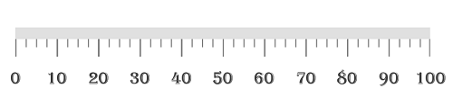
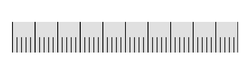

---

layout: post
title: Labels in Syncfusion LinearGauge control for Xamarin.Forms
description:  Learn how to set labels in Syncfusion LinearGauge control
platform: xamarin
control: LinearGauge
documentation: ug

---

# Labels 

[`LinearScale`](https://help.syncfusion.com/cr/cref_files/xamarin/Syncfusion.SfGauge.XForms~Syncfusion.SfGauge.XForms.LinearScale.html) labels associate a numeric value with major scale tick marks.

## Label color customization

The label color can be changed using the [`LabelColor`](https://help.syncfusion.com/cr/cref_files/xamarin/Syncfusion.SfGauge.XForms~Syncfusion.SfGauge.XForms.LinearScale~LabelColor.html) property.





     <gauge:SfLinearGauge>
               <gauge:SfLinearGauge.Scales>
                <gauge:LinearScale ScaleBarColor="#e0e0e0" LabelColor="Purple">
                    <gauge:LinearScale.MajorTickSettings>
                     <gauge:LinearTickSettings Thickness="1"  Color="Gray" Length="15"/>
                      </gauge:LinearScale.MajorTickSettings>
                      <gauge:LinearScale.MinorTickSettings>
                      <gauge:LinearTickSettings Thickness="1"  Color="Gray" Length="7"/>
                       </gauge:LinearScale.MinorTickSettings>
                </gauge:LinearScale>
            </gauge:SfLinearGauge.Scales>
        </gauge:SfLinearGauge>      





            SfLinearGauge linearGauge = new SfLinearGauge();
            LinearScale linearScale = new LinearScale();
            linearScale.ScaleBarColor = Color.FromHex("#e0e0e0");
            linearScale.MajorTickSettings.Thickness = 1;
            linearScale.MajorTickSettings.Length = 15;
            linearScale.MajorTickSettings.Color = Color.Gray;
            linearScale.MinorTickSettings.Color = Color.Gray;
            linearScale.MinorTickSettings.Length = 7;
            linearScale.MinorTickSettings.Thickness = 1;
            linearScale.LabelColor = Color.Purple;
            linearGauge.Scales.Add(linearScale);

    




## Label font customization

The label font can be customized by using the [`LabelFontSize`](https://help.syncfusion.com/cr/cref_files/xamarin/Syncfusion.SfGauge.XForms~Syncfusion.SfGauge.XForms.LinearScale~LabelFontSize.html), [`FontAttribute`](https://help.syncfusion.com/cr/cref_files/xamarin/Syncfusion.SfGauge.XForms~Syncfusion.SfGauge.XForms.LinearScale~FontAttributes.html), and [`FontFamily`](https://help.syncfusion.com/cr/cref_files/xamarin/Syncfusion.SfGauge.XForms~Syncfusion.SfGauge.XForms.LinearScale~FontFamily.html) properties.





    <gauge:SfLinearGauge>

            <gauge:SfLinearGauge.Scales>
                <gauge:LinearScale ScaleBarColor="#e0e0e0" LabelColor="#424242" LabelFontSize ="15" FontAttributes="Bold">
                    <gauge:LinearScale.FontFamily>
                        <OnPlatform x:TypeArguments="x:String" iOS="Chalkduster" Android="algerian.ttf" WinPhone="Chiller" />
                    </gauge:LinearScale.FontFamily>
                    <gauge:LinearScale.MajorTickSettings>
                 <gauge:LinearTickSettings Thickness="1"  Color="Gray" Length="15"/>
                   </gauge:LinearScale.MajorTickSettings>
                   <gauge:LinearScale.MinorTickSettings>
                    <gauge:LinearTickSettings Thickness="1"  Color="Gray" Length="7"/>
                    </gauge:LinearScale.MinorTickSettings>
                </gauge:LinearScale>
            </gauge:SfLinearGauge.Scales>

        </gauge:SfLinearGauge>           
 





            SfLinearGauge linearGauge = new SfLinearGauge();
            LinearScale linearScale = new LinearScale();
            linearScale.LabelFontSize = 15;
            linearScale.ScaleBarColor = Color.FromHex("#e0e0e0");
            linearScale.FontAttributes = FontAttributes.Bold;
            linearScale.MajorTickSettings.Thickness = 1;
            linearScale.MajorTickSettings.Length = 15;
            linearScale.MajorTickSettings.Color = Color.Gray;
            linearScale.MinorTickSettings.Color = Color.Gray;
            linearScale.MinorTickSettings.Length = 7;
            linearScale.MinorTickSettings.Thickness = 1;
            linearScale.LabelColor = Color.FromHex("#424242");
            linearScale.FontFamily = Device.RuntimePlatform == Device.iOS ? "Chalkduster" : Device.RuntimePlatform == Device.Android ? "algerian.ttf" : "Chiller";
            linearGauge.Scales.Add(linearScale);
    




## Setting position for labels

The labels can be positioned far away from the ticks by using the [`LabelOffset`](https://help.syncfusion.com/cr/cref_files/xamarin/Syncfusion.SfGauge.XForms~Syncfusion.SfGauge.XForms.Scale~LabelOffset.html) property in pixel.





        <gauge:SfLinearGauge>
             <gauge:SfLinearGauge.Scales>
                <gauge:LinearScale ScaleBarColor="#e0e0e0" LabelColor="#424242" LabelOffset ="5">
                    <gauge:LinearScale.MajorTickSettings>
                          <gauge:LinearTickSettings Thickness="1"  Color="Gray" Length="15"/>
                    </gauge:LinearScale.MajorTickSettings>
                     <gauge:LinearScale.MinorTickSettings>
                            <gauge:LinearTickSettings Thickness="1"  Color="Gray" Length="7"/>
                      </gauge:LinearScale.MinorTickSettings>
                </gauge:LinearScale>
            </gauge:SfLinearGauge.Scales>
        </gauge:SfLinearGauge>      





            SfLinearGauge linearGauge = new SfLinearGauge();
            LinearScale linearScale = new LinearScale();
            linearScale.ScaleBarColor = Color.FromHex("#e0e0e0");
            linearScale.MajorTickSettings.Thickness = 1;
            linearScale.MajorTickSettings.Length = 15;
            linearScale.MajorTickSettings.Color = Color.Gray;
            linearScale.MinorTickSettings.Color = Color.Gray;
            linearScale.MinorTickSettings.Length = 7;
            linearScale.MinorTickSettings.Thickness = 1;
            linearScale.LabelColor = Color.FromHex("#424242");
            linearScale.LabelOffset = 5;
            linearGauge.Scales.Add(linearScale);
   




### Setting postfix and prefix for labels

You can  postfix/prefix values to the scale labels using the [`LabelPostfix`](https://help.syncfusion.com/cr/cref_files/xamarin/Syncfusion.SfGauge.XForms~Syncfusion.SfGauge.XForms.LinearScale~LabelPostfix.html) and [`LabelPrefix`](https://help.syncfusion.com/cr/cref_files/xamarin/Syncfusion.SfGauge.XForms~Syncfusion.SfGauge.XForms.LinearScale~LabelPrefix.html) properties, respectively.

### Setting label postfix

The [`LabelPostfix`](https://help.syncfusion.com/cr/cref_files/xamarin/Syncfusion.SfGauge.XForms~Syncfusion.SfGauge.XForms.LinearScale~LabelPostfix.html) property allows you to postfix the values to scale labels.





       <gauge:SfLinearGauge>
            <gauge:SfLinearGauge.Scales>
                <gauge:LinearScale MinimumValue = "0" MaximumValue ="1000" Interval ="200" LabelPostfix ="K" ScaleBarColor="#e0e0e0" LabelColor="#424242">
                    <gauge:LinearScale.MajorTickSettings>
                        <gauge:LinearTickSettings Thickness="1"  Color="Gray" Length="15"/>
                    </gauge:LinearScale.MajorTickSettings>
                    <gauge:LinearScale.MinorTickSettings>
                        <gauge:LinearTickSettings Thickness="1"  Color="Gray" Length="7"/>
                    </gauge:LinearScale.MinorTickSettings>
                </gauge:LinearScale>
            </gauge:SfLinearGauge.Scales>
        </gauge:SfLinearGauge>    





            SfLinearGauge linearGauge = new SfLinearGauge();
            LinearScale linearScale = new LinearScale();
            linearScale.MinimumValue = 0;
            linearScale.MaximumValue = 1000;
            linearScale.Interval = 200;
            linearScale.ScaleBarColor = Color.FromHex("#e0e0e0");
             linearScale.MajorTickSettings.Thickness = 1;
            linearScale.MajorTickSettings.Length = 15;
            linearScale.MajorTickSettings.Color = Color.Gray;
            linearScale.MinorTickSettings.Color = Color.Gray;
            linearScale.MinorTickSettings.Length = 7;
            linearScale.MinorTickSettings.Thickness = 1;
            linearScale.LabelColor = Color.FromHex("#424242");
            linearScale.LabelPostfix = "K";
            linearGauge.Scales.Add(linearScale);
    




### Setting label prefix

The [`LabelPrefix`](https://help.syncfusion.com/cr/cref_files/xamarin/Syncfusion.SfGauge.XForms~Syncfusion.SfGauge.XForms.LinearScale~LabelPrefix.html) property allows you to prefix the values to scale labels.





       <gauge:SfLinearGauge>
            <gauge:SfLinearGauge.Scales>
                <gauge:LinearScale  ScaleBarColor="#e0e0e0" LabelColor="#424242" LabelPrefix ="$">
                    <gauge:LinearScale.MajorTickSettings>
                        <gauge:LinearTickSettings Thickness="1"  Color="Gray" Length="15"/>
                    </gauge:LinearScale.MajorTickSettings>
                    <gauge:LinearScale.MinorTickSettings>
                        <gauge:LinearTickSettings Thickness="1"  Color="Gray" Length="7"/>
                    </gauge:LinearScale.MinorTickSettings>
                </gauge:LinearScale>
            </gauge:SfLinearGauge.Scales>
        </gauge:SfLinearGauge>      





             SfLinearGauge linearGauge = new SfLinearGauge();
            LinearScale linearScale = new LinearScale();
            linearScale.ScaleBarColor = Color.FromHex("#e0e0e0");
            linearScale.LabelColor = Color.FromHex("#424242");
            linearScale.MajorTickSettings.Thickness = 1;
            linearScale.MajorTickSettings.Length = 15;
            linearScale.MajorTickSettings.Color = Color.Gray;
            linearScale.MinorTickSettings.Color = Color.Gray;
            linearScale.MinorTickSettings.Length = 7;
            linearScale.MinorTickSettings.Thickness = 1;
            linearScale.LabelPrefix = "$";
            linearGauge.Scales.Add(linearScale);
   
    




## Labels visibility

Labels visibility can be customized using the [`ShowLabels`](https://help.syncfusion.com/cr/cref_files/xamarin/Syncfusion.SfGauge.XForms~Syncfusion.SfGauge.XForms.LinearScale~ShowLabels.html) property of linear scale.





       <gauge:SfLinearGauge>
            <gauge:SfLinearGauge.Scales>
                <gauge:LinearScale ScaleBarColor="#e0e0e0" ShowLabels = "False" ScaleBarSize ="40">
                <gauge:LinearScale.MajorTickSettings>
                    <gauge:LinearTickSettings Thickness="1" Color ="Black" Length ="40" Offset ="-40" />
                </gauge:LinearScale.MajorTickSettings>
                <gauge:LinearScale.MinorTickSettings>
                    <gauge:LinearTickSettings Color ="Black" Length = "20" Offset ="-20" />
                </gauge:LinearScale.MinorTickSettings>
            </gauge:LinearScale>
            </gauge:SfLinearGauge.Scales>
        </gauge:SfLinearGauge>





            SfLinearGauge linearGauge = new SfLinearGauge();
            LinearScale linearScale = new LinearScale();
            linearScale.ScaleBarSize = 40;
            linearScale.ScaleBarColor= Color.FromHex("#e0e0e0");
            linearScale.MajorTickSettings.Color = Color.Black;
            linearScale.MinorTickSettings.Color = Color.Black;
            linearScale.MajorTickSettings.Length = 40;
            linearScale.MinorTickSettings.Offset = -20;
            linearScale.MajorTickSettings.Offset = -40;
            linearScale.MajorTickSettings.Thickness = 1;
            linearScale.MinorTickSettings.Length = 20;
            linearScale.MinorTicksPerInterval = 4;
            linearScale.ShowLabels = false;
            linearGauge.Scales.Add(linearScale);
   
    




