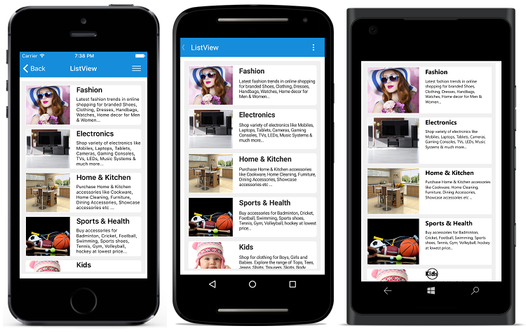
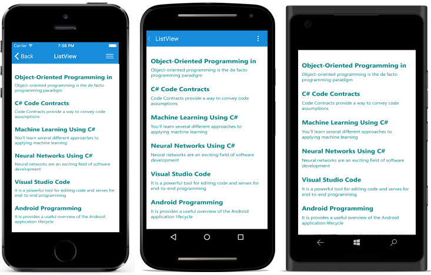

# Getting Started

This section provides a quick overview for getting started with SfListView for Xamarin.Forms. You will walk through the entire process of creating a real world SfListView.

## Assembly deployment

After installing Essential Studio for Xamarin, you can find all the required assemblies in the installation folders,

{Syncfusion Essential Studio Installed location}\Essential Studio\{{ site.releaseversion }}\Xamarin\lib

Eg: C:\Program Files (x86)\Syncfusion\Essential Studio\{{ site.releaseversion }}\Xamarin\lib

N> Assemblies can be found in unzipped package location in Mac

### SfListView for Xamarin.Forms

The following list of assemblies need to be added as reference from the lib folder to use SfListView in your application.

<table>
<tr>
<th>Project</th>
<th>Required assemblies</th>
</tr>
<tr>
<td>PCL</td>
<td>pcl\Syncfusion.DataSource.Portable.dll pcl\Syncfusion.Core.XForms.dll pcl\Syncfusion.GridCommon.Portable.dll pcl\Syncfusion.SfListView.XForms.dll </td>
</tr>
<tr>
<td>Android Renderer</td>
<td>pcl\Syncfusion.DataSource.Portable.dll pcl\Syncfusion.Core.XForms.dll pcl\Syncfusion.GridCommon.Portable.dll pcl\Syncfusion.SfListView.XForms.dll android\Syncfusion.SfListView.XForms.Android.dll </td>
</tr>
<tr>
<td>iOS Renderer</td>
<td>pcl\Syncfusion.DataSource.Portable.dll pcl\Syncfusion.Core.XForms.dll pcl\Syncfusion.GridCommon.Portable.dll pcl\Syncfusion.SfListView.XForms.dll ios-unified\Syncfusion.SfListView.XForms.iOS.dll </td>
</tr>
<tr>
<td>UWP Renderer</td>
<td>pcl\Syncfusion.DataSource.Portable.dll pcl\Syncfusion.Core.XForms.dll pcl\Syncfusion.GridCommon.Portable.dll pcl\Syncfusion.SfListView.XForms.dll uwp\Syncfusion.SfListView.XForms.UWP.dll </td>
</tr>
</table>

N> You can also configure the Syncfusion NuGet packages in Visual Studio, please refer [here]( https://help.syncfusion.com/xamarin/introduction/download-and-installation#configuring-syncfusion-nuget-packages-in-visual-studio) for more information.

## System requirements

In SfListView, minimum support SDK version for Android is `API Level 19 and above` and Xamarin.Forms current version is `2.4.0.280 and later versions`.

## Launching the SfListView on each platform

To use SfListView inside an application, each platform application must initialize the SfListView renderer. This initialization step varies from platform to platform and is discussed in the following sections.

### Android

The Android launches the SfListView without any initialization and is enough to only initialize the Xamarin.Forms Framework to launch the application.

### iOS

To launch the SfListView in iOS, you need to call the `SfListViewRenderer.Init()` in the `FinishedLaunching` overridden method of the AppDelegate class after the Xamarin.Forms Framework initialization and before the LoadApplication is called, as demonstrated in the following code example:


public override bool FinishedLaunching(UIApplication app, NSDictionary options)
{
    …
    global::Xamarin.Forms.Forms.Init ();
    SfListViewRenderer.Init();
    LoadApplication (new App ());
    …
}
 

### Universal Windows Platform (UWP)

To launch the SfListView in UWP, you need to call the `SfListViewRenderer.Init()` in the `MainPage` constructor before the LoadApplication is called, as demonstrated in the following code example:


public MainPage()
{
    …
    SfListViewRenderer.Init();
    LoadApplication (new App ());
    …
}
 

### ReleaseMode issue in UWP platform

There is a known Framework issue in UWP platform. The custom controls will not render when deployed the application in `Release Mode`.

The above problem can be resolved by initializing the SfListView assemblies in `App.xaml.cs` in UWP project as like in below code snippet.


// In App.xaml.cs

protected override void OnLaunched(LaunchActivatedEventArgs e)
{
    …

    rootFrame.NavigationFailed += OnNavigationFailed;
        
    // you'll need to add `using System.Reflection;`
    List<Assembly> assembliesToInclude = new List<Assembly>();

    //Now, add all the assemblies your app uses
    assembliesToInclude.Add(typeof(SfListViewRenderer).GetTypeInfo().Assembly);

    // replaces Xamarin.Forms.Forms.Init(e);        
    Xamarin.Forms.Forms.Init(e, assembliesToInclude);
        
    …     
}


## Create a simple SfListView 

This section explains how to create a SfListView and configure it. The SfListView control can be configured entirely in C# code or by using XAML markup. This is how the SfListView will look like on iOS, Android and Windows devices.
 

In this walk through, you will create a new application that contains the SfListView which includes the below topics.

* [Creating the project](#creating-the-project) 
* [Adding SfListView in Xamarin.Forms](#adding-sflistview-in-xamarin.forms)     
* [Creating Data Model](#creating-data-model-for-the-sflistview)  
* [Binding data](#binding-data-to-sflistview) 
* [Defining an ItemTemplate](#defining-an-itemtemplate)
* [Layouts](#layouts)
* [Sorting](#sorting) 
* [Filtering](#filtering) 
* [Grouping](#grouping) 
* [Selection](#selection)
* [Header and Footer](#header-and-footer)

## Creating the project

Create a new Blank App (Xamarin.Forms.Portable) application in Xamarin Studio or Visual Studio for Xamarin.Forms.

## Adding SfListView in Xamarin.Forms 

1. Add the required assembly references to the PCL and renderer projects as discussed in the [Assembly deployment](#assembly-deployment) section.

2. Import SfListView control namespace Syncfusion.ListView.XForms.

3. Set the SfListView control to the ContentPage.



<?xml version="1.0" encoding="utf-8" ?>
<ContentPage xmlns="http://xamarin.com/schemas/2014/forms"
             xmlns:x="http://schemas.microsoft.com/winfx/2009/xaml"
             xmlns:syncfusion="clr-namespace:Syncfusion.ListView.XForms;assembly=Syncfusion.SfListView.XForms"
             xmlns:local="clr-namespace:GettingStarted;assembly=GettingStarted"
             x:Class="GettingStarted.MainPage">
             
  <syncfusion:SfListView x:Name="listView" />
</ContentPage>


using Syncfusion.ListView.XForms;
using Xamarin.Forms;

namespace GettingStarted
{
    public class App : Application
    {
        SfListView listView;
        public App()
        {
            listView = new SfListView();
            MainPage = new ContentPage { Content = listView };
        }
    }
} 



## Creating Data Model for the SfListView

Create a data model to bind it to the control. 

Create a simple data source as shown in the following code example in a new class file and save it as BookInfo.cs file. 


public class BookInfo : INotifyPropertyChanged
{
    private string bookName;
    private string bookDesc;

    public string BookName
    {
        get { return bookName; }
        set
        {
            bookName = value;
            OnPropertyChanged("BookName");
        }
    }

    public string BookDescription
    {
        get { return bookDesc; }
        set
        {
            bookDesc = value;
            OnPropertyChanged("BookDescription");
        }
    }

    public event PropertyChangedEventHandler PropertyChanged;

    public void OnPropertyChanged(string name)
    {
        if (this.PropertyChanged != null)
           this.PropertyChanged(this, new PropertyChangedEventArgs(name));
    }
}
 


N> If you want your data model to respond to property changes, then implement `INotifyPropertyChanged` interface in your model class

Create a model repository class with BookInfo collection property initialized with required number of data objects in a new class file as shown in the following code example and save it as BookInfoRepository.cs file.


public class BookInfoRepository
{
    private ObservableCollection<BookInfo> bookInfo;

    public ObservableCollection<BookInfo> BookInfo
    {
        get { return bookInfo; }
        set { this.bookInfo = value; }
    }

    public BookInfoRepository()
    {
        GenerateBookInfo();
    }

    internal void GenerateBookInfo()
    {
        bookInfo = new ObservableCollection<BookInfo>();
        bookInfo.Add(new BookInfo() { BookName = "Object-Oriented Programming in C#", BookDescription = "Object-oriented programming is a programming paradigm based on the concept of objects" });
        bookInfo.Add(new BookInfo() { BookName = "C# Code Contracts", BookDescription = "Code Contracts provide a way to convey code assumptions" });
        bookInfo.Add(new BookInfo() { BookName = "Machine Learning Using C#", BookDescription = "You’ll learn several different approaches to applying machine learning" });
        bookInfo.Add(new BookInfo() { BookName = "Neural Networks Using C#", BookDescription = "Neural networks are an exciting field of software development" });
        bookInfo.Add(new BookInfo() { BookName = "Visual Studio Code", BookDescription = "It is a powerful tool for editing code and serves for end-to-end programming" });
        bookInfo.Add(new BookInfo() { BookName = "Android Programming", BookDescription = "It is provides a useful overview of the Android application life cycle" });
        bookInfo.Add(new BookInfo() { BookName = "iOS Succinctly", BookDescription = "It is for developers looking to step into frightening world of iPhone" });
        bookInfo.Add(new BookInfo() { BookName = "Visual Studio 2015", BookDescription = "The new version of the widely-used integrated development environment" });
        bookInfo.Add(new BookInfo() { BookName = "Xamarin.Forms", BookDescription = "Its creates mappings from its C# classes and controls directly" });
        bookInfo.Add(new BookInfo() { BookName = "Windows Store Apps", BookDescription = "Windows Store apps present a radical shift in Windows development" });
    }
}



## Binding data to SfListView

To bind the data source of the SfListView, set the [SfListView.ItemsSource](https://help.syncfusion.com/cr/cref_files/xamarin/sflistview/Syncfusion.SfListView.XForms~Syncfusion.ListView.XForms.SfListView~ItemsSource.html) property as shown below. You can bind the data source of the SfListView either from XAML or in code. 

The following code example binds the collection created in previous step to `SfListView.ItemsSource` property.



<?xml version="1.0" encoding="utf-8" ?>
<ContentPage xmlns="http://xamarin.com/schemas/2014/forms"
             xmlns:x="http://schemas.microsoft.com/winfx/2009/xaml"
             xmlns:syncfusion="clr-namespace:Syncfusion.ListView.XForms;assembly=Syncfusion.SfListView.XForms"
             xmlns:local="clr-namespace:GettingStarted;assembly=GettingStarted"
             x:Class="GettingStarted.MainPage">
             
  <ContentPage.BindingContext>
    <local:BookInfoRepository />
  </ContentPage.BindingContext>

  <syncfusion:SfListView x:Name="listView" 
                   ItemsSource="{Binding BookInfo}" />
</ContentPage>


BookInfoRepository viewModel = new BookInfoRepository ();
listView.ItemsSource = viewModel.BookInfo; 



## Defining an ItemTemplate
 
 By defining the [SfListView.ItemTemplate](https://help.syncfusion.com/cr/cref_files/xamarin/sflistview/Syncfusion.SfListView.XForms~Syncfusion.ListView.XForms.SfListView~ItemTemplate.html) of the SfListView, a custom user interface(UI) can be achieved to display the data items. 
 


<syncfusion:SfListView x:Name="listView" 
                   ItemsSource="{Binding BookInfo}"
                   ItemSize="100">
  <syncfusion:SfListView.ItemTemplate>
    <DataTemplate>
      <Grid Padding="10">
        <Grid.RowDefinitions>
          <RowDefinition Height="0.4*" />
          <RowDefinition Height="0.6*" />
        </Grid.RowDefinitions>
        <Label Text="{Binding BookName}" FontAttributes="Bold" TextColor="Teal" FontSize="21" />
        <Label Grid.Row="1" Text="{Binding BookDescription}" TextColor="Teal" FontSize="15"/>
      </Grid>
    </DataTemplate>
  </syncfusion:SfListView.ItemTemplate>
</syncfusion:SfListView>


using Syncfusion.ListView.XForms;
using Xamarin.Forms;

namespace GettingStarted
{
    public class App : Application
    {
        SfListView listView;
        public App()
        {
            BookInfoRepository viewModel = new BookInfoRepository ();
            listView = new SfListView();
            listView.ItemSize = 100;
            listView.ItemsSource = viewModel.BookInfo;
            listView.ItemTemplate = new DataTemplate(() => {
                var grid = new Grid();
                var bookName = new Label { FontAttributes = FontAttributes.Bold, BackgroundColor = Color.Teal, FontSize = 21 };
                bookName.SetBinding(Label.TextProperty, new Binding("BookName"));
                var bookDescription = new Label { BackgroundColor = Color.Teal, FontSize = 15 };
                bookDescription.SetBinding(Label.TextProperty, new Binding("BookDescription"));

                grid.Children.Add(bookName);
                grid.Children.Add(bookDescription, 1, 0);

                return grid;
            });
            MainPage = new ContentPage { Content = listView };
        }
    }
} 



Now run the application to render the following output. You can also download the entire source code of this demo from [here](http://www.syncfusion.com/downloads/support/directtrac/general/ze/Listview_GettingStarted1048237669).

## Layouts

SfListView supports different layouts such as linear layout and grid layout. The linear layout arranges the items in a single column, whereas the grid layout arranges the items in a predefined number of columns which is defined by [SpanCount](https://help.syncfusion.com/cr/cref_files/xamarin/sflistview/Syncfusion.SfListView.XForms~Syncfusion.ListView.XForms.GridLayout~SpanCount.html) property of `GridLayout`. 
[SfListView.LayoutManager](https://help.syncfusion.com/cr/cref_files/xamarin/sflistview/Syncfusion.SfListView.XForms~Syncfusion.ListView.XForms.SfListView~LayoutManager.html) property is used to define the layout for SfListView. `LinearLayout` is default layout of SfListView.



<syncfusion:SfListView x:Name="listView" 
                   ItemsSource="{Binding BookInfo}"
                   ItemSize="100">
    <syncfusion:SfListView.LayoutManager>
      <syncfusion:GridLayout SpanCount="3" />
    </syncfusion:SfListView.LayoutManager>
</syncfusion:SfListView>


listView.LayoutManager = new GridLayout() { SpanCount = 3 };



## Sorting

SfListView allows you to apply sorting on its data by using [SfListView.DataSource.SortDescriptors](https://help.syncfusion.com/cr/cref_files/xamarin/datasource/Syncfusion.DataSource.Portable~Syncfusion.DataSource.DataSource~SortDescriptors.html) property. You can create a [SortDescriptor](https://help.syncfusion.com/cr/cref_files/xamarin/datasource/Syncfusion.DataSource.Portable~Syncfusion.DataSource.SortDescriptor.html) for the property to be sorted and add it into the `DataSource.SortDescriptors` collection.
You can refresh the view by calling [SfListView.RefreshView](https://help.syncfusion.com/cr/cref_files/xamarin/sflistview/Syncfusion.SfListView.XForms~Syncfusion.ListView.XForms.SfListView~RefreshView.html) method. 

SortDescriptor object holds following three properties:

* PropertyName: Name of the sorted property.
* Direction: An object of type [ListSortDirection](https://help.syncfusion.com/cr/cref_files/xamarin/datasource/Syncfusion.DataSource.Portable~Syncfusion.DataSource.ListSortDirection.html) defines the sorting direction.
* Comparer: Comparer to be applied in when sorting take place
 


<?xml version="1.0" encoding="utf-8" ?>
<ContentPage xmlns="http://xamarin.com/schemas/2014/forms"
             xmlns:x="http://schemas.microsoft.com/winfx/2009/xaml"
             xmlns:syncfusion="clr-namespace:Syncfusion.ListView.XForms;assembly=Syncfusion.SfListView.XForms"
             xmlns:data="clr-namespace:Syncfusion.DataSource;assembly=Syncfusion.DataSource.Portable"
             xmlns:local="clr-namespace:GettingStarted;assembly=GettingStarted"
             x:Class="GettingStarted.MainPage">
             
  <syncfusion:SfListView x:Name="listView">
    <syncfusion:SfListView.DataSource>
      <data:DataSource>
        <data:DataSource.SortDescriptors>
          <data:SortDescriptor PropertyName="BookName" Direction="Ascending"/>
        </data:DataSource.SortDescriptors>
      </data:DataSource>
    </syncfusion:SfListView.DataSource>
  </syncfusion:SfListView>
</ContentPage>


 listView.DataSource.SortDescriptors.Add(new SortDescriptor()
 {
   PropertyName = "BookName",
   Direction = ListSortDirection.Ascending,
 }); 
 listView.RefreshView();



## Filtering

SfListView provides support to filter the records in view by setting predicate to the [SfListView.DataSource.Filter](https://help.syncfusion.com/cr/cref_files/xamarin/datasource/Syncfusion.DataSource.Portable~Syncfusion.DataSource.DataSource~Filter.html) property. You have to call the [DataSource.RefreshFilter](https://help.syncfusion.com/cr/cref_files/xamarin/datasource/Syncfusion.DataSource.Portable~Syncfusion.DataSource.DataSource~RefreshFilter.html) method after assigning the Filter property for refreshing the view.

The following code example illustrates how to filter the items based on the Title property of underlying data by using `FilterContacts` method.
 

var grid = new Grid();
var viewModel = new BookInfoRepository ();

var searchBar = new SearchBar() { Placeholder = "Search here to filter" };
searchBar.TextChanged += OnFilterTextChanged;

listView = new SfListView();
listView.ItemsSource = viewModel.BookInfo;

grid.Children.Add(searchBar);
grid.Children.Add(listView, 0, 1);
...
private void OnFilterTextChanged(object sender, TextChangedEventArgs e)
{
  searchBar = (sender as SearchBar);
  if (listView.DataSource != null)
  {
     this.listView.DataSource.Filter = FilterContacts;
     this.listView.DataSource.RefreshFilter();
  }
}

private bool FilterContacts(object obj)
{
  if (searchBar == null || searchBar.Text == null)
    return true;

  var bookInfo = obj as BookInfo;
  if (bookInfo.BookName.ToLower().Contains(searchBar.Text.ToLower())
      || bookInfo.BookDescription.ToLower().Contains(searchBar.Text.ToLower()))
      return true;
  else
      return false;
}


## Grouping

SfListView allows you to display the items in a group by using the [SfListView.DataSource.GroupDescriptors](https://help.syncfusion.com/cr/cref_files/xamarin/datasource/Syncfusion.DataSource.Portable~Syncfusion.DataSource.DataSource~GroupDescriptors.html) property. You can create a [GroupDescriptor](https://help.syncfusion.com/cr/cref_files/xamarin/datasource/Syncfusion.DataSource.Portable~Syncfusion.DataSource.GroupDescriptor.html) for the property to be grouped and add it in the `DataSource.GroupDescriptors` collection. 
`GroupDescriptor` object holds the following properties:

* PropertyName: Name of the property to be grouped.
* KeySelector: Selector to return the group key.
* Comparer: Comparer to be applied in when sorting take place.

It also provides support to stick the group header by enabling the property [SfListView.IsStickyGroupHeader](https://help.syncfusion.com/cr/cref_files/xamarin/sflistview/Syncfusion.SfListView.XForms~Syncfusion.ListView.XForms.SfListView~IsStickyGroupHeader.html).



<syncfusion:SfListView x:Name="listView">
  <syncfusion:SfListView.DataSource>
    <data:DataSource>
      <data:DataSource.GroupDescriptors>
        <data:GroupDescriptor PropertyName="BookName"/>
      </data:DataSource.GroupDescriptors>
    </data:DataSource>
  </syncfusion:SfListView.DataSource>
</syncfusion:SfListView>


 listView.DataSource.GroupDescriptors.Add(new GroupDescriptor()
 {
   PropertyName = "BookName",
 });



## Selection

SfListView allows you to select the item by setting the [SfListView.SelectionMode](https://help.syncfusion.com/cr/cref_files/xamarin/sflistview/Syncfusion.SfListView.XForms~Syncfusion.ListView.XForms.SfListView~SelectionMode.html) property. You can set the `SfListView.SelectionMode` property to single, multiple and none based on your requirements. Information about the selected item can be tracked using [SfListView.SelectedItem](https://help.syncfusion.com/cr/cref_files/xamarin/sflistview/Syncfusion.SfListView.XForms~Syncfusion.ListView.XForms.SfListView~SelectedItem.html) and [SfListView.SelectedItems](https://help.syncfusion.com/cr/cref_files/xamarin/sflistview/Syncfusion.SfListView.XForms~Syncfusion.ListView.XForms.SfListView~SelectedItems.html) properties. It also allows you to change the selection highlight color by using the [SfListView.SelectionBackgroundColor](https://help.syncfusion.com/cr/cref_files/xamarin/sflistview/Syncfusion.SfListView.XForms~Syncfusion.ListView.XForms.SfListView~SelectionBackgroundColor.html).

You can change the gesture type to select the item by setting the [SfListView.SelectionGesture](https://help.syncfusion.com/cr/cref_files/xamarin/sflistview/Syncfusion.SfListView.XForms~Syncfusion.ListView.XForms.SfListView~SelectionGesture.html) property. You can set the `SfListView.SelectionGesture` property to Tap, DoubleTap and Hold based on your requirements.

You can handle the selection operations with the help of [SelectionChanging](https://help.syncfusion.com/cr/cref_files/xamarin/sflistview/Syncfusion.SfListView.XForms~Syncfusion.ListView.XForms.SfListView~SelectionChanging_EV.html) and [SelectionChanged](https://help.syncfusion.com/cr/cref_files/xamarin/sflistview/Syncfusion.SfListView.XForms~Syncfusion.ListView.XForms.SfListView~SelectionChanged_EV.html) events of the SfListView.
 


<syncfusion:SfListView x:Name="listView" 
                 SelectionMode="Single"
                 SelectionGesture="Tap"
                 SelectionBackgroundColor="#E4E4E4"/>


listView.SelectionMode = SelectionMode.Single;
listView.SelectionGesture = TouchGesture.Tap;
listView.SelectionBackgroundColor = Color.FromHex("#E4E4E4");



## Header and Footer

SfListView allows you to set the header and footer to your user interface(UI) view by setting the DataTemplate to the [HeaderTemplate](https://help.syncfusion.com/cr/cref_files/xamarin/sflistview/Syncfusion.SfListView.XForms~Syncfusion.ListView.XForms.SfListView~HeaderTemplate.html) and [FooterTemplate](https://help.syncfusion.com/cr/cref_files/xamarin/sflistview/Syncfusion.SfListView.XForms~Syncfusion.ListView.XForms.SfListView~FooterTemplate.html).
You can handle the header and footer either scrollable or sticky to the view by enabling or disabling the [IsStickyHeader](https://help.syncfusion.com/cr/cref_files/xamarin/sflistview/Syncfusion.SfListView.XForms~Syncfusion.ListView.XForms.SfListView~IsStickyHeader.html) and [IsStickyFooter](https://help.syncfusion.com/cr/cref_files/xamarin/sflistview/Syncfusion.SfListView.XForms~Syncfusion.ListView.XForms.SfListView~IsStickyFooter.html) properties.
 


<syncfusion:SfListView x:Name="listView"
                 ItemsSource="{Binding InboxInfo}"
                 IsStickyHeader="true"
                 IsStickyFooter="true">
  <syncfusion:SfListView.HeaderTemplate>
    <DataTemplate>
      <Grid BackgroundColor="#4CA1FE" HeightRequest="45">
        <Label Text="Inbox" FontAttributes="Bold" FontSize="18" TextColor="White" />
      </Grid>
    </DataTemplate>
  </syncfusion:SfListView.HeaderTemplate>
  <syncfusion:SfListView.FooterTemplate>
    <DataTemplate>
      <Grid BackgroundColor="#DC595F">
        <Grid.ColumnDefinitions>
          <ColumnDefinition />
          <ColumnDefinition />
        </Grid.ColumnDefinitions>
        <Image Grid.Column="0" Source="Edit.png" />
        <Image Grid.Column="1" Source="Delete.png" />
      </Grid>
    </DataTemplate>
  </syncfusion:SfListView.FooterTemplate>
</syncfusion:SfListView>


ViewModel viewModel = new ViewModel ();
listView.ItemsSource = viewModel.InboxInfo; 
listView.IsStickyHeader = true;
listView.IsStickyFooter = true;
listView.HeaderTemplate = new DataTemplate(() =>
{
  var grid = new Grid();
  grid.BackgroundColor = Color.FromHex("#4CA1FE");
  var headerLabel = new Label { BackgroundColor = Color.White, FontSize = 18,
                                FontAttributes = FontAttributes.Bold };
  headerLabel.Text = "Inbox";
  grid.Children.Add(headerLabel);
  return grid;
});
listView.FooterTemplate = new DataTemplate(() =>
{
  var grid = new Grid();
  grid.BackgroundColor = Color.FromHex("#DC595F");
  var editImage = new Image();
  editImage.Source = "Edit.png";
  var deleteImage = new Image();
  deleteImage.Source = "Delete.png";
  grid.Children.Add(editImage);
  grid.Children.Add(deleteImage, 0, 1);
  return grid;
});

