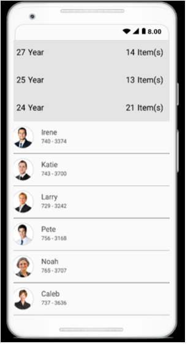
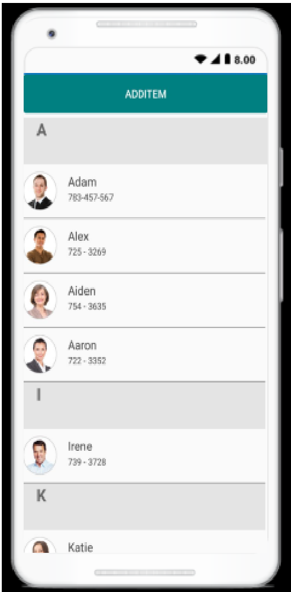

# Grouping 

A group represents a collection of items that belongs to a category. When grouping is applied, the data is organized into different groups based on key values. Each group is identified by its [Key](https://help.syncfusion.com/cr/cref_files/xamarin/datasource/Syncfusion.DataSource.Portable~Syncfusion.DataSource.Extensions.GroupResult~Key.html), by which you can get the underlying data in the group.

## Programmatic grouping

The SfListView allows grouping from the code by defining [GroupDescriptor](https://help.syncfusion.com/cr/cref_files/xamarin/datasource/Syncfusion.DataSource.Portable~Syncfusion.DataSource.GroupDescriptor.html) object, and adding it into the [DataSource.GroupDescriptors](https://help.syncfusion.com/cr/cref_files/xamarin/datasource/Syncfusion.DataSource.Portable~Syncfusion.DataSource.DataSource~GroupDescriptors.html) collection. This control groups the data based on the `GroupDescriptor` object added to this collection.`GroupDescriptor` object holds the following properties:

* PropertyName: Describes name of the property to be grouped.
* KeySelector: Describes selector to return the group key.
* Comparer: Describes comparer to be applied in when sorting take place.

The following code example illustrates how to apply grouping to the data in SfListView.



<ContentPage>
 <syncfusion:SfListView x:Name="listView">
  <syncfusion:SfListView.DataSource>
    <data:DataSource>
      <data:DataSource.GroupDescriptors>
        <data:GroupDescriptor PropertyName="ContactName" />
      </data:DataSource.GroupDescriptors>
    </data:DataSource>
  </syncfusion:SfListView.DataSource>
 </syncfusion:SfListView>
</ContentPage>


listView.DataSource.GroupDescriptors.Add(new GroupDescriptor()
{
  PropertyName = "ContactName",
}); 



## Custom grouping

The SfListView provides support to grouping the items based on custom logic. The custom grouping can be applied to either [SfListView.DataSource.GroupComparer](https://help.syncfusion.com/cr/cref_files/xamarin/datasource/Syncfusion.DataSource.Portable~Syncfusion.DataSource.DataSource~GroupComparer.html) property or [GroupDescriptor.Comparer](https://help.syncfusion.com/cr/cref_files/xamarin/datasource/Syncfusion.DataSource.Portable~Syncfusion.DataSource.GroupDescriptor~Comparer.html) which is added into the `DataSource.GroupDescriptors` collection.
In custom group comparer all items present in a group compares each other based on the items count to each group sorted accordingly.

The following code example illustrates how to perform custom grouping for underlying data based on the group item count.


public class CustomGroupComparer : IComparer<GroupResult>, ISortDirection
{
  public CustomGroupComparer()
  {
    this.SortDirection = ListSortDirection.Ascending;
  }
  
  public ListSortDirection SortDirection
  {
    get;
    set;
  }
  
  public int Compare(GroupResult x, GroupResult y)
  {
    int groupX;
    int groupY;

    groupX = x.Count;
    groupY = y.Count;

    // Objects are compared and return the SortDirection
    if (groupX.CompareTo(groupY) > 0)
      return SortDirection == ListSortDirection.Ascending ? 1 : -1;
    else if (groupX.CompareTo(groupY) == -1)
      return SortDirection == ListSortDirection.Ascending ? -1 : 1;
    else
      return 0;
  }
}


### Group based on first character

The SfListView provides support to grouping the items based on first character of value assigned to property name in [GroupDescriptor](https://help.syncfusion.com/cr/cref_files/xamarin/datasource/Syncfusion.DataSource.Portable~Syncfusion.DataSource.GroupDescriptor.html) by using [KeySelector](https://help.syncfusion.com/cr/cref_files/xamarin/datasource/Syncfusion.DataSource.Portable~Syncfusion.DataSource.GroupDescriptor~KeySelector.html).  

The following code example illustrates how to grouping the items based on first character of value assigned to property name `ContactName` in `GroupDescriptor`.


listView.DataSource.GroupDescriptors.Add(new GroupDescriptor()
{
  PropertyName = "ContactName",
  KeySelector = (object obj1) =>
  {
    var item = (obj1 as Contacts);
    return item.ContactName[0].ToString();
  }
  Comparer = new CustomGroupComparer()
});


### Group based on more than one property in the data object

Grouping the items by bind the multiple properties to property name of [GroupDescriptor](https://help.syncfusion.com/cr/cref_files/xamarin/datasource/Syncfusion.DataSource.Portable~Syncfusion.DataSource.GroupDescriptor.html) by using [KeySelector](https://help.syncfusion.com/cr/cref_files/xamarin/datasource/Syncfusion.DataSource.Portable~Syncfusion.DataSource.GroupDescriptor~KeySelector.html), in which the group header items can be created with multiple data model object effectively.

The following code example illustrates how to grouping the items based on the multiple properties such as designation and level by using `KeySelector`.


listView.DataSource.GroupDescriptors.Add(new GroupDescriptor()
{
  PropertyName = "Designation",
  KeySelector = (object obj1) =>
  {
     var item = (obj1 as Employee);
     return item.Designation + item.Level;
  }
});


### Group by ignoring case sensitivity

Grouping the items by ignoring the case sensitive by using [KeySelector](https://help.syncfusion.com/cr/cref_files/xamarin/datasource/Syncfusion.DataSource.Portable~Syncfusion.DataSource.GroupDescriptor~KeySelector.html) property in the [GroupDescriptor](https://help.syncfusion.com/cr/cref_files/xamarin/datasource/Syncfusion.DataSource.Portable~Syncfusion.DataSource.GroupDescriptor.html). While returning the `KeySelector`, convert the required property name in the data model which is to group either as Upper or Lower case as per the requirement. The items will be grouped based on the `KeySelector` with the case sensitive which has been returned in it.

The following code example illustrates how to grouping the items based on case sensitivity (i.e) value of the property name can be grouped in uppercase or lowercase.


listView.DataSource.GroupDescriptors.Add(new GroupDescriptor() 
{ 
  PropertyName = "ContactName", 
  KeySelector = (object obj) => 
  { 
    return (obj as Contacts).ContactName.ToUpper()[0]; 
  } 
}); 


## Group header summary

### Aggregate summary

For each group, displays the sum of values of the property from model object in [GroupHeaderTemplate](https://help.syncfusion.com/cr/cref_files/xamarin/sflistview/Syncfusion.SfListView.XForms~Syncfusion.ListView.XForms.SfListView~GroupHeaderTemplate.html) by using converter. 

The following code example illustrates how to displays the sum of values of the property `ContactNumber` in group header.


<ContentPage>
   <syncfusion:SfListView>
      <syncfusion:SfListView.GroupHeaderTemplate>
                    <DataTemplate x:Name="GroupHeaderTemplate"  x:Key="GroupHeaderTemplate">
                        <ViewCell>
                            <ViewCell.View>
                                <Grid BackgroundColor="#E4E4E4">
                                    <Grid.ColumnDefinitions>
                                        <ColumnDefinition Width="*" />
                                    </Grid.ColumnDefinitions>
                                    <Label Text="{Binding Key}" />
                                    <Label Text="{Binding Items,Converter={StaticResource Converter}}" Grid.Column="1" />
                                </Grid>
                            </ViewCell.View>
                        </ViewCell>
                    </DataTemplate>
      </syncfusion:SfListView.GroupHeaderTemplate>
   </syncfusion:SfListView>
</ContentPage>


The following code example illustrates how to calculate the sum of values using converter.


public object Convert(object value, Type targetType, object parameter, CultureInfo culture)
{
    int result = 0;
    var items = value as IEnumerable;
    if(items != null)
    {
    var items = items.ToList<object>().ToList<object>();
        if (items != null)
        {
        for (int i = 0; i < items.Count; i++)
            {
            var contact = items[i] as Contacts;
            result += contact.ContactNumber;
            }
        }
    }
    return result
}


You can download the entire sample code from [here](http://www.syncfusion.com/downloads/support/directtrac/general/ze/Aggregate_summary361190372)

### Displaying items count

The total number of items in each group will be display in group header by binding the [Count](https://help.syncfusion.com/cr/cref_files/xamarin/datasource/Syncfusion.DataSource.Portable~Syncfusion.DataSource.Extensions.GroupResult~Count.html) property in the [GroupHeaderTemplate](https://help.syncfusion.com/cr/cref_files/xamarin/datasource/Syncfusion.DataSource.Portable~Syncfusion.DataSource.Extensions.GroupResult~Count.html) as like following code example.


<ContentPage>
 <syncfusion:SfListView>
  <syncfusion:SfListView.GroupHeaderTemplate>
    <DataTemplate>
     <Grid BackgroundColor="#E4E4E4">
      <Grid.ColumnDefinitions>
        <ColumnDefinition Width="*"/>
        <ColumnDefinition Width="*"/>
      </Grid.ColumnDefinitions>
      <StackLayout Orientation="Horizontal" HorizontalOptions="Start"
                   VerticalOptions="Center" >
        <Label Text="{Binding Key}" TextColor="Black" />
        <Label Text="Year" TextColor="Black" />
      </StackLayout>
      <StackLayout Orientation="Horizontal" Grid.Column="1"
                   HorizontalOptions="EndAndExpand" VerticalOptions="Center">
        <Label Text="{Binding Count}" TextColor="Black" />
        <Label Text="Item(s)" TextColor="Black" />
      </StackLayout>
     </Grid>
    </DataTemplate>
  </syncfusion:SfListView.GroupHeaderTemplate>
 </syncfusion:SfListView>
</ContentPage>


The following screenshots shows output when displaying items count at group header. You can download entire sample code from [here](http://www.syncfusion.com/downloads/support/directtrac/general/ze/Items_Count1523989044)

## Multi-level grouping

The SfListView provides support for multiple level of grouping by adding multiple [GroupDescriptor](https://help.syncfusion.com/cr/cref_files/xamarin/datasource/Syncfusion.DataSource.Portable~Syncfusion.DataSource.GroupDescriptor.html) objects into the [GroupDescriptors](https://help.syncfusion.com/cr/cref_files/xamarin/datasource/Syncfusion.DataSource.Portable~Syncfusion.DataSource.DataSource~GroupDescriptors.html) collection. The grouped items will be display in hierarchical structure by customizing the [GroupHeaderTemplate](https://help.syncfusion.com/cr/cref_files/xamarin/sflistview/Syncfusion.SfListView.XForms~Syncfusion.ListView.XForms.SfListView~GroupHeaderTemplate.html) property. In the `GroupHeaderTemplate`, you need to set the `Padding` property to the custom view based on the requirement in order to arrange the group header items and sub group header items in the hierarchical structure. 

N> Multi-level grouping is only applicable for `LinearLayout` in SfListView


<ContentPage xmlns:syncfusion="clr-namespace:Syncfusion.ListView.XForms;assembly=Syncfusion.SfListView.XForms"
             xmlns:dataSource="clr-namespace:Syncfusion.DataSource;assembly=Syncfusion.DataSource.Portable">
 <ContentPage.Resources>
  <ResourceDictionary>
    <local:GroupHeaderConverter x:Key="TemplateConverter"/>
  </ResourceDictionary>
 </ContentPage.Resources>
 <syncfusion:SfListView ItemsSource="{Binding EmployeeInfo}" ItemSize="60">
  <syncfusion:SfListView.DataSource>
    <dataSource:DataSource>
       <dataSource:DataSource.GroupDescriptors>
          <dataSource:GroupDescriptor PropertyName="Designation" />
          <dataSource:GroupDescriptor PropertyName="Level" />
       </dataSource:DataSource.GroupDescriptors>
    </dataSource:DataSource>
  </syncfusion:SfListView.DataSource>
  <syncfusion:SfListView.GroupHeaderTemplate>
     <DataTemplate>
        <ViewCell>
          <ViewCell.View>
             <StackLayout BackgroundColor="{Binding Level,Converter={StaticResource TemplateConverter}}"
                          Padding="{Binding Level,Converter={StaticResource TemplateConverter}}">
                <Label Text="{Binding Key}" 
                       VerticalOptions="Center" HorizontalOptions="Start"/>
             </StackLayout>
          </ViewCell.View>
        </ViewCell>
     </DataTemplate>
  </syncfusion:SfListView.GroupHeaderTemplate>
 </syncfusion:SfListView>
</ContentPage>



public class GroupHeaderConverter : IValueConverter
{
  public object Convert(object value, Type targetType, object parameter, CultureInfo culture)
  {
     if (targetType.Name == "Color")
     {
        if ((int)value == 1)
           return Color.FromHex("#D3D3D3");
        else
           return Color.Transparent;
     }
     else
     {
        if ((int)value == 1)
           return new Thickness(5, 5, 5, 0);
        else
           return new Thickness((int)value * 15, 5, 5, 0);
     }
  }

  public object ConvertBack(object value, Type targetType, object parameter, CultureInfo culture)
  {
     throw new NotImplementedException();
  }
}


You can also download the entire source code of this demo from [here](http://www.syncfusion.com/downloads/support/directtrac/general/ze/Multilevel_Grouping1401226920).

## Group expand and collapse

By default, the groups will be in expanded state in SfListView. You can expand or collapse the group in runtime by setting [SfListView.AllowGroupExpandCollapse](https://help.syncfusion.com/cr/cref_files/xamarin/sflistview/Syncfusion.SfListView.XForms~Syncfusion.ListView.XForms.SfListView~AllowGroupExpandCollapse.html) to true. So, when user tap on group header, then the tapped group gets collapse if the group is in expand state and vice-versa. 



<syncfusion:SfListView x:Name="listView" ItemSize="70" AllowGroupExpandCollapse="True" 
                     ItemsSource="{Binding contactsInfo}" />          


listView.AllowGroupExpandCollapse = true;



The following screenshot shows the output rendered when the groups are collapsed.

### Programmatic expand collapse

Expand or collapse the groups from end-user can be done programmatically at runtime.

#### Expand or collapse all the groups

Expand or collapse all the groups programmatically at runtime by using [ExpandAll](https://help.syncfusion.com/cr/cref_files/xamarin/sflistview/Syncfusion.SfListView.XForms~Syncfusion.ListView.XForms.SfListView~ExpandAll.html) method and [CollapseAll](https://help.syncfusion.com/cr/cref_files/xamarin/sflistview/Syncfusion.SfListView.XForms~Syncfusion.ListView.XForms.SfListView~CollapseAll.html) method of SfListView.



listView.ExpandAll();
listView.CollapseAll();
	


#### Expand or collapse the specific group

Expand or collapse specific group by using [ExpandGroup](https://help.syncfusion.com/cr/cref_files/xamarin/sflistview/Syncfusion.SfListView.XForms~Syncfusion.ListView.XForms.SfListView~ExpandGroup.html) method of SfListView and [CollapseGroup](https://help.syncfusion.com/cr/cref_files/xamarin/sflistview/Syncfusion.SfListView.XForms~Syncfusion.ListView.XForms.SfListView~CollapseGroup.html) method of SfListView.



var group = listView.DataSource.Groups[0];
listView.ExpandGroup(group);
listView.CollapseGroup(group);



#### Expand or collapse all group by default

Expand or collapse all the groups by default by using [Loaded](https://help.syncfusion.com/cr/cref_files/xamarin/sflistview/Syncfusion.SfListView.XForms~Syncfusion.ListView.XForms.ListViewLoadedEventArgs.html) event of SfListView.


listView.Loaded += ListView_Loaded;
  
private void ListView_Loaded(object sender, ListViewLoadedEventArgs e)
{
    listView.CollapseAll();
    listView.ExpandAll();
}


### Keeping only one group in expanded state

To keep any one specific group alone in expand state by using [GroupExpanding](https://help.syncfusion.com/cr/cref_files/xamarin/sflistview/Syncfusion.SfListView.XForms~Syncfusion.ListView.XForms.SfListView~GroupExpanding_EV.html) event and the particular selected group can be get from [GroupExpandCollapseChangingEventArgs](https://help.syncfusion.com/cr/cref_files/xamarin/sflistview/Syncfusion.SfListView.XForms~Syncfusion.ListView.XForms.GroupExpandCollapseChangingEventHandler.html) by which you can compare and collapse all other groups and expand the particular selected group like below code snippets. 


private void ListView_GroupExpanding(object sender, GroupExpandCollapseChangingEventArgs e) 
{ 
  if (e.Groups.Count > 0) 
  { 
    var group = e.Groups[0]; 
    if (expandedGroup == null || group.Key != expandedGroup.Key) 
    { 
      foreach (var otherGroup in listView.DataSource.Groups) 
      { 
        if (group.Key != otherGroup.Key) 
        { 
          listView.CollapseGroup(otherGroup); 
        } 
      } 
      expandedGroup = group; 
      listView.ExpandGroup(expandedGroup); 
    } 
 } 
}


You can download the entire source code of this demo from [here](http://www.syncfusion.com/downloads/support/directtrac/general/ze/One_group_expanded1663737587)

### Events

### GroupExpanding event

The [SfListView.GroupExpanding](https://help.syncfusion.com/cr/cref_files/xamarin/sflistview/Syncfusion.SfListView.XForms~Syncfusion.ListView.XForms.SfListView~GroupExpanding_EV.html) event occurs when the group is being expanded.
 
The [GroupExpandCollapseChangingEventArgs](https://help.syncfusion.com/cr/cref_files/xamarin/sflistview/Syncfusion.SfListView.XForms~Syncfusion.ListView.XForms.GroupExpandCollapseChangingEventHandler.html) of the `GroupExpanding` event provides the information about the expanding group and it has the following members.

`Groups` - Gets a list of groups which are being expanded.

`Cancel` – Decides whether to cancel the group expansion.

The `GroupExpanding` event used for the following usecases,

* To keep any one specific group alone in expand state by compare and collapse all other groups and expand the particular group.

You can cancel the group expansion by setting `GroupExpandCollapseChangingEventArgs.Cancel` to true.



<syncfusion:SfListView x:Name="listView" ItemsSource="{Binding contactsInfo}" 
                       GroupExpanding="ListView_GroupExpanding" />


listView.GroupExpanding += ListView_GroupExpanding;





private void ListView_GroupExpanding(object sender, GroupExpandCollapseChangingEventArgs e)
{
  if (e.Groups[0] == listView.DataSource.Groups[0])
    e.Cancel = true;
}



### GroupExpanded event

The [SfListView.GroupExpanded](https://help.syncfusion.com/cr/cref_files/xamarin/sflistview/Syncfusion.SfListView.XForms~Syncfusion.ListView.XForms.SfListView~GroupExpanded_EV.html) event occurs after the group is expanded.

The [GroupExpandCollapseChangedEventArgs](https://help.syncfusion.com/cr/cref_files/xamarin/sflistview/Syncfusion.SfListView.XForms~Syncfusion.ListView.XForms.GroupExpandCollapseChangedEventHandler.html) of the `GroupExpanded` event provides the information about the expanded group and it has the following member.

Groups - Gets a list of groups which are expanded.

### GroupCollapsing event 

The [SfListView.GroupCollapsing](https://help.syncfusion.com/cr/cref_files/xamarin/sflistview/Syncfusion.SfListView.XForms~Syncfusion.ListView.XForms.SfListView~GroupCollapsing_EV.html) event occurs when the group is being collapsed.

The [GroupExpandCollapseChangingEventArgs](https://help.syncfusion.com/cr/cref_files/xamarin/sflistview/Syncfusion.SfListView.XForms~Syncfusion.ListView.XForms.GroupExpandCollapseChangingEventHandler.html) of the `GroupCollapsing` event provides the information about the collapsing group and it contains the following member.

Groups - Gets a list of groups which are being collapsed.

Cancel – Decides whether to cancel the group collapsing.

You can cancel the group is being collapsed by using `GroupExpandCollapseChangingEventArgs.Cancel` of `GroupCollapsing` event.



<syncfusion:SfListView x:Name="listView" ItemsSource="{Binding contactsInfo}" 
                       GroupCollapsing="ListView_GroupCollapsing" />


listView.GroupCollapsing += ListView_GroupCollapsing;





private void ListView_GroupCollapsing(object sender, GroupExpandCollapseChangingEventArgs e)
{
  if (e.Groups[0] == listView.DataSource.Groups[0])
    e.Cancel = true;
}



### GroupCollapsed event
 
The [SfListView.GroupCollapsed](https://help.syncfusion.com/cr/cref_files/xamarin/sflistview/Syncfusion.SfListView.XForms~Syncfusion.ListView.XForms.SfListView~GroupCollapsed_EV.html) event occurs after the group is collapsed.
 
The [GroupExpandCollapseChangedEventArgs](https://help.syncfusion.com/cr/cref_files/xamarin/sflistview/Syncfusion.SfListView.XForms~Syncfusion.ListView.XForms.GroupExpandCollapseChangedEventHandler.html) of the `GroupCollapsed` event provides the information about collapsed group and it contains the following member.

Groups - Gets a list of groups which are collapsed.

## Stick group header

SfListView allows you to stick the group header to view by enabling the property [SfListView.IsStickyGroupHeader](https://help.syncfusion.com/cr/cref_files/xamarin/sflistview/Syncfusion.SfListView.XForms~Syncfusion.ListView.XForms.SfListView~IsStickyGroupHeader.html). If `IsStickyGroupHeader` is true, the corresponding group header is in view until the last item of the group goes out of view on scrolling.

N> When the `IsStickyGroupHeader` is set as true, [IsStickyHeader](https://help.syncfusion.com/cr/cref_files/xamarin/sflistview/Syncfusion.SfListView.XForms~Syncfusion.ListView.XForms.SfListView~IsStickyHeader.html) property will be changed to true because the header item can't be scrollable when the `IsStickyGroupHeader` is true. When the `IsStickyHeader` is set as false, if `IsStickyGroupHeader` is true then it will be changed to false because the group header item can't be sticky when the `IsStickyHeader` is true.



<syncfusion:SfListView x:Name="listView" ItemSize="70" IsStickyGroupHeader="True" 
                     ItemsSource="{Binding contactsInfo}" />          

  
listView.IsStickyGroupHeader = true;



## Group header customization

### Appearance customization

The User Interface (UI) for group header items can be customized by using [SfListView.GroupHeaderTemplate](https://help.syncfusion.com/cr/cref_files/xamarin/sflistview/Syncfusion.SfListView.XForms~Syncfusion.ListView.XForms.SfListView~GroupHeaderTemplate.html) property.
The following code illustrates how to create the custom view for group header items and binding the [Key](https://help.syncfusion.com/cr/cref_files/xamarin/datasource/Syncfusion.DataSource.Portable~Syncfusion.DataSource.Extensions.GroupResult~Key.html) to it.



<ContentPage>
 <syncfusion:SfListView x:Name="listView">
  <syncfusion:SfListView.GroupHeaderTemplate>
    <DataTemplate>
      <ViewCell>
        <ViewCell.View>
          <StackLayout BackgroundColor="#E4E4E4">
            <Label Text="{Binding Key}"
                   FontSize="22"
                   FontAttributes="Bold"
                   VerticalOptions="Center"
                   HorizontalOptions="Start"
                   Margin="20,0,0,0" />
          </StackLayout>
        </ViewCell.View>
      </ViewCell>
    </DataTemplate>
  </syncfusion:SfListView.GroupHeaderTemplate>
 </syncfusion:SfListView>
</ContentPage>


listView.GroupHeaderTemplate = new DataTemplate(() =>
{
  var grid = new Grid { BackgroundColor = Color.FromHex("#E4E4E4") };
  var label = new Label
  {
    VerticalOptions = LayoutOptions.Center,
    HorizontalOptions = LayoutOptions.Start,
    Margin = new Thickness(20, 0, 0, 0),
  };
  label.SetBinding(Label.TextProperty, new Binding("Key"));
  grid.Children.Add(label);
  return grid;
});



### Expand collapse icon in group header

Expand and collapse the group when tapping icon on group header item can be done by customizing the [GroupHeaderTemplate](https://help.syncfusion.com/cr/cref_files/xamarin/sflistview/Syncfusion.SfListView.XForms~Syncfusion.ListView.XForms.SfListView~GroupHeaderTemplate.html) with the help of converter.
The following code example illustrates how to perform custom grouping with expand collpase icon in group header .



<ContentPage>
    <ContentPage.Resources>
        <ResourceDictionary>
            <local:BoolToImageConverter x:Key="BoolToImageConverter"/>
            <DataTemplate x:Name="ItemTemplate"  x:Key="ItemTemplate">
                <ViewCell>
                    <ViewCell.View>
                        <Grid x:Name="grid">
                            <Grid.RowDefinitions>
                                <RowDefinition Height="*" />
                                <RowDefinition Height="1" />
                            </Grid.RowDefinitions>
                            <Grid RowSpacing="1">
                                <Grid.ColumnDefinitions>
                                    <ColumnDefinition Width="50" />
                                    <ColumnDefinition Width="*" />
                                    <ColumnDefinition Width="70" />
                                </Grid.ColumnDefinitions>
                                <Image Source="{Binding ContactImage}"
                                       VerticalOptions="Center"
                                       HorizontalOptions="Center"
                                       HeightRequest="50"/>
                                <Grid Grid.Column="1"
                                      VerticalOptions="Center">
                                    <Grid.RowDefinitions>
                                        <RowDefinition Height="*" />
                                        <RowDefinition Height="*" />
                                    </Grid.RowDefinitions>
                                    <Label Text="{Binding ContactName}">
                                    </Label>
                                    <Label Grid.Row="1"
                                           Grid.Column="0"
                                           Text="{Binding ContactNumber}">
                                    </Label>
                                </Grid>
                                <Grid Grid.Row="0"
                                      Grid.Column="2"
                                      HorizontalOptions="End">
                                </Grid>
                            </Grid>
                            <StackLayout Grid.Row="1" BackgroundColor="Gray" HeightRequest="1"/>
                        </Grid>
                    </ViewCell.View>
                </ViewCell>
            </DataTemplate>
            <DataTemplate x:Name="GroupHeaderTemplate"  x:Key="GroupHeaderTemplate">
                <ViewCell>
                    <ViewCell.View>
                        <Grid>
                            <Grid.ColumnDefinitions>
                                <ColumnDefinition Width="30" />
                                <ColumnDefinition Width="*" />
                            </Grid.ColumnDefinitions>
                            <Image x:Name="NormalImage" Grid.Column="0" HorizontalOptions="Center"
                                   Source="{Binding IsExpand, Converter={StaticResource BoolToImageConverter}}"
                                   VerticalOptions="Center"/>
                            <Label Text="{Binding Key}" Grid.Column="1"/>
                        </Grid>
                    </ViewCell.View>
                </ViewCell>
            </DataTemplate>
        </ResourceDictionary>
    </ContentPage.Resources>
    <ContentPage.Content>
        <Grid>
            <syncfusion:SfListView x:Name="listView" ItemSize="70"
                                 GroupHeaderSize="60"
                                 ItemTemplate="{StaticResource ItemTemplate}"
                                 GroupHeaderTemplate="{StaticResource GroupHeaderTemplate}"
                                 ItemsSource="{Binding contactsInfo}"
                                 AllowGroupExpandCollapse="True">
            </syncfusion:SfListView>
        </Grid>
    </ContentPage.Content>
</ContentPage>


listView = new SfListView();
viewModel = new ContactsViewModel();
listView.ItemsSource = viewModel.contactsInfo;
listView.GroupHeaderTemplate = new DataTemplate(() => 
{
    var grid = new Grid { BackgroundColor = Color.FromHex("#E4E4E4") };
    var column0 = new ColumnDefinition { Width = 30 };
    var column1 = new ColumnDefinition { Width = new GridLength(1, GridUnitType.Star) };
    grid.ColumnDefinitions.Add(column0);
    grid.ColumnDefinitions.Add(column1);
  
    var image = new Image();
    Binding binding = new Binding("IsExpand");
    binding.Converter = new BoolToImageConverter();
    image.SetBinding(Image.SourceProperty, binding);
    image.HeightRequest = 30;
    image.WidthRequest = 30;
    image.VerticalOptions = LayoutOptions.Center;
    image.HorizontalOptions = LayoutOptions.Center;
  
    var label = new Label
    {
        FontAttributes = FontAttributes.Bold,
        FontSize = 22,
        VerticalOptions = LayoutOptions.Center,
        HorizontalOptions = LayoutOptions.Start,
        Margin = new Thickness(20, 0, 0, 0),
    };
  
    label.SetBinding(Label.TextProperty, new Binding("Key"));
  
    grid.Children.Add(image, 0, 0);
    grid.Children.Add(label, 1, 0);
    return grid;
});



You can switch the expand or collapse group icon based on IsExpand property using the converter.


public class BoolToImageConverter : IValueConverter
{
    public object Convert(object value, Type targetType, object parameter, CultureInfo culture)
    {
        if ((bool)value) 
            return ImageSource.FromResource("ListViewSample.Images. GroupExpand.png");
        else
            return ImageSource.FromResource("ListViewSample.Images. GroupCollapse.png");
    }
  
    public object ConvertBack(object value, Type targetType, object parameter, CultureInfo culture)
    {
        throw new NotImplementedException();
    }
}


You can download entire source code from [here](http://www.syncfusion.com/downloads/support/directtrac/general/ze/Expand_Collapse_icon944838753)

### Height customization

The size of the group header items can be customized by setting the [SfListView.GroupHeaderSize](https://help.syncfusion.com/cr/cref_files/xamarin/sflistview/Syncfusion.SfListView.XForms~Syncfusion.ListView.XForms.SfListView~GroupHeaderSize.html) property. The default value of this property is 40. This property responds to runtime changes and hence you can customize it based on your requirement.
The following code example illustrates how to customize the group header size in SfListView.



<syncfusion:SfListView x:Name="listView" GroupHeaderSize="60" />


listView.GroupHeaderSize = 60;



N> For Vertical orientation, the group header size is considered as height and for Horizontal orientation, it will be considered as width.

### Checkbox in group header

Checked state is maintained for each group header item and also for items inside the group. [GroupHeaderTemplate](https://help.syncfusion.com/cr/cref_files/xamarin/sflistview/Syncfusion.SfListView.XForms~Syncfusion.ListView.XForms.SfListView~GroupHeaderTemplate.html) checked state can be determined by the checked state of each item in group and updated in `GroupHeaderTemplate` with the help of converter.


<ContentPage>
  <syncfusion:SfListView>
    <syncfusion:SfListView.GroupHeaderTemplate>
        <DataTemplate>
            <ViewCell>
              <ViewCell.View>
                <Grid BackgroundColor="#d3d3d3">
                   <Grid.ColumnDefinitions>
                        <ColumnDefinition Width="30" />
                        <ColumnDefinition Width="*" />
                        <ColumnDefinition Width="Auto" />
                   </Grid.ColumnDefinitions>
                   <Label Text="{Binding Key}" Grid.Column="1" VerticalTextAlignment="Center"/>
                   <Image  Grid.Column="2" IsVisible="{Binding SelectionMode, Source={x:Reference listView}}" 
                           HorizontalOptions="Center" VerticalOptions="Center"
                           Source="{Binding ., Converter={StaticResource GroupingSelectionConverter}, ConverterParameter={x:Reference listView}}">
                        <Image.GestureRecognizers>
                            <TapGestureRecognizer Tapped="TapGestureRecognizer_Tapped"/>
                        </Image.GestureRecognizers>
                   </Image>
                </Grid>
              </ViewCell.View>
            </ViewCell>
        </DataTemplate>
    </syncfusion:SfListView.GroupHeaderTemplate>
  </syncfusion:SfListView>
</ContentPage>
 

You can change `GroupHeaderTemplate` checked state with help of converter like below code snippet.


public object Convert(object value, Type targetType, object parameter, CultureInfo culture)
{
    if (value == null)
        return value;

    GroupResult groupResult = value as GroupResult;
    SfListView list = parameter as SfListView;

    var items = new List<MusicInfo>(groupResult.Items.ToList<MusicInfo>());

    if ((items.All(item => item.IsSelected == false)))
    {
        for (int i = 0; i < items.Count(); i++)
        {
            var item = items[i];
            (item as MusicInfo).IsSelected = false;
            list.SelectedItems.Remove(item);
        }
        return ImageSource.FromResource("CustomSelection.Images.NotSelected.png");
    }

    else if ((items.All(item => item.IsSelected == true)))
    {
        for (int i = 0; i < items.Count(); i++)
        {
            var item = items[i];
            (item as MusicInfo).IsSelected = true;
            list.SelectedItems.Add(item);
        }
        return ImageSource.FromResource("CustomSelection.Images.Selected.png");
    }

    else
        return ImageSource.FromResource("CustomSelection.Images.Intermediate.png");
}

   

private void TapGestureRecognizer_Tapped(object sender, EventArgs e)
{
    var image = (sender as Image);
    var groupResult = image.BindingContext as GroupResult;

    if (groupResult == null)
        return;
    var items = groupResult.Items.ToList<MusicInfo>().ToList();

    if ((items.All(listItem => listItem.IsSelected == true)))
    {
        for (int i = 0; i < items.Count(); i++)
           {
                var item = items[i];
                (item as MusicInfo).IsSelected = false;
            }
    }
    else if ((items.All(listItem => listItem.IsSelected == false)))
    {
        for (int i = 0; i < items.Count(); i++)
            {
                var item = items[i];
                (item as MusicInfo).IsSelected = true;
            }
    }
    this.RefreshGroupHeader(groupResult);
    listView.RefreshView();
}

private void RefreshGroupHeader(GroupResult group)
{
    foreach (var item in this.listView.GetVisualContainer().Children)
    {
      if (item.BindingContext == group)
       {
         item.BindingContext = null;
         (item as GroupHeaderItem).Content.BindingContext = null;
        }
    }
}        


The following screenshot shows the output when checking items in group header. You download entire source code from [here](http://www.syncfusion.com/downloads/support/directtrac/general/ze/CustomSelection-1488987005)

### Changing group header appearance when expanding

Background color of the [GroupHeaderTemplate](https://help.syncfusion.com/cr/cref_files/xamarin/sflistview/Syncfusion.SfListView.XForms~Syncfusion.ListView.XForms.SfListView~GroupHeaderTemplate.html) is changed while expanding the particular group with the help of Converter as like below code example.  



<ContentPage>
 <ContentPage.Resources> 
  <ResourceDictionary> 
    <local:SelectionBoolToBackgroundColorConverter x:Key="BoolToColorConverter"/> 
  </ResourceDictionary> 
 </ContentPage.Resources> 
     
 <syncfusion:SfListView x:Name="listView" ItemSize="90" AllowGroupExpandCollapse="True" 
                     ItemSpacing="2" ItemsSource="{Binding Items}"> 
 
   <syncfusion:SfListView.DataSource> 
    <dataSource:DataSource> 
      <dataSource:DataSource.GroupDescriptors> 
         <dataSource:GroupDescriptor PropertyName="DisplayString"/> 
      </dataSource:DataSource.GroupDescriptors> 
    </dataSource:DataSource> 
   </syncfusion:SfListView.DataSource> 
 
   <syncfusion:SfListView.GroupHeaderTemplate> 
    <DataTemplate> 
      <StackLayout BackgroundColor="{Binding Path=IsExpand,   
                                    Converter={StaticResource BoolToColorConverter}}"> 
         <Label Text="{Binding Key}"  
                VerticalOptions="Center" HorizontalOptions="Start" /> 
      </StackLayout> 
    </DataTemplate> 
   </syncfusion:SfListView.GroupHeaderTemplate> 
 </syncfusion:SfListView> 
</ContentPage>


namespace Grouping 
{ 
    public class SelectionBoolToBackgroundColorConverter : IValueConverter 
    { 
        public object Convert(object value, Type targetType, object parameter, CultureInfo culture) 
        { 
            return (bool)value == true ? Color.FromHex("#E4E4E4") : Color.FromHex("#ADD8E6"); 
        } 
 
        public object ConvertBack(object value, Type targetType, object parameter, CultureInfo culture) 
        { 
            throw new NotImplementedException(); 
        } 
    } 
} 



You can download entire source code from [here](http://www.syncfusion.com/downloads/support/directtrac/general/ze/Groupheader_appearance826922341)

## How to 

## Grouping along with sorting

Sort the data can be done either in ascending or descending order by using [DataSource.SortDescriptors](https://help.syncfusion.com/cr/cref_files/xamarin/datasource/Syncfusion.DataSource.Portable~Syncfusion.DataSource.DataSource~SortDescriptors.html) based on PropertyName and Direction. While adding DataSource.SortDescriptors along with [DataSource.GroupDescriptors](https://help.syncfusion.com/cr/cref_files/xamarin/datasource/Syncfusion.DataSource.Portable~Syncfusion.DataSource.DataSource~GroupDescriptors.html) items binded under each group header arranges based on the property given to [ListSortDirection](https://help.syncfusion.com/cr/cref_files/xamarin/datasource/Syncfusion.DataSource.Portable~Syncfusion.DataSource.ListSortDirection.html). After sorting all the groups with items inside the group header arranged based on [KeySelector](https://help.syncfusion.com/cr/cref_files/xamarin/datasource/Syncfusion.DataSource.Portable~Syncfusion.DataSource.GroupDescriptor~KeySelector.html) which returns the group key.


public GroupingPage()
{
    InitializeComponent();
    listView.DataSource.SortDescriptors.Add(new SortDescriptor { PropertyName = "ContactName", Direction = ListSortDirection.Ascending });
    //Applying custom grouping
    listView.DataSource.GroupDescriptors.Add(new GroupDescriptor()
       {
           PropertyName = "ContactName",
           KeySelector = (object obj1) =>
            {
                var item = (obj1 as Contacts);
                return item.ContactName[0].ToString();
            },
        });
}


## Allow to select only one item in a group at a time

Selecting only one item in a group can be done by [ItemSelectionChangingEventArgs](https://help.syncfusion.com/cr/cref_files/xamarin/sflistview/Syncfusion.SfListView.XForms~Syncfusion.ListView.XForms.ItemSelectionChangingEventArgs.html) event. If more than one item in the same group gets selected then already selected item will be removed from ListView’s SelectedItems. 


private void ListView_SelectionChanging(object sender, ItemSelectionChangingEventArgs e) 
{ 
  GroupResult actualGroup = null; 
  object key = null; 
  var selectedItems = listView.SelectedItems; 
  
  //To Cancel the Deselection 
  if (e.RemovedItems.Count > 0 && selectedItems.Contains(e.RemovedItems[0])) 
  { 
    e.Cancel = true; 
    return; 
  } 
  
 //To return when SelectedItems is zero 
  if (e.AddedItems.Count <= 0) 
     return; 
  
  var itemData = (e.AddedItems[0] as Contacts); 
  
  var descriptor = listView.DataSource.GroupDescriptors[0]; 
  if (descriptor.KeySelector == null) 
  { 
    var Collection = new PropertyInfoCollection(itemData.GetType()); 
    key = Collection.GetValue(itemData, descriptor.PropertyName); 
  } 
  else 
    key = descriptor.KeySelector(itemData); 
  
  for (int i = 0; i < listView.DataSource.Groups.Count; i++) 
  { 
   var group = listView.DataSource.Groups[i]; 
  
   if ((group.Key != null && group.Key.Equals(key)) || group.Key == key) 
   { 
     actualGroup = group; 
     break; 
   } 
} 
  
if (selectedItems.Count > 0) 
{ 
   foreach (var item in actualGroup.Items) 
    { 
      var groupItem = item; 
  
      if (selectedItems.Contains(groupItem)) 
      { 
        listView.SelectedItems.Remove(groupItem); 
        break; 
      } 
    } 
  } 
} 


You can download entire source code from [here](http://www.syncfusion.com/downloads/support/directtrac/general/ze/One_item_in_group-1968064931)

## Add item at specific index in a group

Adding an item at specific index in a specific group can be done by using [KeySelector](https://help.syncfusion.com/cr/cref_files/xamarin/datasource/Syncfusion.DataSource.Portable~Syncfusion.DataSource.GroupDescriptor~KeySelector.html) property and [Key](https://help.syncfusion.com/cr/cref_files/xamarin/datasource/Syncfusion.DataSource.Portable~Syncfusion.DataSource.Extensions.GroupResult~Key.html) value of the group by passing the underlying data into the parameter.
The following code explains how items gets added in a group


internal void GetGroupResult(object ItemData)
{
      var descriptor = listView.DataSource.GroupDescriptors[0];
      object key;
  
      if (descriptor.KeySelector == null)
      {
         var propertyInfoCollection = new PropertyInfoCollection(ItemData.GetType());
         key = propertyInfoCollection.GetValue(ItemData, descriptor.PropertyName);
      }
      else
         key = descriptor.KeySelector(ItemData);
      for (int i = 0; i < this.listView.DataSource.Groups.Count; i++)
            {
                var group = this.listView.DataSource.Groups[i];
                if ((group.Key != null && group.Key.Equals(key)) || group.Key == key)
                {
                    itemGroup = group;
                    break;
                }
                group = null;
            }
        itemGroup = this.listView.DataSource.Groups.FirstOrDefault(x => x.Key == key);         
        descriptor = null;
        key = null;
}


To add the data into the specific group at the specific index refer the below code example,


internal void InsertItemInGroup(List<object> items, object Item, int InsertAt)  
{
     var visualContainer = listView.GetType().GetRuntimeProperties().First(p => p.Name == 
                       "VisualContainer").GetValue(listView) as VisualContainer;
     items.Remove(Item);
     items.Insert(InsertAt, Item);
     visualContainer.ForceLayout();
}


The following screenshot shows output when adding item at specific index. You can download entire source code from [here](http://www.syncfusion.com/downloads/support/directtrac/general/ze/Item_at_specific_index1273262202)

