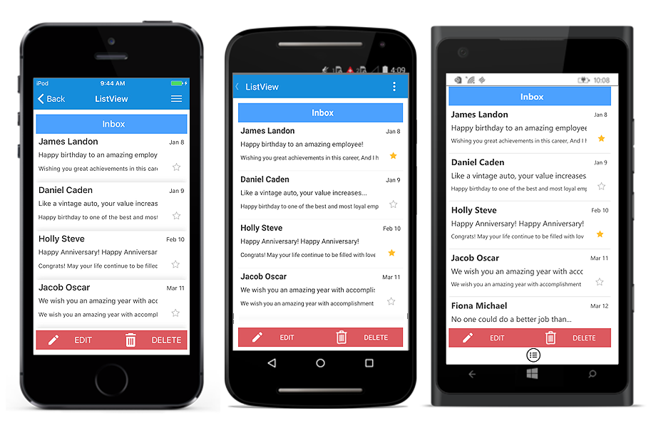
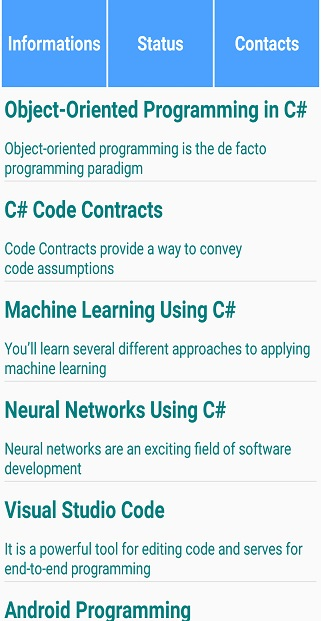
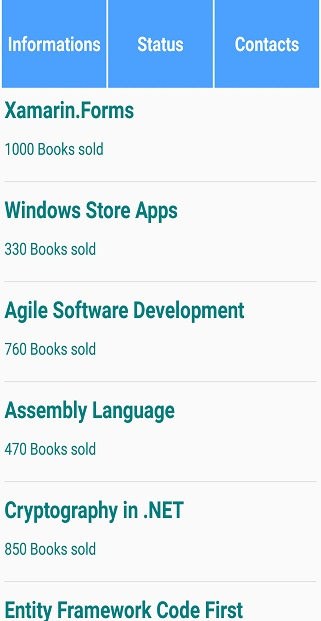
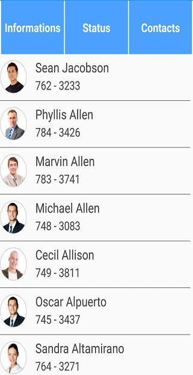
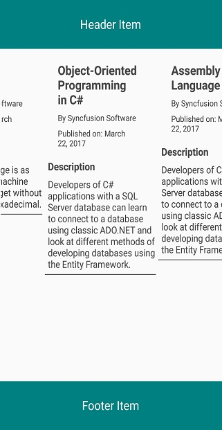

# Header and Footer

This section explains how to define and customize the header and footer in the SfListView.

## Adding header and footer

The [SfListView](https://help.syncfusion.com/cr/cref_files/xamarin/sflistview/Syncfusion.SfListView.XForms~Syncfusion.ListView.XForms.SfListView.html) allows adding and customizing appearance of the header and footer by setting the [SfListView.HeaderTemplate](https://help.syncfusion.com/cr/cref_files/xamarin/sflistview/Syncfusion.SfListView.XForms~Syncfusion.ListView.XForms.SfListView~HeaderTemplate.html) and [SfListView.FooterTemplate](https://help.syncfusion.com/cr/cref_files/xamarin/sflistview/Syncfusion.SfListView.XForms~Syncfusion.ListView.XForms.SfListView~FooterTemplate.html) properties.

To set the `HeaderTemplate`, follow the code example:



<syncfusion:SfListView x:Name="listView"
                 ItemsSource="{Binding InboxInfo}"
                 ItemSize="100">
  <syncfusion:SfListView.HeaderTemplate>
    <DataTemplate>
      <Grid BackgroundColor="#4CA1FE" HeightRequest="45">
        <Label LineBreakMode="NoWrap"
               Margin="10,0,0,0" Text="Inbox" FontAttributes="Bold"
               FontSize="18" TextColor="White" HorizontalOptions="Center"
               VerticalOptions="Center"/>
      </Grid>
    </DataTemplate>
  </syncfusion:SfListView.HeaderTemplate>
</syncfusion:SfListView>


viewModel = new ViewModel ();
listView = new SfListView();
listView.ItemsSource = viewModel.InboxInfo;
listView.HeaderTemplate = new DataTemplate(() =>
{
   var grid = new Grid();
   grid.BackgroundColor = Color.FromHex("#4CA1FE");
   var headerLabel = new Label
   {
       BackgroundColor = Color.White,
       FontSize = 18,
       FontAttributes = FontAttributes.Bold,
       Text = "Inbox"
   };

   grid.Children.Add(headerLabel);

   return grid;
});



## Customize the header and footer Size

The [SfListView](https://help.syncfusion.com/cr/cref_files/xamarin/sflistview/Syncfusion.SfListView.XForms~Syncfusion.ListView.XForms.SfListView.html) allows customizing size of the header and footer items by setting the [SfListView.HeaderSize](https://help.syncfusion.com/cr/cref_files/xamarin/sflistview/Syncfusion.SfListView.XForms~Syncfusion.ListView.XForms.SfListView~HeaderSize.html) and [SfListView.FooterSize](https://help.syncfusion.com/cr/cref_files/xamarin/sflistview/Syncfusion.SfListView.XForms~Syncfusion.ListView.XForms.SfListView~FooterSize.html) properties. The default value is 40. These properties respond to runtime changes. Hence, it can be customized based on the requirement.

To customize the header and footer size, follow the code example:



<syncfusion:SfListView x:Name="listView" HeaderSize="70" FooterSize="60" />


listView.HeaderSize = 70;
listView.FooterSize = 60;



N> For Vertical orientation, the header and footer size is considered as height and for Horizontal orientation, it will be considered as width.

## Stick the header and footer

The [SfListView](https://help.syncfusion.com/cr/cref_files/xamarin/sflistview/Syncfusion.SfListView.XForms~Syncfusion.ListView.XForms.SfListView.html) allows sticking the header and footer items to view by enabling the [SfListView.IsStickyHeader](https://help.syncfusion.com/cr/cref_files/xamarin/sflistview/Syncfusion.SfListView.XForms~Syncfusion.ListView.XForms.SfListView~IsStickyHeader.html) and [SfListView.IsStickyFooter](https://help.syncfusion.com/cr/cref_files/xamarin/sflistview/Syncfusion.SfListView.XForms~Syncfusion.ListView.XForms.SfListView~IsStickyFooter.html) properties. If `SfListView.IsStickyHeader` is `true`, the header item will stick to top of the view. If `SfListView.IsStickyFooter` is `true`, the footer item will stick to bottom of the view.



<syncfusion:SfListView x:Name="listView" IsStickyHeader="True" 
                     IsStickyFooter="True" />          


listView.IsStickyHeader = true;
listView.IsStickyFooter = true;



The following screenshot shows the output rendered when the header and footer is defined with `IsStickyHeader` as true and `IsStickyFooter` as true:

## How to

### Achieve the tabbed page using header

The [SfListView](https://help.syncfusion.com/cr/cref_files/xamarin/sflistview/Syncfusion.SfListView.XForms~Syncfusion.ListView.XForms.SfListView.html) allows you to achieve the tabbed page like structure by customizing the [HeaderTemplate](https://help.syncfusion.com/cr/cref_files/xamarin/sflistview/Syncfusion.SfListView.XForms~Syncfusion.ListView.XForms.SfListView~HeaderTemplate.html). Here we have set the three buttons in the `HeaderTemplate` to change the [ItemsSource](https://help.syncfusion.com/cr/cref_files/xamarin/sflistview/Syncfusion.SfListView.XForms~Syncfusion.ListView.XForms.SfListView~ItemsSource.html) at runtime, refer the following code example.

**XAML**


<?xml version="1.0" encoding="utf-8" ?>
<ContentPage xmlns="http://xamarin.com/schemas/2014/forms"
             xmlns:x="http://schemas.microsoft.com/winfx/2009/xaml"
             xmlns:local="clr-namespace:Header_Footer"
             xmlns:syncfusion="clr-namespace:Syncfusion.ListView.XForms;assembly=Syncfusion.SfListView.XForms"
             x:Class="Header_Footer.MainPage">

    <ContentPage.BindingContext>
        <local:BookInfoRepository />
    </ContentPage.BindingContext>

    <ContentPage.Resources>
        <ResourceDictionary>
            <DataTemplate x:Key="template">
                <ViewCell>
                    <ViewCell.View>
                        <Grid x:Name="grid" RowSpacing="0" Margin="5">
                            <Grid.RowDefinitions>
                                <RowDefinition Height="*" />
                                <RowDefinition Height="1" />
                            </Grid.RowDefinitions>
                            <Grid RowSpacing="0" Grid.Row="0">
                                <Grid.RowDefinitions>
                                    <RowDefinition Height="*" />
                                    <RowDefinition Height="*" />
                                </Grid.RowDefinitions>
                                <Label Grid.Row="0" Text="{Binding BookName}" FontAttributes="Bold" TextColor="Teal" FontSize="21" />
                                <Label Grid.Row="1" Text="{Binding BookDescription}" TextColor="Teal" FontSize="15"/>
                            </Grid>
                            <StackLayout Grid.Row="1" BackgroundColor="#E4E4E4" HeightRequest="1"/>
                        </Grid>
                    </ViewCell.View>
                </ViewCell>
            </DataTemplate>
        </ResourceDictionary>
    </ContentPage.Resources>
    <syncfusion:SfListView x:Name="listView" IsStickyHeader="True" IsStickyFooter="True"
                               HeaderSize="80" FooterSize="60" SelectionBackgroundColor="LightBlue" 
                               ItemSize="90" SelectionMode="Single" ItemTemplate="{StaticResource template}">
        <syncfusion:SfListView.HeaderTemplate>
            <DataTemplate>
                <Grid BackgroundColor="#4CA1FE" HeightRequest="60">
                    <Grid.ColumnDefinitions>
                        <ColumnDefinition Width="2" />
                        <ColumnDefinition Width="*" />
                        <ColumnDefinition Width="2" />
                        <ColumnDefinition Width="*" />
                        <ColumnDefinition Width="2" />
                        <ColumnDefinition Width="*" />
                        <ColumnDefinition Width="2" />
                    </Grid.ColumnDefinitions>
                    <Grid Grid.Column="1" HorizontalOptions="FillAndExpand" VerticalOptions="FillAndExpand" >
                        <Label x:Name="info" BackgroundColor="Transparent" Text="Informations" FontAttributes="Bold" FontSize="18" TextColor="White" 
                              HorizontalTextAlignment="Center" VerticalTextAlignment="Center"  />
                        <Grid.GestureRecognizers>
                            <TapGestureRecognizer Tapped="InfoTapGestureRecognizerTapped" NumberOfTapsRequired="1"/>
                        </Grid.GestureRecognizers>
                    </Grid>
                    <Grid Grid.Column="3" HorizontalOptions="FillAndExpand" VerticalOptions="FillAndExpand" >
                        <Label x:Name="status" BackgroundColor="Transparent" Text="Status" FontAttributes="Bold" FontSize="18" TextColor="White"  
                                HorizontalTextAlignment="Center" VerticalTextAlignment="Center" />
                        <Grid.GestureRecognizers>
                            <TapGestureRecognizer Tapped="StatusTapGestureRecognizerTapped" NumberOfTapsRequired="1"/>
                        </Grid.GestureRecognizers>
                    </Grid>
                    <Grid Grid.Column="5" HorizontalOptions="FillAndExpand" VerticalOptions="FillAndExpand" >
                        <Label x:Name="contacts" BackgroundColor="Transparent" Text="Contacts" FontAttributes="Bold" FontSize="18" TextColor="White" 
                               HorizontalTextAlignment="Center" VerticalTextAlignment="Center"/>
                        <Grid.GestureRecognizers>
                            <TapGestureRecognizer Tapped="ContactsTapGestureRecognizerTapped" NumberOfTapsRequired="1"/>
                        </Grid.GestureRecognizers>
                    </Grid>
                    <BoxView Grid.Column="0" BackgroundColor="White" />
                    <BoxView Grid.Column="2" BackgroundColor="White" />
                    <BoxView Grid.Column="4" BackgroundColor="White" />
                    <BoxView Grid.Column="6" BackgroundColor="White" />
                </Grid>
            </DataTemplate>
        </syncfusion:SfListView.HeaderTemplate>
    </syncfusion:SfListView>
</ContentPage>


**C#**


public partial class MainPage : ContentPage
{
    BookInfoRepository viewModel = new BookInfoRepository();
    BookInfoRepository1 viewModel1 = new BookInfoRepository1();
    EmployeeViewModel viewModel2 = new EmployeeViewModel();

    public MainPage()
    {
        InitializeComponent();
        this.listView.ItemsSource = viewModel.BookInfo;
    }

    public void InfoTapGestureRecognizerTapped(object sender, EventArgs e)
    {
        this.listView.ItemsSource = viewModel.BookInfo;
        this.listView.ItemTemplate = this.Resources["template"] as DataTemplate;
    }

    public void StatusTapGestureRecognizerTapped(object sender, EventArgs e)
    {
        this.listView.ItemsSource = viewModel1.BookInfo1;
        this.listView.ItemTemplate = this.Resources["template"] as DataTemplate;
    }

    public void ContactsTapGestureRecognizerTapped(object sender, EventArgs e)
    {
        this.listView.ItemsSource = viewModel2.EmployeeInfo;
        InitializeTemplate();
    }

    private void InitializeTemplate()
    {
        listView.ItemTemplate = new DataTemplate(() => { return CreateItemTemplate(); });
        listView.ItemSize = 70;
        listView.GroupHeaderSize = 60;
        listView.IsStickyGroupHeader = true;
        listView.AllowGroupExpandCollapse = true;
        listView.ItemSpacing = new Thickness(0, 0, 5, 0);
        listView.IsStickyHeader = true;
        listView.GroupHeaderTemplate = new DataTemplate(() =>
        {
            var grid = new Grid { BackgroundColor = Color.FromHex("#E4E4E4") };
            var label = new Label
            {
                FontAttributes = FontAttributes.Bold,
                FontSize = 22,
                VerticalOptions = LayoutOptions.Center,
                HorizontalOptions = LayoutOptions.Start,
                Margin = new Thickness(20, 0, 0, 0),
            };
            label.SetBinding(Label.TextProperty, new Binding("Key"));
            grid.Children.Add(label);
            return grid;
        });
    }

    private Grid CreateItemTemplate()
    {
        var gridView = new Grid();
        gridView.RowSpacing = 1;
        var row0 = new RowDefinition { Height = new GridLength(1, GridUnitType.Star) };
        var row1 = new RowDefinition { Height = 1 };
        gridView.RowDefinitions.Add(row0);
        gridView.RowDefinitions.Add(row1);

        var grid = new Grid();

        var column0 = new ColumnDefinition { Width = 50 };
        var column1 = new ColumnDefinition { Width = new GridLength(1, GridUnitType.Star) };
        var column2 = new ColumnDefinition { Width = 70 };
        grid.ColumnDefinitions.Add(column0);
        grid.ColumnDefinitions.Add(column1);
        grid.ColumnDefinitions.Add(column2);

        var contactimage = new Image();
        contactimage.SetBinding(Image.SourceProperty, new Binding("EmployeeImage"));
        contactimage.HeightRequest = 50;
        contactimage.VerticalOptions = LayoutOptions.Center;
        contactimage.HorizontalOptions = LayoutOptions.Center;

        var gridview = new Grid();

        gridview.RowSpacing = 1;
        gridview.Padding = new Thickness(10, 0, 0, 0);
        gridview.VerticalOptions = LayoutOptions.Center;
        var rowdefinition0 = new RowDefinition { Height = new GridLength(1, GridUnitType.Star) };
        var rowdefinition1 = new RowDefinition { Height = new GridLength(1, GridUnitType.Star) };
        gridview.RowDefinitions.Add(rowdefinition0);
        gridview.RowDefinitions.Add(rowdefinition1);

        var contactName = new Label();
        contactName.SetBinding(Label.TextProperty, new Binding("EmployeeName"));
        contactName.LineBreakMode = LineBreakMode.NoWrap;
        contactName.TextColor = Color.FromHex("#474747");
        contactName.FontSize = 20;

        var contactNumber = new Label();
        contactNumber.FontAttributes = FontAttributes.None;
        contactNumber.FontSize = 18;
        contactNumber.LineBreakMode = LineBreakMode.NoWrap;
        contactNumber.SetBinding(Label.TextProperty, new Binding("ContactNumber"));
        contactNumber.TextColor = Color.FromHex("#474747");

        var contactType = new Label();
        contactType.Margin = new Thickness(5);
        contactType.FontAttributes = FontAttributes.None;
        contactType.LineBreakMode = LineBreakMode.NoWrap;
        contactType.VerticalOptions = LayoutOptions.End;
        contactType.VerticalTextAlignment = TextAlignment.End;
        contactType.HorizontalOptions = LayoutOptions.End;
        contactType.SetBinding(Label.TextProperty, new Binding("Designation"));
        contactType.TextColor = Color.FromHex("#474747");
        contactType.FontSize = 12;

        var stackLayout = new StackLayout();
        stackLayout.HeightRequest = 1;
        stackLayout.BackgroundColor = Color.Gray;

        gridview.Children.Add(contactName, 0, 0);
        gridview.Children.Add(contactNumber, 0, 1);

        grid.Children.Add(contactimage);
        grid.Children.Add(gridview, 1, 0);

        gridView.Children.Add(grid);
        gridView.Children.Add(stackLayout, 0, 1);

        return gridView;
    }
}


The screenshot shows the output of tabbed page show when tap the header item. You can download the entire source code of this demo from [here](http://www.syncfusion.com/downloads/support/directtrac/general/ze/Header_Footer1375601372).

  

### Display the Header/Footer in vertical mode when listview is in horizontal mode

[SfListView](https://help.syncfusion.com/cr/cref_files/xamarin/sflistview/Syncfusion.SfListView.XForms~Syncfusion.ListView.XForms.SfListView.html) layout the header and footer item based on the [Orientation](https://help.syncfusion.com/cr/cref_files/xamarin/sflistview/Syncfusion.SfListView.XForms~Syncfusion.ListView.XForms.SfListView~Orientation.html). You can load the header and footer element with stick to the view, by customizing the **Grid** as like below code example which creates the header element at the top of the view, footer at bottom of the view and loads the items at the center. 

**XAML**


<Grid> 
  <Grid.RowDefinitions>
            <RowDefinition Height="70"/>
            <RowDefinition Height="*"/>
            <RowDefinition Height="70"/>
  </Grid.RowDefinitions>
  <Grid BackgroundColor="Teal"> 
    <Label Text="ListView AutoFit" FontSize="18" VerticalOptions="Center" HorizontalOptions="Center" TextColor="White"/> 
  </Grid> 
  <sync:SfListView x:Name="listView" ItemSize="80" GroupHeaderSize="80" 
                   ItemSpacing="2" Grid.Row="1" 
                   AutoFitMode="Height" 
                   ItemsSource="{Binding BookInfo}"/> 
  <Grid BackgroundColor="Teal" Grid.Row="2"> 
    <Label Text="ListView Footer Item" FontSize="18" VerticalOptions="Center" HorizontalOptions="Center" TextColor="White"/> 
  </Grid> 
</Grid> 


The screenshot shows the output of header/footer in vertical mode when listview is in horizontal mode. You can download the entire source code of this demo from [here](http://www.syncfusion.com/downloads/support/directtrac/general/ze/Header_Footer_Vertical-1553621205).

