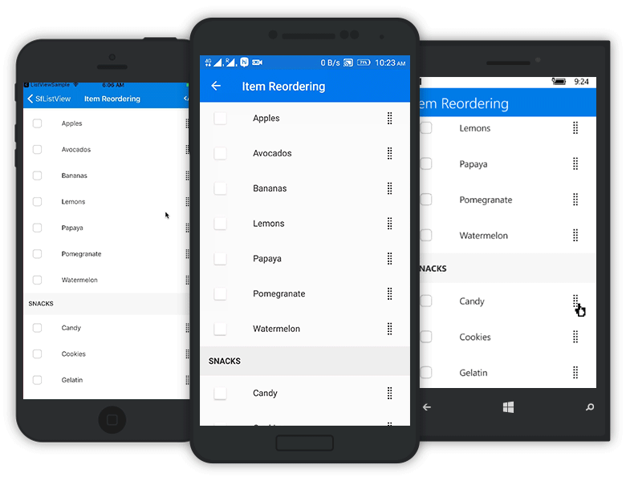
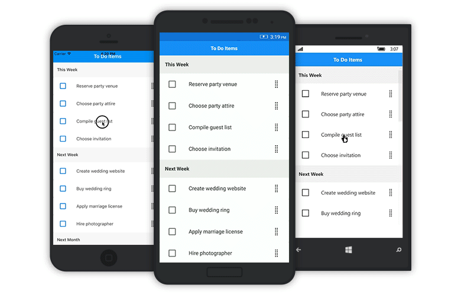

# Item Drag and Drop

The SfListView allows reordering by dragging and dropping items. It supports displaying the customized view in a template while dragging the item. It can be enabled by setting the [SfListView.DragStartMode](https://help.syncfusion.com/cr/cref_files/xamarin/sflistview/Syncfusion.SfListView.XForms~Syncfusion.ListView.XForms.SfListView~DragStartMode.html) property to `OnHold`. The drag and drop options are listed as follows:

 * None: Disables drag and drop. This is the default value.
 * OnHold: Allows dragging and dropping by holding the item.
 * OnDragIndicator: Allows dragging and dropping by loading the [DragIndicatorView](https://help.syncfusion.com/cr/cref_files/xamarin/sflistview/Syncfusion.SfListView.XForms~Syncfusion.ListView.XForms.DragIndicatorView.html) within [SfListView.ItemTemplate](https://help.syncfusion.com/cr/cref_files/xamarin/sflistview/Syncfusion.SfListView.XForms~Syncfusion.ListView.XForms.SfListView~ItemTemplate.html).

N> The [GridLayout](https://help.syncfusion.com/cr/cref_files/xamarin/sflistview/Syncfusion.SfListView.XForms~Syncfusion.ListView.XForms.GridLayout.html) does not support drag and drop. 

The drag and drop scenarios are as follows:

 * Items can be reordered to any position by auto-scrolling.
 * Items can be reordered in same group or in other groups but, no groups can be added to other groups.
 * Groups, header, and footer cannot be reordered.

To enable drag and drop using 'OnHold', follow the code example:



<ContentPage  xmlns:syncfusion="clr-namespace:Syncfusion.ListView.XForms;assembly=Syncfusion.SfListView.XForms">
  <syncfusion:SfListView x:Name="listView" 
                   ItemsSource="{Binding ToDoList}"
                   DragStartMode="OnHold"
                   BackgroundColor="#FFE8E8EC"
                   ItemSize="60" />
</ContentPage>


listView.DragStartMode = DragStartMode.OnHold; 



To enable drag and drop using both 'OnHold' and 'OnDragIndicator', follow the code example:



<ContentPage xmlns:syncfusion="clr-namespace:Syncfusion.ListView.XForms;assembly=Syncfusion.SfListView.XForms">
  <syncfusion:SfListView x:Name="listView" 
                   ItemsSource="{Binding ToDoList}"
                   DragStartMode="OnHold, OnDragIndicator"
                   BackgroundColor="#FFE8E8EC"
                   ItemSize="60" />
</ContentPage>


listView.DragStartMode = DragStartMode.OnHold | DragStartMode.OnDragIndicator; 



N> Reordering changes are made only in view, and not in the underlying data. Thus, the changes will be reverted when performing sorting, grouping, or any other operations that refreshes the view.

## Drag indicator view

To drag and drop the items by [DragIndicatorView](https://help.syncfusion.com/cr/cref_files/xamarin/sflistview/Syncfusion.SfListView.XForms~Syncfusion.ListView.XForms.DragIndicatorView.html), set the [SfListView.DragStartMode](https://help.syncfusion.com/cr/cref_files/xamarin/sflistview/Syncfusion.SfListView.XForms~Syncfusion.ListView.XForms.SfListView~DragStartMode.html) property to `OnDragIndicator`. To display the dragging item, define any custom user interface(UI) in `DragIndicatorView`.

N> You must set the SfListView instance as reference to the [ListView](https://help.syncfusion.com/cr/cref_files/xamarin/sflistview/Syncfusion.SfListView.XForms~Syncfusion.ListView.XForms.DragIndicatorView~ListView.html) property in `DragIndicatorView`.



<ContentPage xmlns:syncfusion="clr-namespace:Syncfusion.ListView.XForms;assembly=Syncfusion.SfListView.XForms">
  <syncfusion:SfListView x:Name="listView" 
                   ItemsSource="{Binding ToDoList}"
                   DragStartMode="OnDragIndicator"
                   BackgroundColor="#FFE8E8EC"
                   ItemSize="60">
  <syncfusion:SfListView.ItemTemplate>
    <DataTemplate>
      <Grid Padding="10">
          <Grid.ColumnDefinitions>
            <ColumnDefinition Width="*" />
            <ColumnDefinition Width="60" />
          </Grid.ColumnDefinitions>
          <Label x:Name="textLabel" Text="{Binding Name}" Grid.Column="1" FontSize="15" TextColor="#333333" />
          <syncfusion:DragIndicatorView Grid.Column="2" ListView="{x:Reference listView}" 
                    HorizontalOptions="Center" 
                    VerticalOptions="Center">
            <Grid Padding="10, 20, 20, 20">
              <Image Source="DragIndicator.png" />
            </Grid>
          </syncfusion:DragIndicatorView>
        </Grid>
      </Grid>
    </DataTemplate>
  </syncfusion:SfListView.ItemTemplate>
</syncfusion:SfListView>                
</ContentPage>


listView.ItemTemplate = new DataTemplate(() =>
{
  var grid = new Grid();
  var name = new Label
  {
    FontSize = 15,
    VerticalOptions = LayoutOptions.Center
  };
  name.SetBinding(Label.TextProperty, new Binding("Name"));

  var indicatorGrid = new Grid()
  {
    Padding = new Thickness(10, 20, 20, 20),
    HorizontalOptions = LayoutOptions.End,
    VerticalOptions = LayoutOptions.Center
  };
  var dragIndicatorView = new DragIndicatorView() { ListView = this.listView };
  var indicator = new Image() { Source = "DragIndicator.png" };

  indicatorGrid.Children.Add(indicator);
  dragIndicatorView.Content = indicatorGrid;

  grid.Children.Add(name);
  grid.Children.Add(dragIndicatorView, 1, 0);
  return grid;
});



The screenshot shows the output of the reordering items by drag and drop. You can download the entire source code of this demo from [here](http://www.syncfusion.com/downloads/support/directtrac/general/ze/ItemReordering-2006479137).

## Drag item customization

By defining the [SfListView.DragItemTemplate](https://help.syncfusion.com/cr/cref_files/xamarin/sflistview/Syncfusion.SfListView.XForms~Syncfusion.ListView.XForms.SfListView~DragItemTemplate.html) of the SfListView, displays the custom User Interface(UI) when performing drag and drop operations. The template can be defined either in code or XAML.

N> If `BackgroundColor` is set to `DragItemTemplate` or [DragIndicatorView](https://help.syncfusion.com/cr/cref_files/xamarin/sflistview/Syncfusion.SfListView.XForms~Syncfusion.ListView.XForms.DragIndicatorView.html), set `InputTransparent` to true. Since, dragging does not happen when performing by `DragIndicatorView` in UWP.



<ContentPage xmlns:syncfusion="clr-namespace:Syncfusion.ListView.XForms;assembly=Syncfusion.SfListView.XForms">
  <syncfusion:SfListView x:Name="listView" 
                   ItemsSource="{Binding ToDoList}"
                   DragStartMode="OnHold"
                   BackgroundColor="#FFE8E8EC"
                   ItemSize="60">
  <syncfusion:SfListView.DragItemTemplate>
    <DataTemplate>
      <Grid Padding="10">
        <Label x:Name="textLabel" Text="{Binding Name}" FontSize="15" />
      </Grid>
    </DataTemplate>
  </syncfusion:SfListView.DragItemTemplate>
</syncfusion:SfListView>                
</ContentPage>


listView.ItemTemplate = new DataTemplate(() => {
  var grid = new Grid();
  var name = new Label { FontSize = 15 };
  name.SetBinding(Label.TextProperty, new Binding("Name"));
  grid.Children.Add(name);
  return grid;
});



## Event

The [ItemDragging](https://help.syncfusion.com/cr/cref_files/xamarin/sflistview/Syncfusion.SfListView.XForms~Syncfusion.ListView.XForms.SfListView~ItemDragging_EV.html) event is raised while dragging and dropping the item in the [SfListView](https://help.syncfusion.com/cr/cref_files/xamarin/sflistview/Syncfusion.SfListView.XForms~Syncfusion.ListView.XForms.SfListView.html). The [ItemDraggingEventArgs](https://help.syncfusion.com/cr/cref_files/xamarin/sflistview/Syncfusion.SfListView.XForms~Syncfusion.ListView.XForms.ItemDraggingEventArgs.html) has the following members which provides the information for the `ItemDragging` event:

 * [Action](https://help.syncfusion.com/cr/cref_files/xamarin/sflistview/Syncfusion.SfListView.XForms~Syncfusion.ListView.XForms.ItemDraggingEventArgs~Action.html): Returns the drag `Action` such as start, dragging, and drop.
 * [Bounds](https://help.syncfusion.com/cr/cref_files/xamarin/sflistview/Syncfusion.SfListView.XForms~Syncfusion.ListView.XForms.ItemDraggingEventArgs~Bounds.html): Return bounds of drag item when dragging and dropping.
 * [Handled](https://help.syncfusion.com/cr/cref_files/xamarin/sflistview/Syncfusion.SfListView.XForms~Syncfusion.ListView.XForms.ItemDraggingEventArgs~Handled.html): If this member is set to true, dragging can be handled. It is applicable only if `Action` is `Dragging`.
 * [ItemData](https://help.syncfusion.com/cr/cref_files/xamarin/sflistview/Syncfusion.SfListView.XForms~Syncfusion.ListView.XForms.ItemDraggingEventArgs~ItemData.html): Returns the underlying data of the dragging item. 
 * [NewIndex](https://help.syncfusion.com/cr/cref_files/xamarin/sflistview/Syncfusion.SfListView.XForms~Syncfusion.ListView.XForms.ItemDraggingEventArgs~NewIndex.html): Returns the item index of the [DataSource.DisplayItems] (https://help.syncfusion.com/cr/cref_files/xamarin/sflistview/Syncfusion.DataSource.Portable~Syncfusion.DataSource.DisplayItems.html) where dragging item is going to be dropped.
 * [OldIndex](https://help.syncfusion.com/cr/cref_files/xamarin/sflistview/Syncfusion.SfListView.XForms~Syncfusion.ListView.XForms.ItemDraggingEventArgs~OldIndex.html): Returns the item index of the [DataSource.DisplayItems] (https://help.syncfusion.com/cr/cref_files/xamarin/sflistview/Syncfusion.DataSource.Portable~Syncfusion.DataSource.DisplayItems.html) where dragging item started. The OldIndex and NewIndex will be same if `Action` is `Start`.
 * [Position](https://help.syncfusion.com/cr/cref_files/xamarin/sflistview/Syncfusion.SfListView.XForms~Syncfusion.ListView.XForms.ItemDraggingEventArgs~Position.html): Returns the touch position of the drag item from screen coordinates.

## Auto scroll options

### Auto scroll margin

To adjust auto scroll margin, set a value to the [ScrollMargin](https://help.syncfusion.com/cr/cref_files/xamarin/sflistview/Syncfusion.SfListView.XForms~Syncfusion.ListView.XForms.AutoScroller~ScrollMargin.html) property of [AutoScroller](https://help.syncfusion.com/cr/cref_files/xamarin/sflistview/Syncfusion.SfListView.XForms~Syncfusion.ListView.XForms.AutoScroller.html) to enable auto-scrolling while dragging. The default value is 15. Auto-scrolling will be enabled when reaching `ScrollMargin` from view bounds while dragging.

To disable auto-scrolling, set the value to `0` for `ScrollMargin`.



this.listView.AutoScroller.ScrollMargin = 20;



### Auto scroll interval

To adjust auto-scroll interval while dragging, set the [Interval](https://help.syncfusion.com/cr/cref_files/xamarin/sflistview/Syncfusion.SfListView.XForms~Syncfusion.ListView.XForms.AutoScroller~Interval.html) property of [AutoScroller](https://help.syncfusion.com/cr/cref_files/xamarin/sflistview/Syncfusion.SfListView.XForms~Syncfusion.ListView.XForms.AutoScroller.html). The default value is 150 milliseconds.



this.listView.AutoScroller.Interval = new TimeSpan(0, 0, 0, 0, 200);



### Disable outside scroll

To disable auto-scroll when dragging item moves outside the SfListView while dragging, set the [AllowOutsideScroll](https://help.syncfusion.com/cr/cref_files/xamarin/sflistview/Syncfusion.SfListView.XForms~Syncfusion.ListView.XForms.AutoScroller~AllowOutsideScroll.html) property of [AutoScroller](https://help.syncfusion.com/cr/cref_files/xamarin/sflistview/Syncfusion.SfListView.XForms~Syncfusion.ListView.XForms.AutoScroller.html) to true. The default value is true.



this.listView.AutoScroller.AllowOutsideScroll = false;



## Disable dragging for particular item

To disable dragging for a particular item, handle the [ItemDragging](https://help.syncfusion.com/cr/cref_files/xamarin/sflistview/Syncfusion.SfListView.XForms~Syncfusion.ListView.XForms.SfListView~ItemDragging_EV.html) event based on the conditions of [Action](https://help.syncfusion.com/cr/cref_files/xamarin/sflistview/Syncfusion.SfListView.XForms~Syncfusion.ListView.XForms.ItemDraggingEventArgs~Action.html) event argument.



private void ListView_ItemDragging(object sender, ItemDraggingEventArgs e)
{
  // Disable the dragging for 4th item.
  if (e.Action == DragAction.Start && e.NewIndex == 3)
    e.Cancel = true;
}



## Cancel dropping for the dragged item

To cancel dropping for the dragged item, handle the [ItemDragging](https://help.syncfusion.com/cr/cref_files/xamarin/sflistview/Syncfusion.SfListView.XForms~Syncfusion.ListView.XForms.SfListView~ItemDragging_EV.html) event based on the conditions of [Action](https://help.syncfusion.com/cr/cref_files/xamarin/sflistview/Syncfusion.SfListView.XForms~Syncfusion.ListView.XForms.ItemDraggingEventArgs~Action.html) event argument. 



private void ListView_ItemDragging(object sender, ItemDraggingEventArgs e)
{
  // Cancel the dropping if drop the drag item into out of view.
  var listView = sender as ListView;
  var totalExtent = listView.GetVisualContainer().Bounds.Bottom;
  if (e.Action == DragAction.Drop && (e.Bounds.Y < -30 || e.Bounds.Bottom > totalExtent + 40))
    e.Cancel = true;
}



## Reorder the underlying collection 

The underlying collection can be reordered directly by setting the [UpdateSource](https://help.syncfusion.com/cr/cref_files/xamarin/sflistview/Syncfusion.SfListView.XForms~Syncfusion.ListView.XForms.DragDropController~UpdateSource.html) property to `true`. The default value is `false`. 



this.listView.DragDropController.UpdateSource = true;



N> Updating items order is not availabe in the underlying collection if grouping is enabled. Because, order of the `DisplayItems` of the DataSource and underlying collection is different.

## Delete item when dropping in particular view

To delete the dragged item when dropping into a particular view, handle the [ItemDragging](https://help.syncfusion.com/cr/cref_files/xamarin/sflistview/Syncfusion.SfListView.XForms~Syncfusion.ListView.XForms.SfListView~ItemDragging_EV.html) event based on the conditions of [Action](https://help.syncfusion.com/cr/cref_files/xamarin/sflistview/Syncfusion.SfListView.XForms~Syncfusion.ListView.XForms.ItemDraggingEventArgs~Action.html) and `Bounds` event arguments. 

To delete the dragged item from the underlying collection when dropping into delete icon, follow the code example. It will enable or disable whenever drag started, and dropped by IsVisible property in ViewModel.



<ContentPage xmlns:syncfusion="clr-namespace:Syncfusion.ListView.XForms;assembly=Syncfusion.SfListView.XForms">
<Grid>
  <Grid.RowDefinitions>
    <RowDefinition Height="Auto" />
    <RowDefinition Height="*" />
  </Grid.RowDefinitions>

  <Grid BackgroundColor="#2196F3">
    <Label Text="To Do Items" x:Name="headerLabel"  TextColor="White" FontAttributes="Bold" VerticalOptions="Center" HorizontalOptions="Center" />
    <StackLayout x:Name="stackLayout" IsVisible="{Binding IsVisible}" Orientation="Horizontal" VerticalOptions="Center" HorizontalOptions="Center">
      <Image Source="Delete.png" HeightRequest="30" WidthRequest="30" />
      <Label x:Name="deleteLabel" Text="Delete Item" FontAttributes="Bold" TextColor="White" />
    </StackLayout>
  </Grid>
  <syncfusion:SfListView x:Name="listView" Grid.Row="1"
                   ItemsSource="{Binding ToDoList}"
                   DragStartMode="OnHold"
                   BackgroundColor="#FFE8E8EC"
                   ItemSize="60" />
</Grid>            
</ContentPage>


public partial class MainPage : ContentPage
{
  public MainPage()
  {
    InitializeComponent();
    var grid = new Grid();
    grid.RowDefinitions.Add(new RowDefinition { Height = new GridLength(40) });
    grid.RowDefinitions.Add(new RowDefinition { Height = new GridLength(1, GridUnitType.Star) });
    var grid1 = new Grid();
    var headerLabel = new Label()
    {
      Text = "To Do Items"
    };
    var stackLayout = new StackLayout();
    stackLayout.SetBinding(StackLayout.IsVisibleProperty, new Binding("IsVisible"));
    var image = new Image() { Source = "Delete.png" };
    var deleteLabel = new Label() { Text = "DeleteItem" };
    stackLayout.Children.Add(image);
    stackLayout.Children.Add(deleteLabel);
    grid1.Children.Add(headerLabel);
    grid1.Children.Add(stackLayout);
    var listView = new SfListView()
    {
      DragStartMode = DragStartMode.OnHold,
      ItemSize = 60,
      SelectionMode = SelectionMode.None,
      BackgroundColor = Color.FromHex("#FFE8E8EC")
    };
    listView.SetBinding(ListView.ItemsSourceProperty, new Binding("ToDoList"));
    grid.Children.Add(grid1);
    grid.Children.Add(listView, 0, 1);
  }
}





private async void ListView_ItemDragging(object sender, ItemDraggingEventArgs e)
{
  var viewModel = this.listView.BindingContext as ViewModel;

  if (e.Action == DragAction.Start)
  {
    viewModel.IsVisible = true;
    this.stackLayout.Opacity = 0.25;
  }

  if(e.Action == DragAction.Dragging)
  {
    var position = new Point(e.Position.X - this.listView.Bounds.X, e.Position.Y - this.listView.Bounds.Y);
    if (this.stackLayout.Bounds.Contains(position))
      this.deleteLabel.TextColor = Color.Red;
    else
      this.deleteLabel.TextColor = Color.White;
  }

  if(e.Action == DragAction.Drop)
  {
    var position = new Point(e.Position.X - this.listView.Bounds.X, e.Position.Y - this.listView.Bounds.Y);
    if (this.stackLayout.Bounds.Contains(position))
    {
      await Task.Delay(100);
      viewModel.ToDoList.Remove(e.ItemData as ToDoItem);
    }
    viewModel.IsVisible = false;
    this.deleteLabel.TextColor = Color.White;
    this.headerLabel.IsVisible = true;
  }
}



You can download the sample for above source code from [here](http://www.syncfusion.com/downloads/support/directtrac/general/ze/ItemDragAndDelete-1586236836).

## Skip dragging item into another group

To skip dragging from one group to another group, handle the [ItemDragging](https://help.syncfusion.com/cr/cref_files/xamarin/sflistview/Syncfusion.SfListView.XForms~Syncfusion.ListView.XForms.SfListView~ItemDragging_EV.html) event based on the conditions of [Action](https://help.syncfusion.com/cr/cref_files/xamarin/sflistview/Syncfusion.SfListView.XForms~Syncfusion.ListView.XForms.ItemDraggingEventArgs~Action.html) and `Bounds` event arguments.

N> While auto-scrolling, dragging item cannot be skipped.

Skip the dragging item by bounds of dragging item, and bounds of current and next group item.



private async void ListView_ItemDragging(object sender, ItemDraggingEventArgs e)
{
  if (e.Action == DragAction.Dragging)
  {
    var currentGroup = this.GetGroup(e.ItemData);
    var container = this.listView.GetVisualContainer();
    var groupIndex = this.listView.DataSource.Groups.IndexOf(currentGroup);
    var nextGroup = (groupIndex + 1 < this.listView.DataSource.Groups.Count) ? this.listView.DataSource.Groups[groupIndex + 1] : null;
    ListViewItem groupItem = null;
    ListViewItem nextGroupItem = null;

    foreach (ListViewItem item in container.Children)
    {
      if (item.BindingContext.Equals(currentGroup))
        groupItem = item;

      if (nextGroup != null && item.BindingContext.Equals(nextGroup))
        nextGroupItem = item;
    }

    if (e.Bounds.Y <= groupItem.Y + groupItem.Height || nextGroupItem != null && (e.Bounds.Y + e.Bounds.Height >= nextGroupItem.Y))
      e.Handled = true;
  }
}

private GroupResult GetGroup(object itemData)
{
  GroupResult itemGroup = null;

  foreach (var item in this.listView.DataSource.DisplayItems)
  {
    if (item is GroupResult)
      itemGroup = item as GroupResult;

    if (item == itemData)
      break;
  }
  return itemGroup;
}



Download the sample for above source code from [here](http://www.syncfusion.com/downloads/support/directtrac/general/ze/ItemDragandDrop-1832006690).

## Drag and drop customization

### Adjust drag item axis

To adjust drag item coordinates (X and Y) while dragging, returns true from virtual method [CanAdjustDragItemAxis](https://help.syncfusion.com/cr/cref_files/xamarin/sflistview/Syncfusion.SfListView.XForms~Syncfusion.ListView.XForms.DragDropController~CanAdjustDragItemAxis.html) of [DragDropController](https://help.syncfusion.com/cr/cref_files/xamarin/sflistview/Syncfusion.SfListView.XForms~Syncfusion.ListView.XForms.DragDropController.html). By default, Y coordinates can be adjusted if [SfListView.Orientation](https://help.syncfusion.com/cr/cref_files/xamarin/sflistview/Syncfusion.SfListView.XForms~Syncfusion.ListView.XForms.SfListView~Orientation.html) is `Vertical`, and X coordinates can be adjusted if `Orientation` is `Horizontal`.



this.listView.DragDropController = new DragDropControllerExt(this.listView);

public class DragDropControllerExt : DragDropController
{
  public DragDropControllerExt(SfListView listView) : base(listView)
  {

  }

  protected override bool CanAdjustDragItemAxis()
  {
    return true;
  }
}



### Layout item on dragging

In the SfListView, layout the [ListViewItem](https://help.syncfusion.com/cr/cref_files/xamarin/sflistview/Syncfusion.SfListView.XForms~Syncfusion.ListView.XForms.ListViewItem.html) with different animations, and time on dragging by virtual method [OnLayoutItem](https://help.syncfusion.com/cr/cref_files/xamarin/sflistview/Syncfusion.SfListView.XForms~Syncfusion.ListView.XForms.DragDropController~OnLayoutItem.html).



this.listView.DragDropController = new DragDropControllerExt(this.listView);

public class DragDropControllerExt : DragDropController
{
  public DragDropControllerExt(SfListView listView) : base(listView)
  {

  }

  protected override Task<bool> OnLayoutItem(View element, Rectangle rect)
  {
    return element.LayoutTo(rect, 250, Easing.BounceIn);
  }
}

