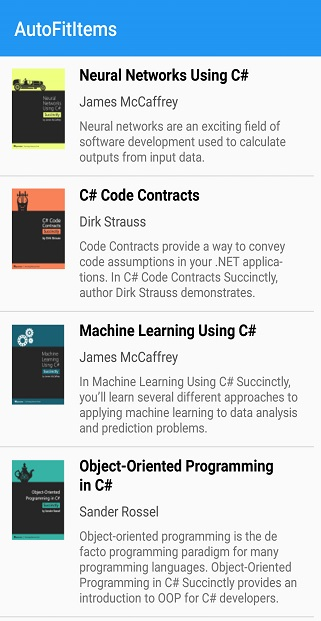

# Item Size Customization

This section explains how to customize the item size in the SfListView.

## Customize item size of a particular item on-demand

The SfListView allows customizing the size of the item on-demand by the [SfListView.QueryItemSize](https://help.syncfusion.com/cr/cref_files/xamarin/sflistview/Syncfusion.SfListView.XForms~Syncfusion.ListView.XForms.SfListView~QueryItemSize_EV.html) event using the item index. This event is raised whenever items come to view and triggered with [QueryItemSizeEventArgs](https://help.syncfusion.com/cr/cref_files/xamarin/sflistview/Syncfusion.SfListView.XForms~Syncfusion.ListView.XForms.QueryItemSizeEventArgs.html).

The `SfListView.QueryItemSize` event provides the following properties in their arguments:

 * [ItemIndex](https://help.syncfusion.com/cr/cref_files/xamarin/sflistview/Syncfusion.SfListView.XForms~Syncfusion.ListView.XForms.QueryItemSizeEventArgs~ItemIndex.html): Identifies a particular item in the SfListView. 
 * [ItemData](https://help.syncfusion.com/cr/cref_files/xamarin/sflistview/Syncfusion.SfListView.XForms~Syncfusion.ListView.XForms.QueryItemSizeEventArgs~ItemData.html): Identifies the underlying data bound to that item.
 * [ItemSize](https://help.syncfusion.com/cr/cref_files/xamarin/sflistview/Syncfusion.SfListView.XForms~Syncfusion.ListView.XForms.QueryItemSizeEventArgs~ItemSize.html): Identifies size of the queried item. For vertical orientation, it will be considered as the item height. For horizontal orientation, it will be considered as the item width.
 * [ItemType](https://help.syncfusion.com/cr/cref_files/xamarin/sflistview/Syncfusion.SfListView.XForms~Syncfusion.ListView.XForms.QueryItemSizeEventArgs~ItemType.html): Identifies the item type of the queried item.
 * [Handled](https://help.syncfusion.com/cr/cref_files/xamarin/sflistview/Syncfusion.SfListView.XForms~Syncfusion.ListView.XForms.QueryItemSizeEventArgs~Handled.html): Decides whether the specified size can be set to the item or not. The default value is false. When this property is not set, the decided size will not set to the item.



this.listView.QueryItemSize += ListView_QueryItemSize;

private void ListView_QueryItemSize(object sender, Syncfusion.ListView.XForms.QueryItemSizeEventArgs e)
{
    if(e.ItemIndex == 1)
    {
        e.ItemSize = 300;
        e.Handled = true;
    }
}



You can download the entire source code of this demo [here](http://www.syncfusion.com/downloads/support/directtrac/general/ze/AutoFit-1318092121).

## AutoFit the items based on the content

The SfListView allows dynamically adjusting size of items based on the content loaded in the [SfListView.ItemTemplate](https://help.syncfusion.com/cr/cref_files/xamarin/sflistview/Syncfusion.SfListView.XForms~Syncfusion.ListView.XForms.SfListView~ItemTemplate.html) by defining the [SfListView.AutoFitMode](https://help.syncfusion.com/cr/cref_files/xamarin/sflistview/Syncfusion.SfListView.XForms~Syncfusion.ListView.XForms.SfListView~AutoFitMode.html) property. The control has two types of AutoFitMode as listed as follows:

 * Height: AutoFit the items based on the content. It considers height of the item when the orientation is vertical [SfListView.Orientation](https://help.syncfusion.com/cr/cref_files/xamarin/sflistview/Syncfusion.SfListView.XForms~Syncfusion.ListView.XForms.SfListView~Orientation.html). When the orientation is horizontal, considers width of the item. The [SfListView.GridLayout](https://help.syncfusion.com/cr/cref_files/xamarin/sflistview/Syncfusion.SfListView.XForms~Syncfusion.ListView.XForms.GridLayout.html) AutoFit all the items in a row and takes the maximum item height of the row and applies to all other items in that row.
 * None: The SfListView items are layout by [SfListView.ItemSize](https://help.syncfusion.com/cr/cref_files/xamarin/sflistview/Syncfusion.SfListView.XForms~Syncfusion.ListView.XForms.SfListView~ItemSize.html).



<syncfusion:SfListView x:Name="listView" 
                     ItemSize="200"
                     AutoFitMode="Height"
                     ItemsSource="{Binding BookInfo}" />


listView.AutoFitMode = AutoFitMode.Height; 



N> If you define any size manually to the view loaded in [SfListView.ItemTemplate](https://help.syncfusion.com/cr/cref_files/xamarin/sflistview/Syncfusion.SfListView.XForms~Syncfusion.ListView.XForms.SfListView~ItemTemplate.html), the SfListView will return that size as the item size for each item. 

You can download the entire source code of this demo [here](http://www.syncfusion.com/downloads/support/directtrac/general/ze/AutoFit2085660985).

## Limitations

 * Defines the size of the image when loading image in the [SfListView.ItemTemplate](https://help.syncfusion.com/cr/cref_files/xamarin/sflistview/Syncfusion.SfListView.XForms~Syncfusion.ListView.XForms.SfListView~ItemTemplate.html). Because, it does not return actual measured size when measuring before layout the item.
 * Avoid SfListView inside the SfListView if [SfListView.AutoFitMode](https://help.syncfusion.com/cr/cref_files/xamarin/sflistview/Syncfusion.SfListView.XForms~Syncfusion.ListView.XForms.SfListView~AutoFitMode.html) is height. Because, the inner SfListView does not return actual measured size when measuring before layout the item.
 