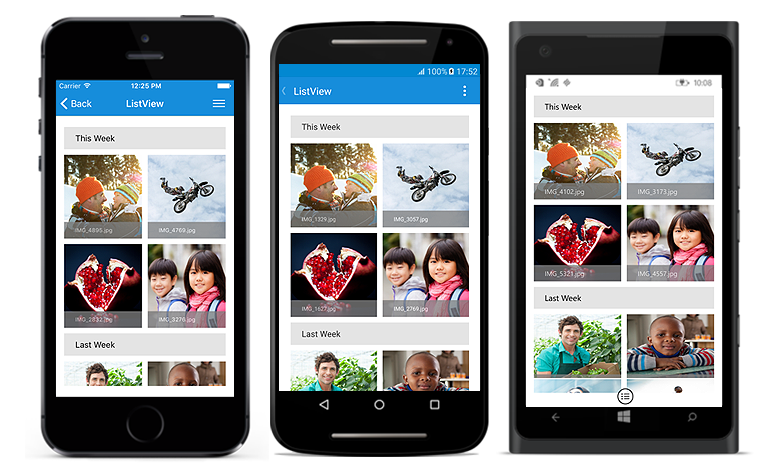
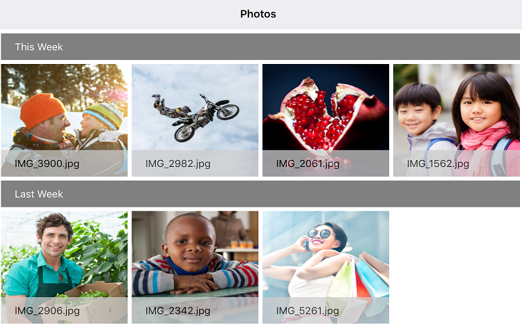

# Layouts

SfListView supports different layouts such as linear layout and grid layout. [SfListView.LayoutManager](https://help.syncfusion.com/cr/cref_files/xamarin/sflistview/Syncfusion.SfListView.XForms~Syncfusion.ListView.XForms.SfListView~LayoutManager.html) property is used to define the layout.

## Linear Layout

Linear layout arranges the items in a single column. Initialize the [LinearLayout](https://help.syncfusion.com/cr/cref_files/xamarin/sflistview/Syncfusion.SfListView.XForms~Syncfusion.ListView.XForms.LinearLayout.html) and assigning it to [SfListView.LayoutManager](https://help.syncfusion.com/cr/cref_files/xamarin/sflistview/Syncfusion.SfListView.XForms~Syncfusion.ListView.XForms.SfListView~LayoutManager.html) property to load the SfListView in linear layout. It is the default layout for SfListView.



<syncfusion:SfListView x:Name="listView" 
                   ItemsSource="{Binding GalleryInfo}"
                   ItemSize="100">
    <syncfusion:SfListView.LayoutManager>
      <syncfusion:LinearLayout />
    </syncfusion:SfListView.LayoutManager>
</syncfusion:SfListView>


listView.LayoutManager = new LinearLayout();



The following screenshot shows the output of linear layout.

## Grid Layout

Grid layout arranges the items in a predefined number of columns. Initialize the [GridLayout](https://help.syncfusion.com/cr/cref_files/xamarin/sflistview/Syncfusion.SfListView.XForms~Syncfusion.ListView.XForms.GridLayout.html) and assigning it to [SfListView.LayoutManager](https://help.syncfusion.com/cr/cref_files/xamarin/sflistview/Syncfusion.SfListView.XForms~Syncfusion.ListView.XForms.SfListView~LayoutManager.html) property to load SfListView in grid layout. 

The number of columns can be defined by using the [SpanCount](https://help.syncfusion.com/cr/cref_files/xamarin/sflistview/Syncfusion.SfListView.XForms~Syncfusion.ListView.XForms.GridLayout~SpanCount.html) property of `GridLayout`. Default `SpanCount` is 2.
In horizontal orientation, `SpanCount` defines the number of rows.



<syncfusion:SfListView x:Name="listView" 
                   ItemsSource="{Binding GalleryInfo}"
                   ItemSize="100">
    <syncfusion:SfListView.LayoutManager>
      <syncfusion:GridLayout SpanCount="2" />
    </syncfusion:SfListView.LayoutManager>
</syncfusion:SfListView>


listView.LayoutManager = new GridLayout() { SpanCount = 2 };



The following screenshot shows the output of Grid layout. You can download the entire source code of this demo from [here](http://www.syncfusion.com/downloads/support/directtrac/general/ze/ListViewGridLayout1923264609)

### Customize SpanCount based on devices

[SpanCount](https://help.syncfusion.com/cr/cref_files/xamarin/sflistview/Syncfusion.SfListView.XForms~Syncfusion.ListView.XForms.GridLayout~SpanCount.html) property of GridLayout can be customized based on platform specific to avoid squeezed problem of listview item in tablet devices or windows desktop. The below code illustrates how to customize the `SpanCount` specific to platform and devices,



 <syncfusion:SfListView.LayoutManager>
   <syncfusion:GridLayout>
      <syncfusion:GridLayout.SpanCount>
       <OnPlatform x:TypeArguments="x:Int32">
         <OnPlatform.WinPhone>
           <OnIdiom x:TypeArguments="x:Int32" Phone="2" Tablet="4" Desktop="4"/>
         </OnPlatform.WinPhone>
         <OnPlatform.Android>
           <OnIdiom x:TypeArguments="x:Int32" Phone="2" Tablet="4" />
         </OnPlatform.Android>
         <OnPlatform.iOS>
           <OnIdiom x:TypeArguments="x:Int32" Phone="2" Tablet="4" />
         </OnPlatform.iOS>
       </OnPlatform>
     </syncfusion:GridLayout.SpanCount>
   </syncfusion:GridLayout>
 </syncfusion:SfListView.LayoutManager>


GridLayout gridLayout = new GridLayout();

if (Device.OS == TargetPlatform.Android || Device.OS == TargetPlatform.iOS)
   gridLayout.SpanCount = Device.Idiom == TargetIdiom.Phone ? 2 : 4;
else if (Device.OS == TargetPlatform.Windows)
   gridLayout.SpanCount = Device.Idiom == TargetIdiom.Desktop || Device.Idiom == TargetIdiom.Tablet ? 4 : 2;

listView.LayoutManager = gridLayout;



The below screenshot shows the output for tablet devices,

